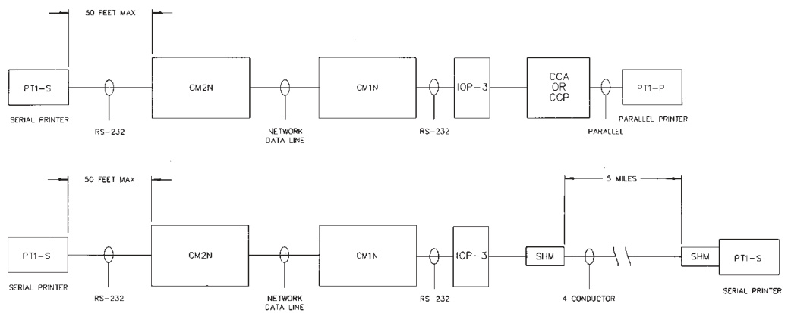

# System Event Printer PT-1S, PT-1P  

# Overview  

The PT-1 series printers are high speed, 9-pin dot matrix type which use standard, continuous tractor feed computer paper. The PT-1 series printers are used to permanently record Life Safety System changes of state. All printed entries contain the date, time, event type and a user defined message for each printed event. The printer is required in proprietary type systems. In local, auxiliary or remote station systems the printer is ancillary and is optional. The printer must be backed up by a UPS in a proprietary system. Printer paper may be fed from the rear or bottom of the printer.  

# Standard Features  

High speed, bi-directional printing   
•Serial (model PT-1S) or parallel (model PT-1P) interface   
•Front panel setup   
•Supports modems for remote installation   
•Supports fiber optics module   
•LED Status indicators   
•RS-232 direct cable Printer self-test mode  

# Application  

The PT-1S (serial, RS-232 interface) is used when connecting to the CM1(N), CM2N, FCCD, 2-MCM or 3-CPU1. The PT-1P (Parallel interface) is used when the printer is connected to the VDU-3, CCA-1/4/8 or the CGP-1/4/8.  

# Installation  

The printer comes from the factory with all DIP switches and operating modes setup for proper operation with the system. The baud rate in some instances may have to be adjusted to provide reliable transmission over long distances. When configuring a system to meet the requirements of proprietary, the printer must be located adjacent to the Fire Command Center.  

When the printer is located greater than 50 ft $(15.2\;\mathrm{m})$ from the Fire Command Center, Short Haul Modems (model SHM-M1 or SHM-F1) may be used. Short Haul Modems will allow distances up to 5 miles (8 km) $@$ 2400 Baud. When Short Haul Modems are used the printer is considered ancillary and the connection is not supervised.  

When the SHM modules are used with the CM1(N) or CM2N an IOP3A module must be used to properly power the modules. The IOP3A may be located on the inside of the Fire Command Center enclosure.  

# Engineering Specifications  

The event and status printer shall be a 9-pin, impact, dot matrix printer with a minimum print speed of 232 characters per second. Print parameters shall be set up with a menu drive program in the printer. The printer shall be capable of serial or parallel communications protocol. The communications speed for RS-232 communications protocol shall be adjustable from 300 to 9600 Baud. The serial or parallel cable shall be supervised. The serial printer shall support Short Haul Modems. The printer shall list the time, date, type and user defined message for each event printed.  

# Connection Diagram  

  

# Specifications  

<html><body><table><tr><td>PrintSpeed</td><td>232 cps</td></tr><tr><td>Voltage</td><td>120VaC，±10%220/240VaC，±10%</td></tr><tr><td>Powerrating</td><td>48VA</td></tr><tr><td>Frequency</td><td>50/60Hz</td></tr><tr><td>MTBF</td><td>4000Hrs@25%dutyCycle</td></tr><tr><td>Size</td><td>14.2x10.8x3.2inches36.1x27.4x8.1cm</td></tr><tr><td>Weight</td><td>9.9 Ibs (4.5 kg)</td></tr><tr><td>AgencyListings</td><td>UL,ULC,MEA,CSFM</td></tr><tr><td>OperatingEnvironment</td><td>Temperature:32°-120°F(0°-49°C).Humidity:85%non-condensing</td></tr></table></body></html>  

# Ordering Information  

<html><body><table><tr><td>Model</td><td>P/N Description</td><td></td></tr><tr><td>PT-1S</td><td>360038</td><td>SerialPrinter</td></tr><tr><td>PT-1P</td><td>360039</td><td>ParallelPrinter</td></tr><tr><td>PT-1S/220</td><td>360070</td><td>SerialPrinter-220/240Vac</td></tr><tr><td>PT-1P/220</td><td>360071</td><td>ParallelPrinter-220/240Vac</td></tr><tr><td colspan="3">RelatedPartsOrderingInformation</td></tr><tr><td>SHM-M1 360024</td><td></td><td>ShortHaulModemwithmaleDB-25connector</td></tr><tr><td>SHM-F1</td><td>360025</td><td>ShortHaulModemwithfemaleDB-25connector</td></tr><tr><td>IOP3A</td><td>130117</td><td>IsolatedI/Oportcard</td></tr></table></body></html>  