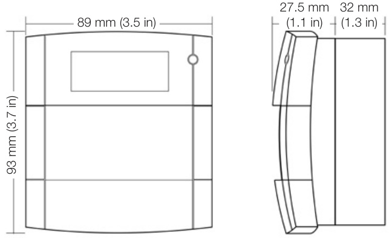

# Intelligent Break Glass Call Point SIGI-271  

# Overview  

SIGI-271 Fire Alarm Call Points are part of Edwards’s Signature Series system. These integrated assemblies feature the familiar KAC Installers’ Series Call Point packaged with Signature Series intelligent addressable/analogue interface electronics.  

In all 271 Series Call Points, the switch is held off by the edge of the glass. When the glass is broken by pressing directly on it, the switch is released and an alarm sent to the Signature loop controller. A protective plastic coating on the glass prevents operator injury and inhibits the release of glass fragments.  

Each Signature Series Call Point constantly runs self-checks to provide important maintenance information. The results of the self-check are automatically updated and permanently stored in the Call Point’s non-volatile memory. This information is accessible for review any time at the control panel, PC, or by using the SIGAPRO Signature Program/Service Tool.  

The information stored in the Call Point’s memory includes:  

•	 Call Point serial number, address, type code.   
•	 Manufacture date, hours of operation, last maintenance date.   
•	 Number of recorded troubles, alarms, time and date of last alarm.   
•	 Up to 24 possible trouble codes that may be used to specifically diagnose faults.  

The Signature loop controller learns where each device’s serial number address is installed relative to other Signature devices on the circuit. The loop controller keeps a “map” of the Signature Series devices connected to it.  

# Standard Features  

# Intelligent Device with Integral Microprocessor  

All decisions are made at the Call Point to allow lower communication speed. Lower communication speeds are less sensitive to line noise; twisted or shielded wire is not required.  

# Automatic Device Mapping  

Each Call Point transmits wiring information regarding its location with respect to other Signature devices on the circuit.  

# Electronic Addressing  

Addresses are downloaded from a PC, or the SIGA-PRO Signature Program/Service Tool. There are no switches or dials to set.  

# Non-volatile Memory  

Permanently stores serial number, type of device, and job number. Automatically updated with historic information.  

# Stand-alone Operation  

Call Point can input an alarm even if the loop controller’s polling interrogation stops.  

# Alarm LED  

Red led flashes to show “alarm” state.  

Designed For High Ambient Temperature Operation Install in ambient temperatures up to 120 °F $(49\,^{\circ}\mathrm{C})$ .  

# Flush or Surface Mount  

Optional Markings Available Glass inserts with multiple languages are available.  

Designed To ISO 9001 Standard Manufactured to strict international quality standards.  

# Application  

The operating characteristics of the fire alarm Call Point is determined by its sub-type code or “Personality Code”. NORMALLY OPEN ALARM - LATCHING (Personality Code 1) is assigned by the factory; no user configuration is required. The device is configured for Class B IDC operation. An ALARM signal is sent to the loop controller when the switch is closed (i.e. when the glass is broken). The alarm condition is latched at the station.  

# Compatibility  

Signature Series Call Points are compatible only with Signature Loop Controller.  

# Testing & Maintenance  

To test the Call Point simply insert the special test key (provided with every unit); the glass drops and the switch closes. Removing the key restores the Call Point to normal.  

The Call Point’s automatic self-diagnosis identifies when it is defective and causes a trouble message. The user-friendly maintenance program shows the current state of each Signature Series device and other pertinent messages. Single devices may be deactivated temporarily, from the control panel. Availability of some maintenance features is dependent on the fire alarm system used.  

Scheduled maintenance (Regular or Selected) for proper system operation should be planned to meet the requirements of the Authority Having Jurisdiction (AHJ).  

# Testing & Maintenance  

  

current state of each Signature Series device and other pertinent messages. Single devices may be deactivated temporarily, from the control panel. Availability of some maintenance features is dependent on the fire alarm system used.  

Scheduled maintenance (Regular or Selected) for proper system operation should be planned to meet the requirements of the Authority Having Jurisdiction (AHJ).  

# Installation and Mounting  

The Signature Series fire alarm Call Points flush mount to standard European General Purpose Outlet Boxes using the KAC ETT/1-P European Terminal Tray. Surface mounting requires the KAC SR3T-P Surface Mounting Box. Edwards recommends that Call Points be installed according to latest recognized edition of national and local fire alarm codes.  

  

Electronic Addressing - The Signature loop controller electronically addresses each Call Point, saving valuable time during system commissioning. Setting complicated switches or dials is not required. Each Call Point has its own unique serial number stored in its “on-board memory”. The loop controller identifies each device on the loop and assigns a “soft” address to each serial number. If desired, the Call Points can be addressed using the SIGA-PRO Signature Program/Service Tool.  

# Warnings & Cautions  

This device will not operate without electrical power. As fires frequently cause power interruption, we suggest you discuss further safeguards with your fire protection specialist.  

# Dimensions  

  

# Typical Wiring  

Connecting to the Call Point is made easy, and virtually ‘Plug-in’. The Call Point is supplied with flying leads and grip forks that connect to large terminals in the ETT/1 or SR3T mounting accessory. Installer cables are accommodated in robust ‘clamp type’ terminals that will each take two conductors in the manner required by  

  

<html><body><table><tr><td>Addressing</td><td>Uses1moduleaddress</td></tr><tr><td>Requirements Operating Current</td><td>Standby=250μA</td></tr><tr><td>TypeCode</td><td>Activated=400 μA Factory Set</td></tr><tr><td>OperatingVoltage</td><td>15.2 to19.95Vdc(19 Vdc nominal)</td></tr><tr><td>Operating Temp.</td><td>32Fto120F(0°Cto49°C)</td></tr><tr><td>Storage Temp.</td><td>-4°Fto140°F(-20°Cto60°C)</td></tr><tr><td>Humidity</td><td>0 to93%RH</td></tr><tr><td>LED Operation</td><td>On-boardREDled:Flasheswheninalarm; Glowssteadywheninalarm-stand-alone</td></tr><tr><td>Compatibility</td><td>mode UsewithSignatureLoopController</td></tr><tr><td>CallPointMateriall</td><td>Thermoplastic(red)</td></tr><tr><td>Agency Listings</td><td>CE Compliant</td></tr></table></body></html>  

# Ordering Information  

<html><body><table><tr><td>Model</td><td>Description</td><td>Carton</td><td>Ship Wt.</td></tr><tr><td>SIGI-271</td><td>Intelligent Call Point - English Markings</td><td>89×90×35mm</td><td>150g</td></tr></table></body></html>  

Accessories   

<html><body><table><tr><td>SR3T-P</td><td>SurfaceMountBox-Red</td><td>89×90×35mm</td><td>50g</td></tr><tr><td>ETT/1-P</td><td>EuropeanTerminalTray(forflushmounting)</td><td>89×90×35mm</td><td>47g</td></tr><tr><td>271-KG1</td><td>ReplacementGlassPack(5inserts)-Englishonly</td><td>82×48×14mm</td><td>70g</td></tr><tr><td>271-KG1-F005</td><td>Replacement tGlassPack(5inserts)-Spanishonly</td><td>82×48×14mm</td><td>70g</td></tr><tr><td>271-KG1-F1</td><td>ReplacementGlassPack(5inserts)-Polish/English</td><td>82×48×14mm</td><td>70g</td></tr><tr><td>271-KG1-F2</td><td>Replacement tGlassPack(5inserts)-Russianonly</td><td>82×48×14mm</td><td>70g</td></tr><tr><td>271-KG1-F200</td><td>ReplacementGlassPack(5inserts)-Hungarian/ English</td><td>82×48×14mm</td><td>70g</td></tr><tr><td>271-KG1-F3</td><td>ReplacementGlassPack(5inserts)-Arabic/English</td><td>82×48×14mm</td><td>70g</td></tr></table></body></html>  