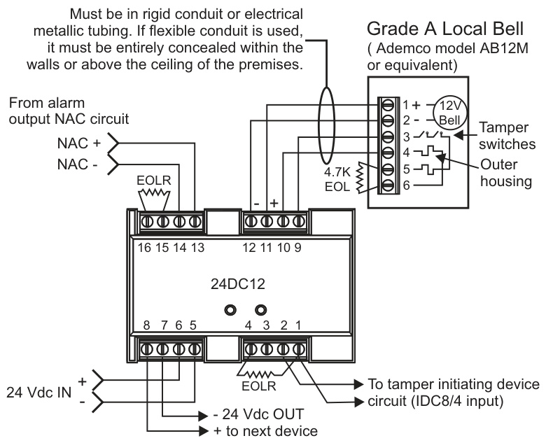
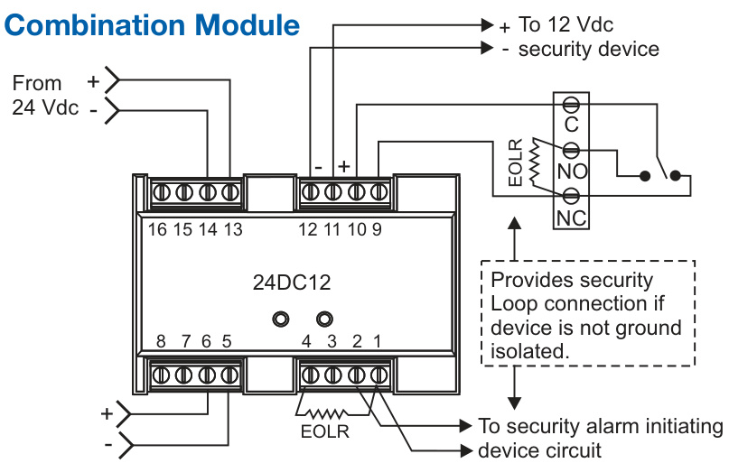
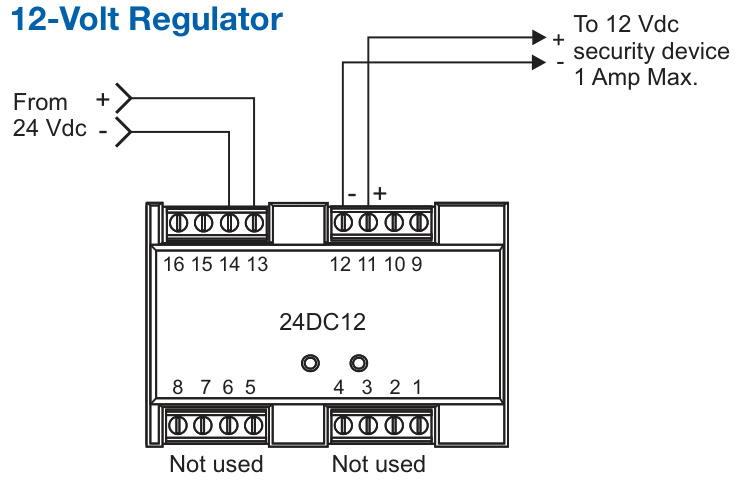
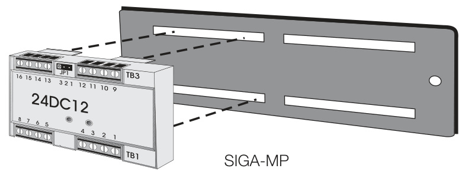

# 12V DC Voltage Regulator with Security Bell Interface 24DC12  

# Overview  

The 24DC12 is a multi-function module used to convert 24 Vdc to 12 Vdc. This makes it possible to use 24 Vdc fire alarm power supplies to provide power for 12-volt security devices. The 24DC12 also provides electrical isolation for UL609/ULC-S303 Local Burglar alarm bell housings.  

The module’s 2-gang mounting makes it ideal for installation into cabinets and wallboxes on SIGA-MP Series mounting plates, thus eliminating the need for additional mounting boxes and hardware.  

# Standard Features  

•	 Converts 18.5-26 Vdc to 12 Volts DC   
•	 Permits the use of existing 24 Vdc fire alarm power supplies to power 12-volt security devices   
Mounts on SIGA-MP series plates. Includes isolation for Grade A and B Local Mercantile premises, Grade A Police Station connect with basic line security, Central Station Grade B.  

# Application  

The 24DC12 converts and regulates power of between 18.5 and 26 volts DC, (typically found in fire alarm panels) to 12 volts DC (used by many security devices). This makes it possible to use existing fire alarm power supplies to run 12-volt security devices.  

The 24DC12 also isolates devices from the control panel alarm initiating circuit. This is useful for meeting UL609/ULC-S303 Local Burglar alarm applications, which require ground isolation for externally-mounted security bells. The 24DC12 may also be used for other security devices that are not ground isolated.  

# Typical Wiring  

# Grade A Local Bell  

  

  

Optional - 24Vdc power used with ground isolating option.  

  

# Mounting  

  

# Note 1:  

<html><body><table><tr><td>AgencyListings</td><td>UL,ULC (See Note 1)</td></tr><tr><td>Input/Output</td><td>Input21to26Vdc/output12Vdc</td></tr><tr><td>Max.Currentoutput@12Vdc</td><td>1 Amp Max.</td></tr><tr><td>Currentdrawasvoltageregulator</td><td>700mA@24Vdcinputwith1.0Amp12Vdcload;350mA@24Vdcinputwith500mA12Vdcload</td></tr><tr><td>CurrentDrawGradeABellWiring</td><td>20mAstandby(failsafe-moduleenergized)*Plusbellcurrent</td></tr><tr><td>Mounting</td><td>SlGA-MPseriesmountingplatesforinstallationinsecuritycabinets.</td></tr><tr><td>WiringTerminations</td><td>Suitablefor#12to#22AWG(2.5mm2to0.25mm2)</td></tr><tr><td>RelativeHumidity</td><td>10-85%noncondensing</td></tr><tr><td>TemperatureRating</td><td>0°-49°C(32°-120°F)</td></tr></table></body></html>

The EST3 is modularly listed under the following standards: UL 864 categories: UOJZ, UOXX, UUKL and SYZV, UL 294 category ALVY, UL 609 category AOTX, UL 636 category ANET, UL 1076 category APOU, UL 365 category APAW, UL 1610 category AMCX, UL 1635 category AMCX ULC-S527, ULC-S301, ULC-S302, ULC-S303, ULC-S306, ULC/ORD-C1076, ULC/ORD-C693 Please refer to EST3 Installation and Service Manual for complete system requirements.  

# Ordering Information  

<html><body><table><tr><td>CatalogNumber</td><td>Description</td><td>Shipping Wt. Ib (kg)</td></tr><tr><td>24DC12</td><td>12VDCVoltageRegulatorwithSecurityBell Interface</td><td>1 (.45)</td></tr></table></body></html>  