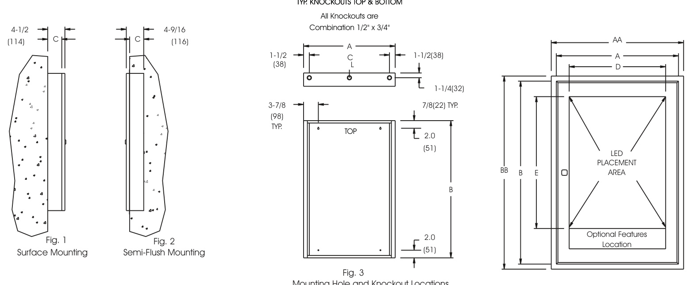
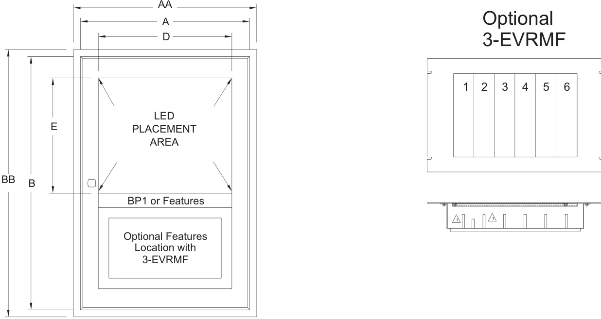
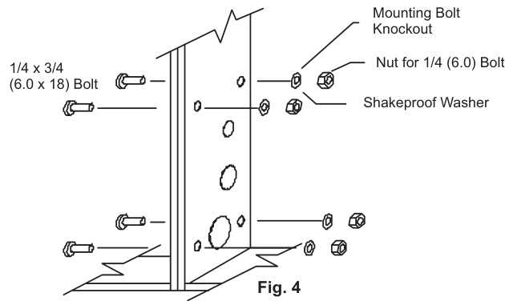
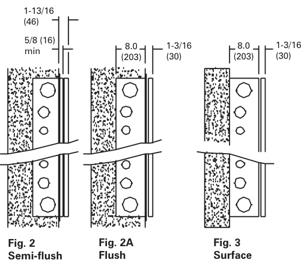
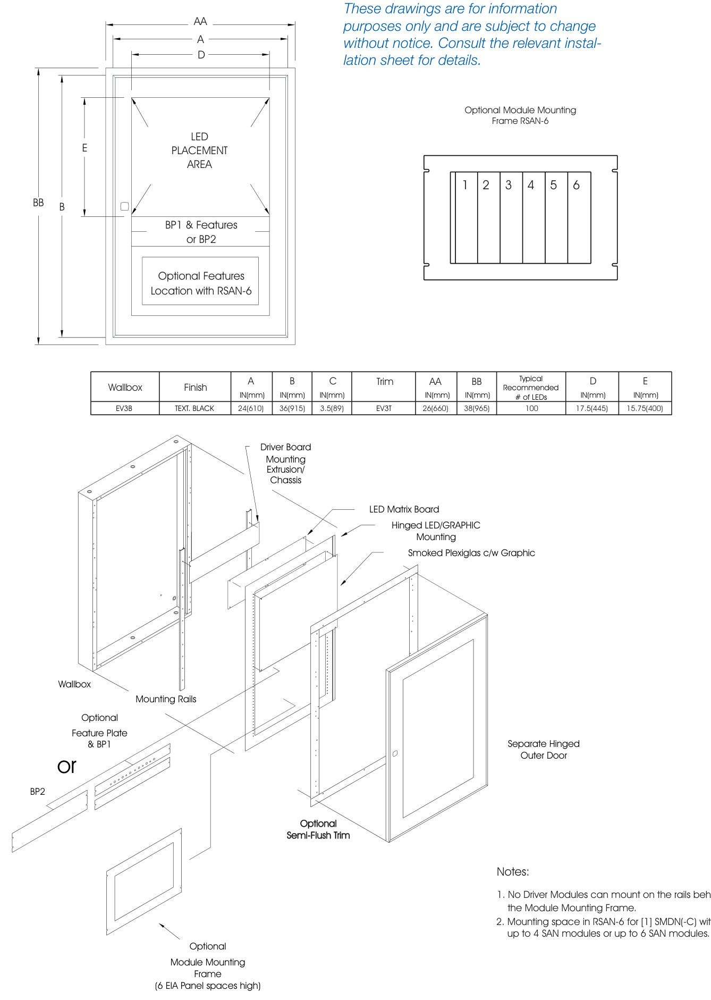

# Graphic Annunciator EV Series Graphic Annunciators FSCS Series Smoke Control Stations  

# Overview  

ENVOY graphic annunciators and smoke control panels are designed to present complex status and control information in an easy-to-understand package. The design of ENVOY products permits users to rapidly determine system status and easily operate associated system controls. The addition of system LCD annunciators and remote microphones can turn ENVOY into a complete fire command station.  

ENVOY EV series graphic annunciators display system information using high intensity LEDs mounted behind the smoked Plexiglas® panel that displays the artwork. The ENVOY FSCS smoke control series replaces the Plexiglas® graphic panel with a gloss black finished steel panel. High contrast white graphics are placed on the panel along with the required switches and LED indicators, integrating the element of control directly “into the picture.” Switches and LEDs can be mounted virtually anywhere on the graphic display itself. White artwork and text on a dark background is standard. Colored artwork is available as an option, to enhance building areas or individual zones. A variety of LEDs and switches are available to meet any display and control requirement.  

Power ON, Trouble, and Signal Silenced LEDs; System Reset, Silence, Trouble Silence, and Drill push button switches are available as panel feature options. Other panel options include system LCD displays and remote microphones.  

“ENVOY graphic panels are available in a variety of standard sizes. Wall boxes are manufactured from 16-gauge cold rolled steel and finished with a textured black baked enamel. Panels can be surface mount or semi-flush mount. When semi-flush mounting, optional trim kits provide a finished look to the installation.  

# Standard Features  

High contrast lines and text LCD display capability Allows display of custom text messages in graphic annunciator enclosure. Smoke control option Agency listed with Edwards control panels Surface or semi-flush mounting Semi-Flush mount with optional trim. Field installed modification of EV series graphics with optional graphic transfer kit.   
•	 Left or right hand hinging of outer door  

# Application  

ENVOY graphics are designed for indoor mounting in areas where easy-to-understand annunciation and/or control is required such as lobbies, control rooms, and building management areas. The flexibility of the ENVOY design and wide variety of options makes ENVOY suitable for everything from a simple graphic annunciator to complex graphic smoke control and fire command stations, complete with audio paging capability.  

  

<html><body><table><tr><td rowspan="2">ForUsewith...</td><td rowspan="2">WALLBOX</td><td rowspan="2">FINISH</td><td rowspan="2">A in(mm)</td><td rowspan="2">B in(mm)</td><td rowspan="2">C (wwju)</td><td rowspan="2">TRIM</td><td rowspan="2">AA in(mm)</td><td rowspan="2">BB in(mm)</td><td rowspan="2">MAXIMUM RECOMMENDED # OF LED'S</td><td rowspan="2">D in(mm)</td><td rowspan="2">E in(mm)</td></tr><tr><td></td></tr><tr><td>EV1 and FSCS-1</td><td>EV1B</td><td>TEXT, BLACK</td><td>24 (610)</td><td>18 (458)</td><td>3.5 (89)</td><td>EV1T</td><td>26 (660)</td><td>20 (508)</td><td>40</td><td>17.5(445)</td><td>10.5 (267)</td></tr><tr><td>EV2 and FSCS-2</td><td>EV2B</td><td>TEXT, BLACK</td><td>24 (610)</td><td>24 (610)</td><td>3.5 (89)</td><td>EV2T</td><td>26 (660)</td><td>26 (660)</td><td>72</td><td>17.5(445)</td><td>15.75 (400)</td></tr><tr><td>EV3 and FSCS-3</td><td>EV3B</td><td>TEXT, BLACK</td><td>24 (610)</td><td>36 (915)</td><td>3.5 (89)</td><td>EV3T</td><td>26 (660)</td><td>38 (965)</td><td>100</td><td>17.5(445)</td><td>26.25 (667)</td></tr><tr><td>EV4 and FSCS-4</td><td>EV4B</td><td>TEXT, BLACK</td><td>36 (914)</td><td>48 (1219)</td><td>3.5 (89)</td><td>EV4T</td><td>38 (965)</td><td>50 (1270)</td><td>120</td><td>30 (762)</td><td>40 (1016)</td></tr></table></body></html>  

  
All wall boxes and trim kits are fabricated of 16 gauge cold rolled steel finished in textured black baked enamel.  

These drawings are for information purposes only and are subject to change without notice. Consult the relevant installation sheet for details.  

# Mounting Instructions:  

# Surface Mounting - Ref. Fig. 1  

1. Hold wallbox in level and upright position against the wall.   
2. Use the mounting holes located in the rear panel to mark the hole positions.   
(See Fig. 3) The top of the wallbox should be no greater than $80^{\prime\prime}$ (2032) from the finished floor.   
3. Drill the mounting holes. Secure the wallbox using suitable fasteners (By Others).  

# Semi-Flush Mounting - Ref. Fig. 2  

1. Plan wall cutout according to wallbox size. (MIN. DEPTH 3 $1/2"$ (89)) Provide mounting supports for each side of wallbox.   
2. Hold the wallbox in a level position.   
IMPORTANT: Be sure the front of the wallbox is flush to the finished wall surface.   
3. Secure the wallbox in position using suitable fasteners (By Others).   
4. Install Optional Trim to the wallbox using mounting hardware provided.  

General Notes:  

1. Install in accordance with National and Local Installation Standards.  

  

<html><body><table><tr><td rowspan="2">Wallbox</td><td rowspan="2">Finish</td><td rowspan="2">A IN(mm)</td><td rowspan="2">B IN(mm)</td><td rowspan="2">C IN(mm)</td><td rowspan="2">TRIM</td><td rowspan="2">AA</td><td rowspan="2">BB IN(mm)</td><td rowspan="2">Typical recommended #of LEDs</td><td rowspan="2">Typical recommended #of switches (FSCS Series Only)</td><td rowspan="2">D IN(mm)</td><td rowspan="2">E IN(mm)</td></tr><tr><td>IN(mm)</td></tr><tr><td>EV3B</td><td>TEXT.BLACK</td><td>24(610)</td><td>36(915)</td><td>3.5(89)</td><td>EV3T</td><td>26(660)</td><td>38(965)</td><td>100</td><td>132</td><td>17.5(445)</td><td>15.75(400)</td></tr></table></body></html>  

These drawings are for information purposes only and are subject to change without notice. Consult the relevant installation sheet for details.  

  

Notes:  

1 Remove these two spacers when a 3-LCD $^+$ 3-ANNCPU3 mounts in slots 1 & 2 ONLY.  

2. Mounting Space in 3-EVRMF for (1) 3-ANNCPU3 with a 3-LCD and up to 4 Control/Display Modules or up to 6 Control/Display Modules.  

3. No Driver Modules can mount on the rails behind the Module Mounting Frame.  

  

  

# Multiple Cabinet Installation - Surface or Semi-flush - Ref. Fig. 4 and 5  

1.	IMPORTANT - Remove ALL conduit AND mounting bolt knockouts from adjacent cabinet side panels before ganging the cabinets together. (See Fig. 4) 2.	Use appropriate quantity of $1/4\times3/4$ $(6.0\times18)$ ) bolts, shakeproof washers and nuts to gang the cabinets together. Bag Assemply supplied with each box. See detail Fig. 4. 3.	Plan rough-in wiring and conduit layout before removing outside panel knockouts.  

  

# General Rough-in Notes  

1.	 Locate 120V, 60Hz primary input power on the left hand side of the cabinets. (Left hand cabinet if multiple cabinets).   
2.	 Locate input/output zone wiring on the top or right hand side of all cabinets.   
3.	 System batteries mount on bottom of cabinet or on the battery shelf mounted to rear rails. (See Fig. 1.) Do not use the bottom panel for conduit entry.   
4.	 Do not cut roughed-in wiring too short. Leave a length of wire equal to the height plus the width of the cabinets.   
5.	 Maintain a minimum of 1.5 (38) clearance from corner walls to side of wallbox.  

# Cabinet Mounting Instuctions  

# Flush and Semi-flush Mounting - Refer  Fig. 2 and 2A  

1.	  The wall cutout for flush and semi-flush cabinet installation should be 1.0 (25) greater than overall cabinet dimensions (min. depth 8.0 (203)). Provide supports for each side of cabinet.   
2.	 The front of the semi-flush mounted cabinets should be a minimum of $5/8$ (16) from the finished wall surface.   
3.	  The front of the flush mounted cabinets should be flush to the finished wall surface.   
4.	 Hold the cabinet in a level position.   
5.	 Secure the cabinet in position using suitable 1/4 (6.0) fasteners.  

# Surface Mounting $^{-}$ Refer Fig. 3  

1.	  Hold cabinet in level and upright position against the wall. 2.	 Use the mounting holes located in the rear panel to mark the hole positions. The top of the cabinet should be no greater than 80 (2032) from the finished floor. 3.	  Drill the mounting holes. Secure the cabinet using suitable $1/4$ (6.0) fasteners.  

# Doors and Trims - Refer Fig. 1  

1.	 Install doors and trims using mounting hardware provided. 2.	  Outer doors mount with either a Left or Right hand opening. Left hand hinged door shown.  

Height Width   
Cat. # Dim. “A” Dim. “B”   
CBA48-B 48 (1219) 28 (711)   
CBA72-B 72 (1828) 28 (711)  

  

# Optional Rack Mount Frames RSAN-6  

  

# Engineering Specification  

Provide a <semi-flush> <surface> mounted graphic <annunciator> <smoke control> panel at the location(s) specified on the plans.  The panel shall be provided with a key locked see through door, capable of left-hand or right-hand mounting. The graphic <annunciator> <smoke control> panel shall be UL, and ULC listed, and operate on nominal 24 VDC that shall be battery backed up. Communication between the annunciator and the host control panel shall be digital. No individual point wiring shall be permitted.  

Annunciator series graphics shall be white artwork on a smoked Plexiglas® background.  The annunciator graphic display shall utilize back-lit using high intensity LEDs, located as shown in the shop drawings. LEDs shall be capable of being independently controlled by the host system. Smoke Control Series graphics shall be white artwork on a gloss black steel background.  System control switches and high intensity LEDs shall be mounted directly on the graphic, as shown in the shop drawings. Each switch and LED function shall be independently identified by the host system; and function as described elsewhere in this specification. It shall be possible to update the graphic artwork in the field with the need to replace the entire graphic artwork.  

The following System controls and indicators shall be provided on the  <annunciator> <smoke control> panel: Power ON, Trouble, and Signal Silenced LEDs; System Reset, Silence, Trouble Silence, and Drill push buttons.  

$<$ It shall be possible to annunciate text messages via LCD display mounted in the graphic  <annunciator> <smoke control> enclosure.>  

The graphic <annunciator> <smoke control> panel shall provide an integral remote microphone for system paging.>  

The graphic  <annunciator> <smoke control panel> shall be Edwards ENVOY series.  

# Ordering / Specification Information  

# Driver Electronics Reference  

The following cross-reference lists the suggested driver electronics to be used with Envoy series products.  

<html><body><table><tr><td>Cat #</td><td>Description</td><td>System</td></tr><tr><td>3-ANNCPU1</td><td>Annunciator CPU- Supports up to eighteen 3-EVDVR(A)modules</td><td>3</td></tr><tr><td>3-EVDVR</td><td>Driver,24LEDs & 12 switches</td><td>3</td></tr><tr><td>3-EVDVRA</td><td>Driver, 24 LEDs & 12 switches w/cables for third party annunciators</td><td>3</td></tr><tr><td>3-EVPWR</td><td>Power Supply - supports up to eighteen 3-EVDVR(A) drivers</td><td>3</td></tr><tr><td>3-EVPWRA</td><td>19"rack mount w/3-EVPWR &room for one 3-ANNCPU1 for third party annunciators</td><td>3</td></tr><tr><td>3-EVDVRX</td><td>19"rack mount for up to three 3-EVDVRAs for third party annunciators</td><td>3</td></tr><tr><td>SAN-CPU</td><td>Annunciator CPU&PowerSupply</td><td>2,4</td></tr><tr><td>SAN- COMM/D</td><td>Common Control Module</td><td>4</td></tr><tr><td>SDR-32</td><td>Driver, 32 LEDs</td><td>2,4</td></tr><tr><td>SIN-16</td><td>Input Interface-16 Switches</td><td>2</td></tr><tr><td>RSA4-CPU</td><td>Annunciator CPU</td><td>4</td></tr><tr><td>RSA4-COM/D</td><td>Common Control Strip</td><td>2,4</td></tr><tr><td>SRAx</td><td>Annunciator CPU. Supports up to 6 XGD cards</td><td>5</td></tr><tr><td>XGD</td><td>Driver, 24 LED's and 12 Switches</td><td>5</td></tr><tr><td>EV24VDC</td><td>Individual LEDswiredwithLEDpositiveleads connected together</td><td>1</td></tr></table></body></html>

$1=$ Direct wired 24 VDC LEDs. ${\boldsymbol{2}}=$ EST2/IRC-3/FCC. $3=$ EST3, $4=$ LSS4, $5=$ QuickStart  

Graphic Annunciator/Smoke Control Panels   
Notes:   

<html><body><table><tr><td>Catalog Number</td><td>Artwork/ LED/ Switch Placement area</td><td>Typical # of In-graphic LEDS (See Note 1)</td><td>Max # of In-graphic Switches (See Note 1)</td><td>ULI/ULC Listing</td><td>Driver Electronics</td><td>Feature Options (see option chart below)</td></tr><tr><td>EV1</td><td>17.5"W × 10.5"H (445 mm x 267 mm)</td><td>40option #1,2</td><td rowspan="7">N/A</td><td rowspan="7">Accessory 48 options</td><td>6SAN/RSA4ModulesOra3-ANNCPU1, one3-EVPWR&four3-EVDVRs</td><td rowspan="7">System LEDs: 15,16,17 (6 max.) System Switches: 14,18,19,20,22,23</td></tr><tr><td>EV2</td><td>17.5"W × 15.75"H (445 mm x 400 mm)</td><td>72option #1,2</td><td>12 SAN / RSA4 Modules or a 3-ANNCPU1, one3-EVPWR&six3-EVDVRs</td></tr><tr><td>EV3</td><td>17.5"W × 26.25"H (445 mm x 667 mm)</td><td>100 option #1,2</td><td>18SAN/RSA4ModulesOra3-ANNCPU1, one3-EVPWR&eleven3-EVDVRs</td></tr><tr><td>EV4</td><td>30"W × 40"H (762 mm×1016 mm)</td><td>120 option #1,2</td><td>18SAN/RSA4ModulesOra3-ANNCPU1, one3-EVPWR&eleven3-EVDVRs</td></tr><tr><td>EVCBA48</td><td>17.5"W× 38"H (445mm ×965 mm)</td><td>120&up option #1,2</td><td>One & up 3-ANNCPU1s, one&up3-EVPWR&eleven& up 3-EVDVRs</td></tr><tr><td>EVCBA72</td><td>17.5"W × 63"H (445mm × 1600mm) (See Note 2)</td><td>120&up option #1,2</td><td>One & up 3-ANNCPU1s, one&up3-EVPWR&eleven&up3-EVDVRs</td></tr><tr><td>FSCS-1</td><td>17.5"W× 10.5"H (445 mm × 267 mm)</td><td>40option #3,4</td><td>One 3-ANNCPU1, one 3-EVPWR&four3-EVDVRs</td></tr><tr><td>FSCS-2</td><td>17.5"W× 15.75"H (445 mm × 400 mm)</td><td>72option #3,4</td><td>#5 thru 13 72 options #5 thru 13 132 options</td><td rowspan="6">Smoke Control (EST3 Only)</td><td>(6 max.) One 3-ANNCPU1, one 3-EVPWR& six3-EVDVRs PS: 24 (1 max.)</td></tr><tr><td>FSCS-3</td><td>17.5"W× 26.25"H (445 mm ×667 mm)</td><td>100option #3,4</td><td>#5 thru 13</td><td>One3-ANNCPU1,one3-EVPWR & eleven 3-EVDVRs</td></tr><tr><td>FSCS-4</td><td>30"W× 40"H (762mm x1016 mm)</td><td>120 option #3,4</td><td>132 options #5 thru 13</td><td>One3-ANNCPU1,one3-EVPWR &eleven3-EVDVRs</td></tr><tr><td>FSCBA48</td><td>17.5"W × 38"H (445mm × 965 mm)</td><td>120& uondo dn #1,2,3,4</td><td>48&up options</td><td>One & up 3-ANNCPU1s, one &up 3-EVPWR&eleven&up3-EVDVRs</td></tr><tr><td>FSCBA72</td><td>17.5"W × 63"H (445mm ×1600mm) (See Note 2)</td><td>120& uodo dn #1,2,3,4</td><td>#5 thru 13 48&up options #5 thru 13</td><td>One &up 3-ANNCPU1s, one &up 3-EVPWR&eleven &up 3-EVDVRs</td></tr></table></body></html>

1.	 The density of individual graphic LED and switch layouts may change the quantities shown. LED spacing should be ½” apart on center and not less then $3/16"$ .  All switches, text and symbols should be kept $\%^{\ast}$ away from viewing area border. In-graphic toggle switches (options 3, 4, & 5) require $1\,|\!\!\frac{\prime}{4}\!\!\!\frac{\prime\prime}{}$ centers. 2.	 The EVCBA72/FSCBA72B provide mounting space equivalent to two EV3 or two FSCS-3 units mounted in a single cabinet.  

<html><body><table><tr><td>Featurel Option #</td><td>Catalog #</td><td>Description</td></tr><tr><td>1</td><td>EVZLED</td><td>Back Lit Graphic LED-Red,Yellow, or Greenfor EV series graphics</td></tr><tr><td>2</td><td>EVBLED</td><td>BackLit Graphic LED-Blue for EV series graphics</td></tr><tr><td>2</td><td>EVZWLED</td><td>Back Lit graphic LED-White for EV series graphics</td></tr><tr><td>3</td><td>EVZSLED</td><td>In-graphic LED - Red, Yellow or Green for FSCS series graphics</td></tr><tr><td>4</td><td>EVZSBLED</td><td>In-graphic LED - Blue for FSCS series graphics</td></tr><tr><td>4</td><td>EVZSWLED</td><td>In-graphic LED - White for FSCS series graphics</td></tr><tr><td>5</td><td>EVSC3-21</td><td>In-graphic2-PosToggleSwitchforFSCSseriesgraphics - ON wired to driver input (1 point)</td></tr><tr><td>6</td><td>EVSC3-22</td><td>In-graphic 2-Pos Toggle Switch for FSCS series graphics - ON & OFF wired to driver inputs (2 points)</td></tr><tr><td>4</td><td>EVSC3-32</td><td>In-graphic 3-Pos Toggle Switch for FSCS series graphics - ON & OFF wired to driver inputs (2 points )</td></tr><tr><td>5</td><td>EVSC3-33</td><td>In-graphic 3-Pos Toggle Switch for FSCS series graphics - ON, AUTO & OFF wired to driver inputs (3 points )</td></tr><tr><td>9</td><td>EVSC3R-21</td><td>In-graphic 2-Pos Rotary Switch for FSCS series graphics - ON wired to driver input (1 point)</td></tr><tr><td>10</td><td>EVSC3R-22</td><td>In-graphic 2-Pos Rotary Switch for FSCS series graphics - ON & OFF wired to driver inputs (2 points)</td></tr><tr><td>11</td><td>EVSC3R-32</td><td>In-graphic 3-Pos Rotary Switch for FSCS series graphics - ON & OFF wired to driver inputs (2 points)</td></tr><tr><td>12</td><td>EVSC3R-33</td><td>In-graphic 3-Pos Rotary Switch for FSCS series graphics - ON, AUTO & OFF wired to driver inputs (3 points )</td></tr><tr><td>13</td><td>EVSC3R-44</td><td>In-graphic 4-Pos Rotary Switch for FSCS series graphics - all positions wired to driver inputs (4 points )</td></tr><tr><td>14</td><td>EVKE</td><td>EnableKeyswitch</td></tr><tr><td>15</td><td>EVPLED</td><td>AnnunciatorPowerOnLED-EV&FSCSseries</td></tr><tr><td>16</td><td>EVTLED</td><td>Trouble LED-EV&FSCS series</td></tr><tr><td>17</td><td>EVSSLED</td><td>Signals Silenced LED - EV & FSCS series</td></tr><tr><td>18</td><td>EVRP</td><td>ResetPushButton-EV&FSCSseries</td></tr><tr><td>19</td><td>EVSSP</td><td>Signal SilencePush Button-EV & FSCS series</td></tr><tr><td>20</td><td>EVTS</td><td>TroubleSilenceSwitch-EV&FSCSseries</td></tr><tr><td>21</td><td>EVDRILL</td><td>Drill Switch-EV& FSCS series</td></tr><tr><td>22</td><td>EVLT</td><td>Lamp TestPush Button-EV &FSCS series</td></tr><tr><td>23</td><td>EVSP</td><td>SparePushButton-EV&FSCSseries</td></tr><tr><td>24</td><td>EVLTPS</td><td>Lamp Test Power Supply - EV & FSCS series - Required if lamp test option used on type 1 (24VDC) system.</td></tr></table></body></html>  

Wallboxes, Doors & Trim Kits   

<html><body><table><tr><td>Catalog #</td><td>Description</td></tr><tr><td>EV1B</td><td>EV1&FSCS-1Wallbox-24"W×18"H×312"D-(609mm×457mm×89mm)-black</td></tr><tr><td>EV2B</td><td>EV2&FSCS-2Wallbox-24"W×24"H×312"D-(609mm×609mm×89mm)-black</td></tr><tr><td>EV3B</td><td>EV3&FSCS-3Wallbox-24"W×36"Hx312"D-(609mmx914mm×89mm)-black</td></tr><tr><td>EV4B</td><td>EV4&FSCS-4Wallbox-36"W×48"H×3%2"D-(914mm×1219mm×89mm)-black</td></tr><tr><td>EV1T</td><td>TrimforEV1BWallbox-OverallDimensions26"W×20"H-(660mm×508mm)-black</td></tr><tr><td>EV2T</td><td>TrimforEV2BWallbox-OverallDimensions26"W×26"H-(660mm×660mm)-black</td></tr><tr><td>EV3T</td><td>TrimforEV3BWallbox-OverallDimensions26"W×38"H-(660mmx965mm)-black</td></tr><tr><td>EV4T</td><td>TrimforEV4BWallbox-OverallDimensions38"W×50"H-(965mmx1270mm)-black</td></tr><tr><td>CBA48-B</td><td>28"W×48"H×8"D(711mm×1219mm×203mm)Wallboxwhite</td></tr><tr><td>CBA48-D</td><td>Door, Viewing area 17 3/8"W 38"H (441mm x 965mm)</td></tr><tr><td>CBA72-B</td><td>28"W×72"H×8"D Wallbox white (711mm ×1829mm× 203mm)</td></tr><tr><td>CBA72-D</td><td>Door,Viewingarea173/8"W63"H(441mmx1600mm)</td></tr><tr><td>CBA48-VT</td><td>Semi-Flush Vertical TrimWhite for a CBA48-B wallbox- Overall 48 1/8"H (1221mm)</td></tr><tr><td>CBA72-VT</td><td>Semi-FlushVertical TrimWhiteforaCBA72-Bwallbox-Overall721/8"H(1831mm)</td></tr><tr><td>CBA-HT1</td><td>Semi-FlushHorizontalTrimfor1CBA48-BorCBA72-Bwallbox-Overall305/8"W (778mm)</td></tr><tr><td>CBA-HT2</td><td>Semi-FlushHorizontal Trimfor2CBA48-BorCBA72-Bwallboxes-Overall585/8"W (1489mm)</td></tr><tr><td>CBA-HT3</td><td>Semi-FlushHorizontalTrimfor3CBA48-BorCBA72-Bwallboxes-Overall865/8"W (2200mm)</td></tr><tr><td>CBA48-FVT</td><td>FlushVertical TrimWhite foraCBA48-Bwallbox-Overall 463/4"H (1188mm)</td></tr><tr><td>CBA72-FVT</td><td>FlushVerticalTrimWhiteforaCBA72-Bwallbox-Overall703/4"H(1798mm)</td></tr><tr><td>CBA-FHT1</td><td>FlushHorizontal Trimfor 1CBA48-Bor CBA72-Bwallbox-Overall30"W(762mm)</td></tr><tr><td>CBA-FHT2</td><td>FlushHorizontal Trimfor2CBA48-BorCBA72-Bwallboxes-Overall58"W (1473mm)</td></tr><tr><td>CBA-FHT3</td><td>FlushHorizontalTrimfor3CBA48-BorCBA72-Bwallboxes-Overall86"W (2184mm)</td></tr></table></body></html>  