# Intelligent Fire Alarm Systems iO64, iO1000  

# Overview  

EDWARDS brand intelligent life safety systems offer the power of high-end intelligent processing in configurations that deliver uncomplicated solutions for small to mid-sized applications. With intelligent detection, electronic addressing, automatic device mapping, optional Ethernet connectivity, and a full line of easilyconfigured option cards and modules, these flexible systems offer versatility that benefits building owners and contractors alike.  

The iO64 provides one Class A or Class B intelligent device loop that supports up to 64 device addresses, and two Class B Notification Ap­pliance Circuits (NACs). Optional Class A device wiring is available with the use of a module.  

The iO1000 provides one Class A or Class B intelligent device loop that supports up to 250 device addresses. Loop controller modules may be added in combination to expand total system capacity in 250-point increments to up to 1,000 device addresses. The iO1000 panel includes four NACs that may be wired for either Class A or Class B operation.  

The RZI16-2 module adds even more capacity to iO installations by adding up to 16 conventional device circuits and two additional notification appliance circuits. This makes them an ideal retrofit solution that can accommodate new intelligent detectors, as well as existing conventional devices.  

iO Series supports a wide range of high-end features, including:  

•	 Supports 10-Year Carbon Monoxide detectors   
•	 R-Series remote annunciators   
•	 SIGA-REL Releasing Modules   
•	 Fully integrated CO detection using Signature Series detectors with or without audible signaling  

# Features  

Auto-programming reduces installation time   
Supports Signature Series intelligent modules and detectors Combines the Signature intelligent releasing module with Signature multisensor detectors for reliable fire suppression   
Form C contacts for alarm and trouble, Form A for supervisory Electronic addressing with automatic device mapping Optional Ethernet port for diagnostics, programming and a variety of system reports Two programmable switches with LEDs and custom labeling Supports Genesis horn silence over two wires, and UL 1971-compliant strobe synchronization   
Class B or Class A wiring   
Ground fault detection by module Supports up to eight serial annunciators, (LCD, LED-only, and graphic interface) Can use existing wiring for most retrofit applications Upload/download remotely or locally Two-level maintenance alert reporting Pre-alarm and alarm verification by point Adjustable detector sensitivity $4\times20$ character backlit LCD display Optional earthquake hardening: seismic Importance Factor 1.5   
Standalone operation   
•Alarm ON command manually activates alarm condition  

# Application  

EDWARDS iO Series life safety systems are powerful intelligent solutions for small to mid-sized buildings. Advanced intelligent technology delivers the benefits of flexible system installation, while clean and easy-to-operate user interfaces make panel operation and system maintenance quick and intuitive.  

# The smart choice  

Signature Series electronic addressing eliminates the tedium of setting dipswitches, and automatic device mapping ensures that each device resides on the system at its correct location. Meanwhile, innovative programming allows the designer to customize the system to precisely suit the needs of the building owner.  

# Reliability you can count on  

The inherent fault-tolerant characteristics of Analog/Addressable Technology boosts the reliability of EDWARDS fire alarm systems. When combined with iO Series smoke and heat detectors, these systems deliver a level of dependability not previously available for small to mid-sized applications. All EDWARDS systems are built to exacting reliability benchmarks.  

# Clear-cut remote annunciation  

Remote annunciation is a strong suit of the iO Series fire alarm systems. Up to eight annunciators can be installed on a single system. Compatible annunciators include a range of LED and LCD models that provide zone or point annunciation, as well as common control capabilities. iO control panels also supports graphic annunciation with optional RA Graphic Annunciator nterface modules. Each interface provides common control and 32 LEDs.  

# Flexibility built right in  

Two fully-programmable front panel switch/LED combinations provide an added measure of flexibility. Their slide-in labels take the mystery out of custom applications, and present a clean finished appearance.  

# Programming and remote diagnostics  

EDWARDS iO Series life safety systems are simple to set up, yet offer advanced programming features that put these small building panels into a class of their own. The auto programming feature quickly gets the panel operational using factory default settings. Basic zone and point settings can be programmed through the front panel interface, so the system is up and running in no time.  

For more advanced system configuration and correlation groups programming, iO Series systems interface to a PC running compatible iO-CU software. This option offers full system configuration in the familiar Windows operating environment. Connection is made to a laptop through the panel’s optional RS-232 communications port, which can also be used to connect a system printer.  

Among the many innovative features of iO Series control panels is the optional network card. This module provides a standard 10/100 Base T Ethernet® network connection that permits access to the control panel from any remote location with the correct communications protocols. The connection can be used to download to the panel from the iO-CU, or upload and view system reports using the iO-CU.  

Available system reports include: Correlation groups, Device details, Device maintenance, History, Internal status, System configuration, System status, Walk test, Dialer, and CO runtime.  

# Perfect for retrofits  

EDWARDS iO Series control panels are particularly well-suited to retrofit applications. All connections are made over standard wiring – no shielded cable required. This means that in most situations existing wiring can be used to upgrade a legacy control panel to iO technology without the expense or disruption of rewiring the entire building. iO control panels also support the ingenious RZI16-2 Zone Module, which adds up to 16 conventional circuits and two NACs. This combination easily accommodates new intelligent detection alongside existing conventional circuits, making it an superior solution in the retrofit market.  

# Scalable IP and Cellular Communications  

Several popular third-party IP/Cellular communicators have been tested with the iO control panels and are compatibility listed to UL864. The IP/Cellular communicators meet NFPA72 2013 edition requirements for sole or secondary transmission paths. Using IP/ Cellular communicators can reduce the cost of ownership by eliminating POTS lines. Please see the iO control panel compatibility documentation part number 3102353-EN for a full list of compatible communicators.  

# Signals with a difference  

iO system NACs are configurable to fully support the advanced signaling technology of EDWARDS Genesis and Enhanced Integrity notification appliances. These devices offer precision synchronization of strobes to UL 1971 standards. For Genesis devices, enabling this feature allows horns to be silenced while strobes on the same two-wire circuit continue to flash until the panel is reset.  

# A complete line of accessories  

iO Series life safety systems are supported by a complete line of analog/addressable detectors, modules and related equipment. Consult the Ordering Information section for details.  

# Dimensions  

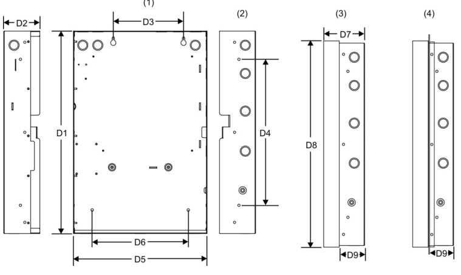  
ce Mounting Holes (3) Backbox with Door Attached flush mounting Holes (4) Backbox with door and trim kit attached.  

Panel dimensions, in (cm)   

<html><body><table><tr><td colspan="11">iu/cocuaun</td></tr><tr><td>Model</td><td>D1* 28.0</td><td>D2 3.85</td><td>D3 9.0</td><td>D4 22.0</td><td>D5* 15.75</td><td>D6 10.25</td><td>D7 4.4</td><td>D8 28.2</td><td>D9 2.7</td></tr><tr><td>iO1000</td><td>(71.1) 21.5</td><td>(9.8) 3.85</td><td>(22.8) 7.5</td><td>(55.8) 15.5</td><td>(40.0) 14.25</td><td>(26.0) 10.25</td><td>(11.1) 4.5</td><td>(71.6) 21.7</td><td>(6.8) 2.7</td></tr><tr><td>iO64</td><td>(54.6)</td><td>(9.8)</td><td>(19.0)</td><td>(39.4)</td><td>(36.2)</td><td>(26.0)</td><td>(11.4)</td><td>(55.1)</td><td>(6.8)</td></tr></table></body></html>  

\* Add 1-1/2 in. $(3.81\;\mathsf{c m})$ to D1 and D5 dimensions for trim kit. The trim kit provides 0.75 inches $\left(1.9\,\mathsf{c m}\right)$ ) of trim to the top, bottom, and sides of the backbox.  

# System Layout  

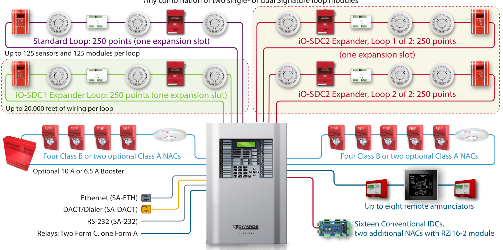  
iO1000   
Any combination of two single- or dual Signature loop modules  

Each iO1000 panel has room for up to two Signature loop controller modules in any combination of single or dual 250-device loops.  

# Panel Layout  

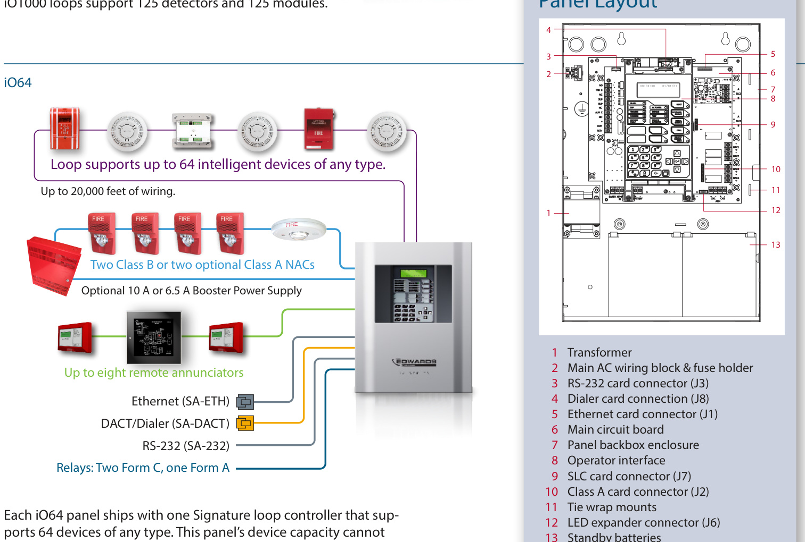  

be expanded.  

# Signature device loop  

The system provides one Signature device loop circuit with a total capacity of 125 detectors and 125 module addresses. The loop circuit is supervised for opens, shorts, and grounds.  

<html><body><table><tr><td>Circuit specifications</td><td>iO1000</td><td>i064</td></tr><tr><td>Device loops</td><td>One ClassBorA loop, supporting 125 detectorsand125 modules. Expandable to four loops.</td><td>One ClassBor A loop, supporting64devicesof any kind.</td></tr><tr><td>Communication linevoltage</td><td colspan="2">Maximum20Vpeak-to-peak</td></tr><tr><td>Circuitcurrent</td><td colspan="2">0.5 A max</td></tr><tr><td>Circuit impedance</td><td colspan="2">66Ω total,0.5μF,max</td></tr><tr><td>Isolators</td><td colspan="2">64maximum</td></tr><tr><td>Signal Synchronization</td><td colspan="2">Supported on a system-widebasis(all deviceloops) whenusingaSIGA-CC1SorSIGA-MCC1Smodule andGenesisorEnhancedIntegritynotificationap- pliances.</td></tr></table></body></html>  

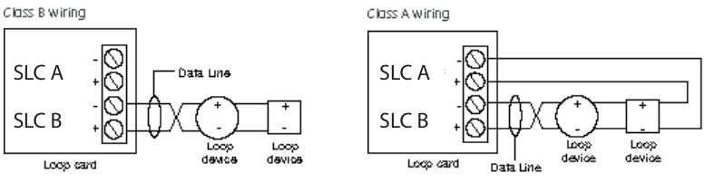  

# Notification appliance circuits (TB2)  

iO1000 control panels come equipped with four notification appliance circuits. iO64 control panels come with two NACs. Each circuit can be individually configured for continuous, temporal, synchronized, and coded output.  

<html><body><table><tr><td>Specifications</td><td>iO1000</td><td>i064</td></tr><tr><td>Circuit Type</td><td>4ClassBor2ClassA</td><td>2 ClassBor2ClassA withSA-CLAmodule</td></tr><tr><td>Voltage</td><td>24VFWR</td><td>3.75Atotal,2.5Amax.</td></tr><tr><td>Current</td><td>6.0Atotal,2.5Amax. percircuitat120/230 VAC 60Hz. 5.0Atotal,2.5Amax percircuitat230VAC 50 Hz.</td><td>percircuitat120/230 VAC60Hz. 3.0 A total,2.5Amax. percircuitat230VAC 50 Hz.</td></tr><tr><td>Impedance</td><td colspan="2">26Ω total,0.35μFmax</td></tr><tr><td>EOLR</td><td colspan="2">15 KQ, V2 W</td></tr><tr><td>Synchronization</td><td colspan="2">Supportedsystem-wide</td></tr></table></body></html>  

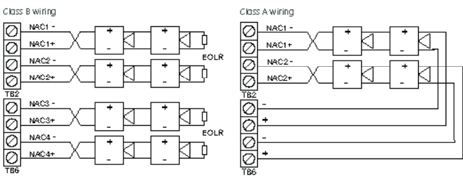  
Marking indicates output signal polarity when the circuit is active. Polarity reverses when the circuit is not active. Wire notification appliances accordingly. Notification appliance polarity shown in active state.  

# Auxiliary & smoke power outputs (TB3)  

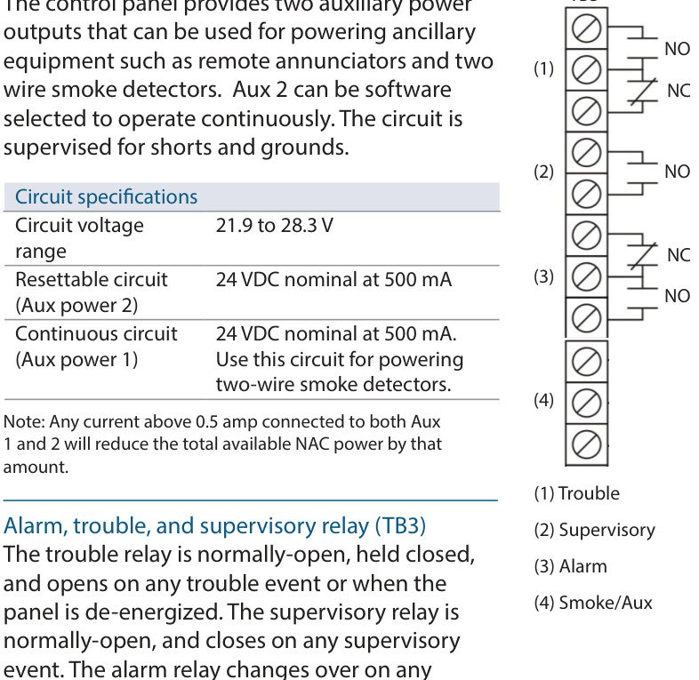  

Relay specifications   

<html><body><table><tr><td></td><td>Alarm</td><td>Trouble</td><td>Supervisory</td></tr><tr><td>Type</td><td>Form C</td><td></td><td>FormA</td></tr><tr><td>Voltage</td><td>24VDC at1Aresistive</td><td colspan="2">24VDC at1Aresistive</td></tr></table></body></html>  

Relay circuits can only be connected to power-limited sources.  

# Annunciator loop (TB4)  

The control panel provides a connection for up to eight serially driven and supervised remote annunciators.  

Circuit specifications   

<html><body><table><tr><td>Deviceloops</td><td>Class B (Style Y) or Class A (Style Z)</td></tr><tr><td>Circuitvoltage</td><td>2.55V</td></tr><tr><td>Circuitcurrent</td><td>30mAmax</td></tr><tr><td>Circuit impedance</td><td>Upto8annunciatorsor40o0feet</td></tr></table></body></html>  

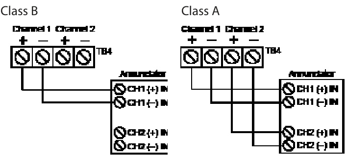  

EDWARDS iO Series panels are supported by a complete line of modules and related equipment that enhance performance and extend system capabilities. Option cards plug directly into the control panel main circuit board or are connected to it with a ribbon cable. After installation, terminals remain accessible. The cabinet provides ample room for wire routing, keeping wiring neat at all times.  

# Single and Dual Loop Controller Cards  

The iO-SDC1 is a single loop controller card that can be used with the iO64 as a replacement for the standard 64-point loop, or with the iO1000 as a 250-point expansion module.  

The iO-SDC2 is a 500-point dual loop controller card for the iO1000 that provides two SLC circuits, each with 125 detector addresses and 125 module addresses.  

<html><body><table><tr><td>Specifications</td><td>iO-SDC1</td><td>iO-SDC2</td></tr><tr><td>Device Addresses</td><td>iO1000:one loop,250 device addresses i064:64 addresses</td><td>i01000:twoloops, 500 device addresses</td></tr><tr><td>Wiring</td><td colspan="2">Class B or Class A</td></tr><tr><td>Operating Voltage</td><td colspan="2">24 VDC</td></tr><tr><td>Operating Current (fully loaded loop)</td><td>Standby:55 mA Alarm:80mA</td><td>Standby:45 mA Alarm:70 mA</td></tr><tr><td></td><td colspan="2">Note: These ratings do not include the use of two-wire smoke modules.</td></tr><tr><td>Communication Line Voltage</td><td colspan="2">Max.20.6Vpeak-to-peak</td></tr><tr><td>Terminal Rating</td><td colspan="2">12 to 18AWG (0.75 to2.5mm²)</td></tr><tr><td>Circuit Current</td><td colspan="2">0.5 A max.</td></tr><tr><td>Maxtotalloop resistance</td><td colspan="2">66Ω</td></tr><tr><td>Max total loop capacitance</td><td colspan="2">0.5 μF</td></tr><tr><td>Isolators</td><td colspan="2">64isolatorsmaximumperloop(totalboth isolatorbasesand modules)</td></tr><tr><td>Ground Fault Impedance</td><td colspan="2">0 to5kQ</td></tr><tr><td>Operating Environment</td><td colspan="2">32to120°F(0to49°C) 0 to93%noncondensing at 90°F(32°℃)</td></tr></table></body></html>  

# SA-ETH Ethernet Interface Card  

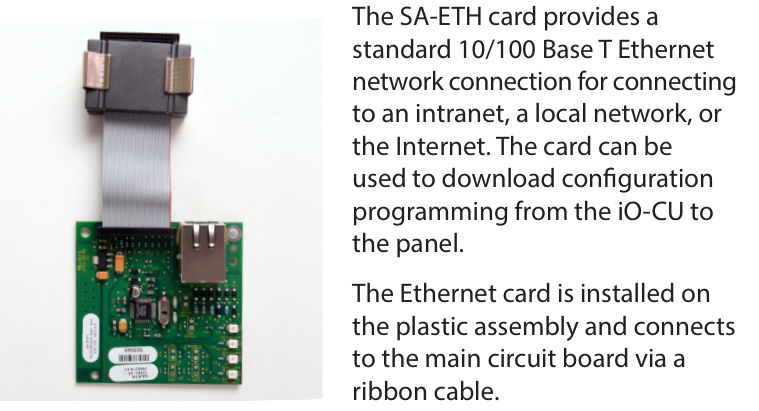  

<html><body><table><tr><td colspan="2">SA-ETHspecmcations</td></tr><tr><td>Ethernet environment</td><td>10/100BaseT</td></tr><tr><td>Operating Temperature</td><td></td></tr><tr><td>Humidity</td><td>32to120°F(0to49°C)</td></tr><tr><td></td><td>0 to 93% RH, noncondensing at 90°F (32°C)</td></tr></table></body></html>  

# RZI16-2 Remote Zone Interface Module  

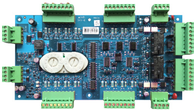  

The RZI16-2 Addressable Remote Zone Interface Module is an addressable device that provides connections for sixteen Class B Initiating Device Circuits and two Class B Supervised Output Circuits. The inputs and outputs can be configured individually for several device types.  

It requires 18 consecutive addresses on the Signaling Line Circuit (SLC). Addresses are assigned electronically. There are no address switches to set.  

The RZI16-2 incorporates two 8-segment DIP switches that are used to select the Alarm or Supervisory default device type for each of the 16 IDC circuits. The module also includes one 4-segment DIP switch used to select the default Relay or NAC output device type. Device types other than the default are accomplished through programming.  

<html><body><table><tr><td colspan="2">RZl16-2Specifications</td></tr><tr><td>Voltage</td><td></td></tr><tr><td>24V/Aux nominal:</td><td>24 VDC</td></tr><tr><td>Supervisory current:</td><td>250mA at24VDCnominal</td></tr><tr><td>Alarm Current</td><td>1000 mA</td></tr><tr><td>24V/Auxminimum:</td><td>18.4VDC</td></tr><tr><td>24V/Auxmaximum:</td><td>26.4VDC</td></tr><tr><td>NAC1, NAC2 nominal:</td><td>24 VDC</td></tr><tr><td>Current</td><td></td></tr><tr><td>Standby current for 4.7 k EOL (U.S.)</td><td>4.8 mA/ circuit</td></tr><tr><td>Standby current for</td><td></td></tr><tr><td>3.9 k EOL (Canada) Alarm current</td><td>5.7 mA/ circuit</td></tr><tr><td>at nominal voltage</td><td>31.1 mA/ circuit</td></tr><tr><td>Relay outputs</td><td></td></tr><tr><td>Quantity</td><td>2</td></tr><tr><td>Type Rating (pilot duty)</td><td></td></tr><tr><td>Input circuit wiring</td><td>Programmable24VDCat2.5A</td></tr><tr><td>resistance</td><td>25 Ω per wire</td></tr><tr><td>Initiating devicecircuits</td><td></td></tr><tr><td>Quantity</td><td>16</td></tr><tr><td>EOLresistor</td><td>4.7kQ (U.S.); 3.9 kQ Canada</td></tr><tr><td>Zone voltage</td><td>22.78 V for 4.7 kQ (U.S.)</td></tr><tr><td></td><td>22.08 V for 3.9 kQ (Canada)</td></tr><tr><td>Alarm current</td><td>31.1 mA/ channel at nominal voltage</td></tr><tr><td>Alarm impedance range</td><td>U089></td></tr><tr><td>Troubleimpedancerange</td><td>> 5.55 kQ</td></tr><tr><td>Supervised output circuits</td><td></td></tr><tr><td>EOLresistor</td><td>15 kQ</td></tr><tr><td>Quantity</td><td>2</td></tr><tr><td>Short circuit detection</td><td><2.6kΩ</td></tr><tr><td>Open circuit detection</td><td>>61.9 kQ</td></tr><tr><td></td><td></td></tr><tr><td>Contact ratings</td><td>24VDC at 2.5 A (5 A for two NACs)</td></tr><tr><td>Compatible cabinets</td><td>MFC(A),iO1000,APS</td></tr></table></body></html>  

# SA-DACT Dialer  

The SA-DACT provides communications between the control panel and the central station over a telephone line system. It transmits system status changes (events) to a compatible digital alarm communicator receiver over the public switched telephone network. The dialer is capable of single, dual, or split reporting of events to two different account and telephone numbers. The modem feature of the SA-DACT can also be used for uploading and downloading panel configuration, history, and current status to a PC running the iO-CU.  

# SA-232 RS-232 interface  

The SA-232 card provides an RS-232 interface with iO panels. It can be used for connecting a printer to the control panel to print system events. The card also can be used for connecting a computer to download a configuration program from the iO-CU to the control panel.  

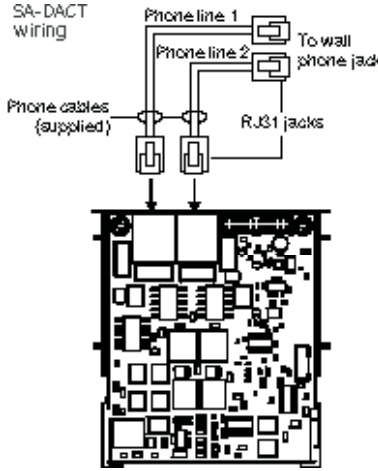  
The dialer phone lines connect to connectors on the dialer’s main circuit board. Phone line 1 connects to connector J4 and phone line 2 connects to connector J1.  

The RS-232 card is installed on the plastic assembly and connects to the main circuit board via a ribbon cable.  

#  

sages and transmits them based on priority (alarm, supervisory, trouble, and monitor). Activations are transmitted before restorations.  

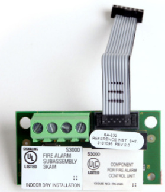  

The SA-DACT is installed on the plastic assembly and connects to the main circuit board via a ribbon cable.  

<html><body><table><tr><td colspan="2">SA-232S specifications</td></tr><tr><td>Operatingvoltage</td><td>StandardElA-232</td></tr><tr><td>Terminalrating</td><td>12 to18AWG(0.75 to2.5sq mm)</td></tr><tr><td>Operating environment</td><td></td></tr><tr><td>Temperature</td><td>32to120°F(0to49°C)</td></tr><tr><td>Humidity</td><td>0 to93%RH,noncondensingat90°F(32°C)</td></tr></table></body></html>  

<html><body><table><tr><td colspan="2">SA-DACTspecifications</td></tr><tr><td>Phonelinetype</td><td>Oneortwoloop-startlinesonapublic, switchednetwork</td></tr><tr><td>Phonelineconnector</td><td>RJ-31/38X(C31/38X)</td></tr><tr><td>Communicationformats</td><td>ContactID(SIADC-05)</td></tr><tr><td>Operatingenvironment</td><td></td></tr><tr><td>Temperature</td><td>32to120°F(0to49°C)</td></tr><tr><td>Humidity</td><td>0 to93%RH,noncondensing at90°F (32°C)</td></tr></table></body></html>  

<html><body><table><tr><td colspan="3">CompatibleDACRs</td></tr><tr><td>Receiver</td><td>Models</td><td>Formats</td></tr><tr><td>Ademco</td><td>685</td><td>ContactID</td></tr><tr><td>FBII</td><td>CP220</td><td>ContactID</td></tr><tr><td>Osborne-Hoffman</td><td>OH2000</td><td>ContactID</td></tr><tr><td>Bosch</td><td>D6600</td><td>ContactID</td></tr><tr><td>SilentKnight</td><td>9800</td><td>ContactID</td></tr><tr><td>Sur-Gard</td><td>SG-MLR1,MLR2</td><td>ContactID</td></tr></table></body></html>  

# SA-CLA Class A Module (iO64 only)  

The SA-CLA card provides Class A capability for NAC wiring. Its terminal block provides the wiring connection for NAC return wiring. The card is required for annunciator Class A wiring even though this wiring does not return to the SA-CLA card. The SACLA is compatible with iO64 control panels only. iO1000 panels are Class A Ready. The SA-CLA is installed directly to the control panel circuit board using its plastic standoffs and plug connection.  

SA-CLA specifications   

<html><body><table><tr><td colspan="2"></td></tr><tr><td>Operatingvoltage Operatingcurrent</td><td>24VFWR 3.75AFWRtotalat120/230VAC60Hz</td></tr><tr><td></td><td>3.0AFWRtotalat230VAC50Hz 2.5Amaxpercircuit</td></tr><tr><td>Circuitimpedance</td><td>26ohms,0.35uF</td></tr><tr><td>Terminalrating</td><td>12 to18AWG(0.75 to2.5sq mm)</td></tr><tr><td>Operatingenvironment</td><td></td></tr><tr><td>Temperature</td><td>32to120°F(0to49°C)</td></tr><tr><td>Humidity</td><td>0to93%RH,noncondensingat90°F(32°C)</td></tr></table></body></html>  

# D16L-iO LED Display Expander (iO1000 only)  

The D16L-iO LED Display Expanders provide LED annunciation for up to 16 zones. It provides two LEDs for each zone. Two D16L-iO LED display expanders can be installed in each iO1000 panel.  

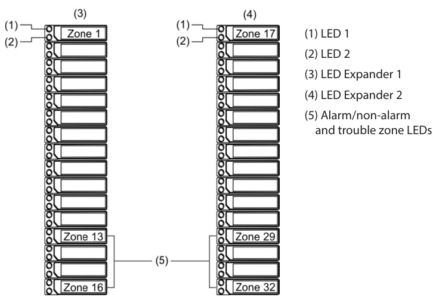  

<html><body><table><tr><td></td><td>i064</td><td>i01000</td></tr><tr><td rowspan="2">Deviceloops</td><td>1 loop ClassB orClass A(Styles 4,6,7) supporting up to 64 device addresses (any combination of detectors and modules)</td><td>1 loop, expandable to 4,Class A orB (Styles 4,6,7), each loop supporting up to 250 device addresses (125 detectors and125modules max.).Addresses1to125 are</td></tr><tr><td>Maximum T-taps: 63 (eachdevicecanbeonitsownbranch)</td><td>for detectors and addresses126to250 areformodules Maximum T-taps/loop:124</td></tr><tr><td rowspan="4">Notification appliance circuits</td><td>2 Class B (Style Y), Class A (Style Z) optional</td><td>4 Class B (Style Y) or 2 Class A (Style Z)</td></tr><tr><td>3.75A FWR total at120/230VAC60Hz</td><td>6.0AFWR totalat120/230VAC60Hz</td></tr><tr><td>3.0AFWRtotalat230VAC50 Hz</td><td>5.0AFWRtotal at230VAC50 Hz</td></tr><tr><td>2.5 A FWR each max.per circuit</td><td>2.5 A FWR each max.per circuit</td></tr><tr><td rowspan="2">Primary power</td><td>120 VAC, 60 Hz, 1.3 A max.</td><td>120 VAC, 60 Hz, 2.0 A max.</td></tr><tr><td>230 VAC, 50-60 Hz, 0.62 A max.</td><td>230 VAC, 50-60 Hz, 0.97 A max.</td></tr><tr><td>Base panel current standby</td><td>155 mA</td><td>172 mA</td></tr><tr><td>Base panel current alarm</td><td>204 mA</td><td>267 mA</td></tr><tr><td>Input zones</td><td>16 max.</td><td>32 max.</td></tr><tr><td>Remote annunciator</td><td>8 drops max., RS-485 Class B, Class A is optional</td><td>8 drops max., RS-485 Class A or B</td></tr><tr><td></td><td>Data line length: 4,000 ft. (1,219 m)</td><td>Data line length: 4,000 ft. (1,219 m)</td></tr><tr><td rowspan="4">Operating voltage Auxiliary power output circuit</td><td colspan="2">24 VDC panel</td></tr><tr><td colspan="2">Auxpower1:500mA,24VDC(1 A possibleif you reducetotal available NAC powerby500 mA)</td></tr><tr><td colspan="2">Aux power 2:500 mA,24VDC Output: 28.3 to 21.9 VDC, special application</td></tr><tr><td colspan="2"></td></tr><tr><td rowspan="8">Loop circuit</td><td colspan="2">Note:For a list of compatible devices, see the iO64 and iO1000 SeriesCompatibility List(P/N 3102353-EN)</td></tr><tr><td colspan="2">Maximum loop resistance:66 Ω Maximum loop capacitance: 0.5 μF</td></tr><tr><td colspan="2">Communication line voltage: Maximum 20.6 V peak-to-peak</td></tr><tr><td colspan="2">Operating current (fully loaded loop) Stand by: 55 mA/45 mA</td></tr><tr><td colspan="2">Alarm:125 mA/115 mA (notincluding two-wire smoke modules)</td></tr><tr><td colspan="2">Circuit current: 0.5 A max. Style 4,6, and 7 wiring</td></tr><tr><td colspan="2">Max.resistancebetweenisolators:Limited onlyby overallwirerunlengths</td></tr><tr><td colspan="2">64 isolators maximumper loop (total both isolatorbasesand modules)</td></tr><tr><td rowspan="5">Batteries</td><td colspan="2">Type: Sealed lead acid</td></tr><tr><td colspan="2">Voltage:24VDC</td></tr><tr><td colspan="2">Charging current: 2.47A max.Amp hour capacity: 26 Ah</td></tr><tr><td colspan="2">Standby operation: 24 hour or 60hour</td></tr><tr><td colspan="2">Placement:Upto two10 Ah batteries willfit in theiO64 controlpanel cabinet and two18 Ahbatterieswill fit inthe iO10o0 control panel cabinet.If larger batteries are required,use an EDwARDS battery cabinet.</td></tr><tr><td rowspan="8">SA-DACTdialer</td><td colspan="2">Phone line type: One or two loop-start lines on a public, switched network</td></tr><tr><td colspan="2">Phone line connector:RJ-31/38X(C31/38X)</td></tr><tr><td colspan="2">Communication formats:Contact ID (SIA DC-05)</td></tr><tr><td colspan="2">Operating current Standby/Alarm:41 mA Max.: 100 mA</td></tr><tr><td colspan="2">FCC registration number:GESALO1BSADACT</td></tr><tr><td colspan="2">Industry Canada Registration number:3944A-SADACT</td></tr><tr><td colspan="2">Ringer equivalence number: 0.1B</td></tr><tr><td colspan="2">Ground fault impedance 0 to5kQ</td></tr><tr><td>Alarm contact</td><td colspan="2">Form C N.O. 24 VDC at 1 A (resistive load)</td></tr><tr><td>Trouble contact</td><td colspan="2">Form C 24VDC at 1A(resistive load)</td></tr><tr><td>Supervisory contact</td><td colspan="2">Form A N.O. 24 VDC at1 A (resistive load)</td></tr><tr><td>Environmental</td><td colspan="2">Temperature:0 to49°C(32to 120°F) Relativehumidity:0 to 93% noncondensing</td></tr><tr><td>Terminal rating</td><td colspan="2">All terminals rated for 12 to 18 AWG (0.75 to 2.5 mm²)</td></tr></table></body></html>  

# Ordering Information  

Part Description   
iO1000 Fire Alarm Systems   

<html><body><table><tr><td>IO1000G</td><td>Fourloopsystemwithone250-pointloopinstalled.110v,graydoor.</td></tr><tr><td>IO1000G-2</td><td>Fourloopsystemwithone250-pointloopinstalled.230v,graydoor.</td></tr><tr><td>IO1000G-2-PG</td><td></td></tr><tr><td>1O1000G-2-SP</td><td></td></tr><tr><td>1O1000G-CA</td><td>Fourloopsystem,one250-pointloopinstalled.110v,graydoor,LEDstrips,Canada.</td></tr><tr><td>IO1000GD</td><td>Fourloopsystem,one250-pointloopinstalled.110v,graydoor,withdialer.</td></tr><tr><td>IO1000G-F</td><td>Fourloopsystem,one250-pointloop.110v,graydoor,LEDstrips,FrenchCanada.</td></tr><tr><td>IO1000G-PG</td><td>Fourloopsystemwithone250-pointloopinstalled.110v,graydoor,Portuguese.</td></tr><tr><td>1O1000G-SP</td><td>Fourloopsystemwithone250-pointloopinstalled.110v,graydoor,Spanish.</td></tr><tr><td>IO1000R</td><td>Fourloopsystemwithone250-pointloopinstalled.110v,reddoor.</td></tr><tr><td>1O1000R-2</td><td>Fourloopsystemwithone250-pointloopinstalled.230v,reddoor.</td></tr><tr><td>1O1000RD</td><td>Fourloopsystem,one250-pointloopinstalled.110v,reddoor,withdialer.</td></tr><tr><td>SA-TRIM2</td><td>iO1oooFlushmounttrim,black.</td></tr></table></body></html>  

iO64 Fire Alarm Systems   

<html><body><table><tr><td>I064G</td><td>Oneloopsystemwithone64-pointloopinstalled.110v,graydoor.</td></tr><tr><td>IO64G-2</td><td>Oneloopsystemwithone64-pointloopinstalled.230v,graydoor.</td></tr><tr><td>IO64G-2-PG</td><td>Oneloopsystemwithone64-pointloopinstalled.230v,graydoor,Portuguese.</td></tr><tr><td>1O64G-2-SP</td><td>Oneloopsystemwithone64-pointloopinstalled.230v,graydoor,Spanish.</td></tr><tr><td>I064GD</td><td>Oneloopsystem,one64-pointloopinstalled.110v,graydoor,withdialer.</td></tr><tr><td>I064GL</td><td>Oneloopsystem,one64-pointloopinstalled.110v,graydoor,EnglishCanada.</td></tr><tr><td>IO64GL-F</td><td>Oneloopsystem,one64-pointloopinstalled.110v,graydoor,FrenchCanada.</td></tr><tr><td>1064G-PG</td><td>Oneloopsystemwithone64-pointloopinstalled.110v,graydoor,Portuguese.</td></tr><tr><td>IO64G-SP</td><td>Oneloopsystemwithone64-pointloopinstalled.110v,graydoor,Spanish.</td></tr><tr><td>IO64R</td><td>Oneloopsystemwithone64-pointloopinstalled.110v,reddoor.</td></tr><tr><td>IO64R-2</td><td>Oneloopsystemwithone64-pointloopinstalled.230v,reddoor.</td></tr><tr><td>I064RD</td><td>Oneloopsystem,one64-pointloopinstalled.110v,reddoor,withdialer.</td></tr><tr><td>SA-TRIM1</td><td>iO64Flushmounttrim,black</td></tr></table></body></html>  

<html><body><table><tr><td colspan="2">OptionCards</td></tr><tr><td>iO-SDC1</td><td>Expansionmodule,one250-deviceloop.</td></tr><tr><td>iO-SDC2</td><td>Expansionmodule,two250-deviceloops,500devicestotal.ForiO1000only</td></tr><tr><td>RZI16-2</td><td>RemoteZoneInterfaceModule.16ClassBIDCs,2ClassBOutput.Includesbracket.</td></tr><tr><td>SA-DACT</td><td>Dual LineDialer/Modem,supportsContactID,mountsincabinetonbaseplate.</td></tr><tr><td>SA-232</td><td>RS-232SerialPortforconnectiontoprinters&computers,mountsincabinet.</td></tr><tr><td>SA-ETH</td><td>EthernetPort,Slave,mountsincabinetonbaseplate.</td></tr><tr><td>SA-CLA</td><td>ClassAadaptermodule.ProvidesClassAcapacityonNACs.Mountsincabineton mainboard.iO64systemsonly</td></tr><tr><td>D16L-iO-2</td><td>LEDAnnunciatormodule,16X2-LEDzones(4programmableforsup).Mounts in cabinettorightofLCDdisplayforzones17-32.ForiO1000only.</td></tr><tr><td>D16L-iO-1</td><td>LEDAnnunciatormodule,16X2-LEDzones(4programmableforsup).Mountsin cabinettoleftofLCDdisplayforzones1-16.ForiO10o0only</td></tr><tr><td>D8RY-iO-2</td><td>8supervisoryonly,4alarmorsupervisory).Mountsincabinet.ForiO1oo0only.</td></tr><tr><td>D8RY-iO-1</td><td>Canadaonly:LEDAnnunciatormodule,twoLEDsperzone,16zones(4alarmonly</td></tr></table></body></html>  

<html><body><table><tr><td colspan="2">Accessories</td></tr><tr><td>CTM</td><td>CityTieModule.2-gang.Connectiontoalocalenergyfirealarmbox.</td></tr><tr><td>MFC-A</td><td>MultifunctionFireCabinet,8"x14"x3.5"-red.</td></tr><tr><td>SIGA-REL</td><td>ReleasingModule</td></tr><tr><td>PT-1S</td><td>SystemPrinter</td></tr><tr><td>BC-1</td><td>BatteryCabinet.14.0"x18.25"x7.25".Holdstwo12V24Abatteries.</td></tr><tr><td>BC-1R</td><td></td></tr><tr><td>BC-1EQ</td><td>BC-1enclosureandcomponentstohardenpanelinternalcomponents.</td></tr><tr><td colspan="2">ProgrammingTools</td></tr><tr><td colspan="2">iO-CU</td></tr><tr><td>260097 RS232cable,4conductor,DB9PCinterface</td><td>IOSeriesconfigurationanddiagnosticsutility</td></tr></table></body></html>  