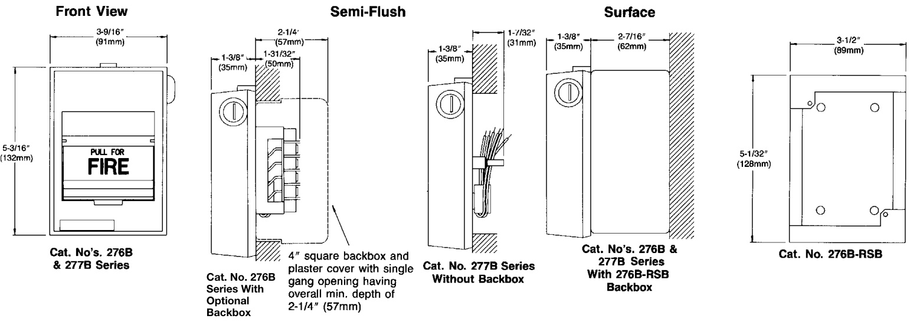

# Single-Action Fire Alarm Stations 276/277B Series  

# Overview  

The EDWARDS Cat. No. 276B/277B series noncoded fire alarm stations are contemporary styled Lexan stations and are flexibly designed to meet a wide variety of application requirements and operational sequences.  

The Cat. No. 276B series are single action stations with terminals for field wiring connections.  

The Cat. No. 277B series are also single action stations but use 6” (150mm) wire leads for field wiring connections.  

All types are available with single or double pole alarm contacts which can be normally open, normally closed or a combination of both. Either a key or tool (depending on station selected) is required to reset mechanism. See specification chart for specific catalog numbers and features.  

For semi flush mounting use a standard North-American 4 inch square box with single gang plaster cover having an overall minimum depth of 2-1/4 inches (57mm). For surface mounting use a Cat. No. 276B-RSB surface back box.  

# Standard Features  

•	 Single action models   
•	 Single or double pole contacts   
•Terminals or wire leads for field connections Pre-signal or general alarm operation Key lock or tool reset   
•Break glass operation   
•Surface or semi flush mounting   
•Red finish   
•Contemporary styling   
•	 Rugged LEXAN construction   
•	 Latch action until reset  

# Operation  

To initiate an alarm and break the glass rod, pull down on the handle marked “Pull for Fire”.  

The alarm handle latches in the pulled position until the station is manually reset. To reset, the station is opened using a Cat. No. 276-K1 key supplied with the station, or a tool; the toggle switch is restored to it’s normal position, the break glass rod is replaced and the station is reclosed. For presignal type stations, the general alarm can be initiated by authorized personnel from any operated station by inserting Cat. No. 276- $\cdot\mathsf{K}2$ key into the keyswitch behind the alarm handle and turning it clockwise.  

# Engineering Specifications  

Furnish and install where indicated on plans, Cat. No. (Select one of the following:)  

•	 (276B series single action manual stations with screw terminals)  

•	 (277B series single action manual stations with 6 inch (150mm) wire leads)  

for connection of installation wiring. All stations shall be of the noncoded break glass type.  

The stations shall be constructed of red lexan with white raised letters. The alarm handle shall be marked “PULL FOR FIRE”, to provide simple, concise instructions for activation of station by the general public.  

Pulling the alarm handle shall break a glass rod and activate a toggle switch which shall cause the handle to latch in the alarm position. Momentary push button type switches shall not be acceptable. To reset the station it shall be necessary to open the station using (select one) (a key) (a special tool), restore the toggle switch to its normal position and replace the glass rod.  

Stations shall be UL listed.  

Contact Ratings   

<html><body><table><tr><td colspan="2">GeneralAlarmSwitch/Keyswitch</td></tr><tr><td>SinglePole</td><td>3.0 Amps,30 Vac,Resistive Load 1.0 Amps, 28Vdc,ResistiveLoad</td></tr><tr><td colspan="2">DoublePole 1.5Amps,30Vac,ResistiveLoad 1.0Amps,28 Vdc,ResistiveLoad</td></tr><tr><td colspan="2">ResistorKitforuseinstationsconnectedtosmokedetector</td></tr><tr><td colspan="2">circuits</td></tr><tr><td colspan="2">StationHousing RedLexan940WithWhiteLetters</td></tr><tr><td colspan="2">Weight 1 Ib (0.4 kg)</td></tr></table></body></html>  

Accessories   

<html><body><table><tr><td>276-GLR</td><td>ReplacementofGlass Rods</td></tr><tr><td>276-K1</td><td>Station Reset Key, Supplied with allKey Reset Stations</td></tr><tr><td>276-K2</td><td>General Alarmkey, Mustbeordereds separately.</td></tr><tr><td>276B-RSB</td><td>Surface BackBox,Red.</td></tr></table></body></html>  

WARNING: These devices will not operate without electrical power. As fires frequently cause power interruptions, we suggest you discuss further safeguards with your local fire protection specialist.  

# Mounting \*Suitable for optional resistor kit (276-R)  

  

# Ordering Information  

<html><body><table><tr><td>Catalog Number</td><td colspan="2">FieldConnections</td><td colspan="4">SwitchContacts</td><td colspan="2">StationReset</td><td colspan="2">Type Alarm</td><td>Agency Approvals</td></tr><tr><td>Single Ac- tion Pull Stations</td><td>Terminals Screw</td><td>6"(150mm) WireLeads</td><td>Single Pole Contact Alarm</td><td>Double Contact Pole</td><td>Circuit Open</td><td>Closed Circuit</td><td>Operated Reset Tool</td><td>Operated Reset Key</td><td>Presignal Contacts Alarm</td><td>Contacts General Alarm</td><td>Listed UL</td></tr><tr><td>276B-1110 276B-1120</td><td>X X</td><td></td><td>X X</td><td></td><td>X X</td><td></td><td>X</td><td>X</td><td></td><td>X X</td><td>X X</td></tr><tr><td>276B-1320 276B-1420</td><td>X X</td><td></td><td></td><td>X X</td><td>X X</td><td>X</td><td></td><td>X X</td><td></td><td>X X</td><td>X X</td></tr><tr><td>277B-1110 277B-1120</td><td></td><td>X X</td><td>X X</td><td></td><td>X X</td><td></td><td>X</td><td>X</td><td></td><td>X X</td><td>X X</td></tr></table></body></html>  