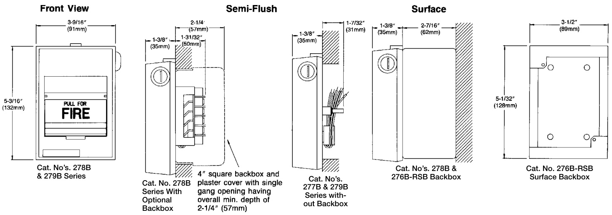

# Double-Action Fire Alarm Stations 278/279B Series — Non-Coded  

# Overview  

The EDWARDS Cat. No. 278B/279B series noncoded fire alarm stations are contemporary styled Lexan stations and are flexibly designed to meet a wide variety of application requirements and operational sequences.  

The Cat. No. 278B series are double action stations with terminals for field wiring connections.  

The Cat. No. 279B series are double action stations with six inch (150mm) wire leads for field wiring connections.  

All types can be either presignal or general alarm and are available with single or double pole alarm contacts which can be normally open, normally closed or a combination of both. Either a key or tool (depending on station selected) is required to reset mechanism. See specification chart for specific catalog numbers and features.  

For semi flush mounting use a standard North-American four inch square box with a single gang plaster cover having an overall minimum depth of 2-1/4 inch (57mm). For surface mounting use a Cat. No. 276B-RSB surface back box.  

# Standard Features  

•	 Double action models   
•	 Single or double pole contacts   
•Terminals or wire leads for field connections Presignal or general alarm operation Key lock or tool reset Break glass operation   
•Surface or semi flush mounting   
•Red finish   
•Contemporary styling   
•	 Rugged LEXAN construction   
•	 Latch action until reset  

To initiate an alarm it is necessary to first lift the upper door marked “LIFT THEN PULL HANDLE”, and then pull the alarm handle.  

The alarm handle latches in the pulled position until the station is manually reset. To reset, the station is opened using a Cat. No. 276-K1 key supplied with the station, or a tool; the toggle switch is restored to it’s normal position, the break glass rod is replaced and the station is reclosed. For presignal type stations, the general alarm can be initiated by authorized personnel from any operated station by inserting a Cat. No. 276-K2 key into the keyswitch behind the alarm handle and turning it clockwise.  

# Engineering Specifications  

Furnish and install where indicated on plans, Cat. No. (Select one of the following:)  

(278B series double action manual stations with screw terminals) (279B series double action manual stations with six inch (150mm) wire leads)  

for connection of installation wiring. All stations shall be of the noncoded break glass type.  

The stations shall be constructed of red lexan with white raised letters. The alarm handle shall be marked “PULL FOR FIRE”, to provide simple, concise instructions for activation of station by the general public. It shall be necessary to first lift an upper door marked “LIFT THEN PULL HANDLE” to gain access to the alarm handle.  

Pulling the alarm handle shall break a glass rod and activate a toggle switch which shall cause the handle to latch in the alarm position. Momentary push button type switches shall not be acceptable. To reset the station it shall be necessary to open the station using (select one) (a key) (a special tool), restore the toggle switch to its normal position and replace the glass rod. Stations shall be UL listed.  

<html><body><table><tr><td colspan="2">ContactRatings:GeneralAlarmSwitch/Keyswitch</td></tr><tr><td>Single Pole</td><td>3.0Amps,30Vac,Resistive Load 1.0 Amps,28Vdc,ResistiveLoad</td></tr><tr><td>DoublePole</td><td>1.5 Amps,30Vac,Resistive Load 1.0Amps,28Vdc,ResistiveLoad</td></tr><tr><td>(Forstationsconnectedtosmoke detectorcircuits)</td><td>2W</td></tr><tr><td>StationHousing</td><td>RedLexan940withWhiteLetters</td></tr><tr><td>Weight</td><td>1 Ib (0.4 kg)</td></tr><tr><td>AgencyListings</td><td>UL38 (S218), FM</td></tr></table></body></html>  

Accessories   

<html><body><table><tr><td>276-GLR</td><td>ReplacementPackage of Glass Rods</td></tr><tr><td>276-K1</td><td>StationResetKey, Supplied with all Key Reset Stations</td></tr><tr><td>276-K2</td><td>GeneralAlarmKey. Mustbeorderedseparately.</td></tr><tr><td>276B-RSB</td><td>Surface BackBox,Red.</td></tr></table></body></html>  

WARNING: These devices will not operate without electrical power. As fires frequently cause power interruptions, we suggest you discuss further safeguards with your local fire protection specialist.  

# Mounting  

  

# Ordering Information  

<html><body><table><tr><td>Catalog Number</td><td colspan="2">Field Connections</td><td colspan="4">SwitchContacts</td><td colspan="2">Station Reset</td><td colspan="2">Type Alarm</td><td>Agency Approvals</td><td colspan="2">SeriesResistor Kit</td></tr><tr><td>Double Action PullSta- tions</td><td>Terminals Screw</td><td>(150mm) Wire Leads</td><td>Single Pole Contact Alarm</td><td>Contact Double Pole</td><td>Circuit Open</td><td>Closed Circuit</td><td>Operated Reset</td><td>Operated Reset Key</td><td>Presignal Contacts Alarm</td><td>Contacts General Alarm</td><td>Listed</td><td>276-R</td><td>276-RT</td></tr><tr><td>278B-1110 278B-1120</td><td>X X</td><td></td><td>X X</td><td></td><td>X X</td><td></td><td>X</td><td>X</td><td></td><td>X X</td><td>X X</td><td>X X</td><td></td></tr><tr><td>278B-1320 278B-1420</td><td>X X</td><td></td><td></td><td>X X</td><td>X X</td><td>X</td><td></td><td>X X</td><td></td><td>X X</td><td>X X</td><td></td><td>X X</td></tr><tr><td>278B-2110 278B-2320</td><td>X X</td><td></td><td>X</td><td>X</td><td>X X</td><td></td><td>X</td><td>X</td><td>X X</td><td>X X</td><td>X X</td><td>X</td><td>X</td></tr><tr><td>279B-1110 279B-1120 279B-1320</td><td></td><td>X X X</td><td>X X</td><td>X</td><td>X X X</td><td></td><td>X</td><td>X X</td><td></td><td>X X X</td><td>X X X</td><td></td><td></td></tr></table></body></html>  