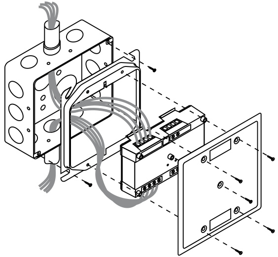
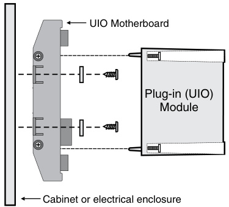
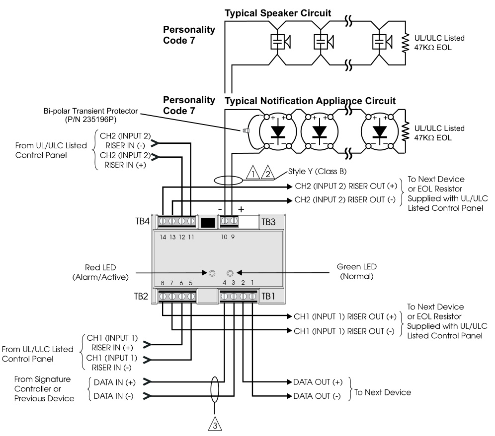
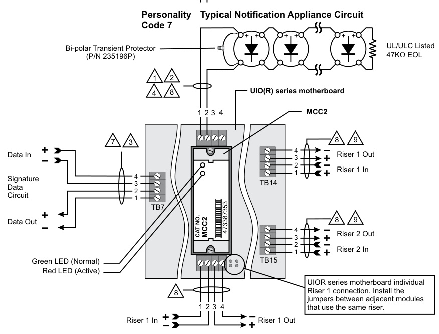
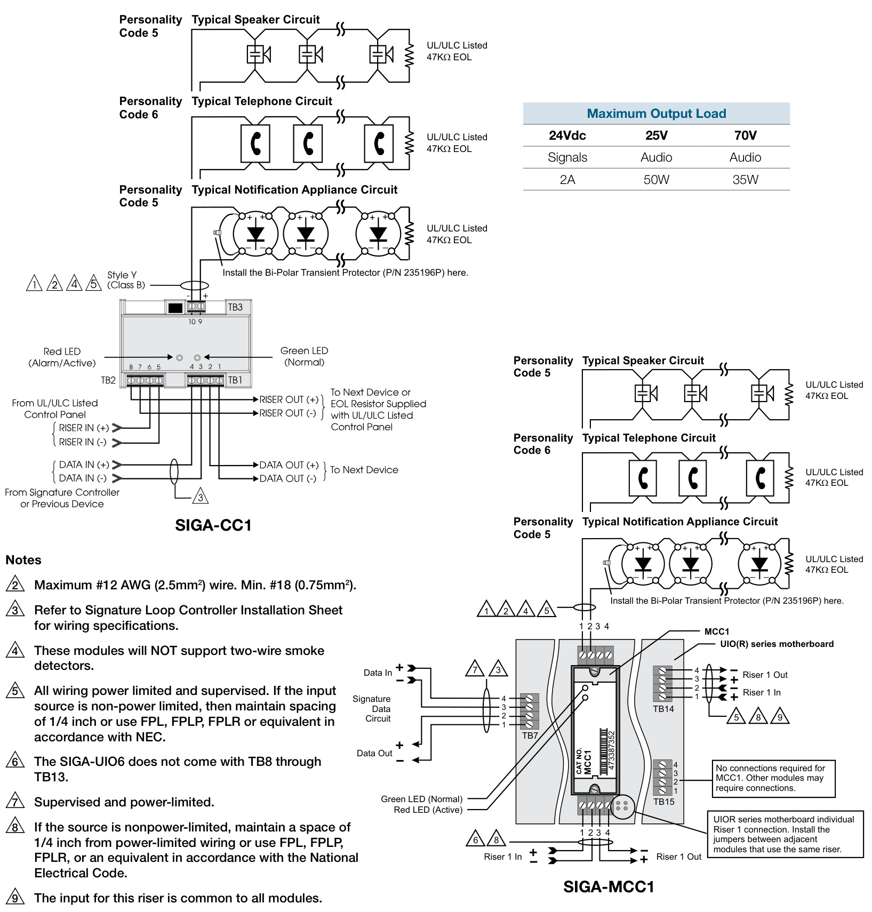

# Signal Modules SIGA-CC1, SIGA-MCC1, SIGA-CC2 & SIGA-MCC2  

# Overview  

SIGA-CC1/MCC1 Single Input Signal Modules and SIGA-CC2/ MCC2 Dual Input Signal Modules are part of EDWARDS's Signature Series system. They are intelligent analog addressable devices used for connecting, upon command from the loop controller, supervised Class B signal or telephone circuits to their respective power inputs. The power inputs may be polarized 24 Vdc to operate audible and visible signal appliances or 25 and 70 VRMS to operate audio evacuation speakers and firefighter’s telephones.  

The actual operation of the SIGA-CC1/MCC1 and SIGA-CC2/ MCC2 is determined by the “personality code” selected by the installer. It is downloaded to the module from the Signature loop controller during system configuration.  

The SIGA-CC1 and SIGA-CC2 mount to standard North American two-gang electrical boxes, making them ideal for locations where only one module is required. Separate I/O and data loop connections are made to each module.  

The SIGA-MCC1 and SIGA-MCC2 are part of the UIO family of plug-in Signature Series modules. They function identically to the SIGA-CC1 and SIGA-CC2, but take advantage of the modular flexibility and easy installation that characterize all UIO modules. Two- and six-module UIO motherboards are available. These can accommodate individual risers for each on-board module, or risers that are shared by any combination of its UIO modules. All wiring connections are made to terminal blocks on the motherboard. UIO assemblies may be mounted in EDWARDS enclosures.  

# Standard Features  

# Single and Dual input (riser) select  

Use for connecting supervised 24 Vdc Audible/Visible signal circuits, or 25 and 70 VRMS Audio Evacuation and Telephone circuits to their power inputs.  

Ring-tone generator   
When configured for telephone circuits, the SIGA-CC1 generates its own ring-tone signal eliminating the need for a separate ring-tone circuit.  

Plug-in (UIO) or standard 2-gang mount UIO versions allow quick installation where multiple modules are required. The 2-gang mount version is ideal for remote locations that require a single module.  

Automatic device mapping   
Signature modules transmit information to the loop controller regarding their circuit locations with respect to other Signature devices on the wire loop.  

# Electronic addressing  

Programmable addresses are downloaded from the loop controller, a PC, or the SIGA-PRO Signature Program/Service Tool; there are no switches or dials to set.  

# Intelligent device with microprocessor  

All decisions are made at the module to allow lower communication speed with substantially improved control panel response time and less sensitivity to line noise and loop wiring properties; twisted or shielded wire is not required.  

Ground fault detection by address Detects ground faults right down to the device level.  

# Installation  

The SIGA-CC1 and SIGA-CC2: mount to North American $^{2-1/2}$ inch $(64\;\mathsf{m m})$ deep two-gang boxes and 1-1/2 inch (38 mm) deep 4-inch square boxes with two-gang covers and SIGA-MP mounting plates. The terminals are suited for #12 to #18 AWG (2.5 $\mathsf{m m}^{2}$ to $0.75\;\mathrm{mm}^{2}$ ) wire size.  

  
SIGA-MCC1 and SIGA-MCC2: mount the UIO motherboard inside a suitable EDWARDS enclosure with screws and washers provided. Plug the SIGA-MCC1 or SIGA-MCC2 into any available position on the motherboard and secure the module to the motherboard with the captive screws. Wiring connections are made to the terminals on the motherboard (see wiring diagram). UIO motherboard terminals are suited for $\#12$ to #18 AWG $2.5\;\mathrm{mm}^{2}$ to $0.75\;\mathrm{mm}^{2}$ ) wire size.  

  

EDWARDS recommends that this module be installed according to latest recognized edition of national and local fire alarm codes.  

Electronic Addressing - The loop controller electronically addresses each module saving valuable time during system commissioning.  Setting complicated switches or dials is not required. Each module has its own unique serial number stored in its on-board memory. The loop controller identifies each device on the loop and assigns a “soft” address to each serial number. If desired, the modules can be addressed using the SIGA-PRO Signature Program/Service Tool.  

Personality Codes 5 and 6 apply to the SIGA-CC1/MCC1 only and are assigned by the installer. Code 7 applies to the SIGACC2/MCC2 only. It is factory assigned; no user configuration is required.  

# Application  

The operation of the SIGA-CC1/MCC1 and SIGA-CC2/MCC2 is determined by their sub-type code or “Personality Code”. The code is selected by the installer depending upon the desired application and is down-loaded from the loop controller. Codes 5 and 6 apply to the SIGA-CC1/MCC1 only. Code 7 is assigned to the SIGA-CC2/MCC2 only and automatically applies to both circuits (A and B).  

Personality Code 5: SIGNAL POWER or AUDIO EVACUATION (SINGLE RISER). Valid for the SIGA-CC1/MCC1 only. Configures the module for use as a Class B Audible/Visible Signal power (24 Vdc polarized) or Audio Evacuation (25 or 70 VRMS) power selector. The ring-tone generator is disabled. The output circuit is monitored for open or shorted wiring. If a short exists, the control panel inhibits the activation of the audible/visible signal circuit to prevent connection to the power circuit.  

Personality Code 6: TELEPHONE w/RING-TONE (SINGLE RISER). Valid for the SIGA-CC1/MCC1 only. Configures the module for use as a Telephone power selector. When a telephone handset is plugged into its jack or lifted from its hook, the module generates its own Ring-Tone signal. A separate ring-tone circuit is not needed. The module sends this signal to the control panel to indicate that an off-hook condition is present. When the system operator responds to the call, the ring-tone signal is disabled.  

Personality Code 7: SIGNAL POWER or AUDIO EVACUATION (DUAL RISER). Valid for the SIGA-CC2/MCC2 only. Configures the module for use as a two circuit Class B Audible/Visible Signal power (24 Vdc polarized) or Audio Evacuation (25 or 70 VRMS) power selector. The single output circuit is monitored for open or shorted wiring. If a short exists, the control panel inhibits the activation of the audible/visible signal circuit to prevent connection to the power circuit.  

# Warnings & Cautions  

This module will not operate without electrical power.  As fires frequently cause power interruption, we suggest you discuss further safeguards with your fire protection specialist.  

# Compatibility  

The Signature Series modules are compatible only with EDWARDS's Signature Loop Controller.  

# Testing & Maintenance  

The module’s automatic self-diagnosis identifies when it is defective and causes a trouble message. The user-friendly maintenance program shows the current state of each module and other pertinent messages. Single modules may be turned off (de-activated) temporarily, from the control panel.  

Scheduled maintenance (Regular or Selected) for proper system operation should be planned to meet the requirements of the Authority Having Jurisdiction (AHJ). Refer to current NFPA 72 and ULC CAN/ULC 536 standards.  

Modules will accept #18 AWG $(0.75\mathsf{m m}^{2})$ , #16 $1.0\mathsf{m m}^{2})$ , #14 AWG (1.50mm2) and $\#12$ AWG $(2.5\mathsf{m m}^{2})$ ) wire sizes.  

Note: Sizes #16 AWG $(1.0\mathsf{m m}^{2})$ and #18 AWG $(0.75\mathsf{m m}^{2})$ ) are preferred for ease of installation. See Signature Loop Controller catalog sheet for detailed wiring requirement specifications.  

  
SIGA-CC2  

# Notes  

1	 For maximum wire resistance and maximum wire  

2		 Maximum #12 AWG (2.5mm2) wire. Min. #18 (0.75mm2).   
3	 Refer to Signature Loop Controller Installation Sheet for wiring specifications.   
4	 These modules will NOT support two-wire smoke detectors.   
5	 All wiring power limited and supervised. If the input source is non-power limited, then maintain spacing of 1/4 inch or use FPL, FPLP, FPLR or equivalent in accordance with NEC.   
6	 The SIGA-UIO6 does not come with TB8 through TB13.   
7	 Supervised and power-limited.   
8	 Supervised and power-limited when connected to a power-limited source. If the source is nonpower-limited, maintain a space of 1/4 inch from power-limited wiring or use FPL, FPLP, FPLR, or an equivalent in accordance with the National Electrical Code.   
9	 The input for this riser is common to all modules.  

  

SIGA-MCC2   

<html><body><table><tr><td colspan="2">Maximum Output Load</td></tr><tr><td>24Vdc</td><td>25V 70V</td></tr><tr><td>Signals Audio</td><td>Audio</td></tr><tr><td>2A 50W</td><td>35W</td></tr></table></body></html>  

# Typical Wiring (SIGA-CC1/MCC1)  

Modules will accept #18 AWG $(0.75\mathsf{m m}^{2})$ ), #16 $1.0\mathsf{m m}^{2})$ , #14 AWG (1.50mm2) and #12 $(2.5\mathsf{m m}^{2})$ ) wire sizes.  

Note: Sizes #16 AWG $\scriptstyle({1.0\m m^{2}})$ ) and $\#18$ AWG $(0.75\mathsf{m m}^{2})$ ) are preferred for ease of installation. See Signature Loop Controller catalog sheet for detailed wiring requirement specifications.  

  

The Signature Series intelligent analog-addressable system from EDWARDS is an entire family of multi-sensor detectors and mounting bases, multiple-function input and output modules, network and non-network control panels, and userfriendly maintenance and service tools. Analog information from equipment connected to Signature devices is gathered and converted into digital signals. An onboard microprocessor in each Signature device measures and analyzes the signal and decides whether or not to input an alarm. The microprocessor in each Signature device provides four additional benefits – Selfdiagnostics and History Log, Automatic Device Mapping, and Fast, Stable Communication.  

Self-diagnostics and History Log – Each Signature Series device constantly runs self-checks to provide important maintenance information. The results of the self-check are automatically updated and permanently stored in its non-volatile memory. This information is accessible for review any time at the control panel, PC, or using the SIGA-PRO Signature Program/ Service Tool. The information stored in device memory includes:  

•	Device serial number, address, and type •	Time and date of last alarm (EST3 V 2 only.) •	Most recent trouble code logged by the detector — 32 possible trouble codes may be used to diagnose faults.  

Automatic Device Mapping –The Signature Data Controller (SDC) learns where each device’s serial number address is installed relative to other devices on the circuit. The SDC keeps a map of all Signature Series devices connected to it. The Signature Series Data Entry Program also uses the mapping feature. With interactive menus and graphic support, the wired circuits between each device can be examined. Layout or “as-built” drawing information showing branch wiring (T-taps), device types and their address are stored on disk for printing hard copy. This takes the mystery out of the installation. The preparation of as-built drawings is fast and efficient.  

Device mapping allows the Signature Data Controller to discover:  

•	Unexpected additional device addresses •	Missing device addresses •	Changes to the wiring in the circuit.  

Most Signature modules use a personality code selected by the installer to determine their actual function. Personality codes are downloaded from the SDC during system configuration and are indicated during device mapping.  

Specifications   

<html><body><table><tr><td>Catalog Num- ber</td><td>SIGA-CC1</td><td>SIGA-MCC1</td><td>SIGA-CC2</td><td>SIGA-MCC2</td></tr><tr><td>Description</td><td colspan="2">Single Input (Riser) Signal Module</td><td colspan="2">Dual Input (Riser) Signal Module</td></tr><tr><td>Type Code</td><td colspan="2">50 (factory set) Two sub-types (personality codes) are available</td><td colspan="2">51 (factory set) One sub-type (personality code) is available (factory set)</td></tr><tr><td>Address Require- ments</td><td colspan="2">Uses one module address</td><td colspan="2">Uses two module addresses</td></tr><tr><td>Wiring Termina- tions</td><td colspan="5">Suitable for #12 to #18 AWG (2.5 mm2 to 0.75mm2)</td></tr><tr><td>Mounting</td><td>North American 2%2 inch (64 mm) deep two-gang boxesand 112 inch (38 mm) deep4 inch square boxes with 2-gang cov- ers and SIGA- MP mounting</td><td>Plugs into UIO2R, UIO6R or UIO6 Motherboards</td><td>North American 2%2 inch (64 mm) deep two-gang boxes and 11%2 inch (38 mm) deep4 inch square boxes with 2-gang cov- ers and SIGA-MP</td><td>Plugs into UIO2R, UIO6R or UIO6 Motherboards</td></tr><tr><td></td><td colspan="4">mounting plates plates</td></tr><tr><td>Operating Current</td><td colspan="4">Standby = 223uA Activated = 100μA</td></tr><tr><td>Operating Voltage</td><td colspan="4">15.2 to19.95Vdc (19Vdc nominal)</td></tr><tr><td>Output Rating</td><td colspan="4">24 Vdc= 2amps25VAudio=50watts70VAudio=35watts</td></tr><tr><td>Construction Storage & Oper-</td><td colspan="4">High Impact Engineering Polymer Operating Temperature: 32°F to 120°F (0°C to 49°C)</td></tr><tr><td>ating Environment</td><td colspan="4">Storage Temperature:-4°F to 140°F (-20°C to 60°C) Humidity: 0 to 93% RH On-board Green LED - Flashes when polled On-board Red LED - Flashes</td></tr><tr><td>LED Operation</td><td colspan="4">wheninalarm/active</td></tr><tr><td>Compatibility</td><td colspan="4">Use with: Signature Loop Controller</td></tr><tr><td>Agency Listings</td><td colspan="4">UL, ULC, CSFM, MEA, FM</td></tr></table></body></html>  

# Ordering Information  

<html><body><table><tr><td>Catalog Number</td><td>Description</td><td>Ship Wt. Ibs (kg)</td></tr><tr><td>SIGA-CC1</td><td>Single Input Signal Module (Standard Mount) - UL/ULC Listed</td><td>0.5 (0.23)</td></tr><tr><td>SIGA-MCC1</td><td>Single Input Signal Module (UIO Mount) - UL/ULC Listed</td><td>0.18 (0.08)</td></tr><tr><td>SIGA-CC2</td><td>Dual Input Signal Module (Standard Mount) - UL/ULC Listed</td><td>0.5 (0.23)</td></tr><tr><td>SIGA-MCC2</td><td>Dual Input Signal Module (UIO Mount) - UL/ULC Listed</td><td>0.18 (0.08)</td></tr><tr><td colspan="3"></td></tr><tr><td colspan="3">Related Equipment</td></tr><tr><td>27193-21</td><td>Surface Mount Box-Red,2-gang</td><td>2 (1.2)</td></tr><tr><td>27193-26</td><td>Surface Mount Box-White,2-gang</td><td>2 (1.2)</td></tr><tr><td>SIGA-UIO2R</td><td>Universal Input-Output Module Board w/Riser Inputs -Two Module Positions</td><td>0.32 (0.15)</td></tr><tr><td>SIGA-UIO6R</td><td>Universal Input-OutputModuleBoard w/Riser Inputs-SixModule Positions</td><td>0.62 (0.28)</td></tr><tr><td>SIGA-UI06</td><td>Universal Input-Output Module Board - Six Module Positions</td><td>0.56 (0.25)</td></tr><tr><td>235196P</td><td>Bi-polarTransientProtector</td><td>0.01 (0.05)</td></tr><tr><td colspan="3"></td></tr><tr><td colspan="3">Accessories</td></tr><tr><td>MFC-A</td><td>Multifunction Fire Cabinet - Red, supports Signature ModuleMountingPlates</td><td>7.0 (3.1)</td></tr><tr><td>SIGA-MP1</td><td>Signature Module Mounting Plate, 1 footprint</td><td>1.5 (0.70)</td></tr><tr><td>SIGA-MP2</td><td>Signature Module Mounting Plate, 1/2 footprint</td><td></td></tr><tr><td>SIGA-MP2L</td><td>SianatureModuleMountingPlate.1/2extendedfootprint</td><td>0.5 (0.23) 1.02 (0.46)</td></tr></table></body></html>  