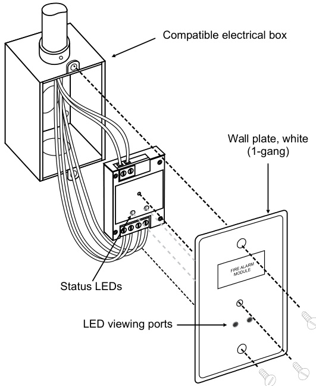
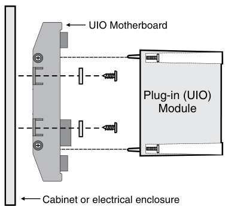
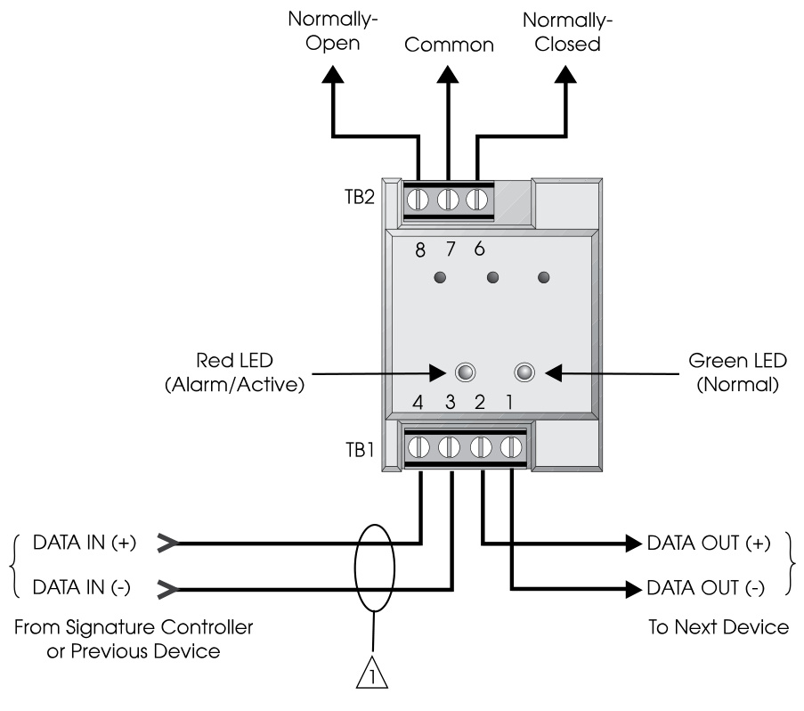
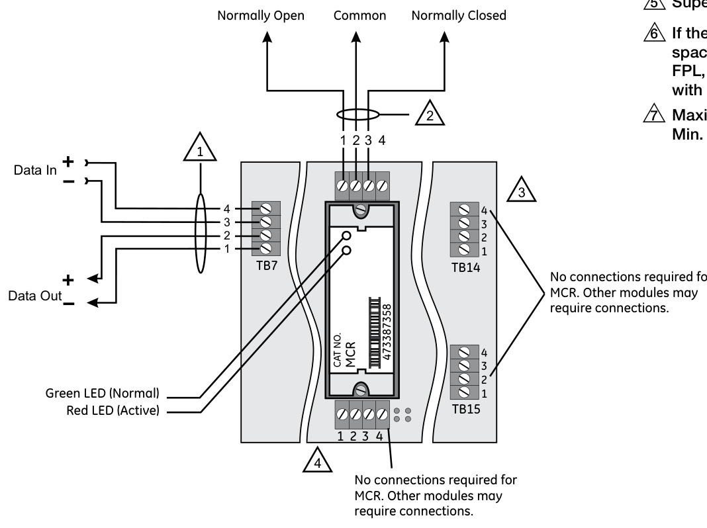
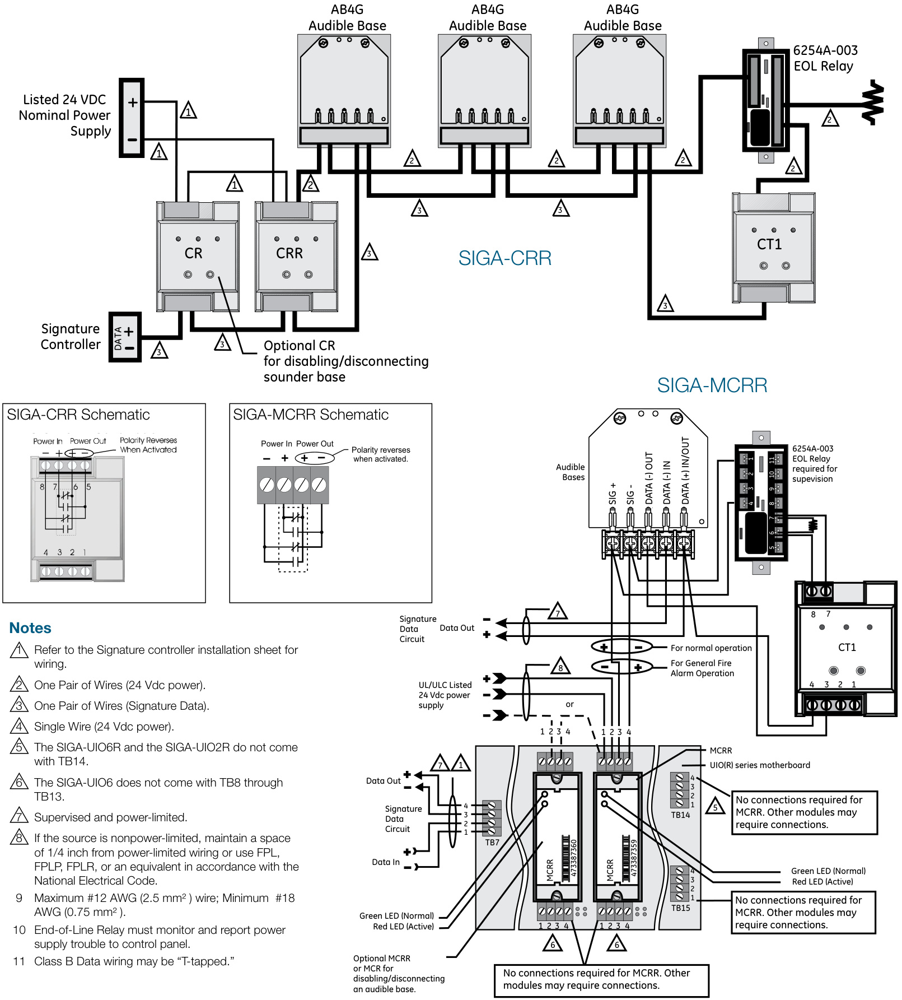

# Control Relay Modules SIGA-CR, SIGA-MCR, SIGACRR, SIGA-MCRR  

# Overview  

The Control Relay Module and the Polarity Reversal Relay Module are part of the Signature Series system. They are intelligent analog addressable devices available in either plug-in (UIO) versions, or standard 1-gang mount versions.  

The SIGA-CR/MCR Control Relay Module provides a Form “C” dry relay contact to control external appliances such as door closers, fans, dampers etc. This device does not provide supervision of the state of the relay contact. Instead, the on-board microprocessor ensures that the relay is in the proper ON/OFF state. Upon command from the loop controller, the SIGA-CR/MCR relay activates the normally open or normally-closed contact.  

The SIGA-CRR/MCRR Polarity Reversal Relay Module provides a Form “C” dry relay contact to power and activate a series of SIGA-AB4G Audible Sounder Bases. Upon command from the Signature loop controller, the SIGA-CRR reverses the polarity of its 24 Vdc output, thus activating all Sounder Bases on the data loop.  

Standard-mount versions (SIGA-CR and SIGA-CRR) are installed to standard North American 1-gang electrical boxes, making them ideal for locations where only one module is required. Separate I/O and data loop connections are made to each module.  

Plug-in UIO versions (SIGA-MCR and SIGA-MCRR) are part of the UIO family of plug-in Signature Series modules. They function identically to the standard mount versions, but take advantage of the modular flexibility and easy installation that characterizes all UIO modules. Two- and six-module UIO motherboards are available. All wiring connections are made to terminal blocks on the motherboard. UIO assemblies may be mounted in EDWARDS enclosures.  

# Standard Features  

# •	 Provides one no/nc contact (SIGA-CR/MCR)  

Form “C” dry relay contact can be used to control external appliances such as door closers, fans, dampers etc. Allows group operation of sounder bases The SIGA-CRR/MCRR reverses the polarity of its 24 Vdc output, thus activating all Sounder Bases on the data loop.  

# Plug-in (UIO) or standard 1-gang mount  

UIO versions allow quick installation where multiple modules are required. The 1-gang mount version is ideal for remote locations that require a single module.  

# Automatic device mapping  

Signature modules transmit information to the loop controller regarding their circuit locations with respect to other Signature devices on the wire loop.  

# Electronic addressing  

Programmable addresses are downloaded from the loop controller, a PC, or the SIGA-PRO Signature Program/Service Tool; there are no switches or dials to set.  

# Intelligent device with microprocessor  

All decisions are made at the module to allow lower communication speed with substantially improved control panel response time and less sensitivity to line noise and loop wiring properties; twisted or shielded wire is not required.  

# Installation  

SIGA-CR and SIGA-CRR: modules mount to North American $2\%$ inch $(64\;\mathsf{m m})$ deep 1-gang boxes and $1\,\%$ inch $(38\,\mathsf{m m})$ ) deep 4 inch square boxes with 1-gang covers and SIGA-MP mounting plates. The terminals are suited for $\#12$ to $\#18$ AWG $2.5\;\mathrm{mm}^{2}$ to $0.75\;\mathrm{mm}^{2})$ ) wire size.  

  

SIGA-MCR and SIGA-MCRR: mount the UIO motherboard inside a suitable EDWARDS enclosure with screws and washers provided. Plug the module into any available position on the motherboard and secure the module to the motherboard with the captive screws. Wiring connections are made to the terminals on the motherboard (see wiring diagram). UIO motherboard terminals are suited for $\#12$ to #18 AWG $2.5\;\mathrm{mm}^{2}$ to $0.75\;\mathrm{mm}^{2}$ ) wire size.  

  
Electronic Addressing - The loop controller electronically addresses each module, saving valuable time during system commissioning. Setting complicated switches or dials is not required. Each module has its own unique serial number stored in its on-board memory. The loop controller identifies each device on the loop and assigns a “soft” address to each serial number. If desired, the modules can be addressed using the SIGA-PRO Signature Program/Service Tool.  

EDWARDS recommends that this module be installed according to latest recognized edition of national and local fire alarm codes.  

# Application  

The operation of Signature Series control relays is determined by their sub-type code or “Personality Code.”  

Personality Code 8: CONTROL RELAY (SIGA-CR/MCR) - Dry Contact Output. This setting configures the module to provide one Form “C” DRY RELAY CONTACT to control Door Closers, Fans, Dampers, etc.  Contact rating is 2.0 amp $@$ 24 Vdc; 0.5 amp $@$ 120 Vac (or 0.25A $@$ 220 Vac for non-UL applications). Personality Code 8 is assigned at the factory. No user configuration is required.  

Personality Code 8: POLARITY REVERSAL RELAY MODULE (SIGA-CRR/MCRR). This setting configures the module to reverse the polarity of its 24 Vdc output. Contact rating is 2.0 amp $@$ 24 Vdc (pilot duty). Personality Code 8 is assigned at the factory. No user configuration is required.  

# Compatibility  

These modules are part of EDWARDS’s Signature Series intelligent processing and control platform. They are compatible with EST3, EST3X and iO Series control panels.  

# Warnings & Cautions  

This module will not operate without electrical power. As fires frequently cause power interruption, we suggest you discuss further safeguards with your local fire protection specialist.  

# Testing & Maintenance  

The module’s automatic self-diagnosis identifies when it is defective and causes a trouble message. The user-friendly maintenance program shows the current state of each module and other pertinent messages. Single modules may be turned off (deactivated) temporarily, from the control panel. Availability of maintenance features is dependent on the fire alarm system used. Scheduled maintenance (Regular or Selected) for proper system operation should be planned to meet the requirements of the Authority Having Jurisdiction (AHJ). Refer to current NFPA 72 and ULC CAN/ULC 536 standards.  

# Typical Wiring  

Modules will accept #18 AWG $(0.75\mathsf{m m}^{2})$ ), #16 $(1.0\mathsf{m m}^{2})$ , #14 AWG $(1.50\mathsf{m m}^{2})$ and #12 AWG $(2.5\mathsf{m m}^{2})$ ) wire sizes.  

Note: Sizes #16 AWG $(1.0\mathsf{m m}^{2})$ ) and #18 AWG $(0.75\mathsf{m m}^{2})$ ) are preferred for ease of installation. See Signature Loop Controller catalog sheet for detailed wiring requirement specifications.  

  
SIGA-CR Control Relay  

# Notes  

1	 Refer to Signature Loop Controller Installation Sheet for wiring specifications.   
2	 NFPA 72 requires that the SIGA-CR/SIGA-MCR be installed in the same room as the device it is controlling. This requirement may not apply in all markets. Check with your local AHJ for details.   
3	 The SIGA-UIO6R and the SIGA-UIO2R do not come with TB14.   
4	 The SIGA-UIO6 does not come with TB8 through TB13.   
5		 Supervised and power-limited.   
6	 If the source is nonpower-limited, maintain a space of 1/4 inch from power-limited wiring or use FPL, FPLP, FPLR, or an equivalent in accordance with the National Electrical Code.   
7	 Maximum #12 AWG (2.5mm2) wire. Min. #18 (0.75mm2).  

  
SIGA-MCR Control Relay  

# Typical Wiring  

Modules will accept #18 AWG $(0.75\mathsf{m m}^{2})$ ), #16 $1.0\mathsf{m m}^{2})$ , #14 AWG (1.50mm2) and #12 AWG $(2.50\mathsf{m m}^{2})$ wire sizes.  

Note: Sizes #16 AWG $1.0\mathsf{m m}^{2},$ ) and #18 AWG $(0.75\mathsf{m m}^{2})$ ) are preferred for ease of installation. See Signature Loop Controller catalog sheet for detailed wiring requirement specifications.  

  

<html><body><table><tr><td>Catalog Number</td><td>SIGA-CR</td><td>SIGA-MCR</td><td>SIGA-CRR</td><td>SIGA-MCRR</td></tr><tr><td>Description</td><td colspan="2">Control Relay</td><td colspan="2">PolarityReversalRelay</td></tr><tr><td>Type Code</td><td colspan="2">Personality Code 8 (Factory Set)</td><td colspan="2">Personality Code 8 (Factory Set)</td></tr><tr><td>Address Requirements</td><td colspan="4">Uses 1 Module Address</td></tr><tr><td>Operating Current</td><td colspan="4">Standby =75 μA Activated =75μA</td></tr><tr><td>Operating Voltage</td><td colspan="4">15.2 to19.95Vdc (19Vdcnominal)</td></tr><tr><td>Relay Type and Rating</td><td colspan="4">Form C, 2 Amps @ 24 Vdc (pilot duty), 0.5 Amps @ 120 Vac and 0.25 Amps @ 220 Vac (220 Vac is non-UL)</td></tr><tr><td>Mounting</td><td>North American 2%2 inch (64 mm) deep 1-gang boxes and 1%2 inch (38 mm) deep 4 inch square boxes with 1-gang covers and SIGA- MP mounting plates</td><td>Not rated for capacitive loads. Plugs into UIO2R, UIO6R or UIO6 Motherboards</td><td>North American 2%2 inch (64 mm) deep 1-gang boxes and 1%2 inch (38 mm) deep 4 inch square boxes with 1-gang covers and SIGA- MP mounting plates</td><td>Plugs into UIO2R, UIO6R or UIO6 Motherboards</td></tr><tr><td>Construction & Finish Storage and Operating</td><td colspan="4">High Impact Engineering Polymer</td></tr><tr><td>Environment</td><td colspan="4">Operating Temperature: 32°F to 120°F (0°℃ to 49°C)</td></tr><tr><td>LED Operation</td><td colspan="4">On-board Green LED - Flashes when polled On-board Red LED - Flashes when in alarm/active</td></tr><tr><td>Compatibility</td><td colspan="4">UseWith:Signature LoopController</td></tr><tr><td>Agency Listings</td><td colspan="4">UL, ULC, CSFM, MEA</td></tr></table></body></html>  

Ordering Information  

<html><body><table><tr><td>Catalog Number</td><td>Description</td><td>Ship Weight - Ibs (kg)</td></tr><tr><td>SIGA-CR</td><td>Control Relay Module (Standard Mount)</td><td>0.4 (0.15)</td></tr><tr><td>SIGA-MCR</td><td>Control Relay Module (UIO Mount)</td><td>0.18 (0.08)</td></tr><tr><td>SIGA-CRR</td><td>PolarityReversal RelayModule(Standard Mount)</td><td>0.4 (0.15)</td></tr><tr><td>SIGA-MCRR</td><td>PolarityReversalRelayModule(UlOMount)</td><td>0.18 (0.08)</td></tr><tr><td colspan="3"></td></tr><tr><td>Related Equipment</td><td></td><td></td></tr><tr><td>27193-11</td><td>Surface Mount Box - Red, 1-gang</td><td>1 (0.6)</td></tr><tr><td>27193-16</td><td>Surface Mount Box -White, 1-gang</td><td>1 (0.6)</td></tr><tr><td>SIGA-UIO2R</td><td>Universal Input-Output Module Board w/Riser Inputs- Two Module Positions</td><td>0.32 (0.15)</td></tr><tr><td>SIGA-UIO6R</td><td>Universal Input-Output Module Board w/Riser Inputs- Six Module Positions</td><td>0.62 (0.28)</td></tr><tr><td>SIGA-UI06</td><td>Universal Input-Output Module Board - Six Module Positions</td><td>0.56 (0.25)</td></tr><tr><td>SIGA-AB4G</td><td>Audible (Sounder) Detector Base</td><td>0.3 (0.15)</td></tr><tr><td colspan="3"></td></tr><tr><td>Accessories MFC-A</td><td></td><td></td></tr><tr><td>SIGA-MB4</td><td>Multifunction Fire Cabinet - Red, supports Signature Module Mounting Plates</td><td>7.0 (3.1)</td></tr><tr><td>SIGA-MP1</td><td>Transponder Mounting Bracket (allows for mounting two 1-gang modules in a 2-gang box)</td><td>0.4 (0.15)</td></tr><tr><td></td><td>Signature Module Mounting Plate, 1 footprint</td><td>1.5 (0.70)</td></tr><tr><td>SIGA-MP2</td><td>Signature Module Mounting Plate, 1/2 footprint</td><td>0.5 (0.23)</td></tr><tr><td>SIGA-MP2L</td><td>Signature Module Mounting Plate, 1/2 extended footprint</td><td>1.02 (0.46)</td></tr></table></body></html>  

# Signature Series Overview  

The Signature Series intelligent analog-addressable system from EDWARDS is an entire family of multi-sensor detectors and mounting bases, multiple-function input and output modules, network and non-network control panels, and user-friendly maintenance and service tools. Analog information from equipment connected to Signature devices is gathered and converted into digital signals. An onboard microprocessor in each Signature device measures and analyzes the signal and decides whether or not to input an alarm. The microprocessor in each Signature device provides four additional benefits – Selfdiagnostics and History Log, Automatic Device Mapping, and Fast, Stable Communication.  

Self-diagnostics and History Log – Each Signature Series device constantly runs selfchecks to provide important maintenance information. The results of the self-check are automatically updated and permanently stored in its non-volatile memory. This information is accessible for review any time at the control panel, PC, or using the SIGA-PRO Signature Program/Service Tool. The information stored in device memory includes:  

•	 Device serial number, address, and type   
•	 Time and date of last alarm   
•	 Most recent trouble code logged by the detector — 32 possible trouble codes may be used to diagnose faults.  

Automatic Device Mapping –The Signature Data Controller (SDC) learns where each device’s serial number address is installed relative to other devices on the circuit. The SDC keeps a map of all Signature Series devices connected to it. The Signature Series Data Entry Program also uses the mapping feature. With interactive menus and graphic support, the wired circuits between each device can be examined. Layout or “as-built” drawing information showing branch wiring (T-taps), device types and their address are stored on disk for printing hard copy. This takes the mystery out of the installation. The preparation of as-built drawings is fast and efficient.  

Device mapping allows the Signature Data Controller to discover:  

•	 Unexpected additional device addresses •	 Missing device addresses •	 Changes to the wiring in the circuit.  

Most Signature modules use a personality code selected by the installer to determine their actual function. Personality codes are downloaded from the SDC during system configuration and are indicated during device mapping.  