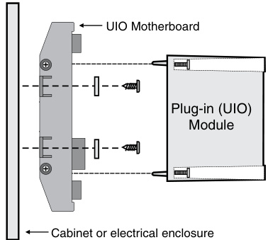
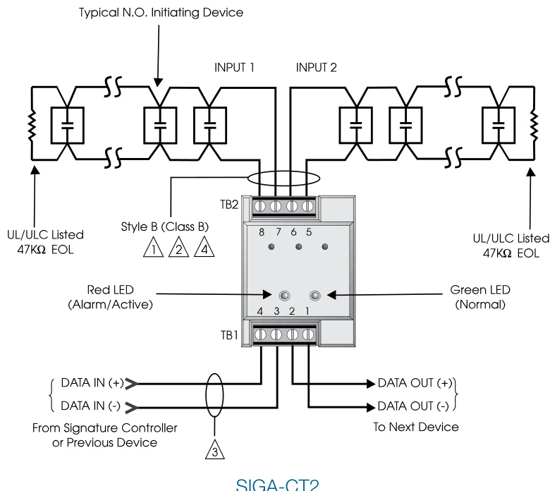
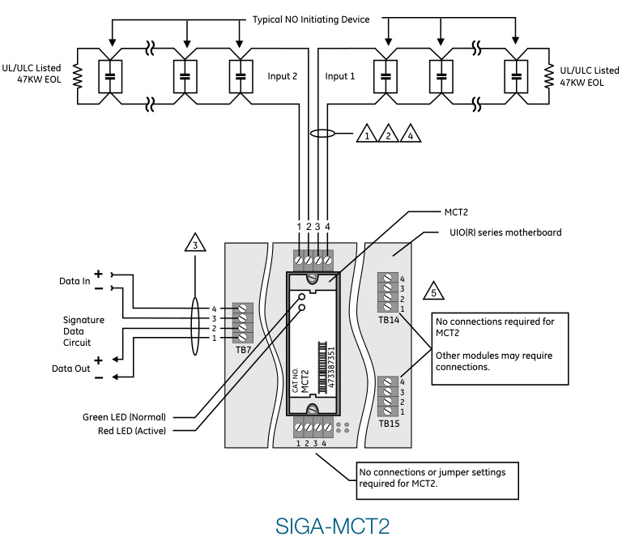

# Input Modules SIGA-CT1, SIGA-CT1HT, SIGA-CT2, SIGA-MCT2  

# Overview  

The SIGA-CT1 Single Input Module, SIGA-CT1HT High Temperature Single Input Module and SIGA-CT2/SIGA-MCT2 Dual Input Modules are intelligent analog addressable devices used to connect one or two Class B normally-open Alarm, Supervisory, or Monitor type dry contact Initiating Device Circuits (IDC).  

The actual function of these modules is determined by the “personality code” selected by the installer. This code is downloaded to the module from the Signature loop controller during system configuration.  

The input modules gather analog information from the initiating devices connected to them and convert it into digital signals. The module’s on-board microprocessor analyzes the signal and decides whether or not to input an alarm.  

The SIGA-CT1, SIGA-CT1HT and SIGA-CT2 mount to standard North American 1-gang electrical boxes, making them ideal for locations where only one module is required. Separate I/O and data loop connections are made to each module.  

The SIGA-CT1HT module operates at an expanded temperature range of $32\,^{\circ}\!\mathsf{F}$ to $158\,^{\circ}\mathsf{F}$ $\,^{0}\mathrm{\textdegreeC}$ to $70\,^{\circ}\mathrm{C})$ for those applications requiring more extreme environmental temperature variation.  

The SIGA-MCT2 is part of the UIO family of plug-in Signature Series modules. It functions identically to the SIGA-CT2, but takes advantage of the modular flexibility and easy installation that characterizes all UIO modules. Two- and six-module UIO motherboards are available. All wiring connections are made to terminal blocks on the motherboard. UIO assemblies may be mounted in EDWARDS enclosures.  

# Standard Features  

Multiple applications Including Alarm, Alarm with delayed latching (retard) for waterflow applications, Supervisory, and Monitor. The installer selects one of four “personality codes” to be downloaded to the module through the loop controller.   
SIGA-CT1HT rated for high temperature environments Suitable for attic installation and monitoring high temperature heat detectors. Plug-in (UIO) or standard 1-gang mount UIO versions allow quick installation where multiple modules are required. The 1-gang mount version is ideal for remote locations that require a single module.   
Automatic device mapping Signature modules transmit information to the loop controller regarding their circuit locations with respect to other Signature devices on the wire loop. Electronic addressing Programmable addresses are downloaded from the loop controller, a PC, or the SIGA-PRO Signature Program/Service Tool. There are no switches or dials to set. Ground fault detection by address Detects ground faults right down to the device level.  

# Signature Series Overview  

The Signature Series intelligent analog-addressable system from EDWARDS Security is an entire family of multi-sensor detectors and mounting bases, multiple-function input and output modules, network and non-network control panels, and user-friendly maintenance and service tools. Analog information from equipment connected to Signature devices is gathered and converted into digital signals. An onboard microprocessor in each Signature device measures and analyzes the signal and decides whether or not to input an alarm. The microprocessor in each Signature device provides four additional benefits – Selfdiagnostics and History Log, Automatic Device Mapping, and Fast, Stable Communication.  

Self-diagnostics and History Log – Each Signature Series device constantly runs self-checks to provide important maintenance information. The results of the self-check are automatically updated and permanently stored in its non-volatile memory. This information is accessible for review any time at the control panel, PC, or using the SIGA-PRO Signature Program/ Service Tool.  

Automatic Device Mapping –The Signature Data Controller (SDC) learns where each device’s serial number address is installed relative to other devices on the circuit. The SDC keeps a map of all Signature Series devices connected to it. The Signature Series Data Entry Program also uses the mapping feature. With interactive menus and graphic support, the wired circuits between each device can be examined. Layout or “as-built” drawing information showing branch wiring (T-taps), device types and their address are stored on disk for printing hard copy.  

# Installation  

SIGA-CT1, SIGA-CT1HT and SIGA-CT2: modules mount to North American $2\%$ inch $\left(64\;\mathsf{m m}\right)$ deep 1-gang boxes and $1\,\%$ inch $\left(38\,\mathsf{m m}\right)$ deep 4 inch square boxes with 1-gang covers and SIGAMP mounting plates. The terminals are suited for $\#12$ to #18 AWG $2.5\;\mathrm{mm}^{2}$ to $0.75\;\mathrm{mm}^{2}.$ ) wire size.  

  
SIGA-MCT2: mount the UIO motherboard inside a suitable EDWARDS enclosure with screws and washers provided. Plug the SIGA-MCT2 into any available position on the motherboard and secure the module to the motherboard with the captive screws. Wiring connections are made to the terminals on the motherboard (see wiring diagram). UIO motherboard terminals are suited for #12 to $\#18$ AWG $2.5\;\mathrm{mm}^{2}$ to $0.75\;\mathrm{mm}^{2}$ ) wire size.  

  

Electronic Addressing - The loop controller electronically addresses each module, saving valuable time during system commissioning. Setting complicated switches or dials is not required. Each module has its own unique serial number stored in its on-board memory. The loop controller identifies each device on the loop and assigns a “soft” address to each serial number. If desired, the modules can be addressed using the SIGA-PRO Signature Program/Service Tool.  

EDWARDS recommends that this module be installed according to latest recognized edition of national and local fire alarm codes.  

# Application  

The duty performed by the SIGA-CT1 and SIGA-CT2/MCT2 is determined by their sub-type code or “Personality Code”. The code is selected by the installer depending upon the desired application and is downloaded from the loop controller.  

One personality code can be assigned to the SIGA-CT1. Two personality codes can be assigned to the SIGA-CT2/MCT2. Codes 1, 2, 3 and 4 can be mixed on SIGA-CT2/MCT2 modules only. For example, personality code 1 can be assigned to the first address (circuit A) and code 4 can be assigned to the second address (circuit B).  

NORMALLY-OPEN ALARM - LATCHING (Personality Code 1) - Assign to one or both circuits.  Configures either circuit A or B or both for Class B normally open dry contact initiating devices such as Pull Stations, Heat Detectors, etc. An ALARM signal is sent to the loop controller when the input contact is closed. The alarm condition is latched at the module.  

NORMALLY-OPEN ALARM - DELAYED LATCHING (Personality Code 2) - Assign to one or both circuits.  Configures either circuit A or B or both for Class B normally-open dry contact initiating devices such as Waterflow Alarm Switches. An ALARM signal is sent to the loop controller when the input contact is closed for approximately 16 seconds. The alarm condition is latched at the module.  

NORMALLY-OPEN ACTIVE - NON-LATCHING (Personality Code 3) - Assign to one or both circuits. Configures either circuit A or B or both for Class B normally-open dry contact monitoring input such as from Fans, Dampers, Doors, etc. An ACTIVE signal is sent to the loop controller when the input contact is closed. The active condition is not latched at the module.  

NORMALLY-OPEN ACTIVE - LATCHING (Personality Code 4) - Assign to one or both circuits.  Configures either circuit A or B or both for Class B normally open dry contact monitoring input such as from Supervisory and Tamper Switches. An ACTIVE signal is sent to the loop controller when the input contact is closed. The active condition is latched at the module.  

# Typical Wiring  

Modules will accept #18 AWG $(0.75\mathsf{m m}^{2})$ ), #16 $\scriptstyle{\left[{\frac{1}{1.0\mathsf{m m}^{2}}}\right]}$ , and #14AWG (1.50mm2),  and $\#12$ AWG $(2.50\mathsf{m m}^{2})$ ) wire sizes.  

Note: Sizes #16 AWG $\left\lbrace1.0\mathsf{m m}^{2}\right\rbrace$ and $\#18$ AWG $(0.75\mathsf{m m}^{2})$ ) are preferred for ease of installation. See Signature Loop Controller catalog sheet for detailed wiring requirement specifications.  

<html><body><table><tr><td colspan="3">Initiating(Slave) DeviceCircuitWireSpecifications</td></tr><tr><td>MaximumAllowableWireResistance</td><td colspan="2">50 ohms (25 ohms per wire) per Circuit</td></tr><tr><td>MaximumAllowableWireCapacitance</td><td></td><td>0.1μF per Circuit MaximumDistancetoEOLR</td></tr><tr><td rowspan="5">ForDesignReference:</td><td>WireSize</td><td rowspan="3">4,000 ft (1,219 m)</td></tr><tr><td>#18AWG(0.75mm2)</td></tr><tr><td>#16 AWG (1.00mm2)</td></tr><tr><td>#14AWG (1.50mm2)</td></tr><tr><td>#12AWG(1.50mm2)</td><td></td></tr></table></body></html>  

  

# NOTES  

1	 Maximum 25 Ohm resistance per wire.  

2		 	Maximum $\#12$ AWG $(2.5\;\mathrm{mm}^{2}$ ) wire; Minimum $\#18$ AWG $(0.75\;\mathrm{mm}2)$ .  
3	 Refer to Signature controller installation sheet for wiring specifications.   
4	 Maximum 10 Vdc @ 350 µA   
5	 The SIGA-UIO6R and the SIGA-UIO2R do not come with TB14.   
6	 All wiring is supervised and power-limited.   
7	 These modules will not support 2-wire smoke detectors.  

# Warnings & Cautions  

This module will not operate without electrical power. As fires frequently cause power interruption, we suggest you discuss further safeguards with your local fire protection specialist.  

# Compatibility  

These modules are part of EDWARDS’s Signature Series intelligent processing and control platform. They are compatible with EST3, EST3X and iO Series control panels.  

  

  

Specifications   

<html><body><table><tr><td>Catalog Number</td><td>SIGA-CT1HT</td><td>SIGA-CT1</td><td>SIGA-CT2</td><td>SIGA-MCT2</td></tr><tr><td>Description</td><td colspan="2">Single Input Module</td><td colspan="2">Dual Input Module</td></tr><tr><td>Type Code</td><td colspan="2">48 (factory set) Four sub-types</td><td colspan="2">49 (factory set) Four sub-types</td></tr><tr><td>AddressRequirements</td><td colspan="2">(personalitycodes)areavailable UsesOneModuleAddress</td><td colspan="2">(personalitycodes)areavailable UsesTwoModuleAddresses</td></tr><tr><td>Operating Current</td><td colspan="2">Standby = 250μA; Activated = 400uA</td><td colspan="2">Standby = 396μA; Activated = 680μA</td></tr><tr><td>Operating Voltage</td><td colspan="4">15.2 to 19.95 Vdc (19 Vdc nominal)</td></tr><tr><td>Construction</td><td colspan="4">High Impact Engineering Polymer</td></tr><tr><td>Mounting</td><td colspan="4">North American 21/2 inch (64 mm) deep one-gang box- UIO2R/6R/6 es and 112 inch(38 mm) deep 4 inch square boxes Motherboard</td></tr><tr><td>Operating Environment</td><td>with one-gang covers and SIGA-MP mounting plates 32°F to158F (0°℃ to 70°℃)</td><td colspan="2">32°F to 120F(0℃ to 49°C)</td><td></td></tr><tr><td>Storage Environment</td><td colspan="4">-4°F to 140°F (-20°C to 60°C); Humidity: 0 to 93% RH</td></tr><tr><td>LED Operation</td><td colspan="4">On-board Green LED - Flashes when polled; On-board Red LED - Flasheswheninalarm/active.</td></tr><tr><td>Compatibility</td><td colspan="4">UsewithSignatureLoopController</td></tr><tr><td>Agency Listings</td><td colspan="4">UL,ULC,MEA,CSFM</td></tr></table></body></html>  

# Ordering Information  

<html><body><table><tr><td>Catalog Number</td><td>Ship Wt. Description Ibs (kg)</td></tr><tr><td>SIGA-CT1 Single Input Module - UL/ULC Listed</td><td>0.4 (0.15)</td></tr><tr><td>SIGA-CT1HT</td><td>Single Input Module High Temperature Operation UL/ULC Listed 0.4 (0.15)</td></tr><tr><td>SIGA-CT2</td><td>Dual Input Module - UL/ULC Listed 0.4 (0.15)</td></tr><tr><td>SIGA-MCT2</td><td>Dual Input Plug-in (UIO) Module － UL, ULC Listed 0.1 (0.05)</td></tr><tr><td colspan="2"></td></tr><tr><td colspan="2">Related Equipment</td></tr><tr><td colspan="2">27193-11 Surface Mount Box- Red, 1-gang 1.0 (0.6) 1.0 (0.6)</td></tr><tr><td colspan="2">27193-16 Surface Mount Box -White,1-gang</td></tr><tr><td colspan="2">Universal Input-Output Module Board w/Riser Inputs SIGA-UIO2R 0.32 (0.15) 0.62 (0.28) 0.56 (0.25)</td></tr><tr><td colspan="2">- Two Module Positions Universal Input-Output Module Board w/Riser Inputs</td></tr><tr><td colspan="2">SIGA-UIO6R -SixModule Positions</td></tr><tr><td colspan="2">SIGA-UIO6 Universal Input-Output Module Board - Six Module Positions</td></tr><tr><td colspan="2">Multifunction Fire Cabinet —Red, supports Signature Module MFC-A MountingPlates</td></tr><tr><td colspan="2">7.0 (3.1) Transponder Mounting Bracket (allows for mounting SIGA-MB4 0.4 (0.15) two 1-gang modules in a 2-gang box)</td></tr><tr><td colspan="2">SIGA-MP1 Signature Module Mounting Plate,1 footprint 1.5 (0.70)</td></tr><tr><td colspan="2">SIGA-MP2 Signature Module Mounting Plate, 1/2 footprint</td></tr><tr><td colspan="2">0.5 (0.23) SIGA-MP2L Signature Module Mounting Plate, 1/2 extended footprint 1.02 (0.46)</td></tr></table></body></html>  