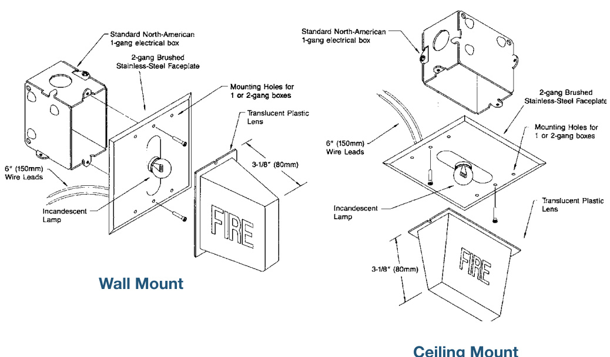

# Lamp Stations 890 Series  

# Overview  

EDWARDS 890 Series Lamp Stations are designed for placement on the wall or ceiling above fire alarm manual pull stations. Wired with the individual fire alarm station, the corridor lamp will “light up” and visually indicate when that station has been “pulled”. This allows the building authorities to quickly recognize what pull station has been activated.  

All models feature a large translucent plastic lens easily seen from all angles. WHITE or RED lenses are available to meet local requirements. Red lenses have “FIRE” printed in white; white lenses have “FIRE” printed in red.  

EDWARDS 890 series Lamp Stations are supplied with 24 volt (0.18 amps) or 120 volt (0.05 amps) lamps, supervision diode, wedge shaped plastic lens and two-gang brushed stainless-steel face plate. Wiring connections are made to six-inch (150mm) wire leads.  

These Lamp Stations flush mount over standard North American one or two-gang electrical boxes, or surface mount to two-gang Wiremold (or equivalent) boxes.  

# Standard Features  

•Wall or ceiling mount •Large RED or WHITE lens •Stainless steel faceplate •Diode supervised •24 Vdc or 120 Vac •Easy installation •Sturdy design  

# Installation  

EDWARDS recommends that these Fire Alarm Stations always be installed in accordance with the latest recognized issue of national and local fire alarm codes.  

  

# Specifications  

<html><body><table><tr><td>CatalogNumber</td><td>890RDA</td><td>890RDB</td><td>890WDA</td><td>890WDB</td></tr><tr><td>MountingStyle</td><td>Ceiling</td><td>Wall</td><td>Ceiling</td><td></td></tr><tr><td>Lens Color</td><td colspan="2">Red withWhite“FIRE"</td><td colspan="2">WhitewithRED“FIRE"</td></tr><tr><td>OperatingVoltage</td><td>24Vdc120Vac</td><td colspan="3">24Vdc</td></tr><tr><td>OperatingCurrent</td><td>0.18Amps-24Vdc 0.05 Amps - 120 Vac</td><td colspan="3">0.18 Amps - 24 Vdc</td></tr><tr><td>FlushMounting</td><td colspan="4">Standard North-American one or two-gang Electrical Box</td></tr><tr><td>SurfaceMounting</td><td colspan="4">Wiremoldorequivalenttwo-gangBox</td></tr><tr><td>Faceplate</td><td colspan="4">two-gangBrushedStainless-steel</td></tr><tr><td>WiringConnection</td><td colspan="4">six-inch(150mm)WireLeads</td></tr><tr><td>Operating Environment</td><td colspan="4">StandardIndooronly(Dry)</td></tr></table></body></html>  

# Ordering Information  

<html><body><table><tr><td>Catalog Number</td><td>Description</td><td>Ship Weight</td></tr><tr><td>890RDA</td><td>LampStation-WallMount,RedLenswithwhite“FIRE includes1-120Vacand 1-24Vdclamp.</td><td rowspan="3">0.5 Ib (0.2 kg)</td></tr><tr><td>890WDA-G5</td><td>LampStation—Wall Mount,WhiteLenswithred“FIRE",24Vdc</td></tr><tr><td>890RDB-G5</td><td>LampStation-Ceiling Mount,Red Lenswithwhite“FIRE"，24Vdc</td></tr><tr><td>890WDB-G5</td><td>Lamp Station-Ceiling Mount,WhiteLenswithred“FIRE",24Vdc</td><td></td></tr></table></body></html>

CAUTION: These devices will not operate without electrical power. As fires frequently cause power interruptions, we suggest you discuss further safeguards with your fire protection specialist.  