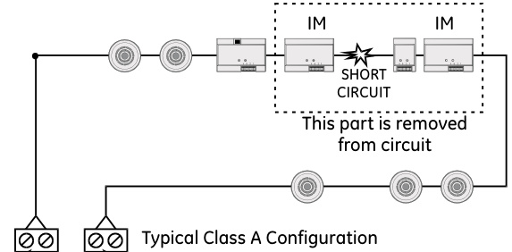
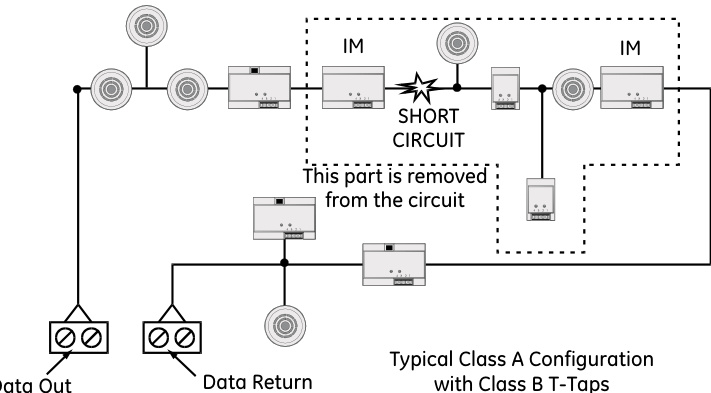
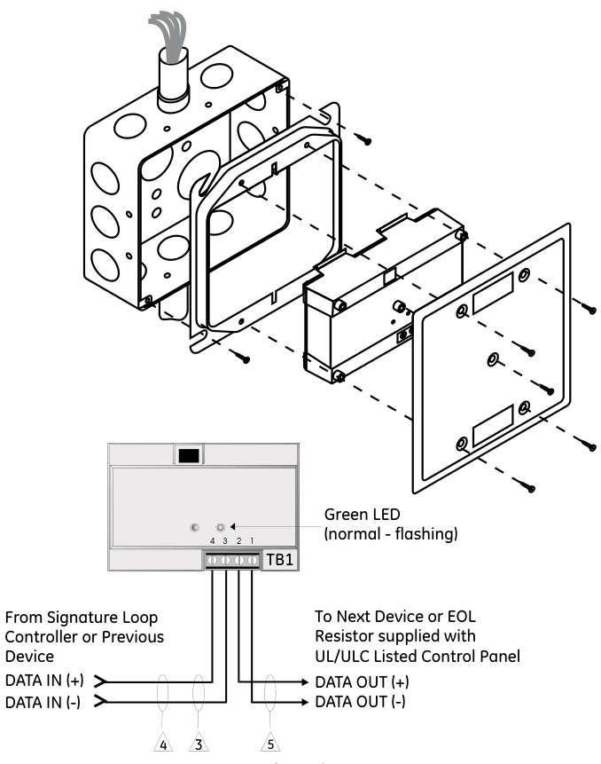

# Isolator Module SIGA-IM  

# Overview  

The SIGA-IM Isolator Module is part of EDWARDS’s Signature Series system. This intelligent device enables part of the Signature data loop to continue operating should a short circuit occur. The module can be wired into a Class A data loop at any point.  

If a fault occurs, the isolator cuts power to all devices beyond the isolator on the loop as follows:  

•	 a short on the line causes all isolators to open within 23 msec. •	 at 10 msec intervals, beginning on one side of the Class A circuit nearest the loop controller, the isolators close to provide the next isolator down the line with power. •	 when the isolator next to the short closes, it reopens within 10 msec.  

Once activated, the line fault isolator continuously checks the faulted side of the loop to determine if the short still exists. When the fault is corrected and system reset, the module automatically restores the entire data loop to the normal condition.  

The microprocessor in every Signature module provides at least three important benefits — Self-diagnostics and History Log, Automatic Device Mapping, and Fast, Stable Communication.  

Self-diagnostics and History Log - Each Signature Series module constantly runs self-checks to provide important maintenance information.  This information is automatically updated and permanently stored in the module’s non-volatile memory and is accessible for review any time using the SIGA-PRO Signature Program / Service Tool.  

Automatic Device Mapping - The Signature loop controller learns keeps a map where each device’s serial number address is installed relative to other devices on the data circuit.  

Fast Stable Communication - Built-in intelligence means less information needs to be sent between the module and the loop controller. Other than regular supervisory polling response, the module only needs to communicate with the loop controller when it has something new to report.  

# Standard Features  

Automatic device mapping Each module transmits wiring information to the loop controller regarding its location with respect to other devices on the circuit. Electronic addressing Addresses are downloaded and permanently stored from a PC, or the SIGA-PRO Signature Program / Service Tool. There are no switches or dials to set. Ground fault detection by address Detects ground faults right down to the device level. 2-gang mounting   
Designed to ISO 9001 standards  

# Testing & Maintenance  

The module’s automatic self-diagnosis identifies when it is defective and causes a trouble message. The user-friendly maintenance program shows the current state of each module and other pertinent messages. Single modules may be turned off (deactivated) temporarily, from the control panel. Availability of maintenance features is dependent on the fire alarm system used.  Scheduled maintenance (Regular or Selected) for proper system operation should be planned to meet the requirements of the Authority Having Jurisdiction (AHJ). Refer to current NFPA 72 and ULC CAN/ ULC 536 standards.  

# Warnings & Cautions  

This module will not operate without electrical power. As fires frequently cause power interruption, we suggest you discuss further safeguardwith your fire protection specialist.  

# Typical Wiring and Installation  

The SIGA-IM module mounts to North American 2-1/2 inch $(64\;\mathsf{m m})$ deep 2-gang boxes and 1-1/2 inch $(38\,\mathsf{m m})$ ) deep 4 inch square boxes with 2 gang covers and SIGA-MP mounting plates. The module will accept #18 AWG $(0.75\mathsf{m m}^{2})$ ), #16 $(1.0\mathsf{m m}^{2})$ , #14 AWG (1.50mm2), and #12 AWG $(2.50\mathsf{m m}^{2})$ wire sizes.  Note: Sizes #16 AWG (1.0mm2) and #18 AWG (0.75mm2) are preferred for ease of installation. See Signature Loop Controller catalog sheet for detailed wiring requirement specifications.  

EDWARDS recommends that this module be installed according to latest recognized edition of national and local fire alarm codes.  

# Application  

This module should only be used on Class A circuits. The operation of the SIGA-IM is determined by its hardware type code and is assigned at the factory. No user configuration is required.  

# Compatibility  

These modules are part of EDWARDS’s Signature Series intelligent processing and control platform. They are compatible with EST3, EST3X and iO Series control panels.  

# Typical Wiring  

  

Data Out Data Return Signature Loop Controller  

  

Signature Loop Controller  

  

For maximum wire resistance, refer to the appropriate manufacturer’s documentation. $\scriptstyle{\hat{2}}$ Max. #12 AWG $12.5\mathsf{m m}^{2}$ )wire. $3$ Refer to Signature Loop Controller Installation Sheet for wiring specifications. $\hat{\langle4\rangle}$ This module should be used only with Class A wiring. $\beta$ Maximum circuit resistance between isolators is 6 ohms. $6$ All wiring is power-limited and supervised.  

<html><body><table><tr><td>Description</td><td>IsolatorModule-factoryset hardware type code</td></tr><tr><td>AddressRequirements</td><td>UsesOneDetectorAddress</td></tr><tr><td>CircuitResistance</td><td>Sixohmsmaximumbetweenisolators</td></tr><tr><td>OperatingCurrent</td><td>Standby = 45uA; Activated = 45μA</td></tr><tr><td>OperatingVoltage</td><td>15.2 to19.95Vdc (19Vdcnominal)</td></tr><tr><td>Construction&Finish</td><td>High Impact Engineering Polymer 2-gang frontplate-WhiteFinish</td></tr><tr><td>StorageEnvironment</td><td>Temperature:-4°Fto140°F(-20°C to60°C)</td></tr><tr><td>Operating Environment</td><td>Temperature:32°F to120°F(0°C t049°C); Humidity:0 to93%RH</td></tr><tr><td>LED Operation</td><td>On-boardGreenLED-Flasheswhenpolled</td></tr><tr><td>Compatibility</td><td>(normal) Usewith:SignatureLoopController</td></tr><tr><td>Agency Listings</td><td>UL,ULC,CSFM,MEA,FM</td></tr></table></body></html>  

<html><body><table><tr><td>Catalog Number</td><td>Description</td><td>Ship Wt. Ib (kg)</td></tr><tr><td>SIGA-IM</td><td>FaultIsolatorModule-UL/ULCListed</td><td>.5 (.23)</td></tr><tr><td></td><td></td><td></td></tr><tr><td>Accessories</td><td></td><td></td></tr><tr><td>27193-21</td><td>SurfaceMountBox-2-gangRED</td><td>1 (.4)</td></tr><tr><td>27193-26</td><td>Surface Mount Box - 2-gang WHITE</td><td></td></tr><tr><td>MFC-A</td><td>MultifunctionFireCabinet-Red,supports SignatureModuleMountingPlates</td><td>7.0 (3.1)</td></tr><tr><td>SIGA-MP1</td><td>Signature Module Mounting Plate, 1 footprint</td><td>1.5 (0.70)</td></tr><tr><td>SIGA-MP2</td><td>SignatureModuleMountingPlate,1/2footprint</td><td>0.5 (0.23)</td></tr><tr><td>SIGA- MP2L</td><td>SignatureModuleMountingPlate,1/2ex- tendedfootprint</td><td>1.02 (0.46)</td></tr></table></body></html>  