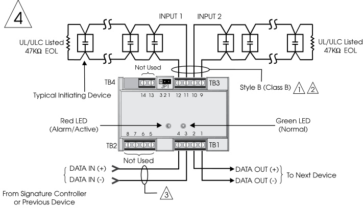
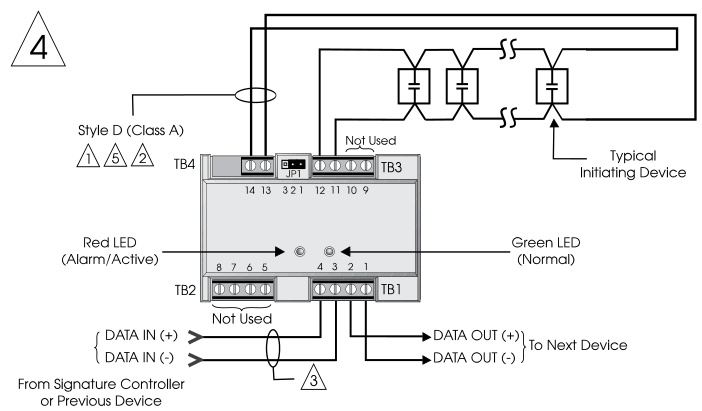
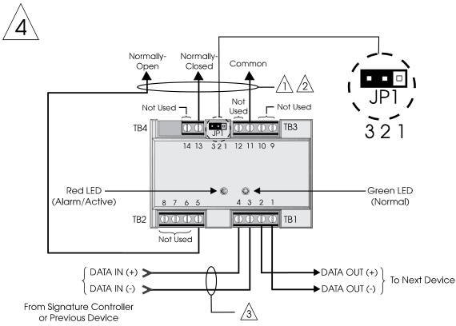
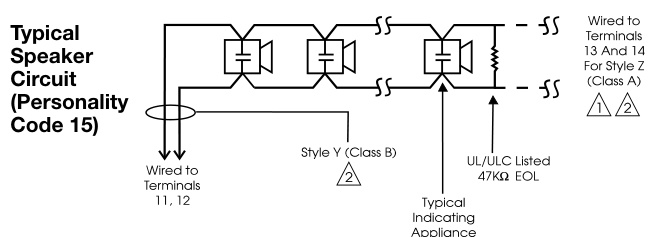
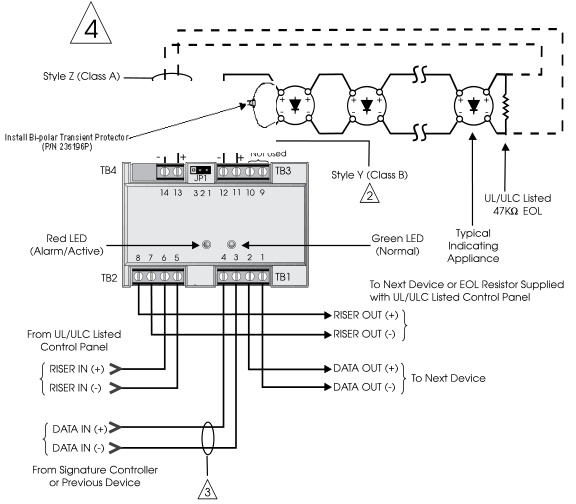
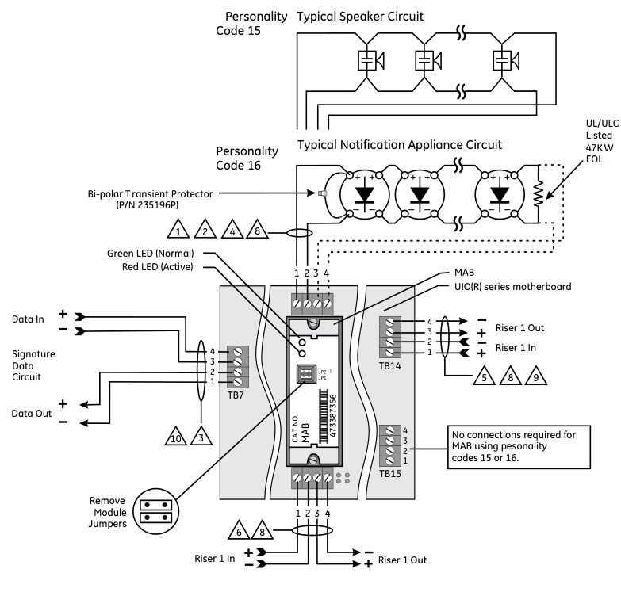
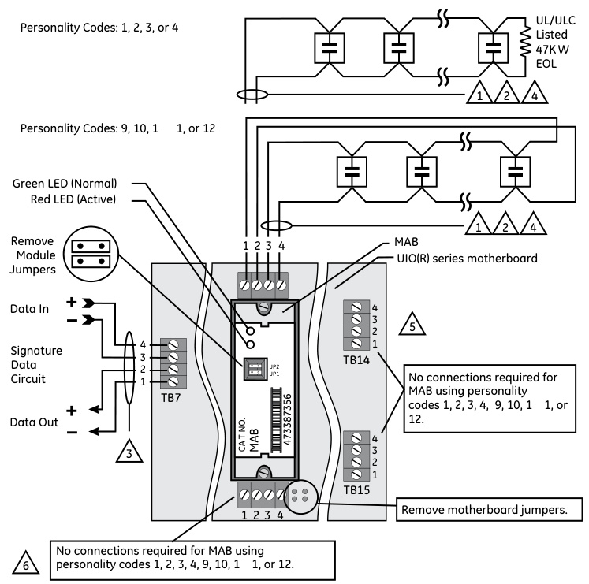

# Class A/B Modules Model SIGA-UM, SIGA-MAB  

# Overview  

The SIGA-UM and SIGA-MAB are Universal Class A/B Modules. They are intelligent analog Addressable devices that are part of EDWARDS’s Signature Series system. The actual function of the module is determined by the “personality code” selected by the installer. This is downloaded to the module from the Signature loop controller during system configuration. The SIGA-UM and SIGA-MAB gather analog information from the slave devices connected to them and convert this into digital signals. Each module’s on-board microprocessor measures and analyzes the signal and decides whether or not to input an alarm.  

The SIGA-UM is installed to a standard North American 2-gang electrical box, making it ideal for locations where only one module is required. Separate I/O and data loop connections are made to each module. The SIGA-UM may be used to connect any one of the following:  

•	 two Class B or one Class A Initiating Device Circuits •	 one Class A or B Notification Appliance Circuit •	 one Class A or B Circuit for 2-wire Smoke Detectors •	 one Form $^{*}\mathrm{C}^{*}$ (NO/NC) Dry Output Contact Relay The SIGA-MAB is part of the UIO family of plug-in Signature Series modules. It takes advantage of the modular flexibility and easy installation that characterizes all UIO modules. Two- and sixmodule UIO motherboards are available. These can accommodate individual risers for each on-board module, or shared risers in any combination with their UIO modules. All wiring connections are  

made to terminal blocks on the motherboard. UIO assemblies may be mounted in EDWARDS enclosures. The SIGA-MAB may be used to connect any one of the following:  

•	 one Class B or one Class A Initiating Device Circuit •	 one Class A or B circuit for 2-wire Smoke Detectors •	 one Class A or B Notification Appliance Circuit  

# Standard Features  

# •	 15 modules in one  

Multiple applications including Class A or B device circuit wiring, Class A or B 2-wire smoke detector circuits and delayed latching (retard) for waterflow alarm applications. The installer selects one of up to 15 “personality codes” to be downloaded from the loop controller.   
Plug in (UIO) or standard 2-gang mount   
UIO versions allow quick installation where multiple modules are required. The 2-gang mount version is ideal for remote locations that require a single module.   
Automatic device mapping   
Signature modules transmit information to the loop controller regarding their circuit locations with respect to other Signature devices on the wire loop.   
Electronic addressing   
Programmable addresses are downloaded from the loop controller, a PC, or the SIGA-PRO Signature Program/Service Tool. There are no switches or dials to set.  

# Intelligent device with microprocessor  

All decisions are made at the module to allow lower communication speed with substantially improved control panel response time and less sensitivity to line noise and loop wiring properties; twisted or shielded wire is not required.   
Non-volatile memory   
Permanently stores serial number, type of device, and job number. Automatically updates historic information including hours of operation, last maintenanc  e date, number of alarms and troubles, and time and date of last alarm.   
Ground fault detection by address   
Detects ground faults right down to the device level.   
High ambient temperature operation   
Install in ambient temperatures up to 120oF (49oC).   
Designed to ISO 9001 standards   
All Signature products are manufactured to strict international quality standards to ensure highest reliability.  

# Installation  

The SIGA-UM: mounts to North American 2-1/2 inch $(64\;\mathsf{m m})$ deep 2-gang boxes and 1-1/2 inch $(38\,\mathsf{m m})$ deep 4 inch square boxes with 2-gang covers and SIGA-MP mounting plates. The terminals are suited for #12 to $\#18$ AWG ( $2.5\;\mathrm{mm}^{2}$ to $0.75\;\mathrm{mm}^{2}$ )wire size.  

  

# Testing & Maintenance  

The module’s automatic self-diagnosis identifies when it is defective and causes a trouble message. The user-friendly maintenance program shows the current state of each module and other pertinent messages. Single modules may be turned off (de-activated) temporarily, from the control panel.  

Scheduled maintenance (Regular or Selected) for proper system operation should be planned to meet the requirements of the Authority Having Jurisdiction (AHJ).  Refer to current NFPA 72 and ULC CAN/ULC 536 standards.  

SIGA-MAB: mount the UIO motherboard inside a suitable EDWARDS enclosure with screws and washers provided. Plug the module into any available position on the motherboard and secure the module to the motherboard with the captive screws. Wiring connections are made to the terminals on the motherboard (see wiring diagram). UIO motherboard terminals are suited for $\#12$ to #18 AWG $2.5\;\mathrm{mm}^{2}$ to $0.75\;\mathrm{mm}^{2}$ ) wire size.  

  
Electronic Addressing - The loop controller electronically addresses each module saving valuable time during system commissioning. Setting complicated switches or dials is not required.  Each module has its own unique serial number stored in its “on-board memory”. The loop controller identifies each device on the loop and assigns a “soft” address to each serial number. If desired, the modules can be addressed using the SIGA-PRO Signature Program/Service Tool.  

Module Operating Characteristics   

<html><body><table><tr><td>ModeofOperation</td><td>PersonalityCode</td><td>StandbyCurrent</td><td>AlarmCurrent</td><td>EOLResistorValue</td></tr><tr><td>Class B Initiating Device Circuit (IDC)</td><td>1,2,3,4</td><td>396uA</td><td>680μA</td><td>47K ohm</td></tr><tr><td>Form “C" Dry Contact Relay - Note 1</td><td>8</td><td>100uA</td><td>100μA</td><td>N/A</td></tr><tr><td>Class A Initiating Device Circuit (IDC)</td><td>9,10,11,12</td><td>223uA</td><td>365uA</td><td>47Kohm</td></tr><tr><td>2-WireSmokeDetectorsand Initiating g Devices (IDC)</td><td>13,14,20,21</td><td>2mA</td><td>First-17mA Subsequent-100uA</td><td>15Kohm</td></tr><tr><td>ClassAorBNotificationAppliance Circuit(NAC)-SeeNote 1</td><td>15,16</td><td>223uA</td><td>365μA</td><td>47Kohm(Class B</td></tr></table></body></html>

Note 1: Contacts rated at 2 amps $@$ 24 Vdc, 0.5 amps $@$ 120 Vac, 50W $@$ 25 V audio, 35W $@$ 70 V audio. Not rated for capacitive loads.  

# Warnings & Cautions  

# Compatibility  

This module will not operate without electrical power. As fires frequently cause power interruption, we suggest you discuss further safeguards with your fire protection specialist.  

The Signature Series modules are compatible only with EDWARDS’s Signature Loop Controller.  

The actual duty performed by the SIGA-UM and SIGA MAB is determined by its sub-type code or “Personality Code”.  The code is selected depending upon the desired application by the installer and is downloaded from the loop controller.  

<html><body><table><tr><td colspan="7">Code Class Description</td></tr><tr><td>1</td><td>B</td><td>Normally Open Alarm</td><td>Latching</td><td>Assign to one orbothcircuits.Configureseither 1or 2orbothfor ClassB normally- when the input contact is closed. The condition alarm is latched at the module.</td><td>Suitable for ... Pull Stations, Heat Detectors</td></tr><tr><td>2</td><td>B</td><td>Normally Open Alarm</td><td>Delayed Latching</td><td>Assign to one or both circuits. Configures either circuit 1 or 2 or both for Class B inputcontact is closed for atleast 16 seconds.The condition alarm islatched at the module.</td><td>WaterflowAlarm Switches</td></tr><tr><td>3</td><td>B</td><td>Normally Open Active</td><td>Non- Latching</td><td>Assign to one or both circuits. Configures either circuit 1 or 2 or both for Class B nor-</td><td>Fans, Dampers, Doors</td></tr><tr><td>4</td><td>B</td><td>Normally Open Active</td><td>Latching</td><td>Assign to one or both circuits. Configures either circuit 1 or 2 or both for Class B nor- when the input contact is closed. The active condition is latched at the module.</td><td>Supervisory and Tamper Switches</td></tr><tr><td>81</td><td></td><td>Control Relay</td><td></td><td>Applies to both circuits 1 and 2 simultaneously. Configures module to provide one Form “C" DRY RELAY CONTACT. Contact rating is 2.0 amp @ 24 Vdc; 0.5 amp @ 120 Vac (or 220 Vac non-UL). This Personality Code is available with the SIGA-UM only.</td><td>Door Closers, Fans, Dampers</td></tr><tr><td>9</td><td>A</td><td>Normally Open Alarm</td><td></td><td>Applies to both circuits 1 and 2 simultaneously.Configures moduleforClass A troller when the input contact is closed. The alarm condition is latched at the module. Applies toboth circuits 1 and 2 simultaneously.Configures module for Class A</td><td>Pull Stations, Heat Detectors</td></tr><tr><td>10</td><td>A</td><td>Normally Open Alarm</td><td>Delayed Latching</td><td>normally-open dry contact initiating devices. An ALARM signal is sent to the loop con- troller when the input contact is closed for at least 16 seconds. The alarm condition is latched atthemodule.</td><td>WaterflowAlarm Switches</td></tr><tr><td>11</td><td>A</td><td>Normally Open Active</td><td>Non- Latching</td><td>Applies to both circuits 1 and 2 simultaneously. Configures module for Class A normal- ly-open dry contact monitoring input. An ACTIVE signal is sent to the loop controller when the inputcontact is closed.The active condition is not latched at the module.</td><td>Fans, Dampers, Doors</td></tr><tr><td>12</td><td>A</td><td>Normally Open Active</td><td>Latching</td><td>Applies to both circuits 1 and 2 simultaneously. Configures module for Class A normal- ly-open dry contact monitoring input. An ACTIVE signal is sent to the loop controller when the input contact is closed.The active condition is latched at the module. 2-wire Smoke Detectors that DO NOT require alarm verification. Normally open dry</td><td>Supervisory and Tamper Switches</td></tr><tr><td>13</td><td>B</td><td>2-Wire Smoke</td><td>Alarm Non- Verified</td><td>contact initiating devices. CAN be on the same circuit with personality code 13 ONLY. An ALARM signal is sent to the loop controller when the input contact is closed or a smoke detector enters into alarm.The alarm condition is latched at the module.The LED on only the first smoke detector to alarm will latch ON steady. Circuit B is used to monitor smoke power from the loop controller. Compatible smoke detectors include: up to 20 - 6249/6250/6264 series, or up to 15 - 6266/6269/6270 series. Also com- patiblewithup to10-model1451or 2451detectors. Applies to both circuits 1 and 2 simultaneously. Configures module for connection of</td><td>Smoke Detectors, Pull Stations, Heat Detectors</td></tr><tr><td>14</td><td>B</td><td>2-Wire Smoke</td><td>Alarm Verified</td><td>up to 1.0 mA of conventional 2-wire Smoke Detectors that DO require alarm verifica- tion. Normally open dry contact initiating devices. CAN NOT be on the same circuit. An ALARM signal is sent to the loop controller when a smoke detector enters into alarm. The alarm condition is latched at the module. The LED on only the first smoke detector to alarm will latch ON steady. Circuit B is used to monitor smoke power from the loop controller. Compatible smoke detectors include: up to 20 - 6249/6250/6264 series, or up to 15 - 6266/6269/6270 series.Also compatiblewith up to 10 -model 1451 or 2451 detectors.</td><td>SmokeDetectors, Pull Stations, Heat Detectors</td></tr><tr><td>15</td><td>A</td><td>Signal Output</td><td></td><td>Applies to both circuits 1 and 2 simultaneously. Configures module for connection of Class A Notification Appliance Circuit (NAC). The maximum allowable signal power is 2 amps @ 24 Vdc,0.5 amps @ 120 Vac (or 220 Vac non-UL). The maximum allowable speaker power is 50w (25 V audio) or 35w (70 V audio).</td><td>Horns, Speakers</td></tr><tr><td>16</td><td>B</td><td>Signal Output</td><td></td><td>Applies to both circuits 1 and 2 simultaneously. Configures module for connection of Class B Notification Appliance Circuit (NAC). The maximum allowable signal power is 2 amps @ 24 Vdc, 0.5 amps @ 120 Vac (or 220 Vac non-UL). The maximum allowable</td><td>Horns, Speakers</td></tr><tr><td>20</td><td>A</td><td>2-Wire Smoke</td><td>Alarm Non- Verified</td><td>Operates the same as personality code 13, except that the wiring is Class A.</td><td>Smoke &Heat Detectors, Pull Stations</td></tr><tr><td>21</td><td>A</td><td>2-Wire Smoke</td><td>Alarm Verified</td><td>Operates the same as personality code 14, except that the wiring is Class A.</td><td>Smoke &Heat Detectors, Pull Stations</td></tr></table></body></html>

Notes: Personality codes are assigned to each address. Only codes 1, 2, 3 and 4 can be mixed on any one module. For example, personality code 1 can be assigned to the first address (circuit A) and code 4 can be assigned to the second address (circuit B). All other codes automatically use up both addresses simultaneously and therefore cannot be mixed. ¹  Does not apply to SIGA-MAB.  

Modules will accept #18 AWG $(0.75\mathsf{m m}^{2})$ ), #16 $1.0\mathsf{m m}^{2})$ , #14 AWG (1.50mm2) and #12 AWG $(2.50\mathsf{m m}^{2})$ wire sizes. Note: Sizes #16 AWG (1.0mm2) and #18 AWG $(0.75\mathsf{m m}^{2})$ ) are preferred for ease of installation. See Signature Loop Controller catalog sheet for detailed wiring requirement specifications.  

  
Class B Dual Input Module (Personality Code 1, 2, 3 or 4)   
2-Wire Smoke Detectors - Class A or Class B (Personality Code 13, 14, 20 or 21)  

  
Class A Single Input Module(Personality Code 9, 10, 11 or 12)  

  

For maximum wire resistance and maximum wire   
distances, refer to IOMC Manual (P/N 270144).   
Maximum #12 AWG $(2.5\mathsf{m m}^{2})$ wire.  Minimum #18 AWG $(0.75\mathsf{m m}^{2})$ .  
Refer to Signature Loop Controller Installation Sheet for wiring specifications.   
This module will NOT support 2-wire smoke detectors unless configured for personality 13, 14, 20 or 21.   
5 Max. 12.5 ohms resistance per wire for Class A configurations. Compatible smoke detector.  Refer to Personality Codes 13, 14, 20 or 21 for type and quantity. SIGA-UM must be installed within the same room as the device it is controlling.   
8) 	 All wiring power limited and supervised. If the input source is non-power limited, then maintain spacing of $1/4$ inch, or use FPL, FPLP, FPLR, or equivalent in accordance with NEC.   
9)  	Polarity at terminals 11 & 12 shown in Supervisory condition. Connect as shown in diagram. (Polarity reverses on Alarm.)  

  
Control Relay Module (Personality Code 8, SIGA-UM only)   
Single Output Module (Personality Code 15 or 16)  

  
Typical Notification Appliance Circuit (Personality Code 16)  

  

# Typical Wiring (SIGA-MAB)  

Modules will accept $\#12$ AWG $(2.5\mathsf{m m}^{2})$ ), #18 AWG $(0.75\mathsf{m m}^{2})$ ), #16 $\left\{1.0\mathsf{m m}^{2}\right\}$ , and #14 AWG (1.50mm2) wire sizes. Note: Sizes #16 AWG $(1.0\mathsf{m m}^{2})$ and #18 AWG $(0.75\mathsf{m m}^{2})$ are preferred for ease of installation. See Signature Loop Controller catalog sheet for detailed wiring requirement specifications.  

# Class A or B Dry Contact Input Module (Personality Code 1, 2, 3, 4, 9, 10, 11 or 12)  

  
Notification (Output) Module (Personality Code 15 or 16)   
Class A or B 2-Wire Smoke Detector and Dry Contact Input Module (Personality Code 13, 14, 20 or 21)  

  

# NOTES  

  

1	 For maximum resistance, see the appropriate technical reference manual. Maximum circuit capacitance is $0.1\textsf{m F}$   
2 Maximum #12 AWG $(2.5\;\mathsf{m m}^{2}$ ) wire; Minimum $\#18$ AWG $(0.75\;\mathsf{m m}^{2})$ )  
3 Refer to Signature Controller Installation Sheet for wiring specifications.   
4 Maximum 10 Vd $;\@350$ 0mA   
/5 The SIGA-UIO6R does not come with  TB14.   
6 The SIGA-UIO6 does not come with TB8 through TB13.   
7 Supervised and power-limited.   
8 If the source is nonpower-limited, maintain a space of 1/4 inch from power-limited wiring or use FPL, FPLP,  FPLR, or an equivalent in accordance with the National Electrical Code.   
9 The input for this riser is common to all modules.   
10 Maximum alarm current is 17 mA. Operating voltage range is 16.0 to 24.0 Vdc.  

Specifications   

<html><body><table><tr><td></td><td>SIGA-UM</td><td>SIGA-MAB</td></tr><tr><td></td><td></td><td>Plug-in (UIO) Universal A/B Module</td></tr><tr><td>Description Wiring</td><td>StandardMountUniversal A/BModule</td><td></td></tr><tr><td>Terminations</td><td colspan="2">Suitable for #12 to #18 AWG (2.5 mm2 to 0.75mm2) NorthAmerican21/2inch(64mm)deep</td></tr><tr><td>Mounting</td><td>2-gang boxes & 1%2inch (38 mm) deep 4 inch square boxes with two- gang covers and SIGA-MP mounting plates</td><td>Plugs into UIO2R, UIO6R or UIO6 Motherboards</td></tr><tr><td>Personality Codes</td><td>15 Selectable Codes Available</td><td>14SelectableCodesAvailable</td></tr><tr><td>Address Requirements</td><td colspan="2">Uses Two Module Addresses</td></tr><tr><td>Operating Current</td><td colspan="2">SeeOperatingCharacteristicsTable</td></tr><tr><td>Operating Voltage</td><td colspan="2">15.2 to 19.95 Vdc (19 Vdc nominal)</td></tr><tr><td>Construction Storage and</td><td colspan="2">High Impact Engineering Polymer</td></tr><tr><td>Operating Environment</td><td colspan="2">Operating Temperature: 32°F to 120°F (0°C to 49°C) Storage Temperature: -4°F to 140°F (-20°℃ to 60°C) Humidity: 0 to 93% RH</td></tr><tr><td>LED Operation</td><td colspan="2">On-board Green LED - Flashes when polled; On-board Red LED - Flashes when in alarm/active</td></tr><tr><td>Compatibility</td><td colspan="2">Use With: Signature Loop Controller</td></tr><tr><td>Agency Listings</td><td colspan="2">UL,ULC,MEA,CSFM</td></tr></table></body></html>  

# Ordering Information  

<html><body><table><tr><td>Catalog Number Description</td><td></td><td>Ship Wt. Ib (kg)</td></tr><tr><td>SIGA-UM</td><td>Universal Class A/B Module (Standard Mount) - UL/ULC Listed</td><td>0.5 (0.23)</td></tr><tr><td>SIGA-MAB</td><td>Universal Class A/B Module (Plug-in) - UL/ULC Listed</td><td>0.18 (0.08)</td></tr><tr><td colspan="3"></td></tr><tr><td>Related Equipment</td><td></td><td></td></tr><tr><td>27193-21</td><td>Surface Mount Box-Red, 2-gang</td><td>2 (1.2)</td></tr><tr><td>27193-26</td><td>Surface Mount Box -White, 2-gang Universal Input-Output ModuleBoard w/Riser Inputs</td><td>2 (1.2)</td></tr><tr><td>SIGA-UIO2R</td><td>- Two Module Positions Universal Input-Output ModuleBoardw/Riser Inputs</td><td>0.32 (0.15)</td></tr><tr><td>SIGA-UIO6R</td><td>-SixModulePositions</td><td>0.62 (0.28)</td></tr><tr><td>SIGA-UIO6</td><td>Universal Input-OutputModuleBoard-SixModulePositions MultifunctionFireCabinet</td><td>0.56 6 (0.25)</td></tr><tr><td>MFC-A</td><td>-Red, supports Signature Module Mounting Plates</td><td>7.0 (3.1)</td></tr><tr><td>SIGA-MP1</td><td>Signature Module Mounting Plate, 1 footprint</td><td>1.5 (0.70)</td></tr><tr><td>SIGA-MP2</td><td>Signature Module Mounting Plate,1/2 footprint</td><td>0.5 (0.23)</td></tr><tr><td>SIGA-MP2L</td><td>Signature Module Mounting Plate, 1/2 extended footprint</td><td>1.02 (0.46)</td></tr></table></body></html>  