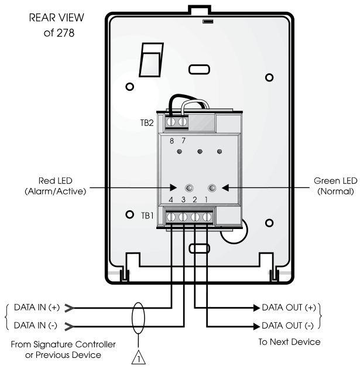
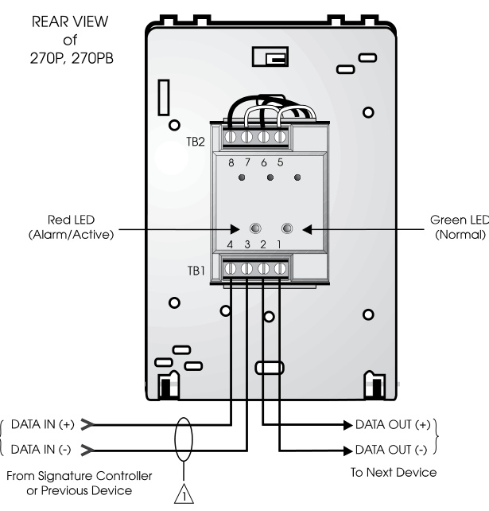
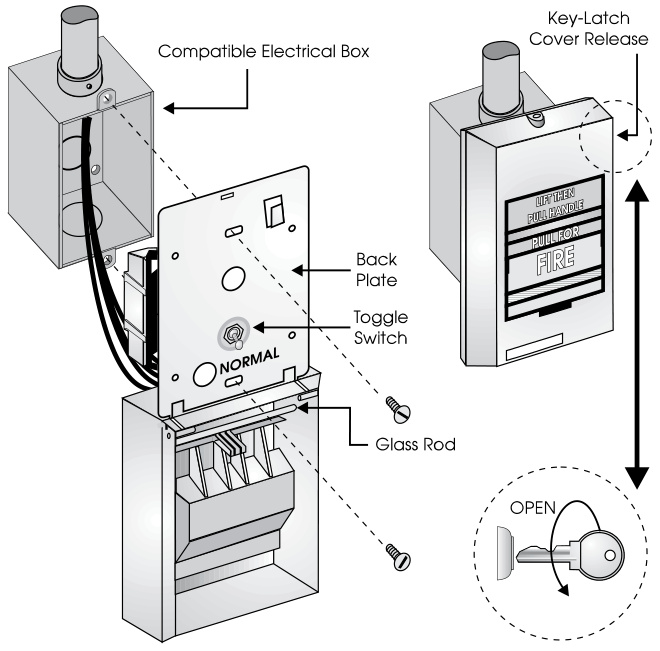
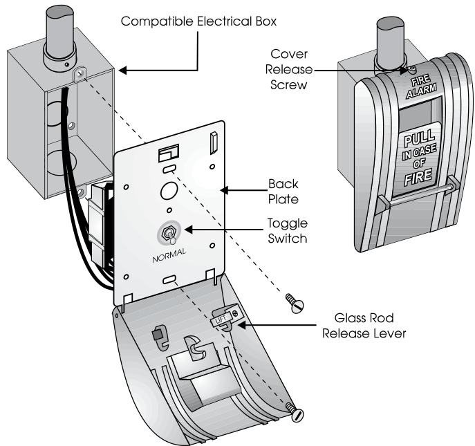
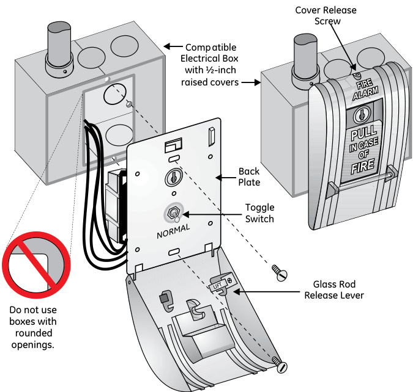

# Manual Pull Stations SIGA-270, SIGA-270P, SIGA-278  

# Overview  

The SIGA-270 and SIGA-278 series Manual Pull Stations are part of EDWARDS’s Signature Series system. The SIGA-270 Fire Alarm Manual Pull Stations feature our very familiar teardrop shape. They are made from die-cast zinc and finished with red epoxy powdercoat paint complemented by aluminum colored stripes and markings.  With positive pull-lever operation, one pull on the station handle breaks the glass rod and turns in a positive alarm, ensuring protection plus fool-proof operation. Presignal models (SIGA-270P) are equipped with a general alarm (GA) keyswitch for applications where two stage operation is required. The up-front highly visible glass rod discourages tampering, but is not required for proper operation.  

EDWARDS’s double action single stage SIGA-278 station is a contemporary style manual station made from durable red colored lexan.  To initiate an alarm, first lift the upper door marked “LIFT THEN PULL HANDLE”, then pull the alarm handle.  

# Standard Features  

Note: Some features described here may not be supported by all control systems. Check your control panel’s Installation and Operation Guide for details.  

# Traditional familiar appearance  

SIGA-270 models feature our familiar teardrop design with simple positive pull action and sturdy die-cast metal body. One stage (GA), two stage (pre-signal), and double action models SIGA-270 models are available for one or two stage alarm systems. The single stage double action SIGA-278 features a rugged Lexan housing with keyed reset mechanism.  

# Break glass operation  

An up-front visible glass rod on the SIGA-270 discourages tampering.  

# Intelligent device with integral microprocessor  

All decisions are made at the station allowing lower communication speed while substantially improving control panel response time. Less sensitive to line noise and loop wiring properties; twisted or shielded wire is not required.  

ADA Compliant Meets ADA requirements for manual pull stations.  

# Electronic Addressing with Non-volatile memory  

Permanently stores programmable address, serial number, type of device, and job number. Automatically updates historic information including hours of operation, last maintenance date, number of alarms and troubles, and time and date of last alarm.  

# Automatic device mapping  

Each station transmits wiring information to the loop controller regarding its location with respect to other devices on the circuit.  

Diagnostic LEDs   
Status LEDs; flashing GREEN shows normal polling; flashing RED shows alarm state.  

# Application  

The operating characteristics of the fire alarm stations are determined by their sub-type code or “Personality Code”. NORMALLYOPEN ALARM - LATCHING (Pesonality Code 1) is assigned by the factory; no user configuration is required. The device is configured for Class B IDC operation. An ALARM signal is sent to the loop controller when the station’s pull lever is operated. The alarm condition is latched at the station.  

# Compatibility  

Signature Series manual stations are compatible only with EDWARDS’s Signature Loop Controller.  

# Warnings & Cautions  

This device will not operate without electrical power. As fires frequently cause power interruption, we suggest you discuss further safeguards with your local fire protection specialist.  

# Testing & Maintenance  

To test (or reset) the station simply open the station and operate the exposed switch. The SIGA-270 series are opened with a tool; the SIGA-278 requires the key which is supplied with that station.  

The station’s automatic self-diagnosis identifies when it is defective and causes a trouble message. The user-friendly maintenance program shows the current state of each Signature series device and other pertinent messages. Single devices may be deactivated temporarily, from the control panel. Availability of maintenance features is dependent on the fire alarm system used.  

Scheduled maintenance (Regular or Selected) for proper system operation should be planned to meet the requirements of the Authority Having Jurisdiction (AHJ). Refer to current NFPA 72 and ULC CAN/ULC 536 standards.  

# Typical Wiring  

The fire alarm station’s terminal block accepts #18 AWG (0.75mm2) to #12 AWG $(2.5\mathsf{m m}^{2})$ wire sizes. See Signature Loop Controller catalog sheet for detailed wiring requirement specifications.  

# Wiring Notes  

1	 Refer to Signature Loop Controller manual for maximum wire distance.  

2.	 All wiring is power limited and supervised.  

  
Figure 4.  Single Stage Systems  

  
Figure 5.  Two Stage Systems  

# Installation  

Single-stage Signature Series fire alarm manual pull stations mount to North American $2\%$ inch $\left(64\;\mathsf{m m}\right)$ ) deep 1-gang boxes.  

Two stage presignal (270P) models require $1\,\%$ inch $(38\,\mathsf{m m}$ ) deep 4-inch square boxes with 1-gang, $\%$ -inch raised covers. Openings must be angular. Rounded openings are not acceptable. Recommended box: Steel City Model 52-C-13; in Canada, use Iberville Model CI52-C-49-1/2.  

All models include terminals are suited for #12 to #18 AWG $2.5\;\mathrm{mm}^{2}$ to $0.75\;\mathrm{mm}^{2})$ wire size. EDWARDS recommends that these fire alarm stations be installed according to latest recognized edition of national and local fire alarm codes.  

Electronic Addressing:  The loop controller electronically addresses each manual station, saving valuable time during system commissioning. Setting complicated switches or dials is not required. Each station has its own unique serial number stored in its on-board memory. The loop controller identifies each device on the loop and assigns a “soft” address to each serial number. If desired, the stations can be addressed using the SIGA-PRO Signature Program/Service Tool.  

  
Figure 1.  SIGA-278 installation  

  
Figure 2.  SIGA-270, SIGC-270F, SIGC-270B installation  

  
Figure 3.  SIGA-270P, SIGC-270PB installation  

Specifications   

<html><body><table><tr><td>CatalogNumber</td><td>SIGA-270,SIGC- 270F,SIGC-270B</td><td>SIGA-270P, SIGC-270PB</td><td>SIGA-278</td></tr><tr><td>Description</td><td>Single Action - One Stage</td><td>Single Action -Two Stage (Presignal)</td><td>Double Action - One Stage</td></tr><tr><td>Addressing Requirements</td><td>Uses 1 Module Address</td><td>Uses 2 Module Addresses</td><td>Uses 1 Module Address</td></tr><tr><td>Operating Current</td><td>Standby=250uA Activated = 400uA</td><td>Standby=396uA Activated = 680uA</td><td>Standby=250uA Activated=400uA</td></tr><tr><td>Construction&Finish</td><td colspan="2">Diecast Zinc - Red Epoxy with aluminum markings</td><td>Lexan-Red with white markings</td></tr><tr><td>Type Code</td><td colspan="3">Factory Set</td></tr><tr><td>Operating Voltage</td><td colspan="3">15.2 to19.95Vdc (19 Vdcnominal)</td></tr><tr><td>Storage and Operating Environment</td><td colspan="3">Operating Temperature: 32F to 120°F (0°C to 49°C) RH</td></tr><tr><td>LED Operation</td><td colspan="3">On-board Green LED- Flashes when polled On-board Red LED-Flasheswhen inalarm</td></tr><tr><td>Compatibility</td><td colspan="3">UseWith:SignatureLoopController</td></tr><tr><td>Agency Listings</td><td colspan="3">UL, ULC (note 1), MEA, CSFM, FM</td></tr></table></body></html>

Note: SIGC-270F, SIGC-270B and SIGC-270PB are ULC listed only. Suffix “F” indicates French markings. Suffix “B” indicates English/French biling ual markings.  

# Ordering Information  

<html><body><table><tr><td>Catalog Number Description</td><td></td><td>Ship Wt. Ibs (kg)</td></tr><tr><td>SIGA-270</td><td>One Stage Fire Alarm Station, English Markings - UL/ULC Listed</td><td rowspan="8">1 (0.5)</td></tr><tr><td>SIGC-270F</td><td>One Stage Fire Alarm Station, French Markings - ULC Listed</td></tr><tr><td>SIGC-270B</td><td>One Stage Fire Alarm Station,French/English Markings - ULC Listed</td></tr><tr><td>SIGA-270P</td><td>Listed</td></tr><tr><td>SIGC- 270PB - ULC Listed</td><td>TwoStage(Presignal)FireAlarmStation,French/EnglishMarkings</td></tr><tr><td>SIGA-278 -UL/ULC Listed</td><td>Double Action (One Stage) Fire Alarm Station, English Markings</td></tr><tr><td></td><td></td></tr><tr><td>Accessories</td><td></td></tr><tr><td>32997</td><td>GA Key w/Tag - for pre-signal station (CANADA ONLY)</td></tr><tr><td>276-K2</td><td>GA Key - for pre-signal station (USA ONLY)</td></tr><tr><td>276-K1</td><td>Station Reset Key, Supplied with all Key Reset Stations 0.1 (.05)</td></tr><tr><td>27165</td><td>12 Glass Rods -for SIGA-270 series (CANADA ONLY)</td></tr><tr><td>270-GLR</td><td>20GlassRods-forSIGA-270 series(USA ONLY)</td></tr><tr><td>276-GLR</td><td>20 Glass Rods-for SlGA-278 series</td></tr><tr><td>276B-RSB</td><td>Surface MountBox,Red-forSlGApull stations 1 (0.6)</td></tr></table></body></html>  