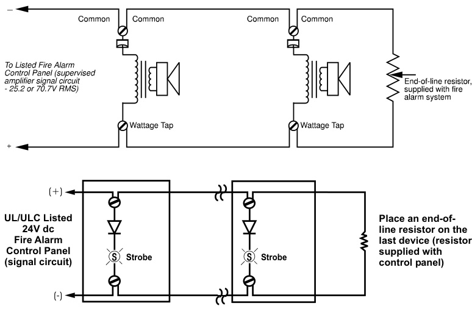
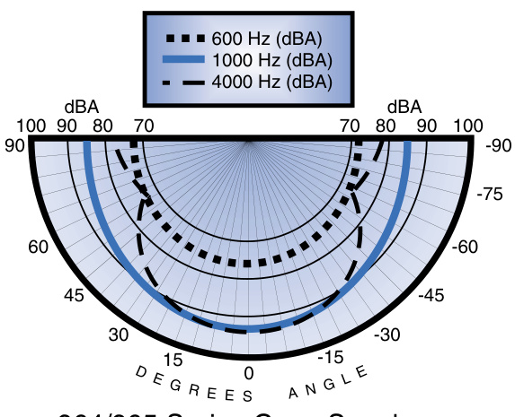
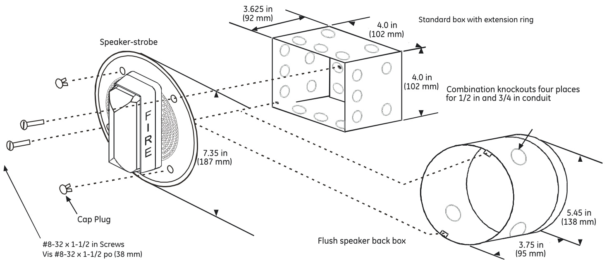
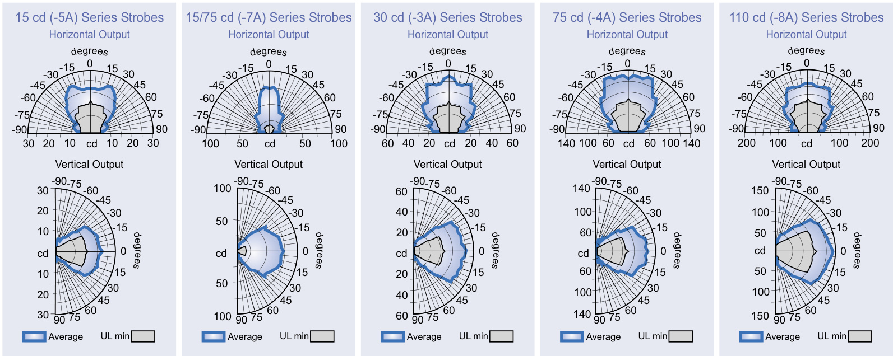

# 4-inch Speakers and SpeakerStrobes 964 and 965 Series  

# Overview  

EDWARDS’s 964 and 965 Series Speaker and Speaker-Strobes are designed for broadcasting high quality, integrated emergency voice communications, and alert or alarm tone signals. Use them in life safety applications, especially to notify the hearing impaired, where transitory people are expected such as hotels, malls, airports, hospitals and other public buildings.  

The 7.35 inch $187\;\mathrm{mm})$ ) diameter steel baffle is finished with an attractive yet durable, high quality, baked white epoxy polyester powder coat. An optional red finish is available. The speakers mount to standard four-inch square electric box with extension ring or to EDWARDS’s 960A Series flush boxes. EDWARDS flush boxes are made from satin coat steel and have flexible mounting straps for using with poured concrete forms.  

The mylar speaker cone with its sealed back construction provides extra durability and improved audibility. Wattage taps from ¼  to 2 watt provide maximum on-site flexibility where higher or lower output is desired. Connect up to #12 AWG wire using the speaker’s large terminal block. The speaker’s integral DC blocking capacitor permits electrical supervision of the audio distribution circuit. Models for 25 Vrms and 70 Vrms circuits are available.  

Strobes are designed for 16 to 33 Vdc operation and must be connected to signal circuits that output a constant (not pulsed) voltage. A diode is used to allow full signal circuit supervision.  

# Standard Features  

UL 1971-listed synchronizing strobe   
Integrity strobes synchronize to the latest UL 1971 requirements when used with a synchronization source.   
Genesis-compatible   
All Genesis and Integrity strobes on the same circuit meet UL 1971 synchronization requirements when used with an external control module.   
Approved for public and private mode applications   
UL 1971-listed as signaling devices for the hearing impaired and UL 1638-listed as protective visual signaling appliances. High dBA Output   
High efficency, sealed mylar speaker cone produces a loud 90 dBA at 2 watts.   
25 and 70 volt RMS models   
All speakers include a DC Blocking Capacitor for audio circuit supervision.   
Field changeable field markings   
Lens language or standard “FIRE” marking is easily changed with optional LKW and LKC series lens kits.   
Easy Installation   
Flush mount to standard North American four-inch square box 2-1/8 inches $\left(54\,\mathsf{m m}\right)$ ) deep with a 1-1/2 inch extension ring.  

# Application  

NOTE: The installation of visible and audible signals are subject to national and local standards, codes, and ordinances.   
Consult your Authority Having Jurisdiction for device installation requirements, application standards, and minimum performance specifications.  

# Speakers  

All 964 and 965 Series speakers include a DC blocking capacitor to allow electrical supervision of the audio distribution circuit. Models for $25\,\mathrm{V}_{\mathrm{FMS}}$ and $70\,\mathrm{V}_{\mathrm{RMS}}$ circuits are available. The mylar speaker with its sealed back construction provides extra durability and improved audibility. Wattage taps from ¼ W to 2 W provide on-site flexibility.  

The suggested sound pressure level for each signaling zone used with alert or alarm signals is a minimum of 15 dB above the average ambient sound level or 5 dB above the maximum sound level having a duration of at least 60 seconds, whichever is greater. This is measured 5 feet $(1.5\;\mathsf{m})$ above the floor. The average ambient sound level is the RMS, A-weighted sound pressure measured over a 24-hour period.  

Doubling the distance from the signal to the ear will theoretically cause a 6dB reduction in the received sound pressure level. The actual effect depends on the acoustic properties of materials in the space. Doubling the power output of a device (e.g.: a speaker from 1W to 2W) will increase the sound pressure level by 3dBA. A 3dBA difference represents a barely noticeable change in volume.  

# Strobes  

EDWARDS strobes are UL 1971-listed for use indoors as ceilingmounted or wall-mounted public-mode notification appliances for the hearing impaired. Prevailing codes require strobes to be used where ambient noise conditions exceed specified levels, where occupants use hearing protection, and in areas of public accommodation. Consult with your Authority Having Jurisdiction for details.  

As part of the Enhanced Integrity line of products, 964 and 965 Series strobes exceed UL synchronization requirements (within 10 milliseconds other over a two-hour period) when used with a synchronization source. Synchronization is important in order to avoid epileptic sensitivity.  

Integrity strobes are fully compatible with EDWARDS Genesis signals.  

NOTE: The flash intensity of some visible signals may not be adequate to alert or waken occupants in the protected area. Research indicates that the intensity of strobe needed to awaken $90\%$ of sleeping persons is approximately 100 cd. EDWARDS recommends that strobes in sleeping rooms be rated at at least 110 cd.  

WARNING: These devices will not operate without electrical power. As fires frequently cause power interruptions, further safeguards such as backup power supplies may be required.  

# Typical Wiring  

Connect 964 Series speakers to 25 Vrms audio circuits. Connect 965 Series speakers to 70 Vrms audio circuits. The strobe must be connected to signal circuits which output a constant (not pulsed) 24 Vdc voltage.  

  

# Typical Sound Output Distribution  

dBA measured at 10 ft $(3.05\;\mathrm{m})$ in anechoic chamber  

  

964/965 Series Cone Speaker  

# Installation and Mounting  

EDWARDS recommends mounting to 960A Series boxes. All models also fit to a standard flush mount, North-American fourinch square electrical box 2-1/8 inches $(54\;\mathsf{m m})$ deep with a 1-1/2 inch extension ring. EDWARDS recommends that fire alarm speakers and speaker/strobes always be installed in accordance with the latest recognized edition of national and local fire alarm codes.  

  

CAUTION CANADA   
Use Standard North American Box with 2 1/8 in $154\;\mathsf{m m})$ Deep Iberville (Commander) Extension Ring (Universal No 53171). Recess box at least 1/8 in (3mm) behind mounting surface.  

  
Light Output Patterns  

<html><body><table><tr><td>UL Rating</td><td>15cd</td><td>15/75cd</td><td>30 cd</td><td>75cd</td><td>110cd</td></tr><tr><td>16Vdc</td><td>109</td><td>150</td><td>130</td><td>263</td><td>329</td></tr><tr><td>16Vfwr</td><td>150</td><td>210</td><td>189</td><td>333</td><td>420</td></tr><tr><td colspan="6"></td></tr><tr><td colspan="6">Typical 15cd 15/75cd 30cd</td></tr><tr><td>Current 24 Vdc</td><td>69</td><td>90</td><td>89</td><td>75cd 159</td><td>110cd 180</td></tr><tr><td>24Vfwr</td><td>108</td><td>128</td><td>134</td><td>255</td><td>260</td></tr></table></body></html>

Vdc: Volts direct current, regulated and filtered Vfwr: Volts full wave rectified  

# Current Draw Notes and Comments  

1.	 Current values are shown in mA.   
2.	 UL Nameplate Rating can vary from Typical Current due to measurement methods and instruments used.   
3.	 EDWARDS recommends using the Typical Current for system design including NAC and Power Supply loading and voltage drop calculations.   
4.	 Use the 16 Vdc RMS current ratings for filtered power supply and battery AH calculations. Use the 16 Vfwr RMS current ratings for unfiltered power supply calculations.   
5.	 Fuses, circuit breakers and other overcurrent protection devices are typically rated for current in RMS values. Most of these devices operate based upon the heating effect of the current flowing through the device. The RMS current determines the heating effect and therefore, the trip and hold threshold for those devices.  

Specifications   

<html><body><table><tr><td></td><td>964/965-5A</td><td>964/965-7A</td><td>964/965-3A</td><td>964/965-4A</td><td>964/965-8A</td></tr><tr><td>UL1638/ULCS526RatedStrobeOutput</td><td>15cd</td><td>15/75cd</td><td>30cd</td><td>75cd</td><td>110cd</td></tr><tr><td>UL 1971 Rated Strobe Output - candela (cd)</td><td>15cd (wall only)</td><td>15cd (wall or ceiling)</td><td>30cd (wall) 15cd (ceiling)</td><td>75cd (wall) 60cd (ceiling)</td><td>110cd (wall) 60cd (ceiling)</td></tr><tr><td>Input/Operating Volts</td><td colspan="5">Speaker: 25 Vrms (964 Series) or 70 Vrms (965 Series) - see ordering table Strobe: 16-33 Vdc Con-</td></tr><tr><td>Speaker Taps/Output (note 1)</td><td colspan="5">tinuous</td></tr><tr><td>Speaker Cone</td><td colspan="5">Speakerfrequencyresponse:400to4,000Hz; 4-inch (102mm) mylar cone, sealed back construction, rated for 8 watts, 8 ohm voice coil.</td></tr><tr><td>StrobeFlashSynchronizationCharacteristics</td><td colspan="5">Synchronized at one flash per second. External control module necessary to meet UL 1971 synchro- nization requirements of 10 milliseconds over a two-hour period.</td></tr><tr><td>Synchronization Sources</td><td colspan="5">G1M-RM,SIGA-CC1S,SIGA-MCC1S,BPS6A,BPS10A</td></tr><tr><td>Strobe Lens Marking</td><td colspan="5">Supplied with LKC-1 “FIRE" red letters, horizontal both sides (Ceiling Mount) - See LKW and LKC series for wall mount style and optional markings</td></tr><tr><td>Flash Tube Enclosure</td><td colspan="5">Clear LEXANwith white marking sleeve</td></tr><tr><td>Baffle</td><td colspan="5">Steel, baked epoxy polyester powder-coat finish</td></tr><tr><td>Wire Connections</td><td colspan="5">Terminals: separate,polarized inputs for speaker & strobe, #12AwG (2.5mm2) maximum</td></tr><tr><td>INDOOROperatingEnvironment</td><td colspan="5"></td></tr><tr><td>Mounting - INDOOR</td><td colspan="5">Flush: 960A-4RF Round Flush Box Alternate Flush Mount: North-American 4 inch square box, 2-1/8"(54 mm) deep with a 1-1/2 inch extension ring</td></tr><tr><td>Agency Listings</td><td colspan="5">UL1971,UL1638,UL1480,ULC S526,ULC S541,CE Compliant,FM,CSFM,MEA(All m0dels</td></tr></table></body></html>

Note 1 - Measured at 10 ft $(3.05\;\mathsf{m})$ in reverberant room using 400 - 4000 Hz band limited pink noise per UL1480.  

<html><body><table><tr><td>Catalog Number</td><td>Description</td><td>Ship Wt. Ib. (kg)</td></tr><tr><td></td><td></td><td></td></tr><tr><td>25VoltSpeakers</td><td></td><td rowspan="3">3 (1.3)</td></tr><tr><td>964-1A-4RR</td><td>Speaker,Red</td></tr><tr><td>964-1A-4RW</td><td>Speaker,White</td></tr><tr><td>25VoltSpeaker-Strobes</td><td></td><td></td></tr><tr><td>964-7A-4RW</td><td>Speaker-Strobe,15/75cd,White</td><td rowspan="2"></td></tr><tr><td>964-8A-4RW</td><td>Speaker-Strobe,110cd,White</td></tr><tr><td></td><td></td><td></td></tr><tr><td>70VoltSpeakers</td><td></td><td></td></tr><tr><td>965-1A-4RR</td><td>Speaker,Red</td><td rowspan="2">3 (1.3)</td></tr><tr><td>965-1A-4RW</td><td>Speaker,White</td></tr><tr><td></td><td></td><td></td></tr></table></body></html>  

<html><body><table><tr><td colspan="2">70VoltSpeaker-Strobes</td></tr><tr><td>965-5A-4RW</td><td>Speaker-Strobe,15cd,White</td></tr><tr><td>965-7A-4RW Speaker-Strobe,15/75cd,White</td><td></td></tr><tr><td>965-3A-4RW</td><td>Speaker-Strobe,30cd,White</td></tr><tr><td>965-8A-4RW</td><td>Speaker-Strobe,110cd，White</td></tr></table></body></html>  

<html><body><table><tr><td>Catalog Number</td><td>Description</td><td>Ship Wt. Ib. (kg)</td></tr><tr><td colspan="2">SynchronizationSources</td><td></td></tr><tr><td>G1M-RM</td><td>GenesisSignal MasterRemoteMount (1-gang)</td><td>0.2 (0.1)</td></tr><tr><td>SIGA-CC1S</td><td>SynchronizationOutputModule (StandardMount)-UL/ULCListed</td><td>0.5 (0.23)</td></tr><tr><td>SIGA-MCC1S</td><td>SynchronizationOutput Module(UIO Mount)-UL Listed</td><td>0.18</td></tr><tr><td>BPS6A</td><td>6.5AmpBoosterPowerSupply</td><td>(0.08) 13 (5.9)</td></tr><tr><td>BPS10A</td><td>10AmpBoosterPowerSupply</td><td>13 (5.9)</td></tr></table></body></html>  

<html><body><table><tr><td colspan="2">MountingAccessories</td></tr><tr><td>960A-4RF RoundFlushBox,Indoor</td><td>1.5 (.7)</td></tr></table></body></html>  

Lens Marking Kits\*   

<html><body><table><tr><td colspan="3"></td></tr><tr><td>LKW-1</td><td>“FIRE"，WallOrientation</td><td rowspan="10">0.2 (.1)</td></tr><tr><td>LKW-1R</td><td>“FIRE"，Red,WallOrientation</td></tr><tr><td>LKW-2</td><td>"FEU",WallOrientation</td></tr><tr><td>LKW-3</td><td>"FIRE/FEU",WallOrientation</td></tr><tr><td>LKW-4</td><td>SMOKE"，WallOrientation</td></tr><tr><td>LKW-5</td><td>"HALON"，WallOrientation</td></tr><tr><td>LKW-6</td><td>“CO2"，WallOrientation</td></tr><tr><td>LKW-7</td><td>“EMERGENCY"，WallOrientation</td></tr><tr><td>LKW-8</td><td>"ALARM"，WallOrientation</td></tr><tr><td>LKW-9</td><td>"FUEGO"，WallOrientation</td></tr></table></body></html>

\*Change “W” to $^{*}\mathrm{C}^{n}$ for Ceiling Mount (e.g. LKC-1)  

Strobes are shipped with standard ceiling mount style “FIRE” lens markings.  Where wall orientation, other languages, or different lens markings are required, EDWARDS offers optional LKW and LKC series Lens Marking Kits. These optional lens markings simply snap on to the strobe. Consult EDWARDS for availability of special lens markings.  