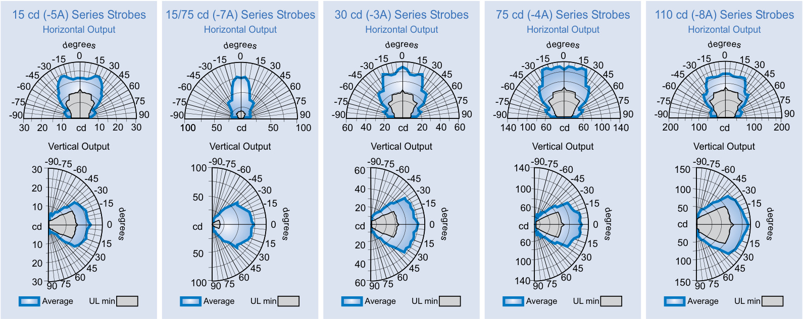
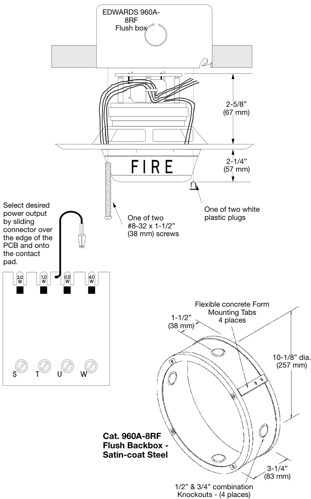
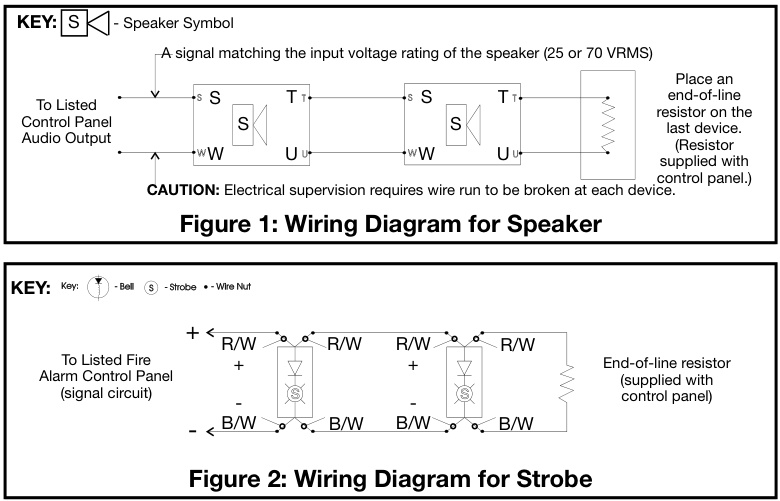
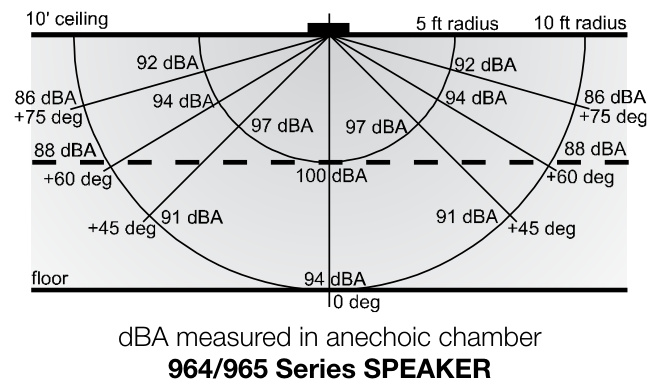

# 8-inch Speakers and SpeakerStrobes 964 & 965 Series  

# Overview  

EDWARDS’s 964 and 965 Series Speaker and Speaker-Strobes are designed for broadcasting high quality, integrated, emergency voice communications, alert and alarm tone signals. Use them in life safety applications, especially to notify the hearing impaired, where transitory people are expected such as hotels, malls, airports, hospitals and other public buildings.  

Speakers are shipped complete with a ‘DC Blocking Capacitor’ to permit electrical supervision of the audio distribution circuit. Use the 964 series for 25 Vrms circuits; the 965 series for 70 Vrms circuits. The large eight-inch speaker cone offers a wide frequency response to improve audibility and intelligibility. Wattage taps from $\%$ to 4 watts provide on-site flexibility where higher or lower dB output is desired. Wattage tap selection is easy; just move the slide-on connector on the speaker’s terminal block.  

The $12\%$ inch $(318\,\mathsf{m m})$ diameter steel baffle is finished with an attractive yet durable, high quality, baked white epoxy polyester powder-coat. The speakers flush mount to EDWARDS’s custom 960A-8RF box. The flush box is made from satin-coat steel and has flexible mounting straps for easy installation with poured concrete forms.  

The flash from EDWARDS strobes will be noticed from almost any position in the room, corridor, or large open space. The output is controlled using a specially shaped reflector to ensure precise dispersion of the light in all viewing directions. EDWARDS strobes are UL1971 listed with both wall and ceiling cd intensity ratings (see Specifications). This is useful in areas where the Authority Having Jurisdiction (AHJ) permits ceiling mount strobes.  

# Standard Features  

High fidelity Large eight-inch speaker cone offers a wide frequency response to improve audibility and intelligibility   
25 and 70 volt RMS models All speakers include a DC Blocking Capacitor for audio circuit supervision.   
Screw terminal wire connection Connect for ½, 1, 2, or 4 watt operation on terminal block.   
Terminals speed installation and accept up to #14 AWG (1.95   
mm²) wire.   
UL 1971-listed synchronizing strobe Integrity strobes synchronize to the latest UL 1971 requirements when used with a synchronization source.   
Genesis-compatible All Genesis and Integrity strobes on the same circuit meet UL 1971 synchronization requirements when used with an external control module. Approved for public and private mode applications UL 1971-listed as signaling devices for the hearing impaired and UL 1638-listed as protective visual signaling appliances.   
Field changeable field markings   
Lens language or standard “FIRE” marking is easily changed with optional LKW and LKC series lens kits.  

# Application  

NOTE: The installation of visible and audible signals are subject to national and local standards, codes, and ordinances.   
Consult your Authority Having Jurisdiction for device installation requirements, application standards, and minimum performance specifications.  

# Speakers  

# Strobes  

All 964 and 965 Series speakers include a DC blocking capacitor to allow electrical supervision of the audio distribution circuit. Models for $25\,\mathrm{V}_{\mathsf{F M S}}$ and $70\,\mathrm{V}_{\mathrm{RMS}}$ circuits are available. Wattage taps from 1/2 W to 4 W provide on-site flexibility.  

The suggested sound pressure level for each signaling zone used with alert or alarm signals is a minimum of 15 dB above the average ambient sound level or 5 dB above the maximum sound level having a duration of at least 60 seconds, whichever is greater. This is measured 5 feet $(1.5\;\mathsf{m})$ above the floor. The average ambient sound level is the RMS, A-weighted sound pressure measured over a 24-hour period.  

Doubling the distance from the signal to the ear will theoretically cause a 6dB reduction in the received sound pressure level. The actual effect depends on the acoustic properties of materials in the space. Doubling the power output of a device (e.g.: a speaker from 1W to 2W) will increase the sound pressure level by 3dBA. A 3dBA difference represents a barely noticeable change in volume.  

EDWARDS strobes are UL 1971-listed for use indoors as wallmounted or ceiling-mounted public-mode notification appliances for the hearing impaired. Prevailing codes require strobes to be used where ambient noise conditions exceed specified levels, where occupants use hearing protection, and in areas of public accommodation. Consult with your Authority Having Jurisdiction for details.  

As part of the Enhanced Integrity line of products, 964 and 965 Series strobes exceed UL synchronization requirements (within 10 milliseconds other over a two-hour period) when used with a synchronization source.  Synchronization is important to avoid epileptic sensitivity.  

Integrity strobes are fully compatible with EDWARDS Genesis signals.  

NOTE: The flash intensity of some visible signals may not be adequate to alert or waken occupants in the protected area. Research indicates that the intensity of strobe needed to awaken $90\%$ of sleeping persons is approximately 100 cd. EDWARDS recommends that strobes in sleeping rooms be rated at at least 110 cd.  

WARNING: These devices will not operate without electrical power. As fires frequently cause power interruptions, further safeguards such as backup power supplies may be required.  

  
Light Output Patterns  

# Installation and Mounting  

All models flush mount to EDWARDS’s 960A-8RF Round Flush Box. EDWARDS recommends that fire alarm speakers and speaker/strobes always be installed in accordance with the latest recognized edition of national and local fire alarm codes.  

  

# Typical Wiring  

Connect 964 Series speakers to 25 Vrms audio circuits. Connect 965 Series speakers to 70 Vrms audio circuits. The strobe must be connected to signal circuits which output a constant (not pulsed) 24 Vdc voltage.  

  

# Typical Sound Output  

  

<html><body><table><tr><td>UL Rating</td><td>15cd</td><td>15/75cd</td><td>30 cd</td><td>75cd</td><td>110cd</td></tr><tr><td>16Vdc</td><td>109</td><td>150</td><td>130</td><td>263</td><td>329</td></tr><tr><td>16Vfwr</td><td>150</td><td>210</td><td>189</td><td>333</td><td>420</td></tr><tr><td colspan="6"></td></tr><tr><td colspan="6">Typical 15cd 15/75cd 30 cd 75cd</td></tr><tr><td>Current 24Vdc</td><td>69</td><td>06</td><td>89</td><td>159</td><td>110cd 180</td></tr><tr><td>24Vfwr</td><td>108</td><td>128</td><td>134</td><td>255</td><td>260</td></tr></table></body></html>

Vdc: Volts direct current, regulated and filtered Vfwr: Volts full wave rectified  

# Current Draw Notes and Comments  

1.	 Current values are shown in mA.   
2.	 UL Nameplate Rating can vary from Typical Current due to measurement methods and instruments used.   
3.	 EDWARDS recommends using the Typical Current for system design including NAC and Power Supply loading and voltage drop calculations.   
4.	 Use the 16 Vdc RMS current ratings for filtered power supply and battery AH calculations. Use the 16 Vfwr RMS current ratings for unfiltered power supply calculations.   
5.	 Fuses, circuit breakers and other overcurrent protection devices are typically rated for current in RMS values. Most of these devices operate based upon the heating affect of the current flowing through the device. The RMS current determines the heating affect and therefore, the trip and hold threshold for those devices.  

Specifications   

<html><body><table><tr><td>Rated Strobe Output (cd)</td><td>964/965-5A-8RW</td><td>964/965-7A-8RW</td><td>964/965-3A-8RW</td><td>964/965-4A-8RW</td><td>964/965-8A-8RW</td></tr><tr><td>UL1638/ULCS526RatedStrobe</td><td>15cd</td><td>15/75cd</td><td>30cd</td><td>75cd</td><td>110cd</td></tr><tr><td>indino</td><td>15cd</td><td>15cd</td><td>30cd (wall)</td><td>75cd (wall)</td><td>110cd (wall)</td></tr><tr><td>UL 1971 Rated Strobe Output (cd)</td><td>(wall only)</td><td>(wall or ceiling)</td><td>15cd (ceiling)</td><td>60cd (ceiling)</td><td>60cd (ceiling)</td></tr><tr><td>Input/Operating Volts</td><td>Speaker:25VRMS(964Series)or70VRMS(965Series)-seeorderingtableStrobe:16-33VdcContinuous</td><td></td><td></td><td></td><td></td></tr><tr><td>Speaker Taps/Output (note 1)</td><td colspan="5">Measured at10ft(3.05m):4W=88dBA,2W=85dBA,1W=82dBA,1/2W=79 dBA</td></tr><tr><td>StrobeFlashSynchronization</td><td colspan="5">requirementsof10millisecondsoveratwo-hourperiod.</td></tr><tr><td>Synchronization Sources</td><td colspan="5">G1M-RM,SIGA-CC1S,SIGA-MCC1S,BPS6A,BPS10A</td></tr><tr><td>Strobe Lens Markings</td><td colspan="5">Supplied with LKC-1 “FIRE" red letters, horizontal both sides (Ceiling Mount) - see LKW and LKC series for wall mount style and optional markings</td></tr><tr><td>Flash Tube Enclosure</td><td colspan="5">Clear LEXAN with snap-onwhite markings sleeve</td></tr><tr><td>Speaker Cone Response</td><td colspan="5">8" (200 mm) cone rated for 5 watts, 8 ohm voice coil, 152 gram (5.36 oz) ceramic magnet 100 Hz-8 KHz +/-5 dB</td></tr><tr><td>Baffle</td><td colspan="5">Steel, baked epoxy polyester powder-coat finish - WHITE</td></tr><tr><td>Wire Connections</td><td colspan="5">Terminals (polarized) for Speaker- #14 AWG (1.95 mm2) maximum.</td></tr><tr><td>INDOOROperatingEnvironment</td><td colspan="5">Color-coded polarized wire leads for strobe (2-INs/2-OUTs).</td></tr><tr><td>Mounting - INDOOR</td><td colspan="5">Flush:960A-8RFRoundFlushBox</td></tr><tr><td>Agency Listings</td><td colspan="5"></td></tr><tr><td></td><td colspan="5">(AllmodelscomplywithADACodeofFederal RegulationChapter28Part36Final Rule)</td></tr></table></body></html>

Note 1 - Measured in reverberant room using 400 - 4000 Hz band limited pink noise per UL1480.  

<html><body><table><tr><td>Catalog Number</td><td>Ship Wt. Description - Ib. (kg)</td></tr><tr><td>25Volt</td><td></td></tr><tr><td>Speakers</td><td></td></tr><tr><td>964-1A-8RW</td><td>Speaker,White 3.2 (1.4)</td></tr><tr><td>70VoltSpeakers</td><td></td></tr><tr><td>965-1A-8RW</td><td>Speaker,White 3.2 (1.4)</td></tr><tr><td></td><td></td></tr><tr><td>70VoltSpeaker/Strobes</td><td></td></tr><tr><td>965-5A-8RW</td><td>Speaker-Strobe, 15cd, White</td></tr><tr><td>965-7A-8RW</td><td>Speaker-Strobe,15/75cd,White 3.5 (1.6)</td></tr><tr><td>965-3A-8RW</td><td>Speaker-Strobe,30cd,White</td></tr><tr><td>965-8A-8RW</td><td>Speaker-Strobe,110cd,White</td></tr></table></body></html>  

Strobes are shipped with standard ceiling mount style “FIRE” lens markings.  Where wall orientation, other languages, or different lens markings are required, EDWARDS offers optional LKW and LKC series Lens Marking Kits. These optional lens markings simply snap on to the strobe. Consult EDWARDS for availability of special lens markings.  

<html><body><table><tr><td colspan="2">Catalog Number Description</td><td>Ship Wt. - Ib. (kg)</td></tr><tr><td colspan="2"></td><td></td></tr><tr><td colspan="2">SynchronizationSources</td><td></td></tr><tr><td>G1M-RM</td><td>GenesisSignal MasterRemoteMount (1-gang)</td><td>0.2 (0.1)</td></tr><tr><td>SIGA-CC1S</td><td>SynchronizationOutputModule(Standard Mount)-UL/ULC Listed</td><td>0.5 (0.23)</td></tr><tr><td>SIGA-MCC1S</td><td>SynchronizationOutputModule(UIO Mount) -UL Listed</td><td>0.18 (0.08)</td></tr><tr><td>BPS6A</td><td>6.5AmpBoosterPowerSupply</td><td>13 (5.9)</td></tr><tr><td>BPS10A</td><td>10AmpBoosterPowerSupply</td><td>13 (5.9)</td></tr><tr><td colspan="2"></td><td></td></tr><tr><td>MountingAccessories</td><td></td><td></td></tr><tr><td>960A-8RF</td><td>RoundFlushBox,Indoor</td><td>2.5 (1.1)</td></tr></table></body></html>  

<html><body><table><tr><td colspan="3">Lens Marking Kits*</td></tr><tr><td>LKW-1 "FIRE"，WallOrientation</td><td></td><td rowspan="9">0.2 (.1)</td></tr><tr><td>LKW-1R</td><td>“FIRE",WallOrientation(red/wwhitelettering)</td></tr><tr><td>LKW-2 “FEU",WallOrientation</td><td></td></tr><tr><td>LKW-3 “FIRE/FEU",WallOrientation</td><td></td></tr><tr><td>LKW-4 ‘SMOKE"，WallOrientation</td><td></td></tr><tr><td>LKW-5 "HALON"，WallOrientation</td><td></td></tr><tr><td>LKW-6 ‘CO2"，WallOrientation</td><td></td></tr><tr><td>LKW-7 ‘EMERGENCY"，WallOrientation</td><td></td></tr><tr><td>LKW-8 "ALARM"，WallOrientation</td><td></td></tr><tr><td>LKW-9 "FUEGO"，WallOrientation</td><td></td></tr></table></body></html>

\*Change “W” to “C” for Ceiling Mount (e.g. LKC-1)”  