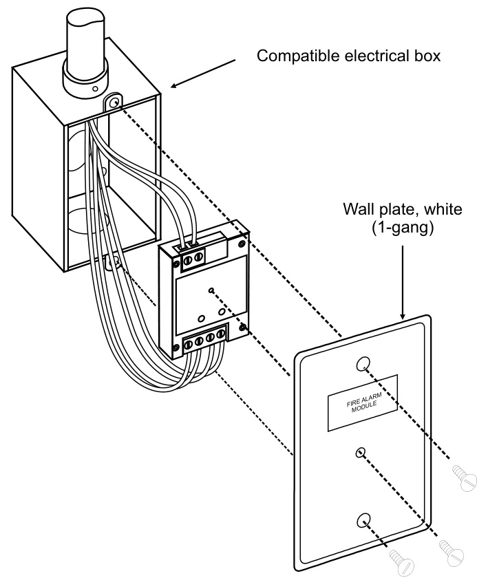
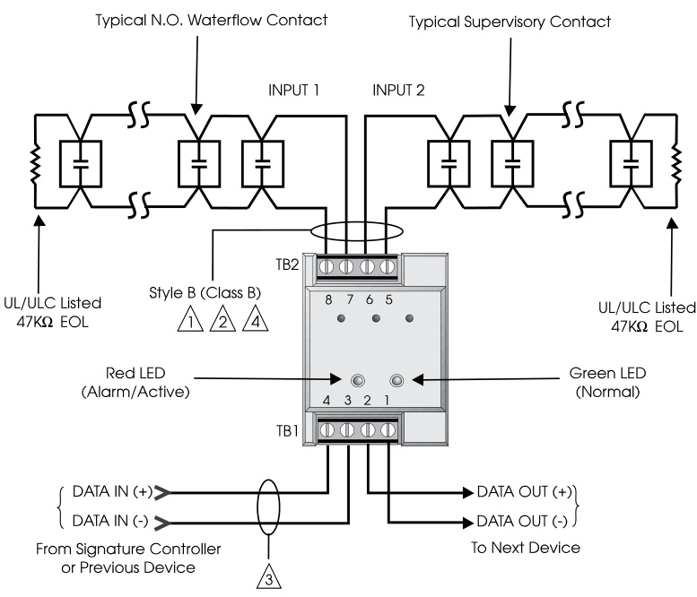
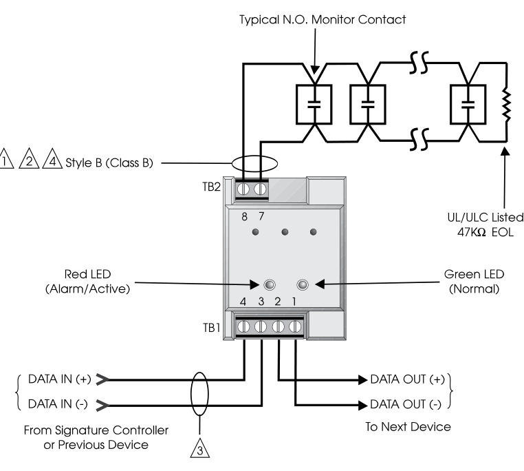

# Input Modules SIGA-MM1 & SIGA-WTM  

# Overview  

The SIGA-MM1 Monitor Module and SIGA-WTM Waterflow/ Tamper Module are part of EDWARDS’s Signature Series system. They are intelligent analog addressable devices used to connect one or two Class B normally-open Alarm, Supervisory, or Monitor type dry contact Initiating Device Circuits (IDC). The function of the SIGA-MM1 and SIGA-WTM is determined by the factory loaded “personality code”.  

The input modules gather analog information from the initiating devices connected to them and convert it into digital signals. The module’s on-board microprocessor analyzes the signal and decides whether or not to input an alarm.  

The microprocessor in each module provides four additional benefits - Self-diagnostics and History Log, Automatic Device Mapping, Stand-alone Operation and Fast, Stable Communication.  

# Standard Features  

Monitor and waterflow/tamper applications Includes Alarm with delayed latching (retard) for waterflow applications, Supervisory, and Monitor.  

# Non-volatile memory  

Permanently stores serial number, type of device, and job number. Automatically updates historic information including hours of operation, last maintenance date, number of alarms and troubles, and time and date of last alarm.  

# Automatic device mapping  

Each module transmits wiring information to the loop controller regarding its location with respect to other devices on the circuit.  

# Electronic addressing  

Permanently stores programmable address; there are no switches or dials to set. Addresses are downloaded from a PC, or the SIGA-PRO Signature Program/Service Tool.  

#  

Intelligent module c/w integral microprocessor All decisions are made at the module allowing lower communication speed while substantially improving control panel response time. Less sensitive to line noise and circuit wiring properties; twisted or shielded wire is not required.  

Ground fault detection by address Detects ground faults right down to the device level.  

Designed for high ambient temperature operation Install in ambient temperatures up to $120\mathsf{\Sigma}^{\mathsf{\Sigma}}$ $(49^{\circ}\mathrm{C})$ .  

# Application  

# Installation  

The duty performed by the SIGA-MM1 and SIGA-WTM is determined by their factory assigned sub-type code or “Personality Code”.  

SIGA-WTM NORMALLY-OPEN ALARM - DELAYED LATCHING (Factory set Personality Code 2) - Assigned to one circuit.  Configures circuit 1 for Class B normally-open Waterflow Alarm Switches. An ALARM signal is sent to the loop controller when the input contact is closed for approximately 16 seconds. The alarm condition is latched at the module.  

SIGA-WTM NORMALLY-OPEN ACTIVE - LATCHING (Factory set Personality Code 4) - Assigned to one circuit. Configures circuit 2 for Class B normally open dry contact Supervisory and Tamper Switches. An ACTIVE signal is sent to the loop controller when the input contact is closed. The active condition is latched at the module.  

SIGA-MM1 NORMALLY-OPEN ACTIVE - NON-LATCHING (Factory set Personality Code 3) - Assigned to one circuit. Configures circuit 1 for Class B normally-open dry contact monitoring input such as from Fans, Dampers, Doors, etc. An ACTIVE signal is sent to the loop controller when the input contact is closed. The active condition is not latched at the module.Compatibility  

The Signature Series modules are compatible only with EDWARDS’s Signature Loop Controller.  

# Warnings & Cautions  

This module will not operate without electrical power. As fires frequently cause power interruption, we suggest you discuss further safeguards with your local fire protection specialist.  

# Compatibility  

These modules are part of EDWARDS’s Signature Series intelligent processing and control platform. They are compatible with EST3, EST3X and iO Series control panels.  

# Testing & Maintenance  

The module’s automatic self-diagnosis identifies when it is defective and causes a trouble message. The user-friendly maintenance program shows the current state of each module and other pertinent messages. Single modules may be turned off (de-activated) temporarily, from the control panel. Scheduled maintenance (Regular or Selected) for proper system operation should be planned to meet the requirements of the Authority Having Jurisdiction (AHJ). Refer to current NFPA 72 and ULC CAN/ULC 536 standards. Availability of maintenance features is dependent on the fire alarm system used.  

The SIGA-MM1 and SIGA-WTM modules mount to North American $^{2-1/2}$ inch $(64\;\mathsf{m m})$ deep one-gang boxes and 1-1/2 inch $(38\,\mathsf{m m})$ deep 4 inch square boxes with one-gang covers and SIGA-MP mounting plates. The terminals are suited for #12 to #18 AWG $2.5\;\mathrm{mm}^{2}$ to $0.75\;\mathrm{mm}^{2}.$ ) wire size.  

EDWARDS recommends that this module be installed according to latest recognized edition of national and local fire alarm codes.  

Electronic Addressing - The loop controller electronically addresses each module, saving valuable time during system commissioning. Setting complicated switches or dials is not required.  Each module has its own unique serial number stored in its on-board memory. The loop controller identifies each device on the loop and assigns a “soft” address to each serial number. If desired, the modules can be addressed using the SIGA-PRO Signature Program/Service Tool.  

Personality codes are assigned by the factory. No user configuration is required for these modules.  

  

# Typical Wiring  

The module will accept #18 AWG $(0.75\mathsf{m m}^{2})$ ), #16 ( $1.0\mathsf{m m}^{2})$ ), #14 AWG (1.50mm2), #12 AWG (2.50mm2)  wire sizes.  

Note:  Sizes #16 AWG $\left\lbrace1.0\mathsf{m m}^{2}\right\rbrace$ and #18 AWG $(0.75\mathsf{m m}^{2})$ ) are preferred for ease of installation. See Signature Loop Controller catalog sheet for detailed wiring requirement specifications.  

<html><body><table><tr><td colspan="3">Initiating(Slave)DeviceCircuitWireSpecifications</td></tr><tr><td colspan="3">MaximumAllowableWireResistance 50ohms(25ohmsper wire)perCircuit</td></tr><tr><td>MaximumAllowableWireCapacitance</td><td>0.1μF per Circuit</td><td></td></tr><tr><td>ForDesignReference:</td><td>WireSize</td><td>MaximumDistancetoEOLR</td></tr><tr><td rowspan="5"></td><td>#18 AWG (0.75mm2)</td><td rowspan="4">4,000 ft (1219 m)</td></tr><tr><td>#16 AWG (1.00 mm2)</td></tr><tr><td>#14AWG (1.50 mm2)</td></tr><tr><td>#12AWG (1.50 mm2)</td></tr></table></body></html>  

  
Model SIGA-WTM  

  
Model SIGA-MM1  

# Notes  

1 Maximum 25 ohms resistance per wire.   
2 Maximum #12 AWG $(2.5\mathsf{m m}^{2})$ wire. Min. #18 (0.75mm2)   
3 Refer to Signature Loop Controller Installation Sheet for   
wiring specifications.   
4 Maximum 10 Vdc $\@approx350{\upmu\mathrm{A}}$ .  
5) All wiring power limited and supervised.   
6) This module will NOT support 2-wire smoke detectors.  

# Specifications  

<html><body><table><tr><td>Catalog Number</td><td>SIGA-MM1</td><td>SIGA-WTM</td></tr><tr><td>Description</td><td>MonitorModule</td><td>Waterflow/Tamper Module</td></tr><tr><td>Type Code</td><td>48 (factory set personalitycode3)</td><td>49 (factory set</td></tr><tr><td>AddressRequirements</td><td>UsesOneModuleAddress</td><td>personality code 2,4) UsesTwoModuleAddresses</td></tr><tr><td>Operating Current</td><td>Standby = 250uA; Activated = 400μA</td><td>Standby = 396uA; Activated = 680μA</td></tr><tr><td>OperatingVoltage</td><td colspan="2">15.2to19.95Vdc(19Vdcnominal)</td></tr><tr><td>Construction&Finish</td><td colspan="2">High Impact Engineering Polymer one-gang front plate-White</td></tr><tr><td>Storageand Operating Environment</td><td colspan="2">Operating Temperature: 32F to 120F (0°℃ to 49°C) StorageTemperature:-4°Fto140F(-20°Cto60°C)</td></tr><tr><td>LED Operation</td><td colspan="2">Humidity: 0 to 93% RH On-board Green LED - Flashes when polled</td></tr><tr><td>CompatibilityAgencyListings</td><td colspan="2">On-boardRedLED-Flasheswheninalarm/active UseWith SignatureLoop Controller UL,ULC,CSFM,MEA</td></tr><tr><td>Mounting</td><td colspan="2">North American2-1/2 inch(64mm) deep one-gangboxes and 1-1/2 inch (38 mm) deep 4 inch square boxes with one-gang covers and SIGA-MP mounting plates.</td></tr></table></body></html>  

# Ordering Information  

<html><body><table><tr><td>Catalog Number</td><td>Description</td><td>Ship Wt Ibs (kg)</td></tr><tr><td>SIGA-MM1</td><td>MonitorModule-UL/ULCListed</td><td>0.4 (.15)</td></tr><tr><td>SIGA-WTM</td><td>Waterflow/Tamper Module-UL/ULC Listed</td><td></td></tr></table></body></html>  

<html><body><table><tr><td colspan="3">Accessories</td></tr><tr><td>27193-11</td><td>Surface MountBox-Red,1-gang</td><td>1.0 (0.6)</td></tr><tr><td>27193-16</td><td>Surface Mount Box -White, 1-gang</td><td></td></tr><tr><td>MFC-A</td><td>MultifunctionFireCabinet -Red,supportsSignatureModuleMountingPlates</td><td>7.0 (3.1)</td></tr><tr><td>SIGA-MB4</td><td>TransponderMountingBracket(allowsformounting two 1-gang modules in a 2-gang box)</td><td>0.4 (0.15)</td></tr><tr><td>SIGA-MP1</td><td>Signature ModuleMountingPlate,1footprint</td><td>1.5 (0.70)</td></tr><tr><td>SIGA-MP2</td><td>SignatureModuleMountingPlate,1/2footprint</td><td>0.5 (0.23)</td></tr><tr><td>SIGA-MP2L</td><td>Signature Module Mounting Plate,1/2extended footprint</td><td>1.02 (0.46)</td></tr></table></body></html>  