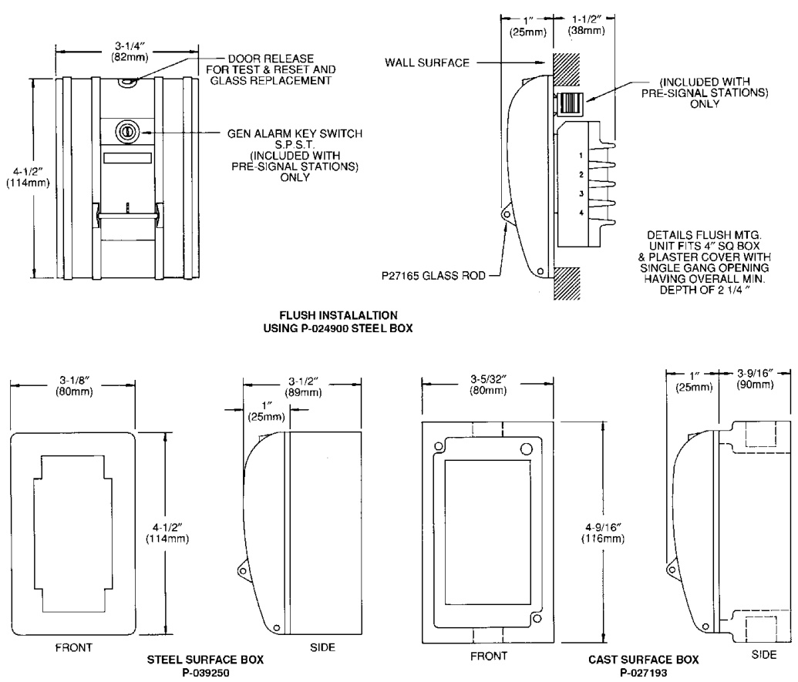

# Fire Alarm Stations 270 Series  

# Overview  

EDWARDS 270 Series Non-Coded Fire Alarm Stations are sturdy, attractive, and designed for economical installation.  

The station is available in the following operational and functional designs:  

—	The 270 Series provides a single action, break glass initiating station. It is available with normally open (N.O.), normally closed (N.C.) or combination N.O./N.C. contacts. The basic 270 Series have screw terminals for field connection. The 270A Series Manual Stations have 6 inch (150mm) wire leads. —	The 270P Series is a break glass, normally open pre-signal station. The pull of the lever sounds an alarm on all pre-signal indicating devices. Inserting a key and turning it will initiate a general evacuation alarm. Screw terminals are provided for field connection.  

All non-coded stations are designed for either flush or surface mounting. For flush mounting a 4 inch standard North American square box with single gang plaster cover should be used. For surface mounting the 270 Series or 270P Series, use P-027193 Cast Box, P-039250 Steel Box Housing for weatherproof enclosure.  

# Standard Features  

•Pull lever   
•Simple positive operation   
•Break glass   
•Attractive, streamline design   
•Less than 5 lb pull force complies with ADA Solid, die-cast metal construction  

# Mounting  

  

# Ordering Information  

All models  are fire alarm red with Aluminum Strips.   
They are marked “Pull in Case of Fire” on the pull handle.  

<html><body><table><tr><td rowspan="2">Cat. No.</td><td rowspan="2">Marking (top of device)</td><td colspan="3">SwitchContacts</td><td colspan="2">FieldConnections</td><td>Pre- Signal</td></tr><tr><td>Single Pole</td><td>Double Pole</td><td>Open Circuit</td><td>Screw Terminals</td><td>Wire Leads</td><td>Pre- Signal</td></tr><tr><td>270-DPO</td><td>FireAlarm</td><td></td><td></td><td></td><td></td><td></td><td></td></tr><tr><td>270-DPO- L</td><td>Local Alarm</td><td></td><td></td><td></td><td></td><td></td><td></td></tr><tr><td>270-SPO</td><td>FireAlarm</td><td></td><td></td><td></td><td></td><td></td><td></td></tr><tr><td>270A-DPO</td><td>Fire Alarm</td><td></td><td></td><td>√</td><td></td><td>√</td><td></td></tr><tr><td>270A-SPO</td><td>FireAlarm</td><td>√</td><td></td><td></td><td></td><td>√</td><td></td></tr><tr><td>270P-DPO</td><td>Fire Alarm</td><td></td><td></td><td>√</td><td>√</td><td></td><td>√</td></tr><tr><td>270P-SPO</td><td>Fire Alarm</td><td></td><td></td><td>√</td><td>√</td><td></td><td>√</td></tr></table></body></html>  