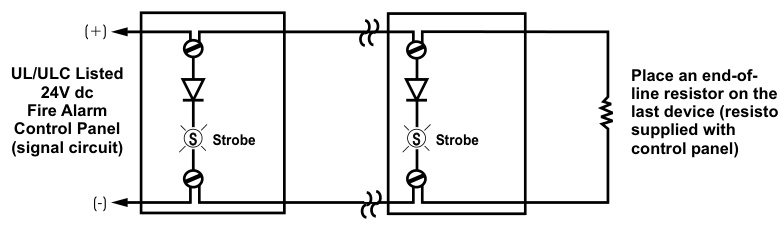
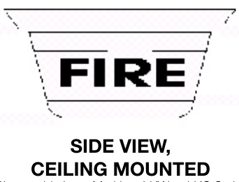
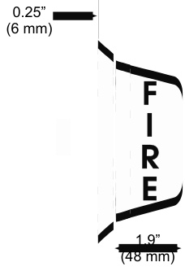
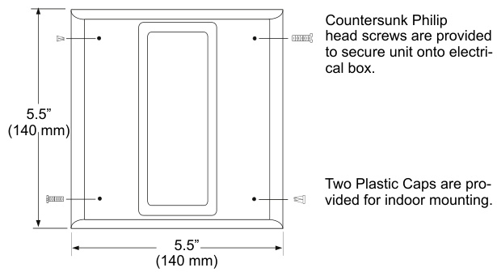
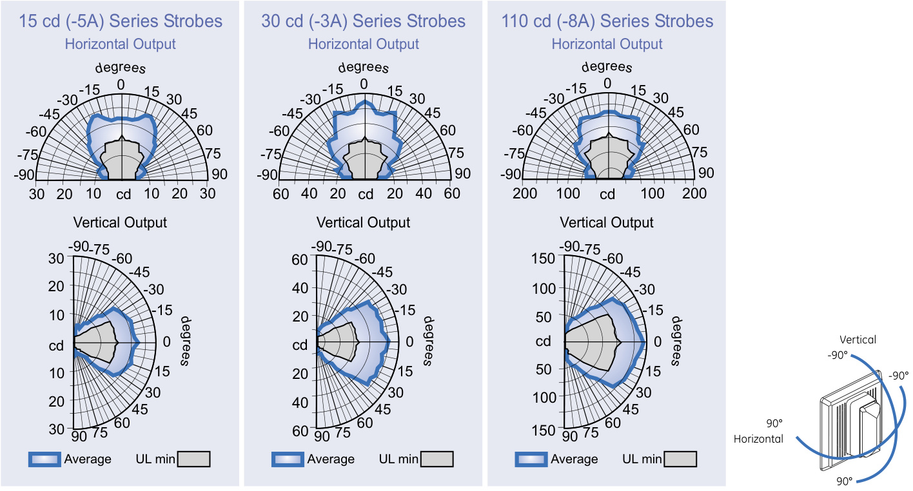

# Harsh Environment Strobes 405-3A, -5A, -6A, -7A -8A CS405-7A, -8A  

# Overview  

405 Series strobes are specially designed for use with compatible life safety communication and control equipment to alert the hearing impaired of a life safety event.  Strobes are available with 15 cd, 15/75 cd, 30 cd, 60 cd, and 110 cd effective flash intensity. They are fully compatible with Genesis signals.  

405 Series strobes exceed UL synchronization requirements (within 10 milliseconds other over a two-hour period) when used with a separately-installed G1M Signal Master, or SIGA-CC1S Synchronization Module, or when powered by suitably enabled booster power supplies and control panels.  

The flash from 405 Series strobes can be noticed from almost any position in the room, corridor, or large open space. 405 Series strobes are UL 1971 listed with both wall and ceiling cd intensity ratings (see Specifications). This is useful in areas where the Authority Having Jurisdiction (AHJ) permits ceiling-mount strobes.  

405 Series strobes are designed for 16 to 33 Vdc operation and must be connected to signal circuits that output a constant (not pulsed) voltage. A diode is used to allow full signal circuit supervision and polarized connections are made to terminals that accept up to #12 AWG (2.5mm²) wire.  

The strobe front plate is of steel construction finished with durable baked epoxy polyester powder-coat paint.  

# Standard Features  

UL 1971-listed synchronizing strobe   
Integrity strobes synchronize to the latest UL 1971 requirements when used with a synchronization source.   
Genesis-compatible   
All Genesis and Integrity strobes on the same circuit meet UL 1971 synchronization requirements when used with an external control module.   
Approved for public and private mode applications   
UL 1971-listed as signaling devices for the hearing impaired and UL 1638-listed as protective visual signaling appliances. Rugged red or white steel front plate   
Ideal for outdoor or harsh environments.   
Rated for wall or ceiling installation   
Field changeable field markings   
Lens language or standard “FIRE” marking is easily changed with optional LKW and LKC series lens kits.   
Fits 4-inch square flush box   
Ideal for retrofit and renovation projects.   
UL/ULC rated outdoor option  

# Application  

NOTE: The installation of visible signals are subject to national and local standards, codes, and ordinances.   
Consult your Authority Having Jurisdiction for device installation requirements, application standards, and minimum performance specifications.  

EDWARDS strobes are UL 1971-listed for use indoors as wallmounted public-mode notification appliances for the hearing impaired. Prevailing codes require strobes to be used where ambient noise conditions exceed specified levels, where occupants use hearing protection, and in areas of public accommodation. Consult with your Authority Having Jurisdiction for details.  

As part of the Enhanced Integrity line of products, 405 Series strobes exceed UL synchronization requirements (within 10 milliseconds other over a two-hour period) when used with a synchronization source.  Synchronization is important because a small portion of the population have a condition which may cause them to become disoriented from multiple random flashes of light. Integrity strobes minimize this risk.  

Integrity strobes are fully compatible with EDWARDS Genesis signals.  

NOTE: The flash intensity of some visible signals may not be adequate to alert or waken occupants in the protected area. Research indicates that the intensity of strobe needed to awaken $90\%$ of sleeping persons is approximately 100 cd. EDWARDS recommends that strobes in sleeping rooms be rated at at least 110 cd.  

WARNING: These devices will not operate without electrical power. As fires frequently cause power interruptions, further safeguards such as backup power supplies may be required.  

# Operating Current (RMS)  

<html><body><table><tr><td>UL Rating</td><td>15cd</td><td>15/75cd</td><td>30cd</td><td>60cd</td><td>110cd</td></tr><tr><td>16Vdc</td><td>109</td><td>150</td><td>130</td><td>269</td><td>329</td></tr><tr><td>16Vfwr</td><td>150</td><td>210</td><td>189</td><td>359</td><td>420</td></tr></table></body></html>  

<html><body><table><tr><td>Typical Current</td><td>15cd</td><td>15/75cd</td><td>30cd</td><td>60 cd</td><td>110cd</td></tr><tr><td>24Vdc</td><td>69</td><td>06</td><td>89</td><td>158</td><td>180</td></tr><tr><td>24Vfwr</td><td>108</td><td>128</td><td>134</td><td>229</td><td>260</td></tr></table></body></html>

Vdc: Volts direct current, regulated and filtered Vfwr: Volts full wave rectified  

# Current Draw Notes and Comments  

1.	 Current values are shown in mA.   
2.	 UL Nameplate Rating can vary from Typical Current due to measurement methods and instruments used.   
3.	 EDWARDS recommends using the Typical Current for system design including NAC and Power Supply loading and voltage drop calculations.   
4.	 Use the 16 Vdc RMS current ratings for filtered power supply and battery AH calculations. Use the 16 Vfwr RMS current ratings for unfiltered power supply calculations.   
5.	 Fuses, circuit breakers and other overcurrent protection devices are typically rated for current in RMS values. Most of these devices operate based upon the heating affect of the current flowing through the device. The RMS current determines the heating affect and therefore, the trip and hold threshold for those devices.  

# Typical Wiring - 24 Vdc  

  

# Installation and Mounting  

All models fit to a standard flush mounted, North American four inch electrical box, 1-1/2 inch $(38\,\mathsf{m m})$ deep minimum. Optional EDWARDS weatherproof, surface mount boxes are available. The strobes must be connected to signal circuits which output a constant (not pulsed) voltage. EDWARDS recommends that these strobes always be installed in accordance with the latest recognized edition of national and local fire alarm codes.  

  

  

\*Changeable Lens Marking, LKW or LKC Series.  

  

# Light Distribution  

  

# Specifications  

<html><body><table><tr><td>Catalog Number</td><td>405-5A</td><td>405-3A</td><td>405-6A</td><td>405-7A</td><td>405-8A,CS405-8A</td></tr><tr><td>UL1638/ULCS526 Rated Strobe Output</td><td>15cd</td><td>30cd</td><td>60cd</td><td>15/75cd</td><td>110cd</td></tr><tr><td>UL1971RatedStrobe</td><td>15cd (wall only)</td><td>30cd wall 15cd ceiling</td><td>60cd wall 30cd ceiling</td><td>15cd wall 15cd ceiling</td><td>110cdwall 60cd ceiling</td></tr><tr><td>indino StrobeFlashRate</td><td colspan="5">Synchronized at one flash per second. External control module necessary to meet UL 1971 synchronization requirements of 10 milliseconds over a two-hour period.</td></tr><tr><td>SynchronizationSources</td><td colspan="5">G1M-RM,SIGA-CC1S,SIGA-MCC1S,BPS6,BPS10</td></tr><tr><td>StrobeOperatingVolts</td><td colspan="5">Continuous16 to33Vdc or 16 to33Vfwr</td></tr><tr><td>OperatingEnvironment</td><td colspan="5">INDOOR:30°C@85%RH;32-120°F(0-49°C)ambient temperature. OUTDOOR (CS models only): 30° C @ 93% RH; -40-150° F (-40-66° C) ambient temp *7A' (17.7cd @ -35° C per UL @ -40°</td></tr><tr><td>Lens Markings</td><td colspan="5">C per ULC) and; '8A'(70.7cd @ -35°C per UL @ -40°C per ULC) models only Supplied with LKW-1 “FIRE" red letters, vertical both sides (Wall Mount)</td></tr><tr><td>Wire Connections</td><td colspan="5">Terminals - polarized input, #12 AwG (2.5mm2) max wire size</td></tr><tr><td>FlashTube Enclosure</td><td colspan="5">Clear LEXAN</td></tr><tr><td>StrobePlate,Finish</td><td colspan="5">CRS steel- 512 in (140mm) square,red or white baked epoxy polyester powder-coat finish</td></tr><tr><td>Mounting</td><td colspan="5">INDOOR:North American 4 in square electrical box; OUTDOOR:449 series weatherproof surfacebox</td></tr><tr><td>Agency Listings</td><td colspan="5">UL 1971, UL 1638, ULC S526, CE, FM, CSFM, MEA (All models comply with ADA Code of Federal Regulation Chapter 28 Part36Final Rule)</td></tr></table></body></html>  

# Ordering Information  

<html><body><table><tr><td>Catalog Number</td><td>Description</td><td>Ship Wt. Ib (kg)</td></tr><tr><td>405-5A-T</td><td>Strobe, 15 cd, Red</td><td rowspan="7">1 (0.4)</td></tr><tr><td>405-5A-TW</td><td>Strobe, 15 cd, White</td></tr><tr><td>405-7A-T</td><td>Strobe, 15/75,Red</td></tr><tr><td>405-7A-TW</td><td></td></tr><tr><td>Strobe,15/75,White 405-3A-T Strobe, 30 cd,Red</td><td></td></tr><tr><td>405-3A-TW Strobe, 30 cd, White</td><td></td></tr><tr><td>405-6A-T</td><td>Strobe, 60 cd, Red</td></tr><tr><td>405-6A-TW</td><td></td></tr><tr><td></td><td>Strobe, 60 cd, White</td></tr><tr><td>405-8A-T 405-8A-TW</td><td>Strobe,110 cd,Red Strobe,110 cd,White</td></tr><tr><td></td><td></td></tr><tr><td colspan="2">Outdoor Listed Strobes</td></tr><tr><td>CS405-7A-T</td><td>Strobe,15/75,Outdoor,Red</td><td rowspan="2">1 (0.4)</td></tr><tr><td>CS405-8A-T</td><td>Strobe,110 cd, Outdoor,Red</td></tr><tr><td colspan="2"></td><td></td></tr><tr><td>Synchronization Sources G1M-RM</td><td>GenesisSignal MasterRemote Mount(1-gang)</td><td>0.2 (0.1)</td></tr><tr><td>SIGA-CC1S</td><td>Synchronization Output Module (Standard Mount) - UL/ULC</td><td>0.5 (0.23)</td></tr><tr><td>SIGA-MCC1S</td><td>Listed</td><td></td></tr><tr><td>BPS6A</td><td>Synchronization Output Module (UIO Mount) - UL Listed 6.5 Amp Booster Power Supply</td><td>0.18 (0.08) 13 (5.9)</td></tr><tr><td>BPS10A</td><td>10 Amp Booster Power Supply</td><td>13 (5.9)</td></tr><tr><td>Mounting Accessories</td><td></td><td></td></tr><tr><td colspan="2">Surface Mount Box, Gray,</td><td>1 (0.4)</td></tr><tr><td>449</td><td>Outdoor, (CS' models only)</td><td></td></tr><tr><td>LKW-1</td><td>“FIRE”-Wall Orientation(supplied) “FIRE" - Wall Orientation,</td><td rowspan="9">0.2 (0.1)</td></tr><tr><td>LKW-1R</td><td>red with white letters</td></tr><tr><td>LKW-2</td><td>“"FEU"”- Wall Orientation</td></tr><tr><td>LKW-3</td><td>“"FIRE/FEU"-Wall Orientation</td></tr><tr><td>LKW-4</td><td>"SMOKE”-WallOrientation</td></tr><tr><td>LKW-7</td><td>“EMERGENCY"-WallOrientation</td></tr><tr><td>LKW-8</td><td>"ALARM" - WallOrientation</td></tr><tr><td>LKW-9</td><td>"FUEGO"- WallOrientation</td></tr><tr><td>LKC-1</td><td>“FIRE"- Ceiling Orientation</td></tr><tr><td>LKC-2</td><td>"FEU"- Ceiling Orientation</td></tr><tr><td>LKC-3</td><td>"FIRE/FEU"-Celing Orientation</td></tr><tr><td>LKC-4</td><td>"SMOKE"- Ceiling Orientation</td></tr><tr><td>LKC-7</td><td></td></tr><tr><td>LKC-8</td><td>“EMERGENCY"-CeilingOrientation "ALARM"- Ceiling Orientation</td></tr><tr><td>LK-10</td><td>"ALERT" - Wall Orientation</td></tr></table></body></html>

Strobes are shipped with standard wall mount style “FIRE” lens markings.  