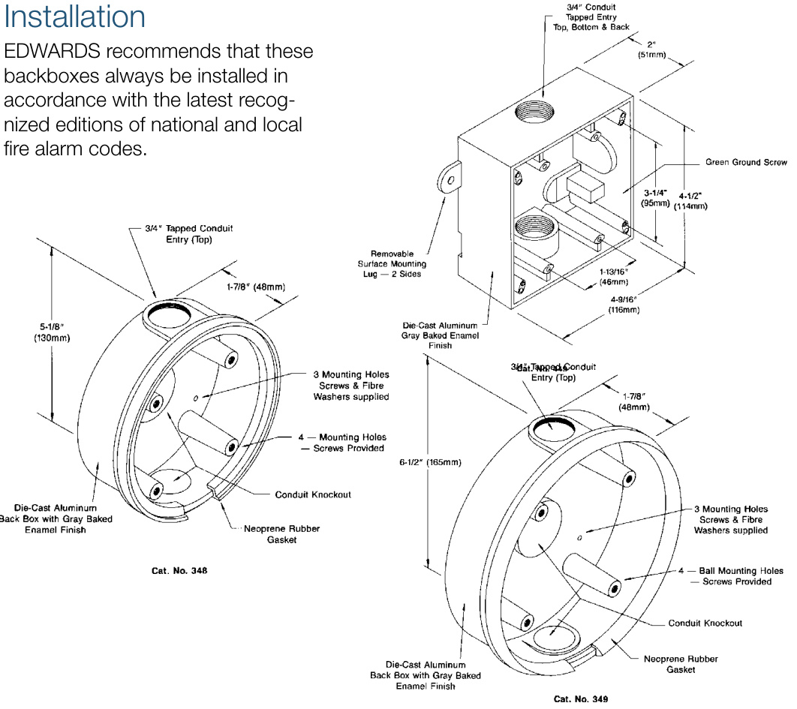

# Weatherproof Mounting Boxes Models 348/349/449  

# Overview  

EDWARDS die-cast weatherproof backboxes are perfect for mounting a variety of EDWARDS signaling appliances such as bells, horns and sirens.  They are made from die-cast aluminum and finished at the factory with a baked “Sage Gray” enamel finish All boxes are shipped complete with a molded neoprene gasket. They all feature 3/4 inch tapped conduit entries.  

Three models are available:  

•Die-cast aluminum •Surface mount •Gray baked enamel finish •Weatherproof gasket included Catalog Number 348 – fits  four inch (100mm) 325 and 340T bells  

# Standard Features  

Catalog Number 349 – fits  six inch (150mm) and 10 inch (250mm), 325 bells plus 5520D Horn/Siren  

Catalog Number 449 – fits six inch (150mm),  eight inch (203mm) and 10 inch (250mm) 438 and 439 series bells and CS405 strobes.  

  

# Specifications  

<html><body><table><tr><td>Catalog Number</td><td>348</td><td>349</td><td>449</td></tr><tr><td>Dimensions</td><td>5-1/8"(130mm)Diameter × 1-7/8"(48mm) Deep</td><td>6-1/2"(165mm)Diameter × 1-7/8"(48mm) Deep</td><td>4-9/16"(116mm)Square × 2"(51mm) Deep</td></tr><tr><td>ConduitEntry</td><td colspan="2">3/4"Top</td><td>3/4"Top,Back,Bottom</td></tr><tr><td>Material</td><td></td><td colspan="2">DieCastAluminum</td></tr><tr><td>Gasket</td><td>MoldedNeoprene Rubber</td><td colspan="2">ClosedCellNeoprene</td></tr><tr><td>Finish</td><td colspan="3">SageGrayBaking Enamel</td></tr></table></body></html>  

# Ordering Information  

<html><body><table><tr><td>Catalog Number</td><td>Description</td><td>Shipping Weight</td></tr><tr><td>348</td><td>WeatherproofBackbox -SurfaceMountwithGasket,5-1/8"(130mm) )Diameter</td><td>0.33Ib (0.15kg)</td></tr><tr><td>349</td><td>WeatherproofBackbox 一 SurfaceMountwithGasket,6-1/2”(165mm) )Diameter</td><td>0.5 Ib (0.2kg)</td></tr><tr><td>449</td><td>WeatherproofBackbox SurfaceMountwithGasket,4-9/16"(116mm) )Square.</td><td>0.33Ib (0.15kg)</td></tr></table></body></html>  