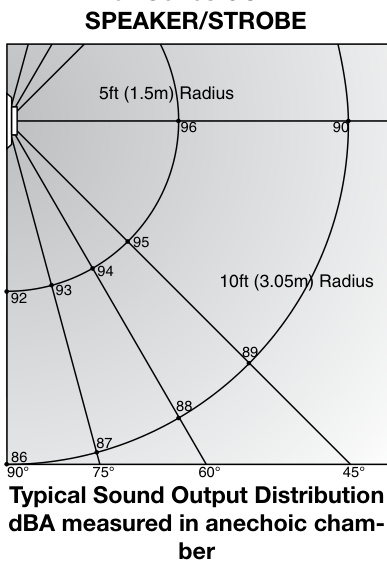

# Speaker and SpeakerStrobes 757 Series  

# Overview  

Integrity Speakers and Speaker-Strobes are designed for broadcasting high quality, integrated, emergency voice communications, as well as alert and alarm tone signals. Use them in life safety applications, especially to notify the hearing impaired and where transitory people are expected such as in hotels, malls, airports, hospitals and other public buildings.  

These speakers are shipped complete with a ‘DC Blocking Capacitor’ to permit electrical supervision of the audio distribution circuit. Models for 25 Vrms and 70 Vrms circuits are available. The mylar speaker with sealed back construction provides extra durability and improved audibility. Wattage taps from 1/4W to 2W provide maximum on-site flexibility.  

Integrity’s rugged plastic housing is available with a red or white textured finish. With its ingenious mounting sub-plate, Integrity is firmly held in place with a single screw ensuring a quick, attractive installation. A separate trim plate is not required for flush mounting.  

The flash from EDWARDS strobes will be noticed from almost any position in the room, corridor, or large open space. EDWARDS strobes are UL1971 listed with both wall and ceiling cd intensity ratings (see Specifications). This is useful in areas where the Authority Having Jurisdiction (AHJ) permits ceiling mount strobes.  

# Standard Features  

# UL 1971-listed synchronizing strobe  

Integrity strobes synchronize to the latest UL 1971 requirements when used with a synchronization source.   
Genesis-compatible   
All Genesis and Integrity strobes on the same circuit meet UL 1971 synchronization requirements when used with an external control module.   
Approved for public and private mode applications   
UL 1971-listed as signaling devices for the hearing impaired and UL 1638-listed as protective visual signaling appliances. High dBA Output   
High efficency, sealed mylar speaker cone produces a loud 90 dBA at 2 watts.   
Multiple Output Taps, 25 or 70 Volt Models   
Easy to select for ¼, ½, 1, or 2 watt operation. Integrity speakers are supplied with a DC Blocking Capacitor for audio circuit supervision.   
Field changeable field markings   
Lens language or standard “FIRE” marking is easily changed with optional LKW and LKC series lens kits.   
Easy Installation   
Flush mount to standard North American 4” square box with $1\,|_{2}^{*}$ extension ring (USA only). Integrity’s universal mounting plate allows it to be wired and then left hanging free for easy inspection and testing before it is fastened to the electrical box.  

# Application  

NOTE: The installation of visible and audible signals are subject to national and local standards, codes, and ordinances.   
Consult your Authority Having Jurisdiction for device installation requirements, application standards, and minimum performance specifications.  

# Speakers  

All Integrity speakers include a DC blocking capacitor to allow electrical supervision of the audio distribution circuit. Models for $25\,\mathrm{V}_{\mathrm{FMS}}$ and 70 $\mathsf{V}_{\mathsf{F M S}}$ circuits are available. The mylar speaker with its sealed back construction provides extra durability and improved audibility. Wattage taps from 2 W to 15 W provide on-site flexibility.  

The suggested sound pressure level for each signaling zone used with alert or alarm signals is a minimum of 15 dB above the average ambient sound level or 5 dB above the maximum  

sound level having a duration of at least 60 seconds, whichever is greater. This is measured 5 feet $(1.5\;\mathsf{m})$ above the floor. The average ambient sound level is the RMS, A-weighted sound pressure measured over a 24-hour period.  

  
757 Series CONE  

# Strobes  

Doubling the distance from the signal to the ear will theoretically cause a 6dB reduction in the received sound pressure level. The actual effect depends on the acoustic properties of materials in the space. Doubling the power output of a device (e.g.: a speaker from 1W to 2W) will increase the sound pressure level by 3dBA. A 3dBA difference represents a barely noticeable change in volume.  

EDWARDS strobes are UL 1971-listed for use indoors as wallmounted or ceiling-mounted public-mode notification appliances for the hearing impaired. Prevailing codes require strobes to be used where ambient noise conditions exceed specified levels, where occupants use hearing protection, and in areas of public accommodation. Consult with your Authority Having Jurisdiction for details.  

As part of the Enhanced Integrity line of products, 757 Series strobes exceed UL synchronization requirements (within 10 milliseconds other over a two-hour period) when used with a synchronization source.  Synchronization is important in order to avoid epileptic sensitivity.  

Integrity strobes are fully compatible with EDWARDS Genesis signals.  

NOTE: The flash intensity of some visible signals may not be adequate to alert or waken occupants in the protected area. Research indicates that the intensity of strobe needed to awaken $90\%$ of sleeping persons is approximately 100 cd. EDWARDS recommends that strobes in sleeping rooms be rated at at least 110 cd.  

WARNING: These devices will not operate without electrical power. As fires frequently cause power interruptions, further safeguards such as backup power supplies may be required.  

# Light Distribution Patterns UL 1971 WALL MOUNTED STROBE LIGHT OUTPUT  

  

# Installation and Mounting  

All models fit to a standard flush mounted, North-American four inch square electrical box, 1-1/2 inch (38 mm) deep with 1-1/2 inch (38mm) extension ring. CAUTION (Canada): When using Iberville (Commander extension rings, 2-1/8 inch (54mm) deep extension ring is required. Optional flush trims are not required. For surface mount, use EDWARDS’s custom indoor and outdoor boxes painted in color-matched red or white epoxy. EDWARDS recommends that these fire alarm speaker/strobes always be installed in accordance with the latest recognized edition of national and local fire alarm codes.  

  

# Typical Wiring  

The strobe must be connected to signal circuits which output a constant (not pulsed) 16 to 33 Vdc voltage. Depending on the model, the speaker must be connected to either 25 or $70\,\vee$ audio circuits.  

  

# Operating Current (RMS)  

<html><body><table><tr><td>UL Rating</td><td>15cd</td><td>15/75cd</td><td>30cd</td><td>75cd</td><td>110cd</td></tr><tr><td>16Vdc</td><td>109</td><td>150</td><td>130</td><td>263</td><td>329</td></tr><tr><td>16Vfwr</td><td>150</td><td>210</td><td>189</td><td>333</td><td>420</td></tr></table></body></html>  

<html><body><table><tr><td>Typical Current</td><td>15cd</td><td>15/75cd</td><td>30cd</td><td>75 cd</td><td>110cd</td></tr><tr><td>24Vdc</td><td>69</td><td>06</td><td>89</td><td>159</td><td>180</td></tr><tr><td>24Vfwr</td><td>108</td><td>128</td><td>134</td><td>255</td><td>260</td></tr></table></body></html>

Vdc: Volts direct current, regulated and filtered Vfwr: Volts full wave rectified  

# Current Draw Notes and Comments  

1.	 Current values are shown in mA.   
2.	 UL Nameplate Rating can vary from Typical Current due to measurement methods and instruments used.   
3.	 EDWARDS recommends using the Typical Current for system design including NAC and Power Supply loading and voltage drop calculations.   
4.	 Use the 16 Vdc RMS current ratings for filtered power supply and battery AH calculations. Use the 16 Vfwr RMS current ratings for unfiltered power supply calculations.   
5.	 Fuses, circuit breakers and other overcurrent protection devices are typically rated for current in RMS values. Most of these devices operate based upon the heating affect of the current flowing through the device. The RMS current determines the heating affect and therefore, the trip and hold threshold for those devices.   
Sound level output notes   
•All values shown are dBA measured at 10 feet $(3.01\,\mathsf{m})$ .  
•UL1480 values measured in reverberation room. Average values are measured in anechoic chamber.  

<html><body><table><tr><td></td><td colspan="2">Speaker</td><td colspan="2">Speaker-strobe</td></tr><tr><td>Wattage</td><td>UL1480</td><td>Average</td><td>UL1480</td><td>Average</td></tr><tr><td>14 W</td><td>81.0</td><td>81.0</td><td>78.0</td><td>78.0</td></tr><tr><td>12 W</td><td>84.0</td><td>84.0</td><td>81.0</td><td>81.0</td></tr><tr><td>1W</td><td>87.0</td><td>87.0</td><td>84.0</td><td>84.0</td></tr><tr><td>2 W (UL)</td><td>90.0</td><td>90.0</td><td>87.0</td><td>87.0</td></tr></table></body></html>  

Specifications   

<html><body><table><tr><td>Rated Strobe Output-candela (cd)</td><td>757-5A-SS</td><td>757-7A-SS</td><td>757-3A-SS</td><td>757-4A-SS</td><td>757-8A-SS</td></tr><tr><td>UL1638&ULCS526</td><td>15 cd</td><td>15/75 cd</td><td>30 cd</td><td>75 cd</td><td>110 cd</td></tr><tr><td>UL 1971</td><td>15 cd (wall mount only)</td><td>15 cd wall 15 cd ceiling</td><td>30 cd wall 15 cd ceiling</td><td>75 cd wall 60 cd ceiling</td><td>110 cd wall 60 cd ceiling</td></tr><tr><td>Input/Operating Volts</td><td colspan="5">Speaker: 25 VRMS (suffix“-S25") or 70 VRMS (suffix“-S70")- see ordering table Strobe:16-33 Vdc Continuous</td></tr><tr><td>Speaker Cone</td><td colspan="5">Speakerfrequencyresponse250to13,000Hz; 4" (102 mm) mylar cone, sealed back construction, rated at 8 watts, 8 ohm voice coil</td></tr><tr><td>Strobe Flash Rate</td><td colspan="5">Synchronized at one flash per second. External control module necessary to meet UL 1971 synchronization requirements of 10 milliseconds over a two-hour period.</td></tr><tr><td>Synchronization Sources</td><td colspan="5">G1M-RM,SIGA-CC1S,SIGA-MCC1S,BPS6,BPS10</td></tr><tr><td>FlashTubeEnclosure</td><td colspan="5">Clear LEXAN</td></tr><tr><td>Lens Markings</td><td colspan="5"></td></tr><tr><td>INDOOROperatingEnvironment</td><td colspan="5">- see LKW and LKC series for ceiling style and optional markings 85% @ 30°C relative humidity; 32-120°F(0-49°C) ambient temperature</td></tr><tr><td>Wire Connections</td><td colspan="5">Terminals - separate, polarized inputs for Speaker & Strobe, #12 AWG (2.5 mm2) max.</td></tr><tr><td>Housing*</td><td colspan="5"></td></tr><tr><td>Mounting - INDOOR</td><td colspan="5">Flush: North-American 4" square box, 1-1/2"(38 mm) dp with 1-1/2"(38 mm) ext.ring. CAUTION (Canada): When using Iberville (Commander) extension rings, 2-1/8" (54 mm) deep extension ring is required.Surface:757A-SB*BackboxBi-directional:757A-BDF*MountingFrame</td></tr><tr><td>Agency Listings</td><td colspan="5">UL1971,UL1638,UL1480,ULCS526,ULCS541,MEA,CSFM,FM</td></tr></table></body></html>  

<html><body><table><tr><td>Catalog Number</td><td>Description</td><td>Ship Wt. Ib. (kg)</td></tr><tr><td colspan="3">25VoltSpeakers</td></tr><tr><td>757-1A-S25</td><td>Speaker, Red</td><td rowspan="2">2.5 (1.2)</td></tr><tr><td>757-1A-S25W</td><td>Speaker, White</td></tr><tr><td colspan="3">25 VoltSpeaker/Strobes</td></tr><tr><td>757-5A-SS25</td><td>Speaker-Strobe, 15cd, Red</td><td rowspan="9">2.7 (1.3)</td></tr><tr><td>757-5A-SS25W</td><td>Speaker-Strobe, 15cd, White</td></tr><tr><td>757-7A-SS25</td><td>Speaker-Strobe,15/75cd,Red</td></tr><tr><td>757-7A-SS25W</td><td>Speaker-Strobe,15/75cd,White</td></tr><tr><td>757-3A-SS25</td><td>Speaker-Strobe,30cd,Red</td></tr><tr><td>757-3A-SS25W</td><td>Speaker-Strobe,30cd,White</td></tr><tr><td>757-4A-SS25</td><td>Speaker-Strobe,75cd,Red</td></tr><tr><td>757-4A-SS25W</td><td>Speaker-Strobe,75cd,White</td></tr><tr><td>757-8A-SS25</td><td>Speaker-Strobe, 110cd, Red</td></tr><tr><td>757-8A-SS25W</td><td>Speaker-Strobe,110cd,White</td></tr><tr><td>70VoltSpeakers</td><td></td><td rowspan="2">2.5 (1.2)</td></tr><tr><td>757-1A-S70</td><td>Speaker, Red</td></tr><tr><td>757-1A-S70W</td><td>Speaker, White</td><td rowspan="2"></td></tr><tr><td>70 Volt Speaker/Strobes</td><td></td></tr><tr><td>757-5A-SS70</td><td>Speaker-Strobe, 15cd, Red</td><td rowspan="9">2.2 (1)</td></tr><tr><td>757-5A-SS70W</td><td>Speaker-Strobe, 15cd, White</td></tr><tr><td>757-7A-SS70</td><td>Speaker-Strobe,15/75cd, Red</td></tr><tr><td>757-7A-SS70W</td><td>Speaker-Strobe, 15/75cd, White</td></tr><tr><td>757-3A-SS70</td><td>Speaker-Strobe, 30cd, Red</td></tr><tr><td>757-3A-SS70W</td><td>Speaker-Strobe, 30cd, White</td></tr><tr><td>757-4A-SS70</td><td>Speaker-Strobe, 75cd, Red</td></tr><tr><td>757-4A-SS70W</td><td>Speaker-Strobe, 75cd, White</td></tr><tr><td>757-8A-SS70</td><td>Speaker-Strobe, 110cd, Red</td></tr><tr><td>757-8A-SS70W</td><td>Speaker-Strobe,110cd,White</td></tr></table></body></html>  

<html><body><table><tr><td colspan="3">Synchronization Sources</td></tr><tr><td>G1M-RM</td><td>Genesis Signal Master Remote Mount (1-gang)</td><td>0.2 (0.1)</td></tr><tr><td>SIGA-CC1S</td><td>SynchronizationOutput Module (Standard Mount)- UL/ULC Listed</td><td>0.5 (0.23)</td></tr><tr><td>SIGA-MCC1S</td><td>Synchronization Output Module (UIO Mount) - UL Listed</td><td>0.18 (0.08)</td></tr><tr><td>BPS6A</td><td>6.5 AmpBooster PowerSupply</td><td>13 (5.9)</td></tr><tr><td>BPS10A</td><td>10 AmpBoosterPowerSupply</td><td>13 (5.9)</td></tr><tr><td colspan="3">Mounting Accessories</td></tr><tr><td>960A-4SF</td><td>Flush Box, Indoor</td><td rowspan="3">1.5 (.7)</td></tr><tr><td>757A-SB</td><td>Surface Box, Red, Indoor</td></tr><tr><td>757A-SBW</td><td>Surface Box, White, Indoor</td></tr><tr><td>757A-BDF</td><td>Bi-directional Mounting Frame, Red</td><td rowspan="2">4 (1.8)</td></tr><tr><td>757A-BDFW</td><td>Bi-directional Mounting Frame, White</td></tr><tr><td colspan="3">Lens Marking Kits*</td></tr><tr><td>LKW-1</td><td>“"FIRE",Wall Orientation (supplied) “FIRE", Wall Orientation</td><td rowspan="9">0.2 (.1)</td></tr><tr><td>LKW-1R</td><td>(red with white lettering)</td></tr><tr><td>LKW-2 LKW-3</td><td>“FEU", Wall Orientation “FIRE/FEU",Wall Orientation</td></tr><tr><td>LKW-4</td><td>“SMOKE",Wall Orientation</td></tr><tr><td>LKW-5</td><td>“"HALON", Wall Orientation</td></tr><tr><td>LKW-6</td><td>"CO2", Wall Orientation</td></tr><tr><td>LKW-7</td><td></td></tr><tr><td></td><td>"EMERGENCY",WallOrientation</td></tr><tr><td>LKW-8</td><td>"ALARM",WallOrientation</td></tr><tr><td>LKW-9</td><td>"FUEGO",WallOrientation</td></tr></table></body></html>

\*Change “W” to “C” for Ceiling Mount (e.g. LKC-1)  