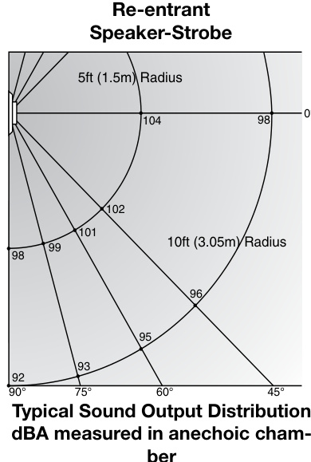
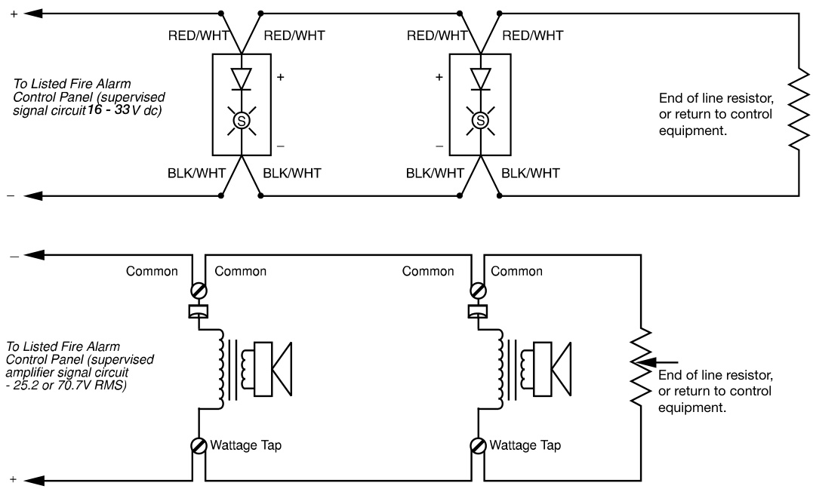
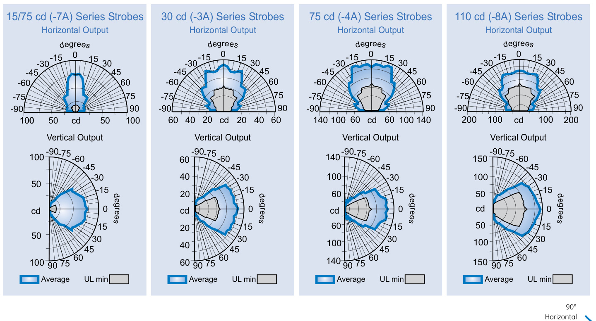
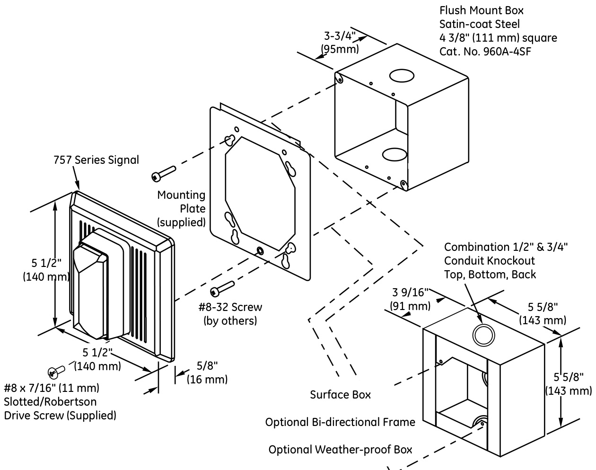

# Re-entrant Speaker and Speaker-Strobe 757 Series  

# Overview  

EDWARDS’s Integrity Series life safety and mass notification/ emergency communications (ECS/MNS) re-entrant speakers and speaker-strobes are high quality appliances for emergency voice communications, as well as alert and alarm tone signals.  

Integrity’s rugged plastic housing is made from durable and fire retardant, high impact plastic with a slightly textured surface. Housings are rated for outdoor use and are available in red or white. Integrity’s ingenious mounting plate firmly holds the device in place with a single screw. This ensures quick and attractive installation. A separate trim plate is not required. Speaker terminals accept up to $\#12$ AWG $(2.5\mathsf{m m}^{2})$ wire for polarized connections. Strobe connections are made to color-coded wire leads.  

Life safety strobes are shipped with standard wall mount style FIRE lens markings.  Where ceiling orientation, other languages, or different lens markings are required, EDWARDS offers optional LKW and LKC series Lens Marking Kits. These optional lens markings simply snap on to the strobe. Consult EDWARDS for availability of special lens markings.  

Integrity strobes are designed for 16 to 33 Vdc operation and must be connected to signal circuits that output a constant (not pulsed) voltage. A diode is used to allow full signal circuit supervision.  

# Standard Features  

# UL 1971-listed synchronizing strobe  

Integrity strobes synchronize to the latest UL 1971 requirements when used with a synchronization source.  

Genesis-compatible   
All Genesis and Integrity strobes on the same circuit meet UL 1971 synchronization requirements when used with an external control module.  

# ECS/MNS models available  

Listed for public and private mode applications UL 1971-listed as signaling devices for the hearing impaired and UL 1638-listed as protective visual signaling appliances.  

98 dBA Output High efficency driver produces a loud 98 dBA at 15 watts.  

# Multiple Output Taps, 25 or 70 Volt Models  

Easy to select for 2, 4, 8, and 15 watt operation. Integrity speakers are supplied with a DC Blocking Capacitor for audio circuit supervision.  

# Outdoor rated  

Durable red or white Noryl front plate is ideal for outdoor, industrial or harsh environments.  

# Field changeable field markings  

Lens language or standard “FIRE” marking is easily changed with optional LKW (wall orientation) and LKC (ceiling orientation) lens kits.  

# Application  

NOTE: The installation of visible and audible signals are subject to national and local standards, codes, and ordinances.   
Consult your Authority Having Jurisdiction for device installation requirements, application standards, and minimum performance specifications.  

# Speakers  

All Integrity speakers include a DC blocking capacitor to allow electrical supervision of the audio distribution circuit. Models for $25\,\mathrm{V}_{\mathsf{F M S}}$ and $70\,\mathrm{V}_{\mathrm{RMS}}$ circuits are available. Wattage taps from 2 W to $15\,\mathrm{W}$ provide on-site  

# Strobes  

The suggested sound pressure level for each signaling zone used with alert or alarm signals is a minimum of 15 dB above the average ambient sound level or 5 dB above the maximum sound level having a duration of at least 60 seconds, whichever is greater. This is measured 5 feet $(1.5\;\mathsf{m})$ ) above the floor.  

Doubling the distance from the signal to the ear will theoretically cause a 6dB reduction in the received sound pressure level. The actual ef  

fect depends on the acoustic properties of materials in the space. Doubling the power output of a device (e.g.: a speaker from 1W to 2W) will increase the sound pressure level by 3dBA.  

  

EDWARDS clear strobes are UL 1971-listed for use indoors as wall- or ceiling- mounted public-mode notification appliances for the hearing impaired. Prevailing codes require strobes to be used where ambient noise conditions exceed specified levels, where occupants use hearing protection, and in areas of public accommodation. Consult with your Authority Having Jurisdiction for details.  

As part of the Enhanced Integrity line of products, 757 Series strobes exceed UL synchronization requirements (within10 milli-seconds over a two-hour period) when used with a synchronization source.  Synchronization is important in order to avoid epileptic sensitivity.  

Integrity strobes are fully compatible with EDWARDS Genesis signals.  

WARNING: These devices will not operate without electrical power. As fires frequently cause power interruptions, further safeguards such as backup power supplies may be required.  

# Typical Wiring  

The strobe must be connected to signal circuits which output a constant (not pulsed) 24 Vdc voltage. Depending on the model, the speaker must be connected to either 25 or $70\,\lor$ audio circuits.  

  

  
Light Distribution Patterns UL 1971 WALL MOUNTED STROBE LIGHT OUTPUT  

# Operating Current (RMS)  

<html><body><table><tr><td>UL Rating</td><td>15/75cd</td><td>30 cd</td><td>75cd</td><td>110cd</td></tr><tr><td>16Vdc</td><td>150</td><td>130</td><td>263</td><td>329</td></tr><tr><td>16Vfwr</td><td>210</td><td>189</td><td>333</td><td>420</td></tr></table></body></html>  

<html><body><table><tr><td>Typical Current</td><td>15/75cd</td><td>30 cd</td><td>75 cd</td><td>110cd</td></tr><tr><td>24Vdc</td><td>06</td><td>89</td><td>159</td><td>180</td></tr><tr><td>24Vfwr</td><td>128</td><td>134</td><td>255</td><td>260</td></tr></table></body></html>

Vdc: Volts direct current, regulated and filtered Vfwr: Volts full wave rectified  

# Notes  

1.	 Current values are shown in mA.   
2.	 Fuses, circuit breakers and other overcurrent protection devices are typically rated for current in RMS values. Most of these devices operate based upon the heating affect of the current flowing through the device. The RMS current determines the heating affect and therefore, the trip and hold threshold for those devices.  

# Sound Level Output  

<html><body><table><tr><td></td><td colspan="2">Speaker</td><td colspan="2">Speaker-strobe</td></tr><tr><td>Wattage</td><td>UL1480</td><td>Average</td><td>UL1480</td><td>Average</td></tr><tr><td>2W</td><td>90.0</td><td>90.3</td><td>84.0</td><td>86.2</td></tr><tr><td>4 W</td><td>93.0</td><td>93.4</td><td>87.0</td><td>89.4</td></tr><tr><td>8W</td><td>96.0</td><td>95.7</td><td>90.0</td><td>91.8</td></tr><tr><td>15 W (UL)</td><td>96.0</td><td>98.2</td><td>90.0</td><td>94.1</td></tr></table></body></html>  

# Sound level output notes  

•	 All values shown are dBA measured at 10 feet $(3.01\,\mathsf{m})$ •	 UL1480 values measured in reverberation room. •	 Average values are measured in anechoic chamber.  

# Installation and Mounting  

All models fit to flush mounted EDWARDS box, Catalog Number 960A-4SF. Optional flush trims are not required. For surface mount, use EDWARDS’s custom indoor and outdoor surface boxes painted in color-matched red or white epoxy. EDWARDS recommends that these Life safety and ECS/MNS speaker/strobes always be installed in accordance with the latest recognized edition of national and local codes.  

  

<html><body><table><tr><td>Model</td><td>757-7A-RSxX</td><td>757-3A-RSxX</td><td>757-8A-RSxX</td></tr><tr><td>UL 1638& ULC S526Rating</td><td>75 cd</td><td>30 cd</td><td>110 cd</td></tr><tr><td>(note 2) UL 1971 Rating (note 2)</td><td>15 cd wall, 15 cd ceiling</td><td>30 cd wall, 15 cd ceiling</td><td>110 cd wall,60 cd ceiling</td></tr><tr><td>Input/Operating Volts</td><td colspan="3">Speaker: 25VRMS (suffix“-RS25"or70 VRMS(suffix“-RS70")- see ordering table Strobe:16-33 Vdc Continuous</td></tr><tr><td>Speaker Taps/Output (note 1)</td><td colspan="3">Measured at 10'(3.05m):15W=98 dBA,8W=95 dBA,4W=93 dBA,2W=90 dBA</td></tr><tr><td>Speaker Driver</td><td colspan="3">Sealed construction, compression driver, 8 ohm voice coil</td></tr><tr><td>Strobe Flash Rate</td><td colspan="3">Synchronized at one flash per second. External control module necessary to meet UL 1971 synchronization requirements of 10 milliseconds over a two-hour period</td></tr><tr><td>Synchronization Sources</td><td colspan="3">SIGA-CC1S,SIGA-MCC1S,SIGA-CC2A,SIGA-MCC2A,G1M-RM BPS6A,BPS10A,APS6A,APS10A, iO64, iO500, Fireshield Plus 3,5 and 10 z0ne.</td></tr><tr><td>Flash Tube Enclosure</td><td colspan="3">Clear LEXAN</td></tr><tr><td>Lens Markings</td><td colspan="3"></td></tr><tr><td>INDOOROperating Environment</td><td colspan="3">- see LKW and LKC series for ceiling style and optional markings -31 to 150° F (-35 to 66°C) ambient temperature.85% relative humidity @ 30°C.</td></tr><tr><td>OUTDOOROperatingEnvironment (must use weatherproof box)</td><td colspan="3">(- </td></tr><tr><td>Wire Connections</td><td colspan="3">(757-3A: rated at 9.0 cd @ -35° C per UL/@ -40° C per ULC) Speaker: Terminals for up to #12 AWG (2.5mm2)</td></tr><tr><td>Housing (note 3)</td><td colspan="3">Strobe: 6"(150 mm) color-coded polarized wire leads Textured, color impregnated engineered plastics - exceeds 94V-0 UL flammability rating</td></tr><tr><td>Mounting - INDOOR</td><td colspan="3">Flush:960A-4SFFlushBox</td></tr><tr><td>Mounting - OUTDOOR</td><td colspan="3">Surface: 757A-SB Backbox Bi-directional (note 3) 757A-BDF Mounting Frame (note 3)</td></tr><tr><td></td><td colspan="3">Surface only: 757A-WB Weatherproof Box (note 3)</td></tr><tr><td>Agency Listings</td><td colspan="3"></td></tr></table></body></html>

Note 1: Measured in reverberant room using 400-4000Hz band linited pink noise per UL 1480. Subtract 3dBA for models with strobes. Note 2: Strobe candela ratings apply to clear strobes. Note 3: RED housing is standard, add Suffix “W” for WHITE  

# Ordering Information  

<html><body><table><tr><td>Catalog Description Number</td><td></td><td>Ship Wt., Ib. (kg)</td></tr><tr><td colspan="3">25 Volt Re-Entrant Speakers,Speaker/Strobes</td></tr><tr><td>757-1A-R25</td><td>Speaker, Red</td><td rowspan="8">2.5 (1.2)</td></tr><tr><td>757-1A-R25W</td><td>Speaker, White</td></tr><tr><td>757-7A-RS25</td><td>Speaker-Strobe,15/75cd,Red</td></tr><tr><td>757-7A-RS25W</td><td>Speaker-Strobe, 15/75cd, White</td></tr><tr><td>757-3A-RS25</td><td>Speaker-Strobe, 30cd, Red</td></tr><tr><td>757-3A-RS25W</td><td>Speaker-Strobe, 30cd, White</td></tr><tr><td>757-8A-RS25</td><td>Speaker-Strobe, 110cd, Red</td></tr><tr><td>757-8A-RS25W</td><td>Speaker-Strobe, 110cd, White</td></tr><tr><td colspan="3">70 Volt Re-Entrant Speakers, Speaker/Strobes</td><td rowspan="8">2.5 (1.2)</td></tr><tr><td>757-1A-R70</td><td>Speaker, Red</td></tr><tr><td>757-1A-R70W</td><td>Speaker, White</td></tr><tr><td>757-7A-RS70</td><td>Speaker-Strobe, 15/75cd, Red</td></tr><tr><td>757-7A-RS70W</td><td>Speaker-Strobe, 15/75cd, White</td></tr><tr><td>757-3A-RS70</td><td>Speaker-Strobe,30cd,Red</td></tr><tr><td>757-3A-RS70W</td><td>Speaker-Strobe, 30cd, White</td></tr><tr><td>757-8A-RS70</td><td>Speaker-Strobe, 110cd, Red</td></tr><tr><td>757-8A-RS70W</td><td>Speaker-Strobe, 110cd, White</td></tr><tr><td colspan="2">Mounting Accessories</td><td rowspan="6">1.5 (0.7)</td></tr><tr><td>960A-4SF 757A-SB</td><td>Flush Box, Indoor Surface Box, Red, Indoor</td></tr><tr><td>757A-SBW</td><td>Surface Box, White, Indoor</td></tr><tr><td></td><td></td></tr><tr><td>757A-WB</td><td>WeatherproofBox,Red,Surface</td></tr><tr><td>757A-WBW</td><td>WeatherproofBox,White,Surface</td></tr></table></body></html>  

Lens Marking Kits\*   

<html><body><table><tr><td>LKW-1</td><td>"FIRE"，WallOrientation(supplied)</td></tr><tr><td>LKW-1R</td><td>"FIRE",WallOrientation（redwith whitelettering)</td></tr><tr><td>LKW-2</td><td>"FEU",WallOrientation</td></tr><tr><td>LKW-3</td><td>"FIRE/FEU"，WallOrientation</td></tr><tr><td>LKW-4</td><td>"SMOKE"，WallOrientation</td></tr><tr><td>LKW-5</td><td>"HALON",WallOrientation</td></tr><tr><td>LKW-6</td><td>"CO2”，WallOrientation</td></tr><tr><td>LKW-7</td><td>“EMERGENCY"，WallOrientation</td></tr><tr><td>LKW-8</td><td></td></tr><tr><td>LKW-9</td><td>"ALARM"，WallOrientation "FUEGO",WallOrientation</td></tr><tr><td>LKW-10</td><td>"ALERT",WallOrientation</td></tr></table></body></html>

\*Change “W” to $^{*}\mathrm{C}^{*}$ for Ceiling Mount (e.g. LKC-1)  