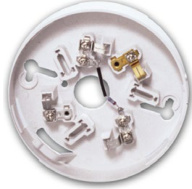
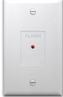
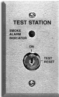

# Intelligent Duct Smoke Detector Housing SIGA-DH  

# Overview  

The SIGA-DH Duct Smoke Detector Housing is specially engineered to exploit all the capabilities of Signature Series intelligent photoelectric and multisensor smoke detectors. EDWARDS Signature Series detectors gather analog information from each of their one or more sensing elements and converts it into digital signals. The detector’s onboard microprocessor measures and analyzes these signals. It compares them to historical readings, time patterns and known characteristics to make an alarm decision. Digital filters and complex Algorithms are applied for optimum detector accuracy. Unwanted alarms are virtually eliminated.  

Each duct housing is packaged with detailed installation instructions, gaskets and a self-adhesive drilling template for locating and mounting the detector. The large access door is completely removable to allow fast detector installation and field wiring connections. The 16 gauge steel housing is finished in red baked enamel for easy identification. Five one-gang knockouts on the housing provide a convenient location for mounting intelligent Signature Series modules.  

The SIGA-DH Duct Housing comes with a 6 inch $:150\;\mathsf{m m})$ exhaust tube. Air sampling tubes are available in lengths from 8 inches $(200\;\mathsf{m m})$ to 10 feet $(3048\,\mathsf{m m})$ ) and must be ordered separately. Compatible smoke detectors, mounting bases, and accessories are listed in the Ordering Information. Refer to individual device catalog literature pages for more detail.  

# Standard Features  

Suitable for high air velocity duct applications Up to 4000 ft/min. $(20.3\;\mathsf{m}/\mathsf{s e c}.$ .) with Photoelectric Detector.   
Standard Signature Series detectors Designed for use with standard 4D, 3D, and Photoelectric Signature Series smoke detectors. Does not require “special” duct smoke heads. Standard, relay, or isolator detector base Detector plugs-in to base then easily installs into housing.   
•	 Install in ducts up to 10 ft. $(3.05\;\mathsf{m})$ wide   
•	 Remote LED and test station accessories   
•	 Designed and manufactured to ISO 9001 standards  

# Typical Wiring  

The detector mounting bases and test station will accept #18 AWG $(0.75\mathsf{m m}^{2})$ , #16 $(1.0\mathsf{m m}^{2})$ , #14 AWG $(1.50\mathsf{m m}^{2})$ and #12 AWG $(2.5\;\mathrm{mm}^{2})$ wire sizes. Note:  #14 AWG $(1.5\;\mathrm{mm}^{2})$ is not recommended due to difficulty of installation. See Loop Controller and Detector catalog sheets for detailed wiring requirement specifications.  

# Application  

The SIGA-DH Duct Smoke Detector Housing requires a clear, flat, accessible area on the duct of at least 7-3/8 inches (188mm) $\mathsf{W}\times7$ inches (175mm) H. The duct housing must be installed on ducts at least 8 inches (200mm) wide. Duct detectors are usually installed on the supply duct after the air filters; or in the return air stream prior to being diluted by outside air.  

Sample tube length must span the entire width of the air duct and the tube can be easily cut to any length. Inlet tubes longer than 3 ft.(900mm) must be supported at both ends.  

Duct detectors continually sample air flow in a HVAC duct and initiate an alarm condition whenever smoke is detected. An alarm is activated when the quantity (percent obscuration) of combustion products in that air sample exceeds the detector’s sensitivity setting.  

Air velocity in the duct maintains the air flow that enters the detector housing through perforations in the air sampling inlet tube and discharges through the outlet exhaust tube. The detector housing must be installed with its INLET air sampling tube upstream of the EXHAUST tube. Before installing the duct detector housing, test the duct air velocity to verify it is within the limits of the Signature smoke detector that is being installed. Also verify that duct air relative humidity is within $0\%$ and $93\%$ .  

WARNING: Duct detectors have specific limitations. Duct detectors ARE NOT a substitute for an open area smoke detector. Duct detectors ARE NOT a substitute for early warning detection. Duct detectors ARE NOT a replacement for a building’s regular fire detection system. Smoke detectors ARE NOT designed to detect toxic gases which can build up to hazardous levels in some  fires. These devices WILL NOT operate without electrical power. As fires frequently  cause power interruptions, EDWARDS suggests you discuss further safeguards with  your local fire protection specialist.  

# Installation and Mounting  

EDWARDS recommends duct detectors always be installed in accordance with the latest recognized editions of local and national fire alarm codes.  

# Typical Wiring  

The detector mounting bases and test station will accept #18 AWG $(0.75\mathsf{m m}^{2})$ , #16 $(1.0\mathsf{m m}^{2})$ , #14 AWG $(1\,.50\mathsf{m m}^{2})$ and $\#12$ AWG $(2.5\;\mathrm{mm}^{2})$ wire sizes. Note:  #14 AWG $(1.5\;\mathrm{mm}^{2})$ is not recommended due to difficulty of installation. See Loop Controller and Detector catalog sheets for detailed wiring requirement specifications.  

# Accessories  

# Duct Detector Air Sampling Tubes  

One air sampling inlet tube must be ordered for each duct smoke detector housing. Refer to Ordering Information for available lengths.  

# Detector Mounting Bases  

One detector mounting base must be ordered for each duct smoke housing. Removing a detector from its base (except isolator base) does not affect other devices operating on the same data loop. Available bases are:  

Standard Base SIGA-SB - This is the basic mounting base. The SIGA-LED Remote LED is supported by the Standard Base.  

  

Relay Base SIGA-RB - This base includes a relay. Normally open or closed operation is selected during installation. The dry contact is rated for 1 amp $@$ 30 Vdc (pilot duty). The relay’s position is supervised to avoid accidentally jarring it out of position. The SIGA-RB can be operated as a control relay if programmed to do so at the control panel (EST3 V. 2 only). The Relay Base does not support the SIGA-LED Remote LED. Relay bases are not affected or activated by the SIGA-DTS Duct Test Station.  

Isolator Base SIGA-IB - This base includes a built-in line fault isolator. A detector must be installed for it to operate. The integral isolator relay is controlled by the detector or the loop controller. A maximum of 96 isolator bases can be installed on one loop. The Isolator Base does not support the SIGA-LED Remote LED.  

  

# Alarm LED Indicator  

The SIGA-LED Alarm Indicator is suitable for use with the SIGA-SB detector base only. A maximum of one can be operated for each detector. It features a red LED on a one-gang plastic plate and can be installed remote or directly on the SIGA-DH Duct Housing.  

# Duct Test Station  

The SIGA-DTS Duct Test Station uses a key switch along with an integral intelligent input module mounted on a two-gang plastic plate. It is supplied with two keys and features a red alarm LED.  

  

When the key is turned to the “TEST” position, the LED lights and the integral module remotely inputs a duct detector test alarm. The actions and sequences programmed at the control panel to activate dampers and other smoke control measures, are easily tested. Detector relay bases are not affected or activated. Resetting the control panel clears the test and returns the system to normal. The key cannot be removed when in the “TEST” position.  

The Duct Test Station mounts to standard 2-inch deep North American two-gang and 4-inch square electric boxes and European 100 mm square boxes.  

# Air Velocity Test Kit  

The 6263-SG Air Velocity Test Kit is specially designed to interface to the SIGA-DH Duct Housing. It is used to test or confirm the air velocity in HVAC ducts where the duct housing is installed.  

<html><body><table><tr><td>Compatible Smoke Detectors</td><td>SIGA-PS</td><td>SIGA-PHS</td><td>SIGA-IPHS</td></tr><tr><td>Smoke Sensing Element(s)</td><td>Photoelectric - Light Scattering Principle</td><td>Photoelectric - Light Scattering Principle Heat - 135° F (57° C) Fixed Temperature</td><td>lonization - Unipolar Photoelectric - Light Scattering Principle Heat - Alarms at 65° F (35° C) change in ambient temperature</td></tr><tr><td>Air Velocity Range</td><td colspan="2">300 to 4000 ft/min. (1.5 to 20.3 m/sec)</td><td>300 to 1000 ft/min. (1.5 to 5.0 m/sec)</td></tr><tr><td>Operating Environment</td><td>Temperature:32- 120° F(0 to 49° C) Humidity: 0 to 93% RH, non-condensing</td><td colspan="2">Temperature:32-100°F(0-38°C) Humidity: 0 to 93% RH, non-condensing</td></tr><tr><td>Storage Environment</td><td colspan="2">Temperature: -4 to 140° F (-20 to 60° C); Humidity: 0 to 93% RH, non-condensing</td><td></td></tr><tr><td>ULI/ULC Sensitivity Range</td><td colspan="2">0.67% to 3.77% obscuration/foot (305mm)</td><td>0.67% to 3.70% obscuration/foot (305mm)</td></tr><tr><td>Dimensions</td><td colspan="3">7-3/8 inches (188mm) W x 7 inches (178mm) H x 5 inches (127mm) D</td></tr><tr><td>Material and Finish</td><td colspan="3">16 Gauge Cold Rolled Steel,Red -Baked Enamel</td></tr><tr><td>Conduit Knockouts</td><td colspan="3">Combination 1/2 inch & 3/4 inch</td></tr><tr><td>Agency Approvals</td><td colspan="3">UL, ULC, MEA, CSFM</td></tr><tr><td>User Selected Sensitivity Settings</td><td colspan="3">Least Sensitive: 3.5%; Less Sensitive: 3.0%; Normal: 2.5%; More Sensitive: 2.0%; Most Sensitive: 1.0%</td></tr><tr><td>Pre-alarm Sensitivity</td><td colspan="3">5 % increments, allowing up to 20 pre-alarm settings</td></tr><tr><td>Electrical,Physical Characteristics</td><td colspan="3">Refertoindividual detector catalog sheets</td></tr><tr><td>Compatible Mounting Bases</td><td colspan="3">SIGA-SBStandardBase,SIGA-RBRelayBase,SIGA-IBIsolatorBase</td></tr><tr><td>Compatible Remote LED</td><td colspan="3">SIGA-LED (LED flashes when in alarm)</td></tr><tr><td>Controller Compatibility</td><td colspan="3">SIGNATURE Loop Controller</td></tr><tr><td>Addressing Restrictions</td><td colspan="3">Uses one Input Device Address</td></tr></table></body></html>  

SIGA-DTS Duct Test Housing   

<html><body><table><tr><td></td><td></td></tr><tr><td>OperatingCurrent</td><td>Standby=250uA;Activated=400uA</td></tr><tr><td>OperatingVoltage</td><td>15.2to19.95Vdc (19Vdcnominal)</td></tr><tr><td>ReplacementKey</td><td>p/n-P-037449</td></tr><tr><td>StorageandOperatingTemperature</td><td>32to120F(0to49°C)</td></tr><tr><td>OnboardLEDOperation</td><td>RedLED-flasheswheninalarmorteststate</td></tr><tr><td>Mounting</td><td></td></tr><tr><td>Construction&Finish AddressingRestrictions</td><td>HighImpactEngineeredPlastic2-gangfrontplate-White UsesoneModuleAddress</td></tr></table></body></html>  

Ordering Information   

<html><body><table><tr><td>Catalog Number</td><td>Description</td><td>Ship Wt Ib. (kg)</td></tr><tr><td>SIGA-DH</td><td>Duct Detector Housing</td><td>6.5 (3.0)</td></tr><tr><td colspan="3"></td></tr><tr><td colspan="3">Sampling Tubes</td></tr><tr><td>6261-001</td><td>8 inch (200mm) Air Sampling Inlet Tube</td><td>0.25 (0.1)</td></tr><tr><td>6261-002</td><td>24 inch (600mm) Air Sampling Inlet Tube</td><td>0.5 (0.2)</td></tr><tr><td>6261-003</td><td>42 inch (1060mm) Air Sampling Inlet Tube</td><td>1.6 (0.8)</td></tr><tr><td>6261-006</td><td>78 inch (1980mm) Air Sampling Inlet Tube</td><td>2.2 (1.0)</td></tr><tr><td>6261-010</td><td>120 inch (3048mm) Air Sampling Inlet Tube</td><td>4.4 (2.0)</td></tr><tr><td colspan="3"></td></tr><tr><td colspan="3">Compatible Detectors and Bases</td></tr><tr><td>SIGA-IPHS</td><td>4D Multisensor Detector</td><td>0.5 (0.23)</td></tr><tr><td>SIGA-PHS</td><td>3DMultisensorDetector</td><td>0.5 (0.23)</td></tr><tr><td>SIGA-PS</td><td>Photoelectric Detector</td><td>0.5 (0.23)</td></tr><tr><td>SIGA-SB</td><td>Standard Base</td><td>0.2 (0.09)</td></tr><tr><td>SIGA-RB</td><td>Relay Base</td><td>0.2 (0.09)</td></tr><tr><td>SIGA-IB</td><td>Isolator Base</td><td>0.2 (0.09)</td></tr><tr><td colspan="3"></td></tr><tr><td colspan="3">Annunciation and Testing</td></tr><tr><td>SIGA-LED</td><td>Alarm LED Indicator</td><td>0.2 (.09)</td></tr><tr><td>SIGA-DTS Duct Test Station</td><td></td><td>0.4 (.18)</td></tr><tr><td>6263-SG Duct AirVelocity TestKit</td><td></td><td></td></tr></table></body></html>  