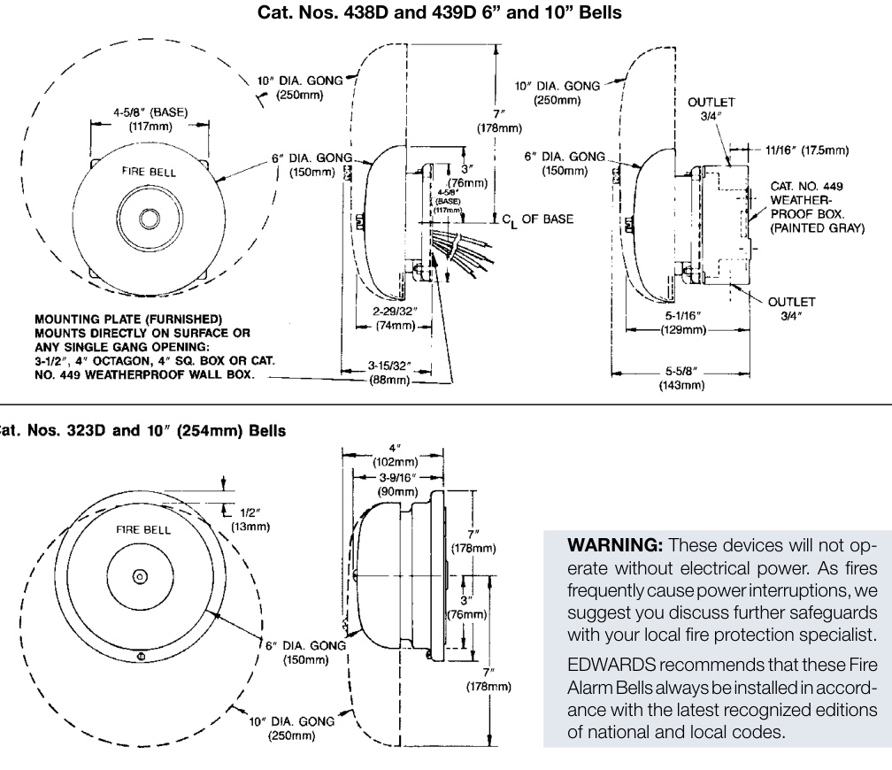

# Fire Alarm Bells  

# Overview  

EDWARDS Fire Alarm Bells are specially designed for fire alarm applications. The gongs are made of selected alloy steel to give the loud, resonant tones necessary in fire alarm systems.  

Two gong sizes are available to overcome different ambient noise level.  

The Fire Alarm Bells are of the underdome type with heavy duty mechanisms. Each bell is supplied with a mounting plate that fits any standard single-gang opening (see Installation Data). For weather-proof application EDWARDS offers an optional surface weatherproof back box. Refer to the Specification chart for applicability and cata-log number of the weatherproof back box for the respective bell.  

Finish — Standard gong and housing furnished gray with red label. Optional red finish available. Add Suffix “R” to Catalog Number.  

FM — 438 and 439 Series Bells shown below are FM approved.  

# Standard Features  

•	 Vibrating and single stroke   
•	 6 inch (150mm), 8 inch (200mm), 10 inch (250mm) sizes Red or gray finish   
Rugged compact mechanism Heavy duty cast housing Low power drain Wide voltage selection Indoor or weatherproof  

# Installation  

  

# Specifications & Ordering Information  

<html><body><table><tr><td>Cat. No.</td><td>DB @ 10ft</td><td>Description</td><td>Volts</td><td>Amps</td><td>Weatherproof Box</td></tr><tr><td>323D-10AW-R</td><td>79</td><td>10" (250mm) Single Stroke, Diode</td><td>20-24Vdc</td><td>0.33</td><td>N/A</td></tr><tr><td>438D-6N5-R</td><td>76</td><td>6" (150mm) Vibrating, Diode</td><td>120 Vac</td><td>0.034</td><td>449</td></tr><tr><td>438D-10N5-R</td><td>88</td><td>10"(250mm) Vibrating,Diode</td><td>120 Vac</td><td>0.034</td><td>449</td></tr><tr><td>439D-6AW-R</td><td>83</td><td>6" (150mm) Vibrating, Diode</td><td>20-24 4Vdc</td><td>0.085</td><td>449</td></tr><tr><td>439D-10AW-R</td><td>86</td><td>10" (250mm) Vibrating, Diode</td><td>20-24 Vdc</td><td>0.085</td><td>449</td></tr><tr><td>438D-8N5-R</td><td>86</td><td>8" (200mm) Vibrating,Diode</td><td>120 Vac</td><td>0.034</td><td>449</td></tr><tr><td>439D-8AW-R</td><td>84</td><td>8" (200mm) Vibrating,Diode</td><td>20-24 Vdc</td><td>0.085</td><td>449</td></tr><tr><td>439D-6AWC-R</td><td>83</td><td>6"(150mm) Vibrating, Diode, ULC listed </td><td>20-24 Vdc</td><td>0.085</td><td>449</td></tr><tr><td>439D-10AWC-R</td><td>86</td><td>10" (250mm) Vibrating,Diode, ULC listed</td><td>20-24 Vdc</td><td>0.085</td><td>449</td></tr><tr><td colspan="8">Mounting Accessories</td></tr></table></body></html>

449 Weatherpoof surface mount box, grey. C/w gasket.  