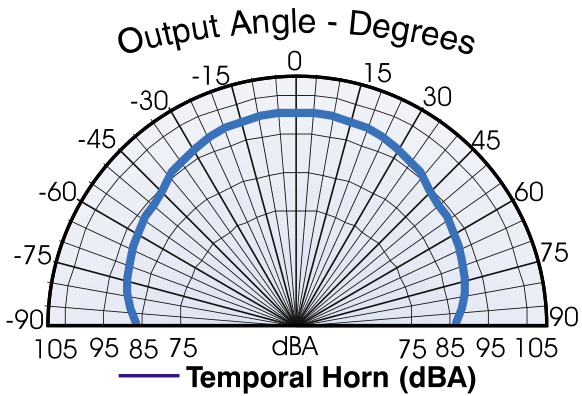
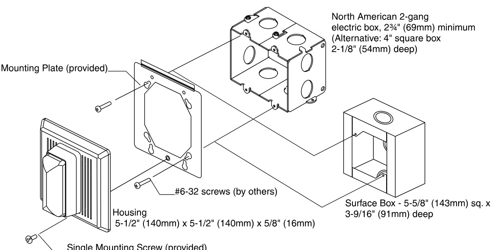
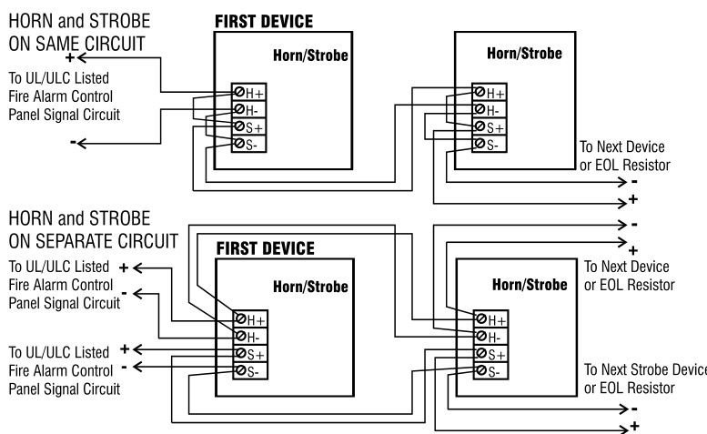
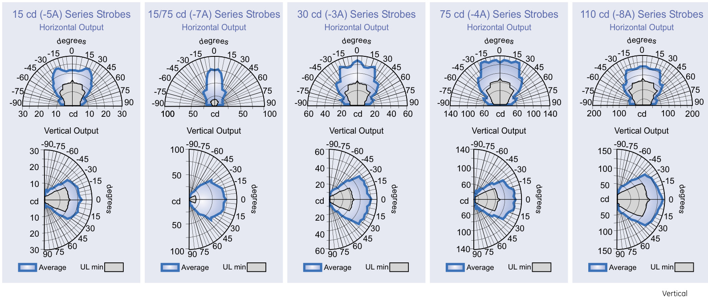
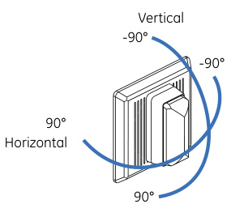

# Temporal Horns and Horn-strobes 757 Series  

# Overview  

Integrity temporal horns and temporal horn-strobes are specially designed for use with compatible life safety communication and control equipment to alert occupants of a life safety event.  The horn emits a piercing low frequency sound that is easily heard above moderate ambient noise levels. The flash from its strobe can be noticed from almost any position in the room, corridor, or large open space.  

Integrity’s rugged plastic housing is made from durable and fire retardant, high impact plastic with a slightly textured surface. Its ingenious mounting plate firmly holds the device in place with a single screw. A separate trim plate is not required. Terminals accept up to #12 AWG $\scriptstyle2.5\mathsf{m m}^{2},$ wire for polarized connections.  

Strobes are shipped with standard wall mount style “FIRE” lens markings.  Where ceiling orientation, other languages, or different lens markings are required, EDWARDS offers optional LKW and LKC series Lens Marking Kits. These optional lens markings simply snap on to the strobe. Consult EDWARDS for availability of special lens markings.  

Integrity horns and horn-strobes are designed for 16 to 33 Vdc operation and must be connected to signal circuits that output a constant (not pulsed) voltage. A diode is used to allow full signal circuit supervision.  

# Standard Features  

UL 1971-listed synchronizing strobe Integrity strobes synchronize to the latest UL 1971 requirements when used with a synchronization source. Adjustable Audible Output Select temporal or continuous tones, and High setting for 98 dBA output or Low setting for 94 dBA sound output. Genesis-compatible All Genesis and Integrity strobes on the same circuit meet UL 1971 synchronization requirements when used with an external control module. Approved for public and private mode applications UL 1971-listed as signaling devices for the hearing impaired and UL 1638-listed as protective visual signaling appliances.   
Durable red or white Noryl front plate Ideal for outdoor, industrial or harsh environments.   
Field changeable field markings   
Lens language or standard “FIRE” marking is easily changed with optional LKW and LKC series lens kits. Easy Installation Flush mount to standard North American 4” square or twogang box. Integrity’s universal mounting plate allows it to be wired and then left hanging free for easy inspection and testing before it is fastened to the electrical box.  

# Application  

NOTE: The installation of visible and audible signals are subject to national and local standards, codes, and ordinances.   
Consult your Authority Having Jurisdiction for device installation requirements, application standards, and minimum performance specifications.  

# Horns  

During installation, the horn is configured for steady or temporal tone signal and either low (94 dBA) or high (98 dBA) output. When temporal output is selected all horns on a common two-wire circuit are self-synchronized (see specifications). External control modules are not required for audible synchronization.  

Suggested sound pressure level for each signaling zone used with alert or alarm signals is at least 15dB above the average ambient sound level, or 5dB above the maximum sound level having a duration of at least 60 seconds, whichever is greater, measured $5'$ (1.5m) above the floor. The average ambient sound level is the RMS, A-weighted sound pressure measured over a 24-hour period.  

Doubling the distance from the signal to the ear will theoretically result in a 6 dB reduction of the received sound pressure level. The actual effect depends on the acoustic properties of materials in the space. A 3 dBA difference represents a barely noticeable change in volume.  

  
Typical Sound Output Distribution dBA measured at 10 ft in anechoic chamber 757 Series Temporal Horn (‘HIGH’ output)  

# Strobes  

EDWARDS strobes are UL 1971-listed for use indoors as wallmounted public-mode notification appliances for the hearing impaired. Prevailing codes require strobes to be used where ambient noise conditions exceed specified levels, where occupants use hearing protection, and in areas of public accommodation. Consult with your Authority Having Jurisdiction for details.  

As part of the Enhanced Integrity line of products, 757 Series strobes exceed UL synchronization requirements (within 10 milliseconds other over a two-hour period) when used with a synchronization source.  Synchronization is important in order to avoid epileptic sensitivity.  

Integrity strobes are fully compatible with EDWARDS Genesis signals.  

NOTE: The flash intensity of some visible signals may not be adequate to alert or waken occupants in the protected area. Research indicates that the intensity of strobe needed to awaken $90\%$ of sleeping persons is approximately 100 cd. EDWARDS recommends that strobes in sleeping rooms be rated at at least 110 cd.  

WARNING: These devices will not operate without electrical power. As fires frequently cause power interruptions, further safeguards such as backup power supplies may be required.  

# Installation and Mounting  

All models fit to a standard flush mounted, North-American twogang electrical box, $2\%$ inch (69 mm) minimum. Optional flush trims are not required. For surface mount, use EDWARDS’s custom indoor and outdoor surface boxes painted in color-matched red or white epoxy. EDWARDS recommends that fire alarm horn/strobes always be installed in accordance with the latest recognized edition of national and local fire alarm codes.  

  

# Typical Wiring  

The strobe must be connected to signal circuits which output a constant (not pulsed) voltage. The horn can be connected to continuous voltage circuits.  

  

# Strobe Operating Current (RMS)  

<html><body><table><tr><td>UL Rating</td><td>15 cd</td><td>15/75cd</td><td>30 cd</td><td>75cd</td><td>110cd</td></tr><tr><td>16Vdc</td><td>109</td><td>150</td><td>130</td><td>263</td><td>329</td></tr><tr><td>16Vfwr</td><td>150</td><td>210</td><td>189</td><td>333</td><td>420</td></tr></table></body></html>  

<html><body><table><tr><td>Typical Current</td><td>15cd</td><td>15/75cd</td><td>30cd</td><td>75cd</td><td>110cd</td></tr><tr><td>24Vdc</td><td>69</td><td>06</td><td>89</td><td>159</td><td>180</td></tr><tr><td>24Vfwr</td><td>108</td><td>128</td><td>134</td><td>255</td><td>260</td></tr></table></body></html>  

Vdc: Volts direct current, regulated and filtered Vfwr: Volts full wave rectified  

# Current Draw Notes and Comments  

1.	 Current values are shown in mA.   
2.	 UL Nameplate Rating can vary from Typical Current due to measurement methods and instruments used.   
3.	 EDWARDS recommends using the Typical Current for system design including NAC and Power Supply loading and voltage drop calculations.   
4.	 Use the 16 Vdc RMS current ratings for filtered power supply and battery AH calculations. Use the 16 Vfwr RMS current ratings for unfiltered power supply calculations.   
5.	 Fuses, circuit breakers and other overcurrent protection devices are typically rated for current in RMS values. Most of these devices operate based upon the heating affect of the current flowing through the device. The RMS current  

# dBA Output  

<html><body><table><tr><td colspan="6">Horn-strobes</td></tr><tr><td rowspan="2"></td><td>UL464</td><td></td><td>Average-anechoic</td><td>Peak-anechoic</td><td></td></tr><tr><td>Temporal</td><td>Steady</td><td>Temporal Steady</td><td>Temporal</td><td>Steady</td></tr><tr><td>High dB Output</td><td>79.0</td><td>85.0</td><td>97.0 97.0</td><td>102.0</td><td>102.0</td></tr><tr><td>Low dB Output</td><td>75.0</td><td>79.0</td><td>93.0 93.0</td><td>98.0</td><td>98.0 determines the heatina affect and thereforethe trin andhold threshold for those</td></tr></table></body></html>  

Horns   

<html><body><table><tr><td rowspan="2"></td><td colspan="2">UL464</td><td colspan="2">Average-anechoic</td><td colspan="2">Peak-anechoic</td></tr><tr><td>Temporal</td><td>Steady</td><td>Temporal</td><td>Steady</td><td>Temporal</td><td>Steady</td></tr><tr><td>High dB Output</td><td>82.0</td><td>85.0</td><td>98.0</td><td>98.0</td><td>104.0</td><td>104.0</td></tr><tr><td>Low dB Output</td><td>75.0</td><td>82.0</td><td>94.0</td><td>94.0</td><td>99.0</td><td>99.0</td></tr></table></body></html>  

# dBA Output Notes and Comments  

•  All values shown are dBA measured at 10 feet $(3.01\,\mathsf{m})$ .  
•  UL1480 values measured in reverberation room.   
•  Average values are measured in anechoic chamber.  

  

# Specifications  

  

<html><body><table><tr><td>Rated Strobe Output- candela (cd)</td><td>757-1A-T</td><td>757-5A-T</td><td>757-7A-T</td><td>757-3A-T</td><td>757-4A-T</td><td>757-8A-T</td></tr><tr><td>UL1638</td><td rowspan="3">N/A (horn only)</td><td>15 cd (indoor only)</td><td>75 cd</td><td>30 cd</td><td>75 cd</td><td>110 cd</td></tr><tr><td>UL 1971</td><td>15 cd (wall mount only)</td><td>15 cd wall 15 cd ceiling</td><td>30 cd wall 15 cd ceiling</td><td>75 cd wall 60 cd ceiling</td><td>110 cd wall 60 cd ceiling</td></tr><tr><td>ULC S526</td><td>15 cd</td><td>75 cd</td><td>30 cd</td><td>75 cd</td><td>120 cd</td></tr><tr><td>Standalone Synchronization Characteristics (note 2)</td><td colspan="6">Strobe flash at 1 per second within 2o0 milliseconds on common circuit Horn pulses at temporal rate within2o0millisecondsoncommoncircuit</td></tr><tr><td>Operating Volts</td><td colspan="6">Strobe:16-33VdcorVfwrContinuous Horn:16-33 Vdc orVfwr Continuous</td></tr><tr><td>Horn Output (note 1)</td><td colspan="6">Anechoic: High Setting - 104 dBA (peak)/98 dBA (avg); Low Setting - 99 dBA (peak)/94 dBA (avg) Reverberent: High Setting - 85 dBA (continuous)/82 dBA (temporal); Low Setting - 82 dBA (continuous)/75 dBA (temporal)</td></tr><tr><td>Horn Current</td><td colspan="6">High Output: 40 mA@ 24Vdc;55mA @ 24 Vrms FWR Low Output: 20 mA @ 24 Vdc;28 mA @ 24 Vrms FWR</td></tr><tr><td>Strobe Flash Synchronization</td><td colspan="6">requirements of 10 milliseconds over a two-hourperiod.</td></tr><tr><td>Synchronization Sources</td><td colspan="6">G1M-RM,SIGA-CC1S,SIGA-MCC1S,BPS6A,BPS10A Supplied with LKW-1 “FIRE" red letters, vertical both sides (Wall Mount)- see LKW and LKC series for ceiling</td></tr><tr><td>Strobe Marking</td><td colspan="6">style and optional markings.</td></tr><tr><td>Flash Tube Enclosure Housing</td><td colspan="6">ClearLEXANwithwhite marking sleeve Textured, color impregnated engineered plastics - exceeds 94V-0 UL flammability rating</td></tr><tr><td>Wire Connections</td><td colspan="6">Terminals - separate, polarized inputs for Horn & Strobe, #12 AWG (2.5mm2) maximum</td></tr><tr><td>INDOOR Operating Environment</td><td colspan="6">32-120° F (0-49° C) ambient temperature. 93% relative humidity @ 40° C</td></tr><tr><td>OUTDOOR Operating Environment (must use weatherproof box)</td><td colspan="6">(757-4A: rated at 48 cd @ -35° C per UL/@ -40° C per ULC) (</td></tr><tr><td>Mounting - INDOOR</td><td colspan="6">(757-8A: rated at 70.7 cd @ -35° C per UL/@ -40° C per ULC) ( )  xm  x   x  - Surface:757A-SB Back box Bi-directional: 757A-BDF Mounting Frame</td></tr><tr><td>Mounting - OUTDOOR</td><td colspan="6">Surface:757A-WBWeatherproofBox UL1971,UL1638,UL464,ULCS526,ULCS525,MEA,CSFM,FM</td></tr><tr><td>Agency Listings</td><td colspan="6">(Allmodels comply withADACodeof Federal Regulation Chapter 28Part36Final Rule)</td></tr></table></body></html>

Note 1 - Measured at 10 ft (3m) $@24$ Vdc. Subtract 3 dBA for models with strobes. Note 2 - Temporal audible pattern is defined as: $\%$ sec ON, $\%$ sec OFF, ½ sec ON, ½ sec OFF, $\%$ sec ON, $1\,\%$ sec OFF, then repeat cycle. Integrity audible will not be affected by Genesis signal silence operation when on the same two wire circuit with Genesis horn strobes.  

<html><body><table><tr><td>Catalog Description Number</td></tr><tr><td>Ship Wt., Ib. (kg)</td></tr><tr><td>Temporal Horns</td></tr><tr><td>757-1A-T* Temporal Horn, Red 1.7 (0.8)</td></tr><tr><td>Temporal Horn-Strobes</td></tr><tr><td>757-7A-T* Temporal Horn-Strobe,15/75cd, Red</td></tr><tr><td>757-5A-T* Temporal Horn-Strobe, 15cd, Red</td></tr><tr><td>757-3A-T* Temporal Horn-Strobe, 30cd, Red 2.0 (0.9)</td></tr><tr><td>757-4A-T* Temporal Horn-Strobe,75cd, Red</td></tr><tr><td>757-8A-T* Temporal Horn-Strobe, 110cd, Red</td></tr><tr><td>Synchronization Sources</td></tr><tr><td>Genesis Signal Master Remote Mount (1- G1M-RM 0.2 (0.1)</td></tr><tr><td>gang) SIGA- Synchronization Output Module (Standard 0.5 (0.23)</td></tr><tr><td>CC1S Mount) - UL/ULC Listed SIGA- Synchronization Output Module (UIO Mount)</td></tr><tr><td>0.18 (0.08) MCC1S - UL Listed</td></tr><tr><td>BPS6A 6.5AmpBoosterPowerSupply 13 (5.9)</td></tr><tr><td>BPS10A 10 AmpBooster PowerSupply 13 (5.9)</td></tr><tr><td></td></tr><tr><td>Mounting Accessories 757A-SB*</td></tr><tr><td>Surface Box, Red, Indoor 1.5 (0.7)</td></tr><tr><td>757A-WB* Weatherproof Box,Red,Surface 757A-BDF* Bi-directional Frame, Red 4 (1.8)</td></tr></table></body></html>

\* Add -W for White housings.  

<html><body><table><tr><td>Lens Marking Kits (see note 1)</td><td></td></tr><tr><td>LKW-1 "FIRE",WallOrientation(supplied)</td><td rowspan="10">0.1 (.05)</td><td rowspan="10"></td></tr><tr><td>LKW-1R</td><td>"FIRE"，WallOrientation,RED</td></tr><tr><td>LKW-2 "FEU",WallOrientation</td><td></td></tr><tr><td>LKW-3</td><td>"FIRE/FEU",WallOrientation</td></tr><tr><td>LKW-4</td><td>"SMOKE"，WallOrientation</td></tr><tr><td>LKW-5</td><td>"HALON"，WallOrientation</td></tr><tr><td>LKW-6</td><td>"CO2"，WallOrientation</td></tr><tr><td>LKW-7</td><td>"EMERGENCY"，WallOrientation</td></tr><tr><td>LKW-8</td><td>"ALARM"，WallOrientation</td></tr><tr><td>LKW-9</td><td>“FUEGO"，WallOrientation</td></tr><tr><td>LKW-10</td><td>"ALERT"，WallOrientation</td></tr><tr><td>Add Suffix“W"tocatalog no.forWHITE.(e.g.757-7A-TW)</td><td></td></tr></table></body></html>  