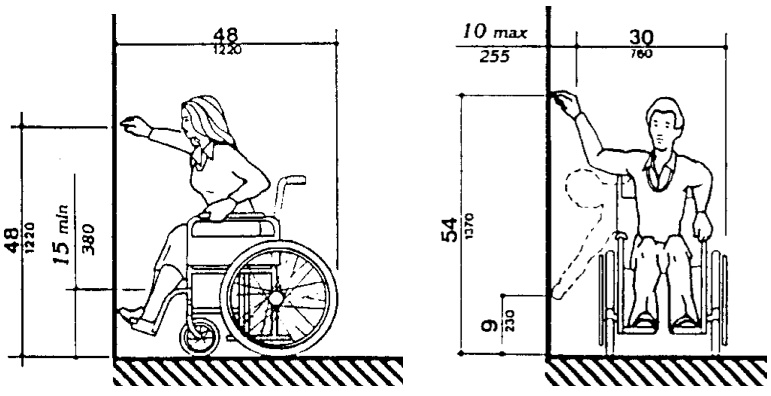
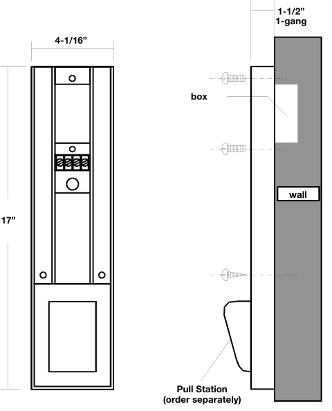
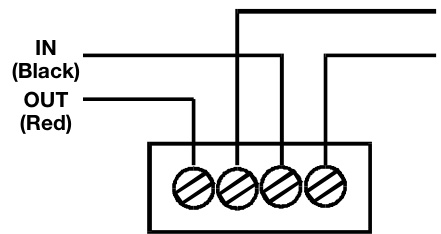

# ADA Station Relocator Model RR-32RL  

# Overview  

The Manual Station Relocator is designed to lower the height of a fire alarm pull station to meet ADA requirements. Most existing pull stations are mounted 60 inches $(1524\;\mathsf{m m})$ or higher above the floor. The Relocator lowers the height without the need for pulling new wires and moving the existing electric box.  

The Relocator is the easiest and most economical way to lower existing pull stations. Simply remove the existing pull station from the wall.  Connect field wiring to Relocator terminals. Reconnect the existing (or new) pull station to wire leads on the front of the Relocator. The Relocator is made from rugged aluminum and finished with an attractive beige finish. A large blue/white wheelchair decal is applied to the front to clearly indicate pull station accessibility.  

# Standard Features  

ADA compliant   
Meets physical requirements for ADA devices.   
Universal design   
Compatible with most brands of pull stations.   
Fast installation   
The simple design ensures very fast, very easy installation. Screw terminal wire connection   
Large terminals helps speed installation; accepts up to #12 AWG $(2.5\mathsf{m m}^{2})$ wire.   
One-gang mounting   
UL listed  

  

# Application  

ADA requires that pull stations be mounted 54 inches $(1370\;\mathrm{mm})$ off the finished floor for wheelchair side access and 48 inches $(1220\;\mathrm{mm})$ for front access.  

To fully comply with ADA you must use a pull station that is certifies to operate with 5 lb pull or less. EDWARDS manual pull stations meet this criteria.  

The Relocator is designed for indoor use only.  

# Installation and Mounting  

To install, simply remove the existing station from the wall, attach the Relocator to the electric box and attach the field wires to the terminal block in the back of the Relocator.  

EDWARDS recommends that fire alarm systems and devices always be installed in accordance with the latest recognized edition of national and local fire alarm codes.  

Compatible EDWARDS Manual Stations: Wire lead models only; maximum $1\,^{7}/16$ -inch deep.  

# Typical Wiring  

  

  

# Specifications  

<html><body><table><tr><td>Construction</td><td>Aluminum with beige paint finish</td></tr><tr><td>Markings</td><td>Suppliedwithlargeblue/whitewheelchairdecal</td></tr><tr><td>FieldWireConnections</td><td>Terminals-#12AWG (2.5mm2)maximum</td></tr><tr><td>Operating Environment</td><td>85%@30°Crelativehumidity;32-120°F(0-49°C)ambient temperature</td></tr><tr><td>Mounting</td><td>Mountstoflushone-gangelectricbox</td></tr><tr><td>Agency Listings</td><td>UL(AllmodelscomplywithADACodeofFederalRegulation Chapter28Part36FinalRule)</td></tr></table></body></html>  

# Ordering Information  

Pull station not included. Order separately.  

<html><body><table><tr><td>Catalog Number</td><td>Description</td><td>Ship Wt. - Ib (kg)</td></tr><tr><td>RR-32RL</td><td>PullStationRelocator</td><td>1 (0.4)</td></tr></table></body></html>  