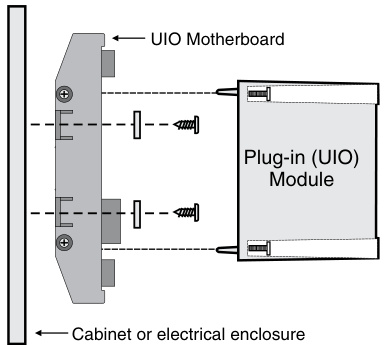
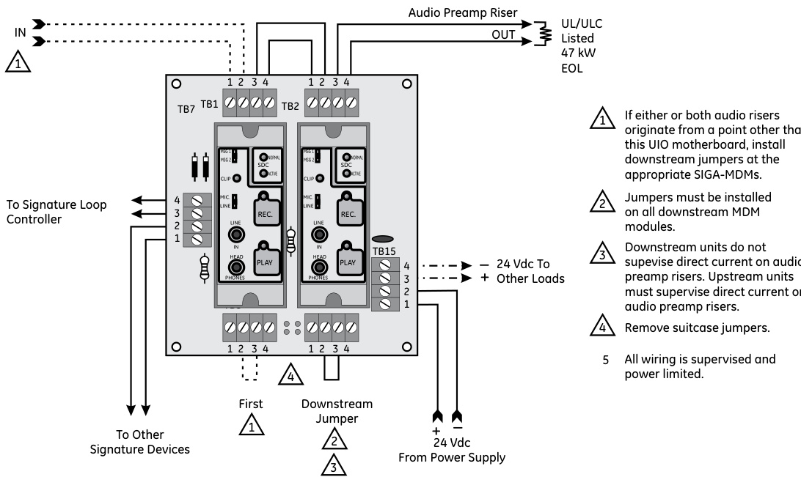
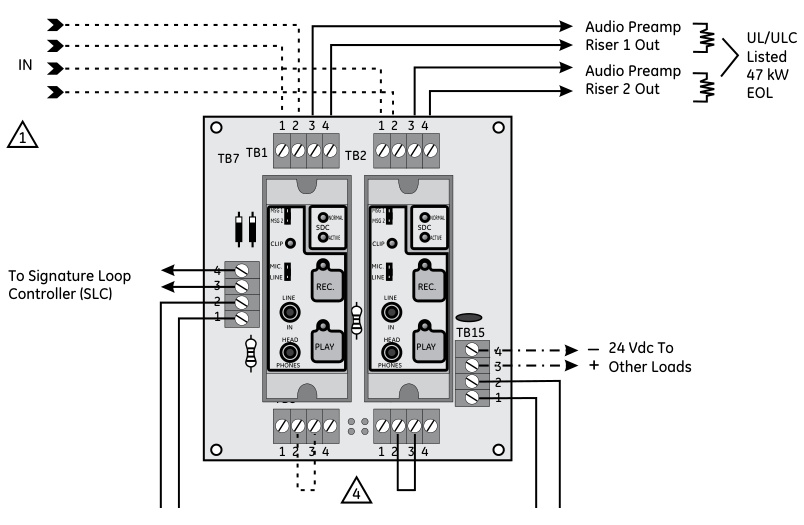

# Digital Message Module Model SIGA-MDM  

# Overview  

The SIGA-MDM Digital Message Module provides the ability to add custom prerecorded voice messaging to EDWARDS’s Network and Non-network systems. A microphone/line-level audio input stereo jack along with an audio output stereo jack for monitoring with headphones or amplified speakers are provided. Creating and reviewing messages is straightforward using MDM’s onboard record and playback switches. Programming in the Signature Data Controller provides all control instructions. Extra wiring for monitoring or controlling circuits is not required.  

The SIGA-MDM is shipped with two factory recorded messages. These standard messages can be changed on-site using the MDM’s recording capabilities.  

EVAC	 Attention ...Attention... An emergency has been reported in this building. Please cease operations and leave the building utilizing the nearest exit or fire stairway. Do not use the elevator. Repeat, do not use the elevator.   
ALERT	 Attention, please, an emergency has been reported in this building. While this report is being verified, please proceed to the corridor outside the nearest fire exit and standby for further instructions. Do not enter the fire exit. Do not use the elevators.  

The SIGA-MDM is part of the UIO family of plug-in Signature Series modules. It takes advantage of the modular flexibility and easy installation that characterizes all UIO modules. Two- and sixmodule UIO motherboards are available. These can accommodate individual risers for each on-board module, or shared risers in any combination with their UIO modules. All wiring connections are made to terminal blocks on the motherboard. UIO assemblies may be mounted in either EDWARDS cabinets, or standard electrical enclosures.  

# Standard Features  

# 60 second capacity  

Store two 30 second messages in non-volatile EEPROM;   
cascade multiple modules for almost unlimited capacity.  

Integral microphone input and audio output jacks Up front jacks allow convenient recording and reviewing messages.  

# Minimum wiring requirements  

Integral jumpers between modules allow sharing of risers to reduce installation wiring.  

# Automatic device mapping  

UIO module transmits information to the loop controller regarding its circuit location with respect to other Signature devices on the wire loop.  

# Electronic addressing  

Programmable addresses are downloaded from the loop controller, a PC, or the SIGA-PRO Signature Program/Service Tool. There are no switches or dials to set.  

# Intelligent device with microprocessor  

All decisions are made at the module to allow lower communication speed with substantially improved control panel response time and less sensitivity to line noise and loop wiring properties; twisted or shielded wire is not required.  

# Application  

The SIGA-MDM provides storage for two 30 second messages in its non-volatile EEPROM memory. On-site recording capability make it easy for programming messages in any language or local dialects. Dual message capability lends itself to bilingual applications or sending Alert and/or Evacuation messages to different areas of the building using a single module. When more capacity is required, up to 47 MDM modules can be cascaded together providing 97 different message outputs. Pre-amp level audio output is fed from the UIO module board terminals into the 2-AAC Audio Controller.  

Electronic Addressing - The loop controller electronically addresses each module saving valuable time during system commissioning. Setting complicated switches or dials is not required.  Each module has its own unique serial number stored in its on-board memory. The loop controller identifies each device on the loop and assigns a “soft” address to each serial number. If desired, the modules can be addressed using the SIGA-PRO Signature Program/Service Tool.  

# Warnings & Cautions  

This module will not operate without electrical power.  As fires frequently cause power interruption, we suggest you discuss further safeguards with your fire protection specialist.  

# Compatibility  

The Signature Series modules are compatible only with EDWARDS’s Signature Loop Controller.  

# Testing & Maintenance  

The module’s automatic self-diagnosis identifies when it is defective and causes a trouble message.  The user-friendly maintenance program shows the current state of each module and other pertinent messages.  Single modules may be turned off (de-activated) temporarily, from the control panel.  

Scheduled maintenance (Regular or Selected) for proper system operation should be planned to meet the requirements of the Authority Having Jurisdiction (AHJ).  Refer to current NFPA 72 and ULC CAN/ULC 536 standards.  

# Installation  

The SIGA-MDM mounts to a UIO motherboard inside a suitable EDWARDS enclosure with screws and washers provided. Plug the module into any available position on the motherboard and secure the module to the motherboard with the captive screws. Wiring connections are made to the terminals on the motherboard (see wiring diagram). UIO motherboard terminals are suited for $\#12$ to #18 AWG $2.5\;\mathrm{mm}^{2}$ to $0.75\;\mathrm{mm}^{2}$ ) wire size.  

  

EDWARDS recommends that these modules be installed according to latest recognized edition of national and local fire alarm codes.  

Modules will accept #12 AWG $(2.5\mathsf{m m}^{2})$ , #18 AWG $(0.75\mathsf{m m}^{2})$ ), #16 $(1.0\mathsf{m m}^{2})$ , and #14 AWG (1.50mm2) wire sizes. Note: Sizes #16 AWG $(1.0\mathsf{m m}^{2})$ and #18 AWG $(0.75\mathsf{m m}^{2})$ are preferred for ease of installation. See Signature Loop Controller catalog sheet for detailed wiring requirement specifications.  

  
Single Cascaded Audio Riser  

  
Se1parate Audio Rise+rs  

Specifications   

<html><body><table><tr><td>Power Requirements</td><td>Standby: 8 mA @ 18 to 26.4 Vdc Remote Playback: 20 mA Local Record/Playback: 20 mA</td></tr><tr><td>Message Capacity</td><td>2@30secondseach</td></tr><tr><td>Audio Characteristics</td><td>Bandwidth:400Hz to2.8kHz+3/-6dB@1kHz Distortion:<2%@1kHz</td></tr><tr><td>AudioInput</td><td>Microphone:20 mVrms max;Line-Level:200 mVrms max.</td></tr><tr><td>(viafrontpanel stereojack)</td><td>Riser: 1 Vrms into 600 ohms 5000 ft of #18 AWG max.</td></tr><tr><td>Audio Output</td><td>Front Panel: 1 Vrms 16 ohms 3.5 mm stereo jack Multi-Unit Cascade Priority: Active downstream has priority</td></tr><tr><td>Remote Control Functions</td><td>PlaybackandMessageSelectviaSignatureDataController(SDC)</td></tr><tr><td>Local Control Functions LED Indicators</td><td>Message Select, Input Level Select, Record, and Local Playback</td></tr><tr><td></td><td>RecordMode,PlayMode,andExcessiveRecordVolume Uses 2 Module Addresses</td></tr><tr><td>AddressRequirements</td><td></td></tr><tr><td>Type Code</td><td>Personality Code (factory set; emulates SIGA-CC2)</td></tr><tr><td>Mounting Construction and Finish</td><td>Plugs intoUIO2R, UIO6R or UIO6 Motherboards</td></tr><tr><td></td><td>HighImpactEngineeredPolymer;White Operating Temperature: 32°F to 100°F (0°C to 38°C)</td></tr><tr><td>Operating and Storage Environment</td><td>Storage Temperature: -4°F to 140°F (-20°C to 60°C) Operating and Storage Humidity: 0 to 93% RH</td></tr><tr><td>Agency Listing</td><td>UL, ULC</td></tr></table></body></html>  

# Ordering Information  

<html><body><table><tr><td>Catalog Number</td><td>Description</td><td>Ship Wt. - Ib. (kg)</td></tr><tr><td>SIGA-MDM</td><td>IntelligentDigitalMessageModule</td><td>0.18 (0.08)</td></tr><tr><td colspan="2"></td><td></td></tr><tr><td colspan="2">RelatedEquipment</td><td></td></tr><tr><td>SIGA-UIO2R</td><td>Universal Input-Output ModuleBoard w/Riser Inputs -TwoModulePositions</td><td>0.32 (0.15)</td></tr><tr><td>SIGA-UIO6R</td><td>Universal Input-OutputModuleBoardw/RiserInputs -SixModulePositions</td><td>0.62 (0.28)</td></tr><tr><td>SIGA-UIO6</td><td>Universal Input-OutputModuleBoard -SixModulePositions</td><td>0.56 (0.25)</td></tr></table></body></html>  