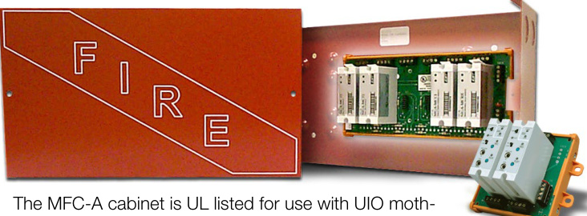
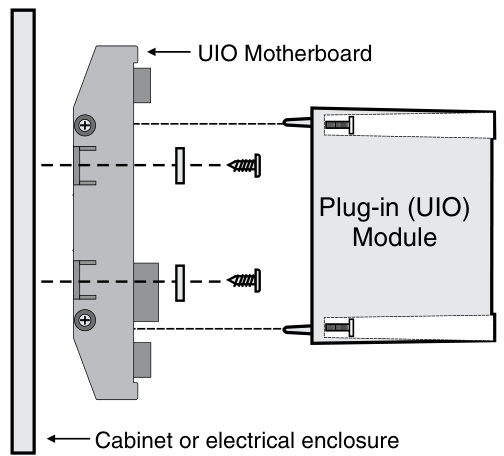
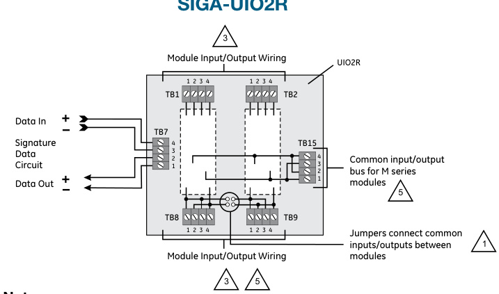
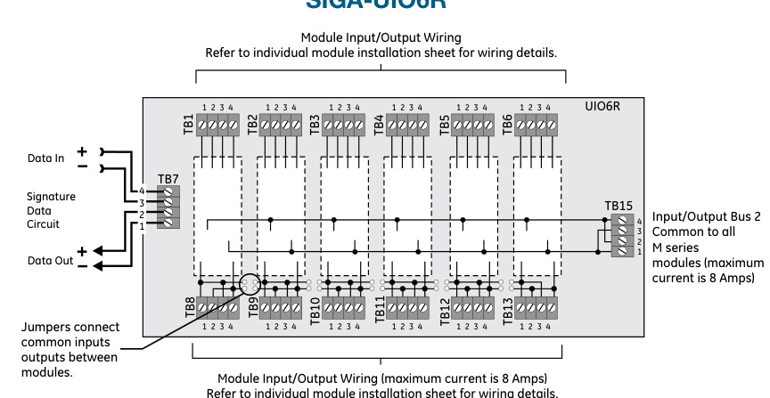
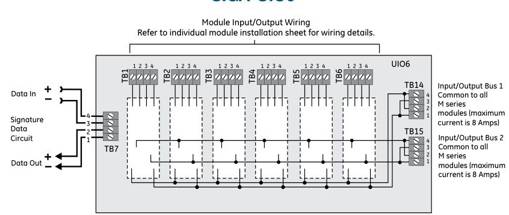

# Universal Input/ Output Module Motherboards SIGA-UIO2R, SIGA-UIO6R,  

# Overview  

Signature Series Universal Input-Output Module Motherboards provide mounting and wiring terminations for up to six Signature Series plug-in UIO (SIGA-“M” series) modules. UIO motherboards slide into a rigid extruded track (included) with mounting pads for convenient mounting into a variety of equipment enclosures. UIO modules plug into the board and are held securely in place with captive machine screws. All field wiring connects to terminal blocks on the motherboard, which permits rapid removal and replacement of modules for troubleshooting.  

The SIGA-UIO2R provides mounting and wiring terminations for up to two UIO modules, and the SIGA-UIO6R provides mounting and wiring terminations for up to six UIO modules. Both motherboards feature a riser #1 input and a riser #2 input bus. Jumpers on riser #1 input, between modules, facilitate sharing a single riser among more than one module. This significantly reduces wiring requirements. Removing the jumpers provide separate riser inputs to each adjacent module. Riser #2 input is fixed to each module position and cannot be split.  

The SIGA-UIO6 provides mounting and wiring terminations for up to six UIO modules. This motherboard provides two riser inputs that are common to all modules.  

# Standard Features  

Modular flexibility   
Wide assortment of multi-function plug-in modules provides total flexibility.   
Minimum wiring requirements Integral jumpers between modules allow sharing of risers to reduce installation wiring.   
Easy installation #12 AWG $\phantom{-}2.5\mathrm{\mm}2\rangle$ terminal blocks and sturdy mounting pads ensure quick installation into EDWARDS enclosures.   
Supports automatic device mapping All compatible UIO modules transmit information to the loop controller regarding their circuit locations with respect to other Signature devices on the wire loop.   
Supports intelligent devices On-board modules make decisions and input an alarm from initiating devices connected to them even if the loop controller’s polling interrogation stops. Twisted or shielded wire not required   
Because all decisions are made at the on-board modules,   
lower communication speeds are possible. This results in substantially improved control panel response time and less sensitivity to line noise and loop wiring properties.   
Supports electronic addressing Programmable addresses are downloaded to compatible UIO modules from the loop controller, a PC, or the SIGA-PRO Signature Program/Service Tool. There are no switches or dials to set.  

# Mounting and Installation  

Mount the UIO motherboard inside a EDWARDS MFC-A cabinet or other suitable electrical enclosure with screws and washers provided. Each MFC-A will hold one UIO2R motherboard or one UIO6 or UIO6R motherboard complete with their full complement of modules.  

Plug a Signature Series UIO module into any available position on the motherboard and secure the module to the motherboard with the captive screws. Wiring connections are made to the terminals on the motherboard (see wiring diagram). UIO motherboard terminals are suited for #12 to #18 AWG ( $2.5\;\mathrm{mm}^{2}$ to $0.75\;\mathrm{mm}^{2}$ )wire size.  

EDWARDS recommends that all boards and modules be installed according to latest recognized edition of national and local fire alarm codes.  

# Testing & Maintenance  

The module’s automatic self-diagnosis identifies when it is defective and causes a trouble message.  The user-friendly maintenance program shows the current state of each module and other pertinent messages.  Single modules may be turned off (de-activated) temporarily, from the control panel.  

  

erboards and meets requirements for spacing and clearance around the components.  

Scheduled maintenance (Regular or Selected) for proper system operation should be planned to meet the requirements of the Authority Having Jurisdiction (AHJ).  Refer to current NFPA 72 and ULC CAN/ULC 536 standards.  

  

# Compatibility  

Signature Series Universal Input/Output Module Boards are compatible only with SIGA-“M” Series I/O Modules, which require a Signature Data Controller. They are compatible with EST3, EST3X and iO Series control panels.  

# Warnings & Cautions  

Signature devices will not operate without electrical power. As fires frequently cause power interruption, we suggest you discuss further safeguards with your fire protection specialist.  

Signature Series Universal Input/Output Motherboards have terminal blocks to accept #18 AWG $(0.75\mathsf{m m}^{2}$ ), #16 AWG (1.0mm2), #14 AWG $(1.5\mathsf{m m}^{2}$ ), and #12 AWG $(2.5\mathsf{m m}^{2})$ ) wire sizes. See Signature Data Controller catalog sheets for detailed wiring requirements and specifications.  

  

# Notes  

1 Jumpers may be used to make the inputs/outputs between modules common.   
2) Not all modules use the SIGA-UIO2R terminals for the same functions.   
3 Refer to individual SIGA-M series installation sheets for jumper settings and wiring information. Installations with multiple SIGA-UIO motherboards or enclosures (which include other wiring) require FPL, FPLR, FPLP, or equivalent NEC-approved wire for all power limited wiring. Observe the details of supervision and power limited versus non-power limited circuits. Refer to the SIGA-M series installation sheets.   
4) Do not mix incompatible signals.   
5 Maximum current is 8 Amps.   
7) Refer to Signature Data Controller Installation Sheets for wiring specifications.  

  
SIGA-UIO6R   
SIGA-UIO6  

  

# Specifications  

# Notes:  

<html><body><table><tr><td>Catalog Number</td><td>SIGA-UIO2R</td><td>SIGA-UI06R</td><td>SIGA-UI06</td></tr><tr><td>Module Capacity</td><td>Two</td><td>Six</td><td>Six</td></tr><tr><td>Dimensions (with module installed)</td><td>5.4 inch L (across mounting feet)x 4.3 inchWx3.2inchH</td><td colspan="2">9.56 inch L (across mounting feet) x 4.3 inch W x3.2inchH</td></tr><tr><td>AddressRequirements</td><td colspan="3">noaddressrequired</td></tr><tr><td>Type Code</td><td colspan="3">none</td></tr><tr><td>CompatibleModules</td><td colspan="3">AllSIGA-MxxxSignatureSeries</td></tr><tr><td>Operating Voltage</td><td colspan="3">15.2to19.95Vdc (19Vdcnominal)</td></tr><tr><td>Mounting (cabinets)</td><td colspan="3">Directly into suitable enclosures (e.g.: MFC-A) - Notes 1, 2, 3.</td></tr><tr><td>Wiring Terminals</td><td colspan="3">#12AWG(2.5mm2)to#18AWG(0.75mm2)</td></tr><tr><td>Storage and Operating Environment</td><td colspan="3">OperatingTemperature:32°Fto120°F(0°Cto49°C)</td></tr><tr><td>Agency Listing</td><td colspan="3">Operating and Storage Humidity: 0 to 93% RH UL,ULC,MEA,CSFM</td></tr></table></body></html>

1.	 Allow a minimum clearance of one inch around all sides of the UIO motherboard. 2.	 On-site drilling of mounting holes may be required. Self-tapping mounting screws are provided. 3.	 Suitable cabinets: MFC-A, CAB2, 3-CAB5, 3-CAB7, 3-CAB14, 3-CAB21, 3-RCC series, RACC series.  

# Ordering Information  

<html><body><table><tr><td>Catalog Number</td><td>Description</td><td>Ship Wt. - Ib (kg)</td></tr><tr><td>SIGA-UIO2R</td><td>Universal Input-OutputModuleBoardw/RiserInputs -TwoModulePositions</td><td>0.32 (0.15)</td></tr><tr><td>SIGA-UIO6R</td><td>Universal Input-OutputModuleBoardw/RiserInputs -SixModulePositions</td><td>0.62 (0.28)</td></tr><tr><td>SIGA-UIO6</td><td>Universal Input-Output ModuleBoard -SixModulePositions</td><td>0.56 (0.25)</td></tr><tr><td>MFC-A</td><td>ULlistedcabinetformountingUlOmotherboards,redwith white“FIRE"8inchHX14inchWX3.5inchD(203mmH X356mmWX89mmD)</td><td>7.0 (3.1)</td></tr></table></body></html>  