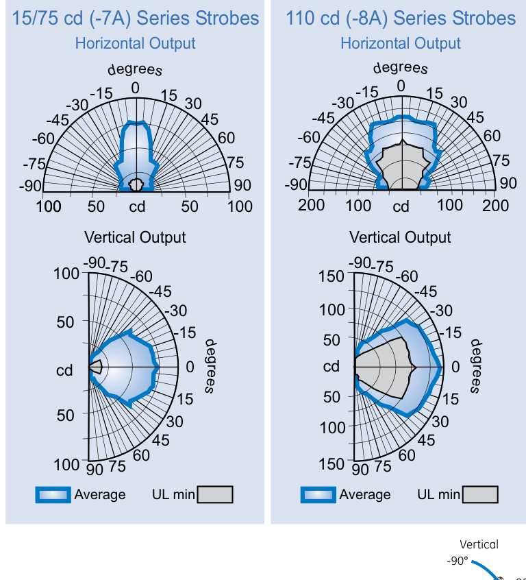
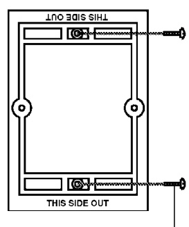

# Synchronized Strobe 202-7A, 202-8A, 203-8A  

# Overview  

202 Series strobes are specially designed for use with compatible life safety communication and control equipment to alert the hearing impaired of a life safety event.  Strobes are available with 15/75 cd, and 110 cd effective flash intensity. They are fully compatible with Genesis signals.  

Strobes are shipped with standard wall mount style “FIRE” lens markings.  Where ceiling mount, other languages, or different lens markings are required, EDWARDS offers optional LKW and LKC series Lens Marking Kits. These optional lens markings simply snap on to the strobe. Consult EDWARDS for availability of special lens markings.  

202 Series strobes are designed for 16 to 33 Vdc operation and must be connected to signal circuits that output a constant (not pulsed) voltage. A diode is used to allow full signal circuit supervision and polarized connections are made to terminals that accept up to #12 AWG (2.5mm²) wire. The 203 Series strobe operates from a 120 Vac 50/60 Hz supply and is not synchronized.  

The strobe housing/front plate is finished in red or white and is made from durable and fire retardant, high impact plastic with a slightly textured surface.  

# Standard Features  

UL 1971-listed synchronizing strobe   
Integrity strobes synchronize to the latest UL 1971 requirements when used with a synchronization source.   
Genesis-compatible   
All Genesis and Integrity strobes on the same circuit meet UL 1971 synchronization requirements when used with an external control module.   
Approved for public and private mode applications   
UL 1971-listed as signaling devices for the hearing impaired and UL 1638-listed as protective visual signaling appliances. Rated for wall or ceiling installation   
Field changeable field markings   
Lens language or standard “FIRE” marking is easily changed with optional LKW and LKC series lens kits.   
Screw terminal wire connection   
Large terminals speed installation and accept up to #12 AWG $(2.5\mathsf{m m}^{2})$ wire.   
Fits one-gang flush box   
Ideal for retrofit and renovation projects. Optional color  
matched surface boxes available.  

# Application  

NOTE: The installation of visible and audible signals are subject to national and local standards, codes, and ordinances.   
Consult your Authority Having Jurisdiction for device installation requirements, application standards, and minimum performance specifications.  

EDWARDS strobes are UL 1971-listed for use indoors as wallmounted public-mode notification appliances for the hearing impaired. Prevailing codes require strobes to be used where ambient noise conditions exceed specified levels, where occupants use hearing protection, and in areas of public accommodation. Consult with your Authority Having Jurisdiction for details.  

As part of the Enhanced Integrity line of products, 202/203 Series strobes exceed UL synchronization requirements (within 10 milliseconds other over a two-hour period) when used with a synchronization source.  Synchronization is important in order to avoid epileptic sensitivity.  

Integrity strobes are fully compatible with EDWARDS Genesis signals.  

NOTE: The flash intensity of some visible signals may not be adequate to alert or waken occupants in the protected area. Research indicates that the intensity of strobe needed to awaken $90\%$ of sleeping persons is approximately 100 cd. EDWARDS recommends that strobes in sleeping rooms be rated at at least 110 cd.  

WARNING: These devices will not operate without electrical power. As fires frequently cause power interruptions, further safeguards such as backup power supplies may be required.  

# Installation and Mounting  

All models fit to a standard flush mounted, North American onegang electrical box, two inch (51mm) deep minimum.  Optional EDW15A/R7D5 Sc dc o(l-o7r-A)m aStecrhieesd  iSntdroobore ssurfac31e05-  ccmddo  (u(--n35t AAb)) o SxSeeersrii eearsse   SSattrvroaoiblbable. Strobes must be connected to signal circuits which output a constant (not pulsed) voltage.  EDWARDS recommends that these strobes always be installed in accordance with the lat00est recognized editio-3n0 of national a3n0d local fire alarm c--3o30d0es.  

  
MOUNTING PLATE  

# UL 1971 WALL MOUNTED STROBE LIGHT OUTPUT  

# Light Distribution Patterns  

  

  
Two pan head slotted screws are provided to secure mounting plate to 1-gang electrical box.  

# Typical Wiring — 24 Vdc  

  

CAUTION: This unit is designed to be used on signal circuits that output a constant voltage. Do not connect this unit to a coded or pulsating voltage. Electrical supervision requires wire run to be broken at each device. Do not loop signal circuit field wires around the strobe terminals.  

Operating Current (RMS)   

<html><body><table><tr><td colspan="3">ULRating 15/75cd 110cd</td></tr><tr><td>16Vdc</td><td>150</td><td>329</td></tr><tr><td>16Vfwr</td><td>210</td><td>420</td></tr><tr><td colspan="3"></td></tr><tr><td colspan="3">TypicalCurrent 15/75cd 110cd</td></tr><tr><td>24Vdc</td><td>90</td><td>180</td></tr><tr><td>24Vfwr</td><td>128</td><td>260</td></tr><tr><td>120Vac</td><td>N/A</td><td>104 mA</td></tr></table></body></html>

Vdc: Volts direct current, regulated and filtered Vfwr: Volts full wave rectified  

# Current Draw Notes and Comments  

1.	 Current values are shown in mA.   
2.	 UL Nameplate Rating can vary from Typical Current due to measurement methods and instruments used.   
3.	 EDWARDS recommends using the Typical Current for system design including NAC and Power Supply loading and voltage drop calculations.   
4.	 Use the 16 Vdc RMS current ratings for filtered power supply and battery AH calculations. Use the 16 Vfwr RMS current ratings for unfiltered power supply calculations.   
5.	 Fuses, circuit breakers and other overcurrent protection devices are typically rated for current in RMS values. Most of these devices operate based upon the heating affect of the current flowing through the device. The RMS current determines the heating affect and therefore, the trip and hold threshold for those devices.  

# Specifications  

<html><body><table><tr><td>Catalog Number</td><td>202-7A</td><td>202-8A</td><td>203-8A</td></tr><tr><td>UL 1971 Rated Strobe Output - candela (cd)</td><td>15cd (wall or ceiling)</td><td>110cd (wall); 60cd (ceiling)</td><td>110cd (wall); 60cd (ceiling)</td></tr><tr><td>UL1638/ULCS526RatedStrobe μndino</td><td>75cd</td><td>110cd</td><td>110cd</td></tr><tr><td>Strobe Flash Rate</td><td colspan="2">Synchronized at one flash per second. External control module necessary to meet UL 1971 synchronization requirements of 10 milliseconds over a</td><td>Non-synchronized at one fps.</td></tr><tr><td>Strobe Operating Volts</td><td colspan="2">two-hour period. 16-33Vdc/fwr(ULvoltage designations“Regulated 24"and"24 fwr")</td><td>120 Vac 50/60Hz</td></tr><tr><td>Synchronization Sources Environment for</td><td colspan="3">G1M-RM,SIGA-CC1S,SIGA-MCC1S,BPS6A,BPS10A</td></tr><tr><td>Indoor Rating</td><td colspan="3">93% relative humidity @ 86° F (30° C); Temperature Range 32° F to 120° F (0° C to 49° C)</td></tr><tr><td>Environmentfor Outdoor Rating</td><td colspan="3">95% relative humidity @ 90° F (32° C); Temperature Range -40° F to +150° F (-40° C to +66° C)</td></tr><tr><td>Lens Markings</td><td colspan="3">Supplied with LKW-1 “FIRE" red letters, vertical both sides (Wall Mount) See LKW and LKC series for ceiling style and optional markings.</td></tr><tr><td>Wire Connections</td><td colspan="3">Terminals - polarized input, #12 AWG (2.5mm2) max wire size</td></tr><tr><td>FlashTube Enclosure</td><td colspan="3">Clear LEXAN</td></tr><tr><td>Strobe Plate, Finish</td><td colspan="3">Textured color-impregnated plastic.Exceeds 94V-0 UL Flammability Rating</td></tr><tr><td>Mounting</td><td colspan="3">Flush - One-gang, 2-inch deep North American electrical box; Surface - 27193 series box or one-gang wiremold box.</td></tr><tr><td>Agency Listings</td><td colspan="3">Chapter 28Part 36Final Rule)</td></tr></table></body></html>

NOTE:  For outdoor surface mounting of 203-8A, use 897B-008 red weatherproof wallbox.  

Ordering Information   

<html><body><table><tr><td>Catalog Number</td><td>Description</td><td>Ship Wt. Ib. (kg)</td></tr><tr><td>202-7A-T</td><td>Strobe-15/75 cd,Red</td><td rowspan="5">1 (0.45)</td></tr><tr><td>202-7A-TW</td><td>Strobe - 15/75 cd, White</td></tr><tr><td>202-8A-T</td><td>Strobe - 110 cd, Red</td></tr><tr><td>202-8A-TW</td><td>Strobe - 110 cd, White</td></tr><tr><td>203-8A-T</td><td>Strobe-110 cd,120Vac,Red</td></tr><tr><td>203-8A-TW</td><td>Strobe -110 cd,120Vac,White</td><td></td></tr><tr><td>Synchronization Sources</td><td></td><td></td></tr><tr><td>G1M-RM</td><td>Genesis Signal MasterRemote Mount(1-gang)</td><td>0.2 (0.1)</td></tr><tr><td>SIGA-CC1S</td><td>Synchronization Output Module (Standard Mount) - UL/ ULC Listed</td><td>0.5 (0.23)</td></tr><tr><td>SIGA-MCC1S</td><td>Synchronization Output Module (UIO Mount) - UL Listed</td><td>0.18 (0.08)</td></tr><tr><td>BPS6A</td><td>6.5 Amp Booster Power Supply</td><td>13 (5.9)</td></tr><tr><td>BPS10A</td><td>10AmpBoosterPowerSupply</td><td>13 (5.9)</td></tr><tr><td>Mounting Accessories</td><td></td><td></td></tr><tr><td>27193-11</td><td>Surface Mount Box - Indoor, 1-gang Red</td><td rowspan="3">1 (0.45)</td></tr><tr><td rowspan="2">27193-16</td><td>Surface Mount Box</td></tr><tr><td>-Indoor, 1-gang White</td></tr><tr><td>Lens Markings Kits</td><td></td><td></td></tr><tr><td>LKW-1</td><td>"FIRE"- Wall (supplied)</td><td rowspan="9">(0.2 Ib, 0.1 kg)</td></tr><tr><td>LKW-1R</td><td>“FIRE"-Wall(Red)</td></tr><tr><td>LKW-2</td><td>"FEU" - Wall</td></tr><tr><td>LKW-3 "FIRE/FEU"-Wall</td><td></td></tr><tr><td>LKW-4</td><td>"SMOKE"-Wall</td></tr><tr><td>LKW-5</td><td>"HALON" - Wall</td></tr><tr><td>LKW-6</td><td>"CO2"-Wall</td></tr><tr><td>LKW-7</td><td>"EMERGENCY"-Wall</td></tr><tr><td>LKW-8</td><td>"ALARM" - Wall</td></tr><tr><td>LKW-9</td><td>“FUEGO"-Wall</td></tr><tr><td>LKW-10</td><td>“ALERT"- Wall</td></tr><tr><td>LKC-1</td><td>“FIRE"- Ceiling</td></tr><tr><td>LKC-2</td><td>“FEU"-Ceiling</td></tr><tr><td>LKC-3</td><td>“FIRE/FEU”- Ceiling</td></tr><tr><td>LKC-4</td><td>"SMOKE"- Ceiling</td></tr><tr><td>LKC-5</td><td>“"HALON" - Ceiling</td></tr><tr><td>LKC-6</td><td></td></tr><tr><td></td><td>“CO2"- Ceiling</td></tr><tr><td>LKC-7</td><td>“EMERGENCY"- Ceiling</td></tr><tr><td>LKC-8 LKC-9</td><td>“ALARM”- Ceiling “FUEGO"- Ceiling</td></tr></table></body></html>  