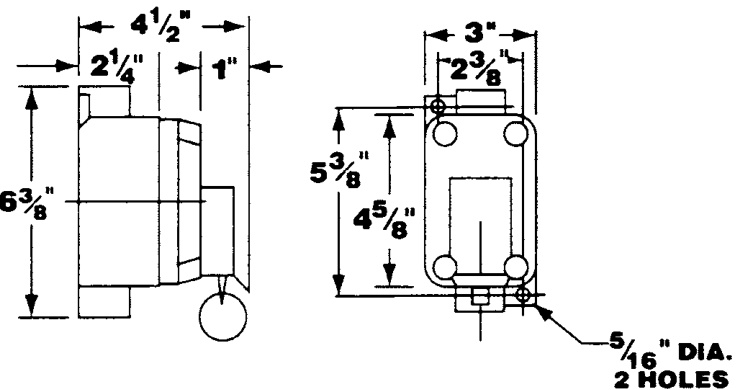

# Hazardous location fire alarm station XAL53  

# Overview  

The XAL53 is an extremely rugged double-action fire alarm station suitable for hazardous locations. The device is activated by lifting the front cover and pulling down the ring. This two-step process prevents unintentional operation.  

The station is reset by depressing the exposed shaft and returning the cover plate to its original position.  

# Standard Features  

•	 Copper-free aluminum alloy construction •$\%$ ” NPT feed-through conduit openings •	 Red textured powder epoxy paint finish provides high visibility •	 Normally open and normally closed contacts  

# Application  

XAL53 fire alarm stations are suitable for areas that are hazardous due to the presence of flammable gases or vapors, combustible dusts, or easily-ignitable fibers or flyings. Install in petroleum refineries, chemical and petrochemical plants, storage areas, and other processing facilities where hazardous substances are handled or stored and in areas where emergency control of an alarm or signal circuit is required.  

# Dimensions  

  

# Hazardous classifications  

Class I, Div. 1 and 2, Groups C and D Class II, Div. 1 and 2, Groups E, F and G •Class III •NEMA Type 7, Groups C and D NEMA Type 9, Groups E, F and G  

# Ordering Information  

Catalog  Number Description Ship  Wt., lb. (kg.) XAL53 Hazardous Location Fire Alarm Station 10 (4.5)  