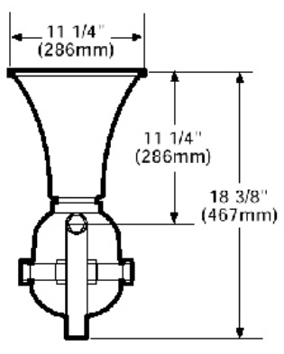
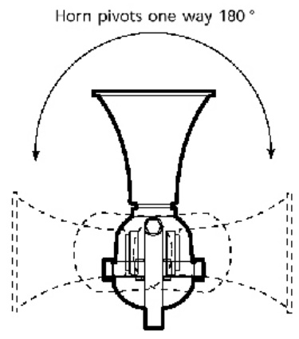

# Hazardous Location Horns and Sirens 5522D, 5523D, 5524D, 5525D  

# Overview  

EDWARDS hazardous location horns and sirens are extremely high decibel, high-performance signaling diode polarized appliances intended for fire alarm and life safety applications. Signals are solid-state with no moving parts or contacts to wear out. They require no maintenance or lubrication. The signals operate with very low current consumption and do not require extra current on start-up.  

# Standard Features  

•	 Diode polarized for field wiring supervision   
•	 High dB output   
•	 Low current draw   
•	 Corrosion-resistant heat flowed epoxy finish   
•	 Swivel-adjustable mounting  

# Application  

Hazardous location horns and sirens are suitable for many locations including mines, granaries, flour mills, tankers, refineries, laboratories and other applications. They can be used where standard bells or horns are not satisfactory, particularly in areas of high noise levels. 5522D, 5523D, 5524D and 5525D signals are for indoor applications only and are not weatherproof.  

# Installation  

Bolts through the flange on the aluminum alloy casting are epoxysealed to prevent disassembly or tampering. Signals mount on any solid surface using three bolts and may be swivelled through 180 degrees horizontally or 180 degrees vertically, depending on the orientation of the mounting yoke. The housing and trumpet are finished with a metallic gray enamel.  

All wiring is made to tagged 30-inch (760mm) wire leads. Each unit is equipped with a sealed, threaded $\%$ inch fitting.  

  

  

# Specifications  

<html><body><table><tr><td>Catalog Number</td><td>5522D-AW</td><td>5523D-AW</td><td>5524D-AW</td><td>5525D-AW</td></tr><tr><td>ndno</td><td>Horn</td><td>Siren</td><td>Horn</td><td>Siren</td></tr><tr><td>Sound Characteristic</td><td>Predominant 1.1 KHz (Suitable for Coded signals)</td><td>Rises and falls 600 to1300 Hz every three seconds (Not suitablefor coded signals)</td><td>Predominant 1.1 KHz (Suitable for Coded signals)</td><td>Rises and falls 600 to1300 Hz every three seconds (Not suitableforcoded signals)</td></tr><tr><td>Sound Output</td><td>109 dBA at 10 ft (3m)</td><td>105 dBA at 10 ft (3m)</td><td>109 dBA at 10 ft (3m)</td><td>105 dBA at 10 ft (3m)</td></tr><tr><td>Approvals</td><td colspan="2">Class I, Division 1 & 2, GroupsB,C and D</td><td colspan="2">Class I, Division 1 & 2, Groups C and D; Class Il, Division 1 & 2, Groups E, F</td></tr><tr><td colspan="2">Operating Voltage</td><td colspan="3">and G; Class IIl 20 -24 Vdc</td></tr><tr><td colspan="4"></td></tr><tr><td colspan="4">Current Draw 350 mA Wiring 30-inch (760 mm) tagged wire leads</td></tr><tr><td colspan="4">Connections Finish Corrosion-resistantheatflowed grayepoxy</td></tr></table></body></html>  

# Ordering Information  

<html><body><table><tr><td>Cat. No.</td><td>Description</td><td>Ship Wt</td></tr><tr><td>5522D-AW</td><td>Horn:24 Vdc;Class I, Division 1 & 2,Groups B, C and D</td><td>25 Ib (11.5 kg)</td></tr><tr><td>5523D-AW</td><td>Siren: 24 Vdc; Class I, Division 1 & 2, Groups B, C and D</td><td>25 Ib (11.5 kg)</td></tr><tr><td>5524D-AW</td><td>Horn:24Vdc;Class1,Division1&2,Groups CandD;Class lI, Division 1 & 2, Groups E, F and G; Class Ill</td><td>25 Ib (11.5 kg)</td></tr><tr><td>5525D-AW</td><td>Siren:24Vdc;Class1,Division1&2,Groups CandD;Class , Division 1 & 2, Groups E, F and G; Class Il</td><td>25 Ib (11.5 kg)</td></tr></table></body></html>  