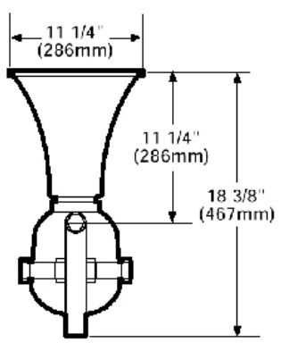
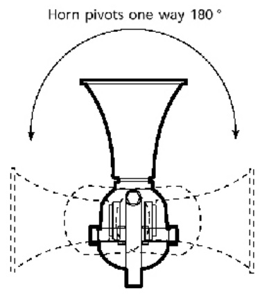

# Hazardous Location Multiple Tone Signal 5533BD  

# Overview  

The EDWARDS 5533BD signal is a heavy-duty industrial, tone-selectable, signaling device capable of producing volume-controlled, high-decibel tones. The signal delivers one audible output signal selected from the 19 available tones. The tone is selected by setting a miniature switch on the unit.  

# Standard Features  

•	 Diode polarized for field wiring supervision   
•	 19 tone capability – no additional tone modules needed   
•	 Four three-pulse temporal tones   
•	 Internal volume control   
•	 One Input, one output   
•	 Corrosion-resistant heat flowed epoxy finish  

# Application  

The 5533BD signal is intended for use in fire alarm systems and other applications that require electrical supervision of signal circuit field wiring, particularly where a high decibel sound is required for alert or evacuation in hazardous locations. Typical applications include signaling use in mining, granaries, flour mills, tankers, refineries, laboratories, spray booths, and other hazardous locations. The 5533BD signal is suitable for indoor applications only and is not weatherproof.  

# Installation  

5533BD signals mount with three bolts on any solid surface. To maximize effective signal direction, the trumpet can be swivelled through 180 degrees horizontally or 180 degrees vertically, depending on the orientation of the mounting yoke.  

All field wiring is made to tagged wire leads. Each unit is fitted with a sealed, threaded $\%$ -inch ( $13\;\mathrm{mm})$ fitting.  

  

  

# Field-selectable Tones  

<html><body><table><tr><td>Tone</td><td>Description</td><td>Standard Volume</td><td>High Volume</td></tr><tr><td>Ding-Dong</td><td>Percussive pairs of 700 and 570 Hz tones, each damped to zero</td><td>106</td><td>109</td></tr><tr><td>Warble</td><td>575 and 770 Hz alternately, 87 ms each</td><td>106</td><td>109</td></tr><tr><td>Siren</td><td>600-1250 Hz up and down sweep in 8 seconds and repeat</td><td>110</td><td>114</td></tr><tr><td>StutterPercussive</td><td>470 Hz, 83 ms on,109 ms off</td><td>103</td><td>106</td></tr><tr><td>Slow Whoop</td><td>600-1250 Hz upward sweep in 4 seconds and repeat</td><td>110</td><td>114</td></tr><tr><td>Beep</td><td>470 Hz,0.55 seconds on,0.55 seconds off</td><td>103</td><td>106</td></tr><tr><td>Chime 1</td><td>700 Hz percussive repeat at 1 Hz</td><td>106</td><td>109</td></tr><tr><td>Fast Whoop</td><td>600-1250Hz upward sweep in 1 second and repeat</td><td>110</td><td>114</td></tr><tr><td>Hi/Lo</td><td>780 to 600 Hz alternately, 0.52 seconds each</td><td>106</td><td>109</td></tr><tr><td>Rapid Siren</td><td>600-1250 Hz up and down sweep in 0.25 seconds and repeat</td><td>110</td><td>114</td></tr><tr><td>Yeow</td><td>1250-600 Hz downward sweep in 1.6 seconds and repeat</td><td>110</td><td>114</td></tr><tr><td>Horn</td><td>470 Hz continuous</td><td>103</td><td>106</td></tr><tr><td>Air Horn</td><td>370 Hz continuous</td><td>106</td><td>109</td></tr><tr><td>Dual Tone</td><td>450-500 Hz, 0.4 to 0.5 second cycle</td><td>103</td><td>106</td></tr><tr><td>Chime 2</td><td>575 Hz percussive repeat at 1 Hz</td><td>106</td><td>109</td></tr><tr><td>Three-Pulse Horn</td><td>470 Hz, 3 0.5 second pulses separated by 0.5 seconds followed by a 1.5 second delay and repeat</td><td>103</td><td>106</td></tr><tr><td>Three-Pulse Air Horn</td><td>370 Hz, 3 0.5 second pulses separated by 0.5 seconds followed by a 1.5 second delay and repeat</td><td>106</td><td>109</td></tr><tr><td>Three-Pulse Dual Tone</td><td>450-500 Hz, 0.4 to 0.5 second cycle, 3 0.5 second pulses separated by 0.5 seconds followed by a 1.5</td><td>106</td><td>109</td></tr><tr><td>Three-Pulse Chime 2</td><td>second delay and repeat 575 Hz, 3 0.5 second pulses separated by 0.5 seconds followed by a 1.5 second delay and repeat</td><td>103</td><td>106</td></tr></table></body></html>

\*Ratings taken in an anechoic chamber with signal volume control set at maximum and measurements made on an “A” weighted scale with peak hold.  

# Specifications  

<html><body><table><tr><td>UL Listing - for both Divisions 1 and 2</td><td>ClassI,Groups B,C and D</td></tr><tr><td>Nominal OperatingVoltage</td><td>20-24Vdc</td></tr><tr><td>Current Draw-Standby</td><td>61 mA</td></tr><tr><td>Current tDraw-Operating</td><td>440 mA</td></tr><tr><td>WiringConnections</td><td>TaggedWireLeads</td></tr><tr><td>Finish</td><td>Corrosion-resistantheatflowed epoxy</td></tr></table></body></html>  

# Ordering Information  

<html><body><table><tr><td>Cat.No.</td><td>Description</td><td>ShippingWeight</td></tr><tr><td>5533BD-AW</td><td>DiodePolarized HazardousLocationSignal 一 ClassI,Division 1&2,Groups B,C and D</td><td>25 Ib (11.5 kg)</td></tr></table></body></html>  