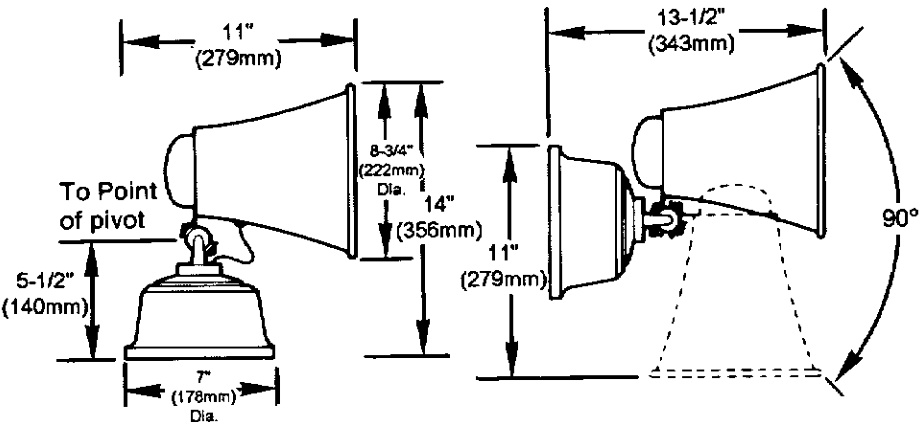
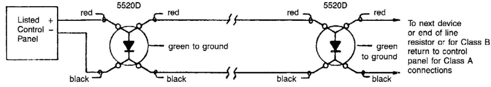

# Horn/Siren Combination 5520D Series  

# Overview  

EDWARDS 5520D series Duotronic signals are 24 Vdc diode-polarized, heavy duty, high-decibel signaling appliances for use in fire alarm applications where a supervised signal is required. Colored sage gray, 5520D Series signals will finction as either a horn or siren by setting an internal tamper-proof switch.  

The 5520D Horn/Siren has no moving parts or contacts to wear out. It requires no maintenance or lubrication. The horn/siren operates with very low current consumption and does not require extra current on start-up. The horn’s predominant frequency is $1.1\mathsf{\sf\sf\sf\sf\sf\sf\sf\sf\big\big\sf\big\!\big\sf\big\!\big<}_{}^{}\mathsf{\sf\!\big\|}.\mathsf{\sf\big\|}\mathsf{\sf\big\!\big\sf\big\!\big\sf\big\!\big\sf\big\!\big\!\big\sf\big\!\big\!\big\sf\big\!\big\!\big\|}$ When horn output is selected, the frequency rises and falls from 300 to 3000 Hz every 3 seconds.  

Once mounted, the horn/siren switch is tamperproof. The horn is suitable for coded applications, while the siren is not. The 5520D Series can be made suitable for outdoor weatherproof applications by adding the EDWARDS catalog number 349 Backbox.  

# Standard Features  

•	 No moving parts   
•	 High dB output   
•Suitable for coded signals (horn mode only)   
•Swivel/adjustable mounting   
•Outdoor/weatherproof option   
•Diode polarized   
•Low current draw, no inrush current Mounts to one-gang opening  

# Application  

5520D signals signals are ideal for indoor or outdoor applications including schools, factories, commercial occupancies, and lumber yards. They can be used where standard bells or horns are not satisfactory, particularly in areas of high noise level. The unit will function as a Horn or Siren with just the flick of a switch.  

# Installation  

5520D Series signals include a universal mounting plate that permits mounting to a standard single gang, $3\%$ ,$3\%$ , or 4-inch octagon outlet box, or a 4-inch square box. It may also be installed without a box directly to the wall or ceiling. The megaphone may be swivelled through $180^{\circ}$ horizontally and $90^{\circ}$ vertically. All wiring is made to colour-coded wire leads attached to a quick-disconnect plug. When complete, the device just plugs-in and is locked to the mounting plate with a set screw. For weatherproof installations, use a EDWARDS Cat. No. 349 back box, ordered separately.  

  

# Wiring  

  

# Specifications  

<html><body><table><tr><td>Nominal OperatingVoltage</td><td>20-24Vdc</td></tr><tr><td>CurrentDraw</td><td>350mA</td></tr><tr><td>SoundPressureOutput</td><td>Horn - 114 dBA at 10 ft (3m); Siren - 112 dBA at 10 ft (3m)</td></tr><tr><td>HornCharacteristic</td><td>Predominant1.1KHz(Suitableforcodedsignals)</td></tr><tr><td>SirenCharacteristic</td><td>Risesandfalls600to1300Hzeverythreeseconds (Not suitableforcoded signals)</td></tr><tr><td>WiringConnections</td><td>Color-codedwireleadswithquick-disconnectplug</td></tr><tr><td>Finish</td><td>Metallic gray enamel</td></tr><tr><td>Approvals</td><td>UL, ULC, FM</td></tr></table></body></html>  

# Ordering Information  

<html><body><table><tr><td>Cat.No.</td><td>Description</td><td>ship Wt.</td></tr><tr><td>5520D-AW</td><td>Horn/SirenCombination-24Vdc</td><td>25Ib (11.5kg)</td></tr><tr><td></td><td></td><td></td></tr><tr><td>Accessories</td><td></td><td></td></tr><tr><td>349</td><td>WeatherproofBackbox</td><td>0.5lb (0.2kg)</td></tr></table></body></html>  