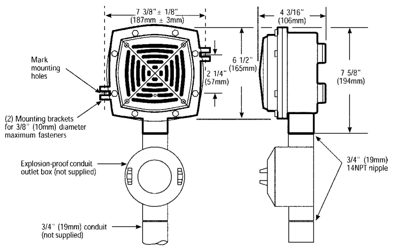

# Hazardous Location Horns 888D-N5 & 889D-AW  

# Overview  

888D and 889D hazardous location horns are diode-polarized, heavy duty, high decibel vibrating horns intended for use in life safety systems in hazardous (classified) locations. These horns may be mounted to any solid surface using two bolts (by others).  

Each unit is supplied with a sealing fitting for $\%$ -inch -14 National Pipe Taper (NPT) nipple, and wire leads for the electrical connection to the life safety system notification appliance circuit.  

# Standard Features  

Diode polarized •Corrosion resistant heat flowed epoxy finish – red Low current draw  

# Application  

888D and 889D hazardous location horns are UL-listed for installation in the following classified locations:  

•	 Class I, Division 1 and 2, Groups B, C, and D •	 Class II, Division 1 and 2, Groups E, F, and G •	 Class III hazardous locations, for Div. 1 and 2  

# Mounting  

  

# Specifications  

<html><body><table><tr><td>Catalog Number</td><td>888D-N5 889D-AW</td></tr><tr><td>RatedVoltage</td><td>120Vac 24Vdc</td></tr><tr><td>Alarm Current</td><td>0.13A 0.16A</td></tr><tr><td>Soundoutput</td><td>100dBAmeasuredinananechoicchamber onan“A" weighted decibel scale at 10 ft (3m)</td></tr></table></body></html>  

# Ordering Information  

<html><body><table><tr><td>Catalog Number</td><td>Description Ship Wt.</td></tr><tr><td>888D-N5</td><td>Hazardouslocationhorn-120Vac</td></tr><tr><td>889D-AW</td><td>9.0 Ib. (4.1 kg.) Hazardouslocation-24Vdc</td></tr></table></body></html>  