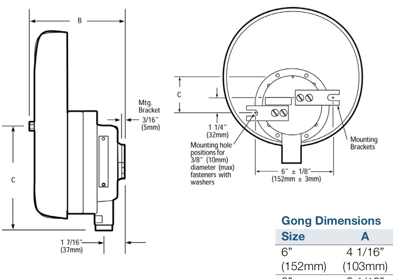

# Hazardous Location Bells 438DEX-N5 & 439DEX-AW  

# Overview  

430D series of hazardous location bells are diode-polarized, heavy duty fire bells for use in life safety applications where a diode supervised signal is required.  

Hazardous location bells are available with 6-inch ( $152\;\mathrm{mm})$ ,8-inch $(203\,\mathsf{m m})$ or 10 inch $(254\mathsf{m m})$ gongs, for either 120 Vac or 24 Vdc operation. They can be mounted to any solid surface using two $_{3/8}$ inch $10\;\mathrm{mm})$ ) bolts and the supplied mounting brackets or to a rigid conduit. The integral explosion-proof housing is mechanically terminated to accept a standard $\%$ -inch -14 National Pipe Taper (NPT) nipple.  

# Standard Features  

Diode polarized   
•$6",8"$ , and $10"$ gong sizes   
•Low power drain for efficient operation over long wire runs Completely assembled  

# Application  

430D series of hazardous location bells are UL-listed for installation in the following classified locations:  

•Class I groups B, C and D   
•Class II groups E, F and G Class III hazardous locations, for Div. 1 and 2  

# Mounting  

  

<html><body><table><tr><td>Size</td><td>A</td><td>B</td><td>C</td></tr><tr><td>6” （152mm）</td><td>4 1/16” (103mm）</td><td>413/16" (122mm）</td><td>5/8" (16mm)</td></tr><tr><td>8” (203mm)</td><td>51/16” (129mm)</td><td>5 1/4" （133mm）</td><td>15/8" (41mm)</td></tr><tr><td>10" (245mm)</td><td>6 1/16" （154mm）</td><td>53/8" (137mm）</td><td>25/8" (67mm)</td></tr></table></body></html>  

# Specifications  

<html><body><table><tr><td>438DEX-XN5</td><td>439DEX-XAW</td></tr><tr><td>RatedVoltage</td><td>120Vac 24Vdc</td></tr><tr><td>Alarm Current</td><td>.041A(RMS) 0.24A</td></tr><tr><td>Soundoutput</td><td>83dBAmeasuredinananechoicchamber on an“A" weighted decibel scale at 10 ft (3m)</td></tr></table></body></html>  

# Ordering Information  

<html><body><table><tr><td>Catalog Number</td><td>Description</td><td>Ship Wt. Ib. (kg.)</td></tr><tr><td>439DEX-6AW</td><td>6"(152 mm) Hazardous Location Bell - 24 Vdc, Gray</td><td>8 (3.6)</td></tr><tr><td>439DEX-6AW-R</td><td>6"(152mm)HazardousLocationBell-24Vdc,Red</td><td>8 (3.6)</td></tr><tr><td>439DEX-8AW</td><td>8"(203 mm)Hazardous LocationBell-24Vdc,Gray</td><td>10 (4.5)</td></tr><tr><td>439DEX-8AW-R</td><td>8”(203mm)HazardousLocationBell-24Vdc,Red</td><td>10 (4.5)</td></tr><tr><td>439DEX-10AW</td><td>10"(254 mm) Hazardous Location Bell-24 Vdc,Gray</td><td>12 (5.4)</td></tr><tr><td>439DEX-10AW-R</td><td>10"(254mm)HazardousLocationBell-24Vdc,Red</td><td>12 (5.4)</td></tr></table></body></html>  