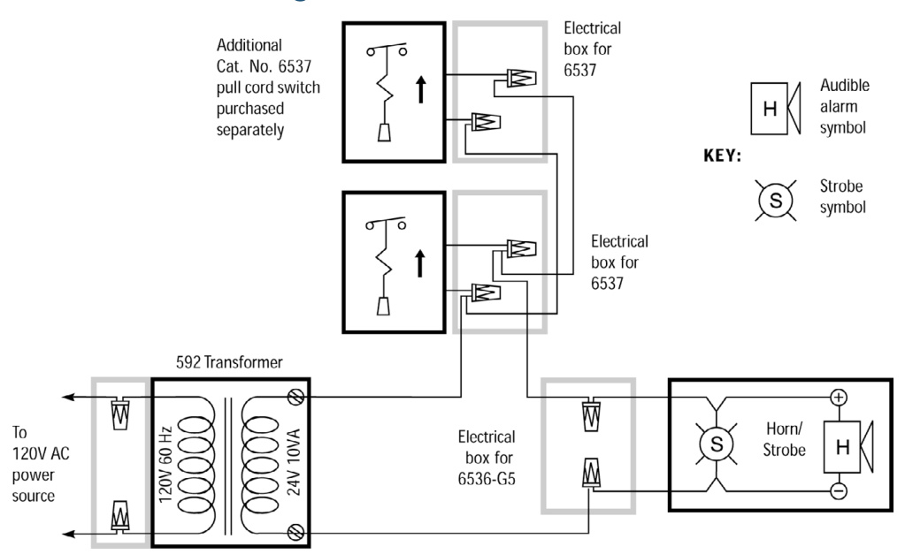
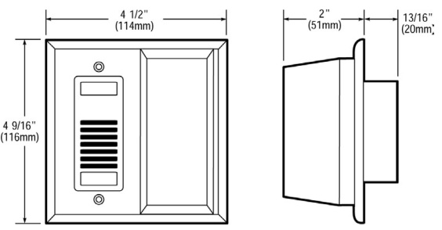
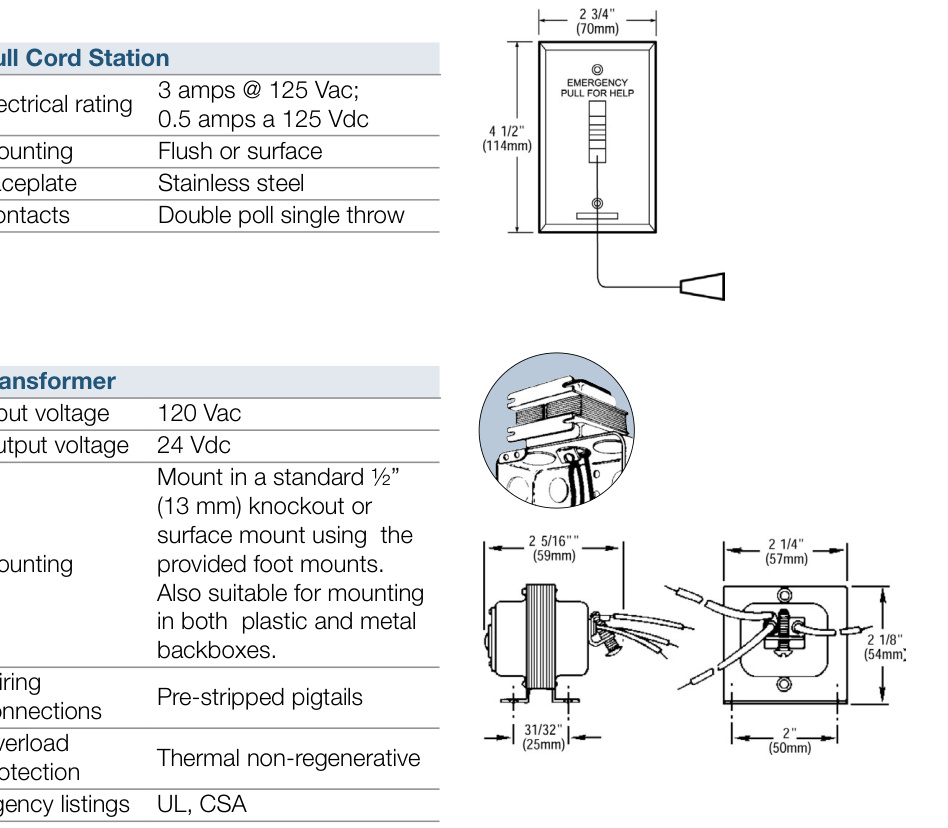

# Call for Assistance Kit 6538-G5  

# Overview  

The EDWARDS 6538-G5 Call For Assistance Kit is designed for areas where a call-for-help or an emergency switch is required. The kit consists of a horn/strobe for audible and visual signaling, an emergency pull cord station, and a transformer.  

# Standard Features  

•	 All-in-one call for assistance package •	 Uses single-gang boxes •	 Easy to install •	 Visual and audible signaling •	 Resettable at the initiating station  

# Application  

Use the Call for Assistance Kit in health care facilities, public rest rooms, and handicapped areas.  

  
Wiring  

# Specifications  

<html><body><table><tr><td colspan="2">Horn/Strobe</td></tr><tr><td>Soundoutput</td><td>82 dBAat10 ft.(3.05m)</td></tr><tr><td>Strobeoutput</td><td>11.7 cd</td></tr><tr><td>Electricalrating</td><td>24V50/60Hzor24Vdc</td></tr><tr><td>Currentdraw</td><td>175mA@24V50/60 Hz;125mA@24Vdc</td></tr><tr><td>Mounting</td><td>Single-gang 2"x 4"(51 mmx102mm)electrical box</td></tr><tr><td>Color</td><td>Neutralbeige</td></tr><tr><td>Agency Listing</td><td>UL</td></tr></table></body></html>  

  

  

# Ordering Information  

<html><body><table><tr><td>Catalog Number</td><td>Description</td><td>Ship Wt.</td></tr><tr><td>6538-G5</td><td>CallforAssistanceKit</td><td>2 Ibs. (0.9 kg.)</td></tr></table></body></html>  