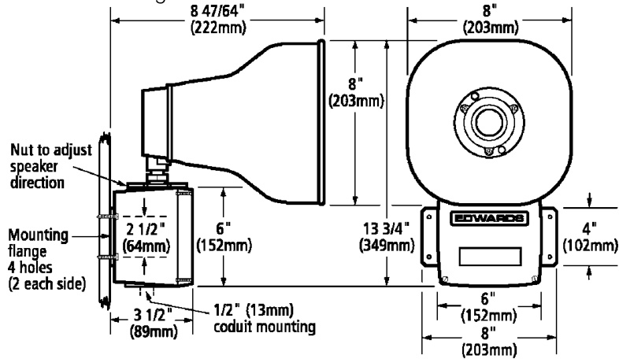

# Multiple Tone Signal 5530MD-24AW  

# Overview  

The EDWARDS 5530MD-24AW Adaptatone Millennium is a heavy-duty industrial, tone-selectable, stand-alone, signaling device capable of producing volume-controlled, high-decibel tones. It uses a microprocessor circuit to create 27 distinctive tones. A single tone may be selected by setting a miniature dip switch within the unit. The Adaptatone Millennium can be activated from a 24 Vdc external voltage source such as an output of a PLC or Fire/Security panel.  

# Standard Features  

•	 Diode Polarized   
•	 Stand-alone, 27 tone capability – no additional tone modules needed   
•	 Four 3-pulse temporal tones   
•	 New “soft” tones Single Input, Single Output   
•Weatherproof   
•Corrosion-resistant heat-flowed epoxy finish Captive Components Speaker can be rotated and locked in any horizontal direction   
Signal activates directly from a supervised output  

# Application  

The 5530MD-24AW is designed for industrial applications requiring high decibel output and electrical supervision of signaling circuit field wiring. The signal may also be used for unsupervised signaling applications. Typical applications include emergency warning systems, plant evacuation and security intrusion alarms, process monitoring, shift start-and-dismissal horns, and paging signals.  

# Hazardous Location Ratings  

The 5530MD-24AW is UL and cUL Listed as an audible signal appliance for use in Class I, Division 2, Group A,B,C, and D; Class II, Division 2, Group F and G; and, Class III, Division 1 and 2 hazardous or non-hazardous locations.  

<html><body><table><tr><td>Hazardous Locations</td><td>Temperature Code</td></tr><tr><td>Class 1,Division 2, Groups A,B,C,D</td><td>T3C(≤320 °F/≤ 160 °C</td></tr><tr><td>Class Il, Division 2,Groups F,G; Class Il, Division 1,2</td><td>T5 5(212°F/100 °C)</td></tr></table></body></html>  

# Installation  

The 5530MD-24AW is designed for either $1/2"$ ( $13\;\mathsf{m m}$ ) conduit orsurface mounting.  

  

# Programmable Tone Selection  

Programming the 5530MD-24AW for the tone or tones selected is accomplished through setting the switches located in the signal base. A tone selection chart is provided in the cover of each unit. In some cases the signaling task will dictate the tones required. For example, if a paging function is to be performed one of the unique percussive tones (Chime 1 or Chime 2) may be most suitable. Local regulations or standards may require specific tones such as siren, horn, hi-lo. In some cases varying ambient noise may necessitate on-site evaluation of all available tones to select the most suitable tone. On-site volume control is also available by adjusting the volume control in the base.  

<html><body><table><tr><td>Tone</td><td>Description</td><td>dB Ratings at 10</td></tr><tr><td>Ding-Dong</td><td>Percussive pairs of 700 and 570 Hz</td><td>Ft.* 98</td></tr><tr><td>Warble</td><td>tones，each damped to zero 575 and 770 Hz alternately, 87 ms each</td><td>104</td></tr><tr><td>Siren</td><td>600-1250 Hz up and down sweep in 8 Sec.</td><td>110</td></tr><tr><td>Stutter</td><td>470 Hz, 83 ms on,109 ms off</td><td>66</td></tr><tr><td>Percussive Slow Whoop</td><td>600-1250 Hz upward sweep n 4 seconds</td><td>110</td></tr><tr><td>Beep</td><td>470 Hz,0.55 seconds on,0.55seconds off</td><td>102</td></tr><tr><td>Chime 1</td><td>700 Hz percussive repeat at 1 Hz</td><td>98</td></tr><tr><td>Fast Whoop</td><td>600-1250 Hz upward sweep in 1 second</td><td>110</td></tr><tr><td>Hi/Lo</td><td>780 to 600 Hz alternately, 0.52 seconds each</td><td>105</td></tr><tr><td>Rapid Siren </td><td>600-1250 Hz up and down sweep in .25 Sec.</td><td>107</td></tr><tr><td>Yeow</td><td>1250-600Hzdownwardsweepin1.6 seconds and repeat</td><td>110</td></tr><tr><td>Horn</td><td>470 Hz continuous</td><td>102</td></tr><tr><td>Air Horn</td><td>370 Hz continuous</td><td>102</td></tr><tr><td>Dual Tone</td><td>450-500 Hz, 0.4 to 0.5 second cycle</td><td>103</td></tr><tr><td>Chime 2</td><td>575 Hz percussive repeat at 1 Hz.</td><td>96</td></tr><tr><td>3 Pulse Horn</td><td>470 Hz, 3 0.5 second pulses separated by 0.5 seconds followed by a 1.5 second</td><td>107</td></tr><tr><td>3 Pulse Air Horn</td><td>delay and repeat 370 Hz, 3-0.5 second pulses separated by 0.5 seconds followed by a 1.5 second delay and repeat</td><td>107</td></tr><tr><td>3 Pulse Dual Tone</td><td>450-500 Hz, 0.4 to 0.5 second cycle, 3-0.5 second pulses separated by 0.5 seconds followed by a 1.5 second delay and repeat</td><td>105</td></tr><tr><td>3 Pulse Chime 2</td><td>575 Hz,3-0.5 second pulses separated by 0.5 seconds followed by a 1.5 second delay and repeat</td><td>95</td></tr><tr><td>Phasor</td><td>416-625 Hz up and down sweep in 13ms</td><td>102</td></tr><tr><td>Telephone</td><td>570 and 770Hz alternately 50ms.each for 1.2 sec., 1.5s delay</td><td>103</td></tr><tr><td>Staircase</td><td>440-2000 Hz up and down steps,750ms</td><td>107</td></tr><tr><td>3 Tone Alert</td><td>463,641,and 869 Hz, 200ms each 1 sec delay</td><td>106</td></tr><tr><td>Presignal Chime</td><td>470 Hz percussive repeat at 1.5 Hz</td><td>95</td></tr><tr><td>NFPA Whoop</td><td>422-775Hz upward sweep 850 ms each, 1 second delay and repeat</td><td>104</td></tr><tr><td>Westminster</td><td>Two measures 411,520,407,312 Hz</td><td>98</td></tr><tr><td>Three Blind Mice</td><td>Four Measures,787,714,625,952,333 Hz</td><td>101</td></tr></table></body></html>

\* Ratings taken in an anechoic chamber with signal volume control set at maximum and measurements made on an $^{\prime\prime}A^{\prime\prime}$ weighted scale with peak hold.  

<html><body><table><tr><td>Output</td><td>15Wattsto110dB@10ft</td></tr><tr><td>Construction</td><td>Heavy-dutyzinccast</td></tr><tr><td>OperatingVoltage</td><td>20-31Vdc</td></tr><tr><td>StandbyCurrentCurrent</td><td>0.10 amps</td></tr><tr><td>SignalOnOperating Current</td><td>0.80 amps</td></tr><tr><td>HazardousLocation Ratings</td><td>Class I,Division 2,Group A,B,C,and D; ClassIl,Division 2,GroupF and G;and, ClassIll,Division1and2</td></tr><tr><td>Agency Listings</td><td>UL&ULCListedforindoorandoutdoor applications</td></tr></table></body></html>  

<html><body><table><tr><td>Catalog Number</td><td>Description</td><td>Ship Wt. ib (kg)</td></tr><tr><td>5530MD-24AW</td><td>Polarized Multiple Tone Signal</td><td>25.0 (11.5)</td></tr></table></body></html>  