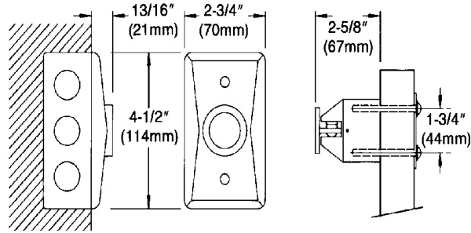
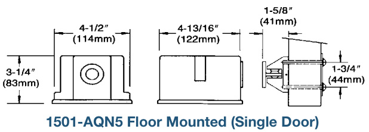
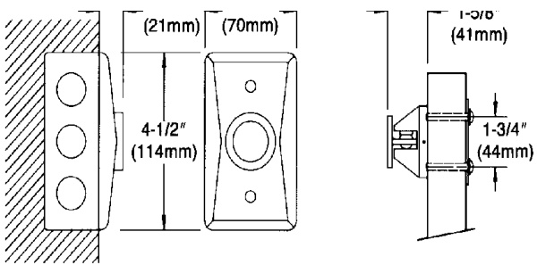
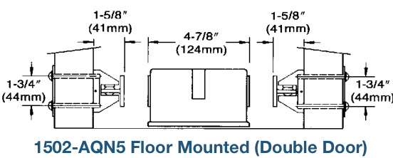
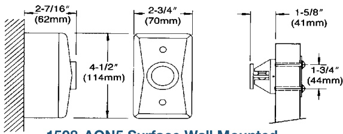
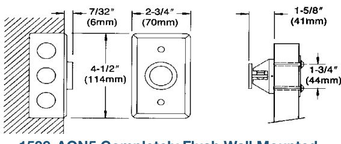
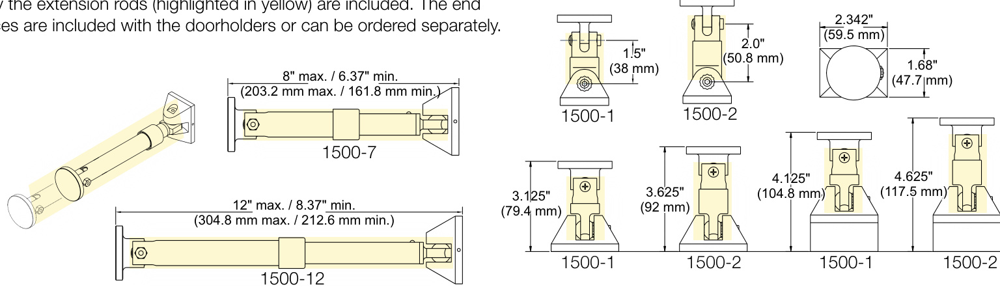

# Electromagnetic Door Holders  

# Overview  

EDWARDS Electromagnetic Door Holders are ruggedly constructed and attractively designed. The housing is finished with an aluminum color, durable baked polyester powder paint. The floor or wall section houses the electromagnet while the contact plate attaches to the door. The contact plate has a shock absorbing nylon (swivel) ball which allows the plate to adjust to any door angle. Floor units are available in single-door or double-door (back to back) versions. Wall units are available in flush or surface mounted versions.  

EDWARDS door releases should be installed wherever doors may be effectively used to confine smoke and fire, or where the release of a self-closing door from a remote location is desirable for other reasons.  

Fail-safe operation is an inherent feature of EDWARDS door holder-releases. If power fails, doors are released automatically but may be opened or closed manually at any time. All units are free of moving parts, are self-contained and require no maintenance.  

These door holder-releases have a holding force of approximately 15 to 25 Lbf (66 to 111N). The device holds a door open while energized. When de-energized by a relay controlled by the fire alarm system or other switch, the door is released to a closed position, checking the spread of smoke and flames. Electromagnetic door holders should be used and installed in accordance with local Building Codes and Standards.  

# Standard Features  

•	 Floor and wall mounted styles •	 Low power consumption AC/DC models •	 Completely silent operation •	 25 Lbf (111N) nominal holding force •	 Adjustable, swivel contact plate  

# Basic Models  

# Floor Mounted:  

The electromagnet portion consists of a floor plate and a floor housing which when installed with gaskets provided, form a weatherproof electrical junction box. Incoming conduit connects directly into floor plate.  

Floor mounted units are available with one (Cat. No. 1501) or two (Cat. No. 1502) magnet faces for holding a single door or two doors back to back.  

# Wall Mounted:  

Wall mounted models are available in flush, semi-flush and surface mounting configurations. Flush and semi-flush models are designed for concealed wiring applications and mount on standard single gang $\langle2\times4$ inch) outlet boxes. Surface mounted models mount on a surface adaptor housing (junction box), which is provided.  

# Dimensions  

  

1504-AQN5 Flush Wall Mounted (Long Catch Plate)  

  

  
1505-AQN5 Flush Wall Mounted (Short Catch Plate)  

  

  
1508-AQN5 Surface Wall Mounted  

  
1509-AQN5 Completely Flush Wall Mounted  

# Catch Plate Extensions  

  

Specifications   

<html><body><table><tr><td>ModelNo. Style</td><td></td><td>Volts</td><td>Amps*</td></tr><tr><td>1501-AQN5</td><td>FloorMounted (Single Door)</td><td rowspan="6">24Vac60Hz</td><td rowspan="6">.015</td></tr><tr><td>1502-AQN5</td><td>FloorMounted (Double Door)</td></tr><tr><td>1504-AQN5</td><td>FlushWallMounted (Long Catch Plate)</td></tr><tr><td>1505-AQN5</td><td>FlushWallMounted (Short Catch Plate) 24Vdc120Vac60Hz</td></tr><tr><td>1508-AQN5</td><td>SurfaceWallMounted</td></tr><tr><td>1509-AQN5</td><td>CompletelyFlushWallMounted</td></tr></table></body></html>

\*1502-AQN5 is a double unit which draws .015 per side  

Ordering Information  

<html><body><table><tr><td>Model No.</td><td>Description</td><td>Ship. Wt. Ib (kg)</td></tr><tr><td>1501-AQN5</td><td>FloorMounted (SingleDoor)</td><td>5.4 (2.45)</td></tr><tr><td>1502-AQN5</td><td>FloorMounted(DoubleDoor)</td><td>5.0 (2.27)</td></tr><tr><td>1504-AQN5</td><td>FlushWallMounted(LongCatchPlate)</td><td>2.0 (0.91)</td></tr><tr><td>1505-AQN5</td><td>FlushWallMounted(ShortCatchPlate)</td><td>2.0 (0.91)</td></tr><tr><td>1508-AQN5</td><td>SurfaceWallMounted</td><td>3.0 (1.36)</td></tr><tr><td>1509-AQN5</td><td>Completely FlushWall Mounted</td><td>2.0 (0.91)</td></tr><tr><td></td><td></td><td></td></tr><tr><td>Accessories</td><td></td><td></td></tr><tr><td>1500-1</td><td>Catchplateextensionassembly,1.5"</td><td>0.25 (0.11)</td></tr><tr><td>1500-2</td><td>Catchplateextensionassembly,2.5"</td><td>0.25 (0.11)</td></tr><tr><td>1500-7</td><td>Catchplateextensionassembly(5.25to7.5inches)</td><td>0.5 (0.23)</td></tr><tr><td>1500-12</td><td>Catchplateextensionassembly(7.5to12inches)</td><td>1.0 (0.45)</td></tr><tr><td>CS2595-5</td><td>Replacement armature-short(forusewith1501，1502,1505,1508and1509doorholders)</td><td>0.25 (0.11)</td></tr><tr><td>CS2598-5</td><td>Replacementarmature-long(forusewith1504doorholder)</td><td>0.25 (0.11)</td></tr></table></body></html>  

CAUTION: These Door Holder units will not operate without electrical power.  