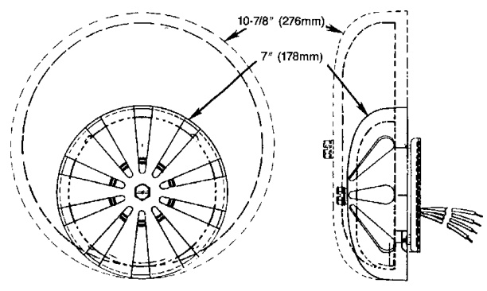

# Yard Hood  

The EDWARDS Cat. No. 390 Yard Hood provides complete protection of 6 inch (152mm), 8 inch (203mm) or 10 inch (254mm) bells which are mounted within it.  The Yard Hood prevents muffling of sound by snow or ice or by the accumulation of dust and leaves.  

With the use of the appropriate weatherproof box and weatherproof signal the 390 Yard Hood will give years of trouble-free operation outdoors in any weather.  

# Full Cast Grid  

The EDWARDS Full Cast Grid provides added protection against impact without adversely affecting the sound produced by the bell.  

The Grid is available in gray by adding the letter “G” to the catalog number of many of the EDWARDS bells (Eg. 340G-6N5). The Grid can be ordered in red for the 438 and 439 bells under the catalog numbers 439-6GR for 6 inch (152mm) bells, 439-10GR for 8 inch (203mm) and 10 inch (254mm) bells.  

# Grill  

Nearly every EDWARDS indicating device-bell, horn or chime can be installed behind an attractive flush mounted grill. The grill gives valuable protection against unauthorized personnel and damage by moving objects. The grill should be used wherever flush mounting is desired. Grilles are ideal for offices, reception areas, schools, shipping areas and any location where a projecting device might be damaged. The grill is finished in gray primer.  

The flush wall box which houses the bell, horn or chime and provides mounting brackets for the grill should be ordered separately. Refer to Grill & Box chart for the part numbers of the box.  

# Installation  

EDWARDS recommends that these accessories always be installed in accordance with the latest recognized editions of national and local fire alarm codes.  

  

<html><body><table><tr><td colspan="2">Cat. No.390 Yard Hood Dimensions</td></tr><tr><td>Height Width</td><td>Depth</td></tr><tr><td>15i inches (381mm) (276mm)</td><td>10-7/8inches 8-1/4 inches (210mm)</td></tr></table></body></html>  

  

<html><body><table><tr><td colspan="3">ProtectiveGridDimensions</td></tr><tr><td>For:</td><td>Diameter</td><td>Depth</td></tr><tr><td>4 inch (102mm)Bell</td><td>4-3/4inches (121mm)</td><td>2-1/4inches (57mm)</td></tr><tr><td>6 inch</td><td>7inches</td><td>2-7/16inches</td></tr><tr><td>(152mm)Bell</td><td>(178mm)</td><td>(62mm)</td></tr><tr><td>8 inch</td><td></td><td>2-7/8inches</td></tr><tr><td>(203mm) &10inch</td><td>10-7/8inches</td><td></td></tr><tr><td>(254mm)Bell</td><td>(276mm）</td><td>(73mm)</td></tr></table></body></html>  

  

<html><body><table><tr><td rowspan="2">Cat. No.</td><td rowspan="2">Capacity</td><td colspan="4">WallBox</td><td rowspan="2">Dimensions ofGrill E&D</td></tr><tr><td>Part No.</td><td>A</td><td>Dimensions B</td><td></td></tr><tr><td>511A</td><td>All 4 inch (102mm) BellsandHorns</td><td>P-029521</td><td>8 in (203mm)</td><td>8in (203mm)</td><td>3-7/8 in (98mm)</td><td>10 × 10 in (254mm×254mm）</td></tr><tr><td>512A</td><td>All6inch(152mm) Bells,Chimes and Horns</td><td>P-029522</td><td>10 in (254mm)</td><td>10 in (254mm)</td><td>4-1/4 in (108mm)</td><td>12×12 in （305mm×305mm）</td></tr><tr><td>513A</td><td>All8inch(203mm) and10 inch (254mm)Bells</td><td>P-029513</td><td>14 in (356mm)</td><td>14 in (356mm)</td><td>5 in (127mm)</td><td>16x16in (406mm×406mm)</td></tr></table></body></html>  