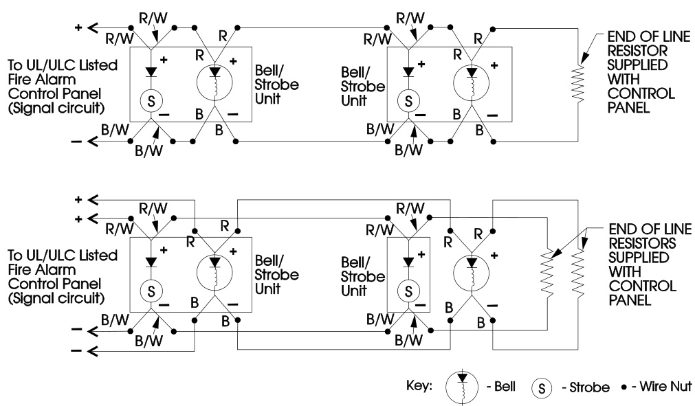
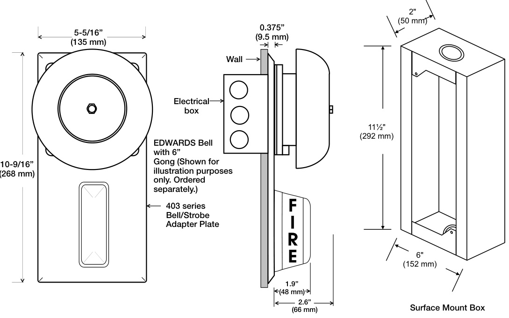
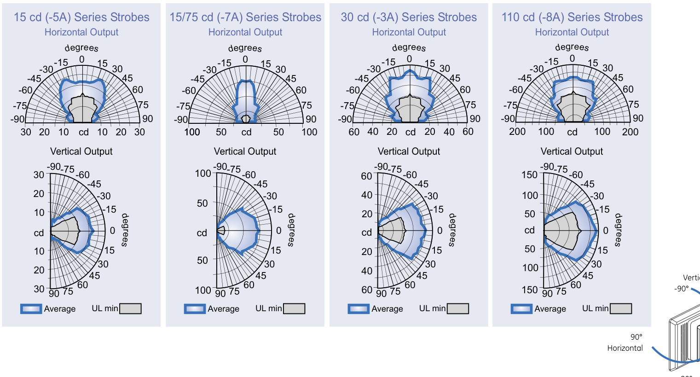

# Bell-Strobe Plate 403-3A, -5A, -8A  

# Overview  

EDWARDS 403 Series Bell-Strobe Plates are specially designed for use with compatible life safety communication and control equipment to alert the hearing impaired of a life safety event. Strobes are available with 15 cd, 15/75 cd, 30 cd, and 110 cd effective flash intensity. They are fully compatible with Genesis signals.  

As part of the Enhanced Integrity line of products, 403 series strobes exceed UL synchronization requirements (within 10 milliseconds other over a two-hour period) when used with a separately-installed G1M Signal Master or SIGA-CC1S Synchronization Module.  

The flash from 403 series strobes can be noticed from almost any position in the room, corridor, or large open space. Light dispersion is controlled with a specially shaped reflector that directs a minimum of 12 per cent of rated light output above and below the strobe, and a minimum of 25 per cent of rated light straight out both sides.  

403 Series strobes are designed for 16 to 33 Vdc operation and must be connected to signal circuits that output a constant (not pulsed) voltage. A diode is used to allow full signal circuit supervision and polarized connections are made to $7^{\circ}$ ($175\:\mathrm{mm})$ wire lead.  

The rugged steel plate with smooth bevelled edges is finished in a durable, high quality, baked red epoxy polyester powder-coat.  

# Standard Features  

Converts EDWARDS 439 model bells   
Ideal for renovation work; easily adapts to existing or new EDWARDS bells for conversion into Bell/Strobes. Mounts to North American one-gang, two-gang, octagon, and 4-inch square boxes.   
UL 1971-listed synchronizing strobe   
403 Series strobes synchronize to the latest UL 1971 requirements when used with an external control source.   
Genesis-compatible   
All Genesis and Integrity strobes on the same circuit meet UL 1971 synchronization requirements when used with an external control module.   
Approved for public and private mode applications   
UL 1971-listed as signaling devices for the hearing impaired and UL 1638-listed as protective visual signaling appliances. Rugged steel plate   
Strong CRS plate with durable baked red epoxy polyester powder-coat finish.   
Field changeable field markings   
Lens language or standard “FIRE” marking is easily changed with optional LKW series lens kits.  

# Application  

NOTE: The installation of visible and audible signals are subject to national and local standards, codes, and ordinances.   
Consult your Authority Having Jurisdiction for device installation requirements, application standards, and minimum performance specifications.  

# Bells  

Suggested sound pressure levels in each signaling zone for alarm or alert signals are at least 15 dB above the average ambient sound level or 5 dB above the maximum sound level having a duration of at least 60 seconds, whichever is greater, measured 1500mm above the floor. The average ambient sound level is the RMS, A-weighted sound pressure measured over a 24-hour period.  

# Strobes  

EDWARDS strobes are UL 1971-listed for use indoors as wallmounted public-mode notification appliances for the hearing impaired. Prevailing codes require strobes to be used where ambient noise conditions exceed specified levels, where occupants use hearing protection, and in areas of public accommodation. Consult with your Authority Having Jurisdiction for details.  

As part of the Enhanced Integrity line of products, 403 Series strobes exceed UL synchronization requirements (within 10 milliseconds other over a two-hour period) when used with a synchronization source.  Synchronization is important in order to avoid epileptic sensitivity.  

Integrity strobes are fully compatible with EDWARDS Genesis signals.  

NOTE: The flash intensity of some visible signals may not be adequate to alert or waken occupants in the protected area. Research indicates that the intensity of strobe needed to awaken $90\%$ of sleeping persons is approximately 100 cd. EDWARDS recommends that strobes in sleeping rooms be rated at at least 110 cd.  

WARNING: These devices will not operate without electrical power. As fires frequently cause power interruptions, further safeguards such as backup power supplies may be required.  

# Typical Wiring  

# SAME SIGNAL CIRCUIT  

The bell and strobe can be connected to the same signal circuit (as shown) if the circuit is configured for continuous signal operation. CAUTION:  Electrical supervision requires wire run to be broken at each device. Do not loop signal circuit field wires around the Bell/Strobe units leads.  

# SEPARATE SIGNAL CIRCUITS  

The bell and strobe can be connected to different signal circuits (as shown).  The strobe is designed to be used on circuits that output a constant voltage.  Do not connect strobe to a coded or pulsating voltage. CAUTION:  Electrical supervision requires wire run to be broken at each device. Do not loop signal circuit field wires around the Bell/Strobe units leads.  

  

# Installation and Mounting  

The 403 series bell/strobe plates install to a variety of standard, flush mounted, North-American electrical boxes. This includes one-gang, two-gang, 3-1/2 inch & 4 inch octagon, and 4 inch square. The plate must be installed along with EDWARDS’s model 439 series 6 inch (150 mm), 8 inch (200 mm), and 10 inch (250 mm) bells (order separately). The strobe must be connected to a signal circuit which outputs a constant (not pulsed) voltage; the bell can be connected to pulsed or continuous voltage circuits.  

EDWARDS recommends that these fire alarm bell/strobes always be installed in accordance with the latest recognized edition of national and local fire alarm codes.  

  
Light Distribution Patterns UL 1971 WALL MOUNTED STROBE LIGHT OUTPUT  

  

<html><body><table><tr><td>UL Rating</td><td>15cd</td><td>15/75cd</td><td>30cd</td><td>110cd</td></tr><tr><td>16Vdc</td><td>109</td><td>150</td><td>130</td><td>329</td></tr><tr><td>16Vfwr</td><td>150</td><td>210</td><td>189</td><td>420</td></tr><tr><td colspan="5"></td></tr><tr><td>Typical Current</td><td>15cd</td><td>15/75cd</td><td>30cd</td><td>110cd</td></tr><tr><td>24Vdc</td><td>69</td><td>90</td><td>89</td><td>180</td></tr><tr><td>24Vfwr</td><td>108</td><td>128</td><td>134</td><td>260</td></tr></table></body></html>

Vdc: Volts direct current, regulated and filtered Vfwr: Volts full wave rectified  

# Current Draw Notes and Comments  

1.	 Current values are shown in mA.   
2.	 UL Nameplate Rating can vary from Typical Current due to measurement methods and instruments used.   
3.	 EDWARDS recommends using the Typical Current for system design including NAC and Power Supply loading and voltage drop calculations.   
4.	 Use the 16 Vdc RMS current ratings for filtered power supply and battery AH calculations. Use the 16 Vfwr RMS current ratings for unfiltered power supply calculations.   
5.	 Fuses, circuit breakers and other overcurrent protection devices are typically rated for current in RMS values. Most of these devices operate based upon the heating affect of the current flowing through the device. The RMS current determines the heating affect and therefore, the trip and hold threshold for those devices.  

# Specifications  

<html><body><table><tr><td>Catalog Number</td><td>403-5A-R</td><td>403-7A-R</td><td>403-3A-R</td><td>403-8A-R</td></tr><tr><td>UL1638/ULCS526 Rated Strobe Output</td><td>15 cd</td><td>15/75cd</td><td>30 cd</td><td>110 cd</td></tr><tr><td>UL1971RatedStrobe</td><td>15 cd</td><td>15wall</td><td>30 wall 15 ceiling</td><td>110 wall</td></tr><tr><td>Output-candela (cd)</td><td colspan="3">(wall mount only) 15 ceiling Synchronized atoneflashpersecond.External control modulenecessarytomeet</td><td>60 ceiling</td></tr><tr><td>StrobeFlashRate</td><td colspan="3"></td><td></td></tr><tr><td>SynchronizationSources</td><td colspan="4">G1M-RM,SIGA-CC1S,SIGA-MCC1S,BPS6A,BPS10A</td></tr><tr><td>StrobeOperatingVolts</td><td colspan="3">16to33Vdc(Continuous)</td></tr><tr><td>OperatingEnvironment</td><td colspan="3">INDO0R:32-120°F(0-49°C)ambienttemperature.85%relativehumidity@30°C Supplied with LKW-1 “FIRE"red letters, vertical both sides (Wall Mount)- see LKW series for optional markings</td></tr><tr><td>Lens Markings</td><td colspan="3">Strobe 7 in (175 mm) color-coded polarized leads -2 INs/2 OUTs,Bell(see 439 series cat sheet)</td></tr><tr><td>Wire Connections</td><td colspan="3">Clear LEXAN</td></tr><tr><td>FlashTubeEnclosure StrobePlate,Finish</td><td colspan="3">CRS Steel-5-5/16 in x10-9/16 in(135 mm x 268 mm),red baked epoxy polyester powder-c0at finish</td></tr><tr><td>Mounting</td><td colspan="3">Fits over FLUSH mounted North-Americanboxes-One-gang & two-gang,3-1/2 inch& 4 inch octagon,4 inch square</td></tr><tr><td>Agency Listings</td><td colspan="3">UL1971,UL1638,ULCS526,CSFM,MEA,FM</td></tr><tr><td></td><td colspan="3"></td></tr></table></body></html>  

<html><body><table><tr><td>Cat. Number</td><td>Description</td><td>Ship Wt. Ib (kg)</td></tr><tr><td>403-5A-R</td><td>Bell-StrobePlate-15 cd,Red</td><td rowspan="5">2.0 (0.9)</td></tr><tr><td>403-7A-R</td><td>Bell-Strobe Plate - 15/75 cd,Red</td></tr><tr><td>403-3A-R</td><td>Bell-Strobe Plate - 30 cd, Red</td></tr><tr><td>403-8A-R</td><td>Bell-StrobePlate-110 cd,Red</td></tr><tr><td>403-SB</td><td>Surface box for 403, Red; 6" W x 111%2"H× 2" D (152 × 292 × 50mm) -- Canada only.</td></tr><tr><td colspan="4"></td></tr><tr><td>Synchronization Sources G1M-RM</td><td></td><td>0.2 (0.1)</td></tr><tr><td>SIGA-CC1S</td><td>Genesis Signal Master Remote Mount (1-gang) Synchronization Output Module(Standard Mount) -UL/ULC Listed</td><td>0.5 (0.23)</td></tr><tr><td>SIGA-MCC1S</td><td>Synchronization Output Module (UlO Mount) - UL Listed</td><td>0.18 (0.08)</td></tr><tr><td>BPS6A</td><td></td><td>13 (5.9)</td></tr><tr><td>BPS10A</td><td>6.5 AmpBooster Power Supply</td><td></td></tr><tr><td></td><td>10 AmpBoosterPowerSupply</td><td>13 (5.9)</td></tr><tr><td colspan="3"></td></tr><tr><td>Lens Marking Kits (see note 1) LKW-1</td><td>“"FIRE", Wall Orientation (supplied)</td><td rowspan="9">0.1 (.05)</td></tr><tr><td>LKW-1R</td><td>“FIRE",WallOrientation,RED</td></tr><tr><td>LKW-2</td><td>“FEU", Wall Orientation</td></tr><tr><td>LKW-3</td><td>“FIRE/FEU", Wall Orientation</td></tr><tr><td>LKW-4 LKW-5</td><td>"SMOKE",WallOrientation</td></tr><tr><td>"HALON", Wall Orientation</td><td></td></tr><tr><td>LKW-6 LKW-7</td><td>"CO2", Wall Orientation</td></tr><tr><td>LKW-8</td><td>“EMERGENCY",WallOrientation</td></tr><tr><td>LKW-9</td><td>“ALARM", Wall Orientation</td></tr><tr><td>*Add Suffix “W" to catalog no.for WHITE.(e.g. 757-7A-TW)I</td><td>“"FUEGO", Wall Orientation</td></tr><tr><td colspan="2"></td></tr></table></body></html>

Note 1 - Change “W” to “C” for CEILING mount. (e.g. LKC-1)  