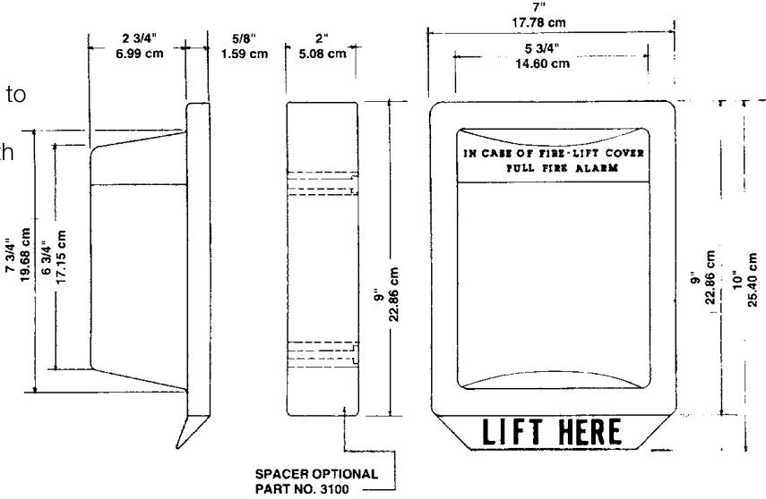
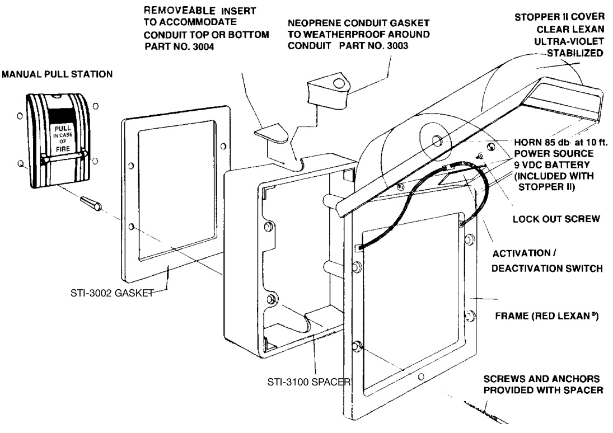

# STI Series Stopper® II  

# Overview  

This unique and patented device helps to prevent false fire alarms without restricting legitimate alarms. It consists of a tamper-proof, clear Lexan polycarbonate shield and frame that fits easily over manual pull stations. When lifted to gain access to the actual alarm, it sounds a piercing warning horn. Immediate attention is drawn to the pull station and a prankster will run or be caught. Legitimate alarms can still be pulled.  

Use proven in thousands of applications around the worldincluding colleges, schools, hospitals, nursing homes, correctional institutions, hotels/motels and stores.  

# Testing Approvals  

Stopper II has been tested and approved or listed by:   
•	 Underwriter Laboratories No. 49G2   
•	 Underwriter Laboratories of Canada Issue No. 13959C   
•	 Factory Mutual No. OG6A2.AY   
•	 New York City Board of Standards No. 947-81-SA   
•	 State of California (approval not required)   
•	 General Service Administration  

# Standard Features  

•	 Fits virtually all pull stations Tested and approved by wide range of fire prevention and testing authorities   
Unconditional lifetime guarantee against breakage and damage to molded polycarbonate cover   
•	 Guards against physical damage to manual pull station   
•	 Weatherproofing option Optional 9-volt alkaline battery (included) powered horn  

# Dimensions  

# Size of Pull Station Accommodated  

The Stopper II can be installed over a flush-mounted station up to $5\%$ inches (140mm) wide $\times\,6\%$ inches (171mm) high. However, the pull station’s maximum dimensions will decrease as its depth (distance from wall) increases. e.g.:  

$3\%$ inch (19mm) deep pull station may be 5 inches (140mm) wide x 6 inches(152mm) high 1-5/8 inch (41mm) deep pull station may be 5 inches (127mm) wide x 6 inches (152mm) high 2-3/8 inch (60mm) deep pull station may be 4 inches (102mm) wide $x\,5$ inches(146mm) high 2 inch (70mm) deep pull station may be 3 inches (76mm) wide $\times\,5$ inches (140mm) high NOTE: If additional depth is needed, use the Conduit Spacer (Part No. STI 3100) which adds 2 inches (51mm) to the depth.  

# Patent Approval  

Stopper II has received patent approval from the United States (No. 4267549) and Canada (No. 1147828Z). Patents for other countries are pending.  

# Mounting  

Two types of mounting are available. Flush-mounted means the pull station is mounted directly on the wall. Surface-mounted means the pull station is mounted on an electrical box away from the wall.  

Surface Mounted: When the pull station is mounted on an electrical box away from the wall, order Part No. STI 1130 (with horn) or Part No. STI 1230 (without horn). Each includes longer screws with anchors and a 2 inch (51mm) conduit spacer (Part No. STI 3100) with knockouts top and bottom to accommodate the conduit pipe.  

# For Added Weatherproofing  

Install gasket (STI 3002) between Stopper Il frame and wall. A second gasket must be installed behind the spacer for surface mounting. A conduit gasket (STI 3003) may be used to seal the conduit pipe.  

  

  

# IMPORTANT NOTICE  

Adequate training and instruction must be provided to avoid the pos  
sibility that persons, in the event of a real fire, lift the Stopper II cover,   
hear the horn and think they have set off the fire alarm.   
1.	 Explain the purpose of the Stopper II to authorized personnel.   
2.	 Show them how it works.   
3.	 Instruct them to, upon hearing the Stopper II horn, check for the presence of a fire, and act accordingly by either pulling the fire alarm or shutting off Stopper II by closing the cover.   
4.	 Check with your local fire authorities.   
5.	 When covering a pull station, UL requires stations to be listed for outdoor use.  

<html><body><table><tr><td>Catalog Number</td><td>Description</td><td>Ship Wt. Ibs (kg)</td></tr><tr><td>*STI-1100</td><td>Stopper lIl withHorn(UL/ULC)-Flush</td><td rowspan="4">1.3 (0.6)</td></tr><tr><td>*STI-1130</td><td>StopperIlwithHorn(UL/ULC)-Surface</td></tr><tr><td>*STI-1200</td><td>StopperllwithoutHorn-Flush</td></tr><tr><td>*STI-123O</td><td>StopperIlwithoutHorn-Surface</td></tr><tr><td>*STI-1250</td><td>WeatherStopper,flushc/wgasket(STl-3002)</td><td>1.3 (0.6)</td></tr><tr><td>*STI-3150</td><td>WeatherStopper, surface,c/w gaskets(STi- 3002x2),2"Spacer(STl-3100) and conduit gasketkit</td><td>1.3 (0.6)</td></tr></table></body></html>  

<html><body><table><tr><td colspan="2">Accessories</td></tr><tr><td>STI-3100 STI-3002</td><td>2 inch(50mm)S Spacer 0.5 (0.2)</td></tr><tr><td>Weatherproofing Gasket Weatherproofing</td><td>gConduitGasket 0.2 (0.1)</td></tr><tr><td>STI-3003 STI-3004 ConduitInsert</td><td></td></tr><tr><td>STI-1280</td><td>Black plate for rough wall mounting</td></tr><tr><td></td><td></td></tr></table></body></html>

\*Suffix “F” for French labelled model  