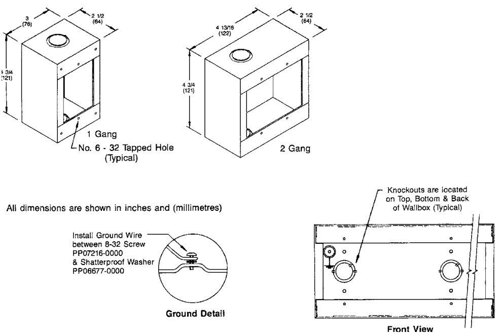

# Surface Mount Boxes 27193 Series - Gang Type  

# Overview  

EDWARDS 27193 Series Surface Mount Boxes are multi-gang utility boxes designed for surface mounting where a heavy-duty general purpose box is required. Devices can be mounted to predrilled and tapped (#6-32) holes in standard one-gang to five-gang mounting configurations.  

The 27193 boxes are finished in a durable baking enamel and are available in two standard colors: white versions are available for easy custom finishing to match the decor on site.  

They are constructed from heavy duty 16 gauge cold rolled steel (CRS) for maximum durability. The 27193 boxes are easily surface mounted with screws using the mounting holes provided in the back of the box. All boxes are provided with convenient combination 1/2 inch and 3/4 inch conduit knockouts on the top, bottom and rear side. Each box also includes a grounding provision.  

# Standard Features  

One to five gang   
•Fire red or bright white   
•Durable baked finish   
•Sturdy steel one-piece construction Grounding provision   
•Combination $\%$ inch $\&\,\%$ inch knockouts  

# Application  

These surface mount boxes are suited for a variety of uses including:  

End-of-Line Resistors One-gang Fire Red Manual Pull Stations Halon Discharge Stations $\mathsf{C O}_{2}$ Discharge Stations Two-gang White Signature Series Modules One-gang White Signature Series Modules  

# Dimensions  

  

# Ordering Information  

<html><body><table><tr><td>Color/Finish</td><td>1-gang</td><td>2-gang</td></tr><tr><td>FireRed</td><td>27193-11</td><td>27193-21</td></tr><tr><td>BrightWhite</td><td>27193-16</td><td>27193-26</td></tr><tr><td>27193-11-NY</td><td colspan="2">Red single-gang surface box without bottom knockout, for New York CitySchool Construction Authority</td></tr><tr><td colspan="2"></td><td></td></tr><tr><td>BoxSize</td><td>1-gang</td><td>2-gang</td></tr><tr><td>Ship Weight - Ibs. (kg)</td><td>1 (0.4)</td><td>2 (0.8)</td></tr></table></body></html>  