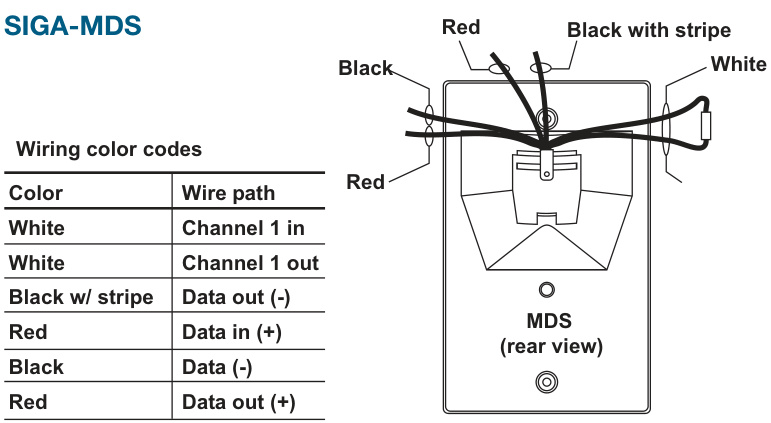

# PIR Motion Detector SIGA-MD, SIGA-MDS  

# Overview  

The SIGA-MD is a Passive Infrared (PIR) motion detection module that connects directly to the Signature loop. The module uses adaptive signal processing with gliding focus mirror optics to analyze the size, speed and shape to determine the alarm threshold. A tamper switch notifies the host system when the cover is removed.  

The SIGA-MD is designed for flat wall or corner mounting. The SIGA-MDS is designed for single gang box mounting. Curtains and masks are provided. These can be used to adjust the motion sensor’s coverage pattern to suit the application.  

The intelligence built into every SIGA-MD means that the module can decide when to report information and when to suppress sending information to the host system. As an example, when the SIGA-MD module is disarmed, changes of state that would normally create an alarm are recognized by the module and sent to the host as a background task. This enhances reponse time by removing the burden of normal room activity on the network. Should a trouble or tamper condition be detected these events are immediately transmitted to the host helping to ensure system integrity is maintained. Once the module is armed, alarms are sent immediately to the host.  

The SIGA-MD is housed in a small Cycoloy® enclosure designed for surface mounting in a fixed position. The SIGA-MDS comes with a swivel mounting bracket for mounting to a single-gang electrical box. Wiring terminals are provided for 16 to 22 AWG  (1.0 $\mathsf{m m}^{2}$ to $0.25\;\mathrm{mm}^{2}$ ) wires.  

When the cover is removed, the unit generates a tamper signal and automatically goes into alignment mode. In alignment mode, the unit’s LED activates when motion is detected. This allows the installer to verify that the device’s position and masks are optimally adjusted for the protected area.  

# Standard Features  

•	 Range up to 34ft $:10.6\;\mathsf{m})$   
•	 Field of view $90^{\circ}$ Up to seven curtain configurations   
•Small aesthetic enclosure Automatic device mapping   
•Electronic addressing Intelligent device with microprocessor   
•	 Diagnostic LEDs for service   
•	 Alignment (walk-test) mode  

# Personality Codes  

The Motion Detector requires a Signature loop controller to download the personality codes that determine how it will operate. The first channel is user-definable to eight different personalities. The second channel is factory configured for the motion detector. The user-definable personality codes are described below.  

# Personality Code 3: Normally Open Active - Non-Latching (Factory Default)  

Personality code 3 configures the Motion Detector channel 1 for use with Class B, normally-open (N/O) contact devices (e.g. Guard tour). When the N/O contact of the device is closed, an active signal is sent to the loop controller. The active status is non-latching and clears when the N/O input is returned to the open condition. The panel will report an open circuit as a trouble condition.  

# Personality Code 41: Security Open with Tamper  

Personality code 41 configures the Motion Detector channel 1 for devices that use a Class B, N/O contact for security conditions and a Class B, normally-closed (N/C) contact for tamper conditions. When the N/O contact is closed, an active signal is sent to the loop controller; similarly, when the N/C contact is opened, a tamper signal is sent to the loop controller.  

# Personality Code 42: Security Closed with Tamper  

Personality code 42 configures the Motion Detector channel 1 for devices that use a Class B, N/C contact for security conditions and a Class B, N/O contact for tamper conditions. When the $\mathsf{N}/\mathsf{C}$ contact is opened, an active signal is sent to the loop controller; similarly, when the $\mathsf{N}/\mathsf{O}$ contact is closed, a tamper signal is sent to the loop controller.  

# Personality Code 43: Basic Security  

Personality code 43 configures the Motion Detector channel 1 for devices that use a Class B, N/C contact and/or a Class B, N/O for security conditions. When the N/C contact is opened or the N/O contact of the device is closed, an active signal is sent to the loop controller.  

# Personality Code 44: Tamper  

Personality code 44 configures the Motion Detector channel 1 for devices that use a Class B, N/C contact and/or a Class B, N/O for tamper conditions. When the N/C contact is opened or the N/O contact is closed, a tamper signal is sent to the loop controller.  

# Personality Code 45: Security Open  

Personality code 45 configures the Motion Detector channel 1 for use with a Class B, N/O contact. When the N/O contact is closed, an active signal is sent to the loop controller. The panel will report an open circuit as a fault condition.  

# Personality Code 46: Security Closed  

Personality code 46 configures the Motion Detector channel 1 for use with a Class B, N/C contact. When the N/C contact is opened, an active signal is sent to the loop controller. The panel will report a short circuit as a fault condition.  

# Personality Code 48: Security - Maintenance  

Personality code 48 configures the Motion Detector channel 1 for devices that use a Class B, N/C contact or a Class B, N/O contact for maintenance conditions (e.g. a motion detector with a separate maintenance contact). When the $\mathsf{N}/\mathsf{C}$ contact is opened or the N/O contact is closed, a maintenance signal is sent to the loop controller.  

# Compatibility  

The SIGA-MD and SIGA-MDS are compatible only with the EST3 Signature loop controllers, and require two Signature addresses.  

# Engineering Specification  

The Passive Infrared Motion Detector shall utilize adaptive signal processing with gliding focus mirror optics to analyze the size, speed and shape to determine the alarm threshold. The unit shall be configurable for up to seven different curtain patterns, have a range of up to 34 ft (10.6m) and a $90^{\circ}$ field of view.  

The unit shall wire directly to the same intelligent device loop as the intelligent fire detection and control where permitted by the authority having jurisdiction, facilitating total integration of the fire and security functions by the system. The PIR motion detector shall not require power from an external source. All motion detector addressing shall be electronic, jumpers or DIP switches shall not be considered as equivalent to electronic addressing. Removing the cover shall automatically activate the tamper switch and put the unit in the alignment mode.  

The unit shall be constructed of a thermoplastic housing with integral (removable) cover and integral tamper switch. The motion detector shall be suitable for mounting directly on a finished wall. All wiring terminations shall be to an integral terminal strip or to wire pigtails when mounting to single-gang electrical boxes.  

# Application  

The SIGA-MD may be mounted in a corner or on a flat wall up to 10 ft (3 m) above the finished floor. The SIGA-MDS mounts to a single-gang electrical box and comes with a swivel mounting bracket.  

Because the SIGA-MD and SIGA-MDS are security devices, the automatic Signature like-device replacement operation differs from that of fire devices. To prevent a swapped detector from compromising the system, the panel will display a map fault until the new device is redefined as a valid part of the system.  

  

  
SWIGIAR-IMND  

  

  

# Specifications  

# Note:  

<html><body><table><tr><td>Model</td><td>SIGA-MD</td><td>SIGA-MDS</td></tr><tr><td>Mounting</td><td>Mounts directly to a flat wall orcorner 6 to 10 ft (1.8 to 3 m) above floor</td><td>Mounts to single-gang electrical box 6 to 10 ft (1.8 to 3m) above floor</td></tr><tr><td>Mounting Base</td><td>Fixed</td><td>Swivel</td></tr><tr><td>Wire Size</td><td>16AWG to22AWG (1.0mm2 to 0.25mm2)</td><td>Pig Tails supplied</td></tr><tr><td>Dimensions (HWD)</td><td>4.75 x 2.75 x 2 in (12 x6.9x5 cm)</td><td>5.25 x2.75x 3.85 in (13 x6.9 x 9.6 cm)</td></tr><tr><td>Agency Listings</td><td colspan="2">UL, ULC. See Note.</td></tr><tr><td>Range</td><td colspan="2">Up to 34 ft (10.6 m)</td></tr><tr><td>Patterns</td><td colspan="2">Full, right, left and center</td></tr><tr><td>Curtains</td><td colspan="2">Up to 7</td></tr><tr><td>Field of View</td><td colspan="2">.06</td></tr><tr><td>Current Draw</td><td colspan="2">Standby: 600 μA; Active: 700 μA</td></tr><tr><td>Environment</td><td colspan="2">32°to 120°F(0°to 49°C)</td></tr><tr><td>Addressing</td><td colspan="2">Two Signature Module addresses</td></tr><tr><td>Personality Code</td><td colspan="2">41 - Normally open with tamper</td></tr><tr><td>Construction</td><td colspan="2">WhiteCycloyThermoplastic</td></tr><tr><td>Software Compatibility</td><td colspan="2">EST3V3.0or greater</td></tr></table></body></html>

The EST3 is modularly listed under the following standards: UL 864 categories: UOJZ, UOXX,  UUKL and SYZV, UL 294 category ALVY, UL 639 category ANSR, UL 609 category AOTX, UL 636 category ANET, UL 1076 category APOU, UL 365 category APAW, UL 1610 category AMCX, UL 1635 category AMCX ULC-S527, ULC-S301, ULC-S302, ULC-S303, ULC-S306, ULC/ORD-C1076, ULC/ ORD-C693 Please refer to EST3 Installation and Service Manual for complete system requirements.  

# Ordering Information  

<html><body><table><tr><td>Catalog Number</td><td>Description</td><td>ShippingWt., Ib (kg)</td></tr><tr><td>SIGA-MD</td><td>PassiveInfraredMotionDetector</td><td>0.5 (0.23)</td></tr><tr><td>SIGA-MDS</td><td colspan="2">PassiveInfraredMotionDetectorwithswivelmount</td></tr></table></body></html>  