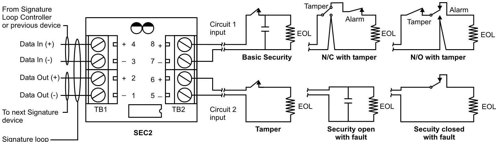

# Dual Input Security Module SIGA-SEC2  

# Overview  

The SIGA-SEC2 is an intelligent analog addressable device used to connect one or two normally-open or normally-closed dry contact security circuits.  

The actual function of this module is determined by the “personality code” selected by the installer. This code is downloaded to the module from the Signature loop controller during system configuration. The input module gathers information from the devices connected to them and converts it into digital signals. The module’s on-board microprocessor analyzes the signal and decides whether or not to input an alarm, tamper, or maintenance condition.  

The intelligence built into every SIGA-SEC2 means that the module can decide when to report information and when to suppress sending information to the host system. As an example, when the SIGA-SEC2 module is disarmed, changes of state that would normally create an alarm are recognized by the module and sent to the host as a background task. This enhances reponse time by removing the burden of normal room activity on the network. Should a trouble or tamper condition be detected these events are immediately transmitted to the host helping to ensure system integrity is maintained. Once the module is armed, alarms are sent immediately to the host.  

The module is housed in a small attractive thermo-plastic enclosure designed for surface mounting. Wiring terminals are provided for up to 16 AWG $(1.00\;\mathrm{mm^{2}})$ to 22 AWG $(0.25\;\mathrm{mm^{2}})$ wires.  

# Standard Features  

Two input circuits Suitable for doors, windows and other locally-powered security devices such as motion detectors, etc.   
Small aesthetic enclosure Multiple applications Automatic device mapping   
•Electronic addressing Intelligent device with microprocessor   
•Non-volatile memory   
•	 Diagnostic LEDs for service   
•	 Designed in accordance with ISO 9001 Quality System  

# Application  

The duty performed by the SIGA-SEC2 is determined by its personality code. SIGA-SEC2 provides two security circuits, each circuit can be assigned a personality code. The SIGA-SEC2 is ideal for connection to door contacts, motion detectors, glass break detectors or any sensor offering dry contact alarm, trouble, or tamper contacts.  

NORMALLY OPEN w/TAMPER (Personality code 41, Security) – Assign to one or both circuits. Configures circuit 1 or 2 or both to transmit a security alarm condition when the input circuit is shorted and transmit a tamper condition when the circuit is opened. Outputs are non-latching.  

NORMALLY CLOSED w/TAMPER (Personality code 42, Security) - Assign to one or both circuits. Configures circuit 1 or 2 or both to transmit a security alarm condition when the input circuit is opened and transmit a tamper condition when the circuit is shorted. Outputs are non-latching.  

BASIC SECURITY (Personality code 43) - Assign to one or both circuits. Configures circuit 1 or 2 or both to transmit an alarm condition when the input circuit is opened or shorted. Outputs are non-latching.  

TAMPER (Security Personality code 44) - Assign to one or both circuits. Configures circuit 1 or 2 or both to transmit a tamper condition when the input circuit is opened or shorted. For use in conjunction with another circuit used to detect security alarm condition. Outputs are non-latching.  

MAINTENANCE (Security Personality code 48) - Assign to one or both circuits. Configures circuit 1 or 2 or both to transmit a maintenance condition when the input circuit is opened or shorted. For use with device such as a motion detector providing a separate maintenance contact indicating the device is operational but requires service. Outputs are non-latching.  

NORMALLY OPEN w/TROUBLE (Personality code 3, Active – Non Latching) - Assign to both circuits. Configure both circuits to transmit an active condition when the input circuit is shorted and transmit a trouble condition when the circuit is opened.  

SECURITY OPEN w/FAULT (Personality code 45) - Assign to one or both circuits. Configures circuit 1 or 2 or both to transmit a security alarm condition when the input circuit is shorted and transmit a fault condition when the circuit is opened. Outputs are non-latching.  

SECURITY CLOSED w/FAULT (Personality code 46, Security Closed) - Assign to one or both circuits. Configures circuit 1 or 2 or both to transmit an alarm condition when the input circuit is opened and transmit a fault condition when the circuit is shorted. Outputs are non-latching.  

# Installation  

The SIGA-SEC2 should be mounted in the protected space, and in close proximity to the device it is monitoring.  

Electronic Addressing – The loop controller electronically addresses each module, saving valuable time during system commissioning. Setting complicated switches or dials is not required. Each module has its own unique serial number stored in its on board memory. The loop controller identifies each device on the loop and assigns a “soft” address to each serial number used by the systems.  

# Compatibility  

The SIGA-SEC2 is compatible with the EST3 Signature loop controllers, and requires two Signature addresses.  

# Engineering Specifications  

Provide intelligent dual input security modules at the locations shown on the drawings. The Dual Input Security Module shall provide two (2) input circuits each capable of a minimum of 6 personalities, each with a distinct operation. The module shall have an aesthetically pleasing enclosure for unobtrusive mounting in visible areas, and shall be capable of being directly surface mounted without the need for an electrical box.  

The dual input security module shall support the following circuit configurations:  

·	 Security Open w/Tamper (short sends security alarm, open   
sends tamper) 41   
·	 Security Closed w/Tamper (open sends security alarm, short   
sends tamper) 42   
·	 Basic Security (open or short sends security alarm) 43   
·	 Security Tamper (open or short sends tamper) 44   
·	 Security Open (short sends active, open sends fault) 45   
·	 Maintenance (open or short sends maintenance) 48   
·	 Active Non-Latching (short sends active, open sends trouble) 3   
Security Closed (open sends active, short sends fault) 46  

The Dual Input Security Module shall be a EDWARDS model SIGASEC2.  

  

# Signature Series Overview  

The Signature Series intelligent analog-addressable system from EDWARDS is an entire family of multi-sensor detectors and mounting bases, multiple-function input and output modules, network and non-network control panels, and user-friendly maintenance and service tools. Analog information from equipment connected to Signature devices is gathered and converted into digital signals. An onboard microprocessor in each Signature device measures and analyzes the signal and decides whether or not to input an alarm. The microprocessor in each Signature device provides four additional benefits – Self-diagnos-tics, Automatic Device Mapping and Fast, Stable Communication.  

Self-diagnostics and History Log – Each Signature Series device constantly runs self-checks to provide important maintenance information. The results of the self-check are automatically updated and permanently stored in its non-volatile memory. This information is accessible for review any time at the control panel, PC, or using the SIGA-PRO Signature Program/Service Tool. The information stored in device memory includes:  

•	Device serial number, address, and type •	Date of manufacture and hours of operation¹ •	Most recent trouble code logged by the device — 32 possible trouble codes may be used to diagnose faults.  

Automatic Device Mapping –The Signature Data Controller (SDC) learns where each device’s serial number address is installed relative to other devices on the circuit. The SDC keeps a “map” of all Signature Series devices connected to it. The Signature Series Data Entry Program also uses the mapping feature. With interactive menus and graphic support, the wired circuits between each device can be examined. Layout or “as-built” drawing information showing branch wiring (T-taps), device types and their address are stored on disk for printing hard copy. This takes the mystery out of the installation. The preparation of “as-built” drawings is fast and efficient.  

Device mapping allows the Signature Data Controller to discover: •	Unexpected additional device addresses   
•	Missing device addresses   
•	Changes to the wiring in the circuit.  

Most Signature modules use a “personality code” selected by the installer to determine their actual function. Personality codes are downloaded from the System Definition Utility (SDU) during system configuration and are indicated during device mapping.  

Fast Stable Communication – Built-in intelligence means less information needs to be sent between the device and the Signature Data Controller (SDC). Other than regular supervisory polling response, Signature devices only need to communicate with the SDC when they have something new to report. This provides very fast control panel response and allows a lower baud rate (speed) to be used for communication on the circuit. The lower baud rate offers several advantages including:  

•	Less sensitivity to circuit wire characteristics.   
•	Less sensitivity to noise glitches on the cable.   
•	Less emitted noise from the data wiring.   
•	Twisted or shielded wiring is not required.  

Testing & Maintenance – Automatic self-diagnosis identifies when a Signature device is defective and causes a trouble message. The user-friendly maintenance program shows the current state of each device and other pertinent information. Single devices may be turned off temporarily, from the control panel.  

Quality and Reliability – EDWARDS Signature devices are manufactured in North America to strict international ISO 9001 standards. All electronics utilize surface mount technology (SMT) for smaller size and greater immunity to RF noise. A conformal coating is used for humidity and corrosion resistance.  

¹ Retrievable with SIGA-PRO programming tool.  

Specifications   

<html><body><table><tr><td>AgencyListings</td><td>UL, ULC. See Note.</td></tr><tr><td>Dimensions</td><td>17/8"×3"×1"</td></tr><tr><td>(HWD)</td><td>(4.52cmx7.62cmx2.54cm)</td></tr><tr><td>WireSize Mounting</td><td>16AWG(1.0mm2) to22AWG (0.25mm2)</td></tr><tr><td>Finish</td><td>Surface mount directly on wall or in a 4"square electrical box WhiteCycoloy</td></tr><tr><td>Operating</td><td>30°F t0 120°F (0°C to 49°C).</td></tr><tr><td>Environment</td><td>Oto93%Humiditynon-condensing.</td></tr><tr><td>CurrentDraw</td><td>Standby:720μA;Tamper/Active:850μA</td></tr></table></body></html>  

# Note:  

The EST3 is modularly listed under the following standards:   
UL 864 categories: UOJZ, UOXX, UUKL and SYZV, UL 294 category ALVY, UL 609 category AOTX, UL 636 category ANET, UL 1076 category APOU, UL 365 category APAW, UL 1610 category AMCX, UL 1635 category AMCX ULC-S527, ULC-S301, ULC-S302, ULC-S303, ULC-S306, ULC/ORDC1076, ULC/ORD-C693. Please refer to EST3 Installation and Service Manual for complete system requirements.  

# Ordering Information  

<html><body><table><tr><td>Catalog Number</td><td>Description</td><td>Shipping Wt. Ib (kg)</td></tr><tr><td>SIGA-SEC2</td><td>Dual Input Security Module</td><td>0.4 (0.15)</td></tr></table></body></html>  