# Releasing Module SIGA-REL  

# Overview  

The SIGA-REL is an analog addressable module that communicates directly with the fire alarm panel Signature loop controller. The SIGA-REL controls sprinkler, pre-action and deluge systems, and may also be used to release extinguishing agents such as $\mathrm{CO}_{2}$ , Halon, or foam. The module is easily configured in the field and offers a wide range of options that ensure dependable service, while preventing the unnecessary release of extinguishing agent.  

In addition to being an intelligent network component, the SIGA-REL interfaces with a number of conventional devices. These provide manual actuation of abort, release, and service disconnect functions. Together with the SIGA-REL, they comprise a complete fire suppression package. There is no need for a separate releasing panel because the SIGA-REL takes full advantage of the existing control panel communications infrastructure. This ensures low-cost installations with all the benefits of Signature Series analog initiation and control.  

Seven on-board circuits provide added flexibility. Each SIGA-REL hosts:  

•Two supervised Class B release circuits   
•Two supervised Class B pre-release NACs One supervised Class B manual release input circuit (latching) One supervised Class B abort circuit for normally-open abort switch (non-latching) One first alarm output relay (Form C contact)  

The SIGA-REL also includes a series of built-in timers that determine the duration of abort routines and release sequences. These timers are easily configured in the field and provide a highly flexible range of options.  

# Standard Features  

Ideal for sprinkler, pre-action and deluge systems   
Suitable a wide range of sprinkler applications and extinguishing agents such as CO2 and Halon.   
Built-in timers   
Selectable durations for abort, manual, and automatic delays. Four abort modes   
Field-configurable abort routines determine how the timers operate when the abort function is initiated.   
Supervised circuitry you can rely on   
Two Class B release circuits and two pre-release circuits provided.   
Manual operation keeps ultimate control in plain view The SIGA-REL features a manual release input circuit as well as a manual abort input circuit.   
Fully automated response leaves nothing to chance This module’s Form C relay is ideal for room preparation routines.   
Automatic device mapping simplifies installation   
Signature modules transmit directly to the loop controller their circuit locations with respect to other Signature devices on the wire loop.  

# Application  

# Understanding fire suppression  

Fire suppression today is an important part of a growing number of life safety installations. With an ever-increasing reliance on mission-critical computer systems and record high capital investment in high-tech production facilities, businesses large and small are looking for a means of protecting their investments and ensuring a fire won’t cripple their operations.  

While fire detection remains the first line of defense against the risks of fire to people, building owners are looking to fire suppression as a means of protecting their property and assets.  

But it’s a well known fact that fire suppression is a double-edged sword: water can snuff out a mission-critical computer system as easily as it can a fire. Alternatives to water, including carbon dioxide and other extinguishing agents can endanger lives, while the release of even the most inert extinguishing agents can disrupt operations and cost millions of dollars in down-time and lost production.  

A primary goal of any fire suppression system is to prevent the release of extinguishing agent unless it is absolutely necessary. There is no margin for error. But no matter what measures are taken to prevent the unwanted release of extinguishing agent, the fact remains that no suppression system is any better than the detectors it relies on for input. The foundation of an effective suppression system, therefore, rests firmly on the quality and reliability of its smoke detectors.  

Signature Series detectors form an integral part of the suppression system built around the SIGA-REL releasing module. These detectors provide unsurpassed reliability and immunity from false alarms. The SIGA-REL is engineered to the same exacting standards of quality and performance. With a robust set of features designed to eliminate any unwanted release of extinguishing agent, the SIGA-REL provides all the benefits of a dedicated releasing panel without the extra expense, and equally important, all the proven advantages of the Signature Series family of products.  

# Understanding the SIGA-REL  

The SIGA-REL Releasing Module is a network component that provides control for fire suppression routines. It fulfils much the same purpose as a standalone releasing panel, but supports Signature Series detectors as an integral part of the suppression system. The SIGA-REL is easy to set up and accepts programming via the control panel’s SDU Rules Editor.  

The diagram below represents typical application of the SIGA-REL. The explanations that follow summarize each element of the module.  

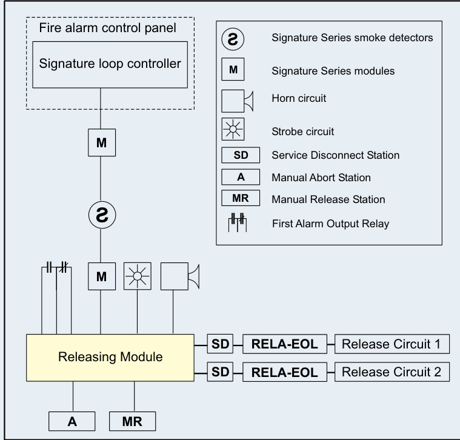  
Release Circuits. The SIGA-REL includes two supervised release circuits, each of which provides fire suppression control to different areas of a protected space. The releasing circuits actuate solenoids on the suppression agent tanks according to pre-defined release routines. These solenoids release the agent into the protected area. Both circuits operate together.  

First Alarm Relay. This on-board relay provides a Form C contact that activates at the first alarm input or manual release. The relay is typically used for room preparation such as controlling fans and dampers in advance of the release of suppression agent.  

Pre-release. Pre-release circuits are used to provide power to notification appliances located within the protected are. Two supervised pre-release circuits are provided: one (steady) for visual notification appliances, and one (pulsed) for audible notification appliances. The pre-release circuits activate with the start of the automatic delay timer.  

Manual Release. The manual release circuit is used to activate the suppression system by means of a connected normallyopen release station. This initiates the manual release sequence according to a pre-defined routine. The manual release circuit is supervised and latching. Input from this circuit is processed at the module – communication with the control panel is not necessary.  

Abort. The abort circuit is used to prevent the release of agent into the protected area after the release sequence has begun, but before the automatic delay timer expires. A connected normally-open release station provides manual control over this circuit. The abort circuit is supervised and non-latching.  

Service Disconnect. The service disconnect switch is used to temporarily disable the fire suppression system. There is no dedicated circuit for this switch. Instead, it is installed on both release circuits between the SIGA-REL and the RELA-EOL end-of-line relay. Opening the Service Disconnect Switch allows the fire alarm system to be tested without activating the fire suppression system. The operation of this switch causes a trouble signal at the control panel.  

Data. The Signature data circuit provides an input and an output to the data loop that communicates with the Signature loop controller at the control panel. The SIGA-REL resides on the same data loop as the Signature Series detectors that initiate the automatic release sequence. This close association offers the most reliable performance and ensures compliance with prevailing life safety codes.  

Power. The SIGA-REL requires 24 Vdc (power limited). See the specification table for details.  

The SIGA-REL has several built-in safeguards to prevent the unwanted release of extinguishing agent. All release sequences are subject to configurable delay timers that provide the opportunity for an occupant of the area to manually abort the release sequence. If no abort signal is received before the delay timer expires, the suppression agent is released.  

The SIGA-REL includes three delay timers: one for manual release sequences (up to 30 seconds); one for automatic release sequences (up to 50 seconds); and one for abort sequences (10 seconds).  

# Normal State  

In its normal operating state the SIGA-REL supervises both of its release circuits and both of its pre-release NAC circuits for faults. Should a short or open occur on any of these circuits, a Trouble condition is reported to the control panel.  

A trouble condition on any of these circuits may prevent the operation of that circuit, but it won’t inhibit the operation of any other fault-free circuit.  

# Manual Release Sequence  

The operation of a manual release station initiates the manual release sequence. The diagram below outlines the manual release sequence.  

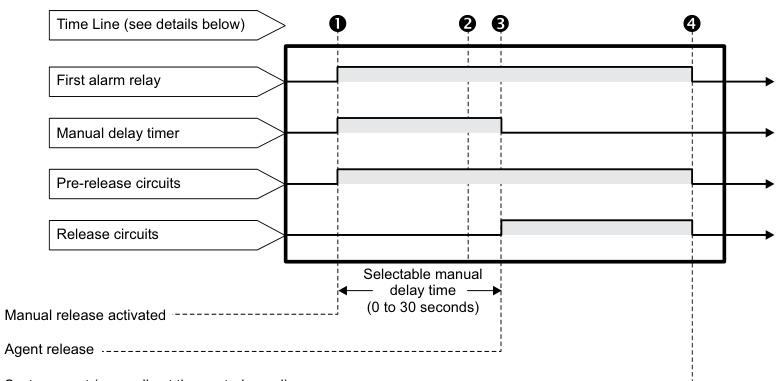  
System reset (manually at the control panel)  

Note: Misapplication of the SIGA-REL can have serious consequences. Descriptions provided here are for information only, are subject to change, and should not be used as a guide to field installation of equipment. Always consult the SIGA-REL installation manual when setting up or configuring this component.  

Note:  A manual release sequence cannot be aborted.  

# Manual Release Time Line  

# Automatic Release Sequence  

The automatic release sequence requires an AND group (cross zone) or a matrix group (counting zone). AND groups and matrix groups require fire alarm signals from designated Signature Series devices. These logic groups are programmable through a laptop computer and the System Definition Utility (SDU).  

Note: EST2 systems do not support matrix groups. See Programming the SIGA-REL for AND group rules. To create AND groups and matrix groups, see the System Programming Manual and the SDU Online Help for your system.  

The diagram below outlines the automatic release sequence.  

	 An active manual release station disables automatic operation and the abort function and simultaneously activates the: Manual delay timer Pre-release circuit Pre-release strobe circuit (steady On) Pre-release horn circuit (60 pulses per minute)   
	 Ten seconds before the expiration of the manual delay timer, the pre-release horn changes from 60 pulses per minute to steady On.   
$\^\bullet$ The manual delay timer expires and the release circuits activate.   
$\circ$ A manual reset at the fire alarm control panel deactivates the release solenoids and the Releasing Module returns to the normal state.  

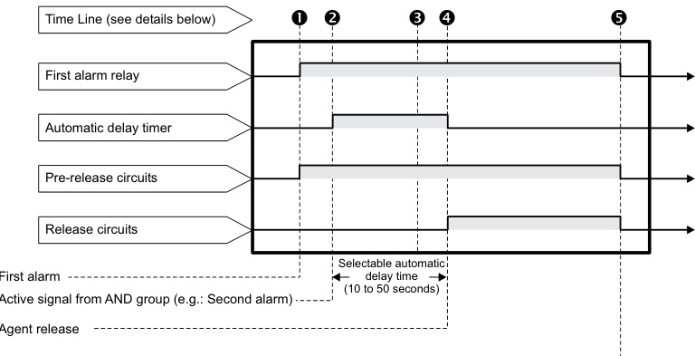  
System reset  

# Automatic Release Time Line  

A detector signals the first alarm. This event simultaneously activates the: First alarm relay Pre-release strobe circuit (steady On) Pre-release horn circuit (15 pulses per minute)   
$\bullet$ A detector in the protected area signals a second alarm and meets the AND group conditions.\* The automatic delay timer then starts its countdown and the pre-release horn circuit changes to 60 pulses per minute. \* AND group and matrix group conditions depend on programming.   
	 10 seconds before the automatic delay timer expires, the prerelease (horn) circuit changes to steady On.   
$\circ$ The automatic delay timer expires and the release circuits activate.   
$\pmb{\mathcal{S}}$ A manual reset at the fire alarm control panel deactivates the release solenoids and the Releasing Module returns to the normal state.  

# Abort Sequences  

The SIGA-REL provides four abort modes. Aborts do not terminate the release of fire suppression agents. They merely offer a limited extension of the automatic timer delay period.  

# Abort Mode 1 (factory default)  

If the abort is initiated before the automatic time delay expires, it will prevent the releasing action. The automatic delay timer will continue to run while the abort is active. When the abort switch is restored, the release will occur with the expiration of the automatic delay timer or the abort delay timer, whichever occurs last.  

# Abort Mode 2  

If the abort is initiated before the automatic time delay expires, it will prevent the releasing action. The automatic delay timer will stop running. When the abort switch is restored, the automatic delay timer will continue from the stop point and the release will occur with the expiration of the timer.  

# Compatibility  

# Sprinkler systems  

The SIGA-REL works with two types of sprinkler systems: deluge and pre-action. The primary difference between both systems is the type of sprinkler head (or nozzle) that terminates the pipes. Table1-1 outlines the Factory Mutual Research Corporation (FMRC) requirements for deluge and pre-action systems.  

FM approval requirements for deluge and pre-action sprinkler systems   

<html><body><table><tr><td>Standby operation</td><td>90hours</td></tr><tr><td>Alarmoperation</td><td>10minutes</td></tr><tr><td>NFPAstyle</td><td>Class A (Style D or E) or Class A (Style 2, 5, 6, or 7)</td></tr><tr><td>FMRCdocumentation</td><td>FMRCApproval Guide(Volume e1)</td></tr></table></body></html>  

# Deluge sprinkler systems  

In Deluge sprinkler systems, open-valve sprinkler heads terminate pipes connected to a water supply controlled by a single valve. When the system detects a fire it automatically opens the valve to allow the waterflow through all of the sprinkler heads. Deluge sprinklers are useful for applications that require the simultaneous discharge of water through every sprinkler.  

The following fire detection systems meet FRMC requirements for deluge systems:  

• Wet pilot sprinkler line • Dry pilot sprinkler line • Hydraulic rate-of-rise • Pneumatic rate-of-rise • Electric  

# Pre-action sprinkler systems  

In Pre-action sprinkler systems, closed-valve sprinkler heads terminate pipes connected directly to a water supply. The water supply is usually in the same area as the sprinklers and the pipes are supervised for air pressure. Pre-action sprinklers are useful where it is important to prevent the accidental discharge of water.  

# Abort Mode 3  

Industrial Risk Insurers (IRI) Mode: To be recognized as valid, the abort must be active when the second alarm is received. When the abort switch is restored, the release will occur with the expiration of the abort delay timer (set for 10 sec).  

# Abort Mode 4  

International applications: If the abort is initiated before the automatic time delay expires, it will prevent the releasing action. The automatic delay timer will stop running. When the abort switch is restored, the automatic delay timer will reset and commence time from $\mathtt{t}=0$ . The release will occur with the expiration of the timer setting minus 10 seconds.  

The following fire detection systems meet FRMC requirements for pre-action systems:  

• Hydraulic rate-of-rise • Pneumatic rate-of-rise • Electric  

# Automatic fire extinguishing systems  

Automatic fire extinguishing systems automatically detect and extinguish fires. They require no manual input because detectors automatically activate releasing solenoids or sprinkler valves. The table below provides a list of the fire suppression agents and the applicable NFPA documents.  

Fire suppression agents and NFPA documentation   

<html><body><table><tr><td>Agent</td><td>NFPAdocumentation</td></tr><tr><td>Low-expansionfoam</td><td>NFPA 11</td></tr><tr><td>Medium- and high-expansion foam</td><td>NFPA 11A</td></tr><tr><td>CO2</td><td>NFPA 12</td></tr><tr><td>Sprinklers</td><td>NFPA 13</td></tr><tr><td>Waterspray</td><td>NFPA 15</td></tr><tr><td>Foam-water</td><td>NFPA 16</td></tr><tr><td>Drychemicals</td><td>NFPA 17</td></tr></table></body></html>

The table below outlines the FMRC requirements for automatic fire extinguishing systems.  

FM approval requirements for automatic fire extinguishing systems   

<html><body><table><tr><td>Standbyoperation</td><td>24 hours</td></tr><tr><td>Alarm operation</td><td>10minutes</td></tr><tr><td>NFPAstyle</td><td>B or D</td></tr><tr><td>FMRCdocumentation</td><td>FMRCApproval Guide(Volume 1</td></tr></table></body></html>  

Compatible panels. The SIGA-REL is compatible with iO Series, EST3 and EST3X fire alarm control panels. You may install the SIGA-REL in any of the following enclosures:  

• 2-WB(X) series • 2-CAB series • 3-CAB series • RACCR series • MFC-A • APS6A/APS10A Note: Maintain a 1-inch $(25.4\;\mathsf{m m})$ ) minimum clearance all around the SIGA-REL. The clearance space must also comply with the National Electrical Code.  

# Wiring  

Power supplies. The SIGA-REL is compatible with the following power supplies:  

• 2-PPS(-220) • 2-PPS/6A(-220) • SIGA-APS(-220) • 3-BPS/M • 3-PPS/M • BPS6\*, BPS $10^{\star}$ , APSxA \*Not compatible with FMRC sprinkler applications that require 90 hours of standby.  

Solenoid polarizing relays. Use the RELA-EOL with the SIGA-REL. For more information, see the RELA-EOL installation sheet.  

Abort stations. The SIGA-REL is only compatible with normally-open, momentary-action abort stations. Abort stations must be listed with the appropriate agencies in your area. See Listing agencies.  

Service disconnect stations. The SIGA-REL is only compatible with service disconnect stations that are normally-closed (minimum 2.0 Amps). Service disconnect stations must be listed with the appropriate agencies in your area. See Listing agencies.  

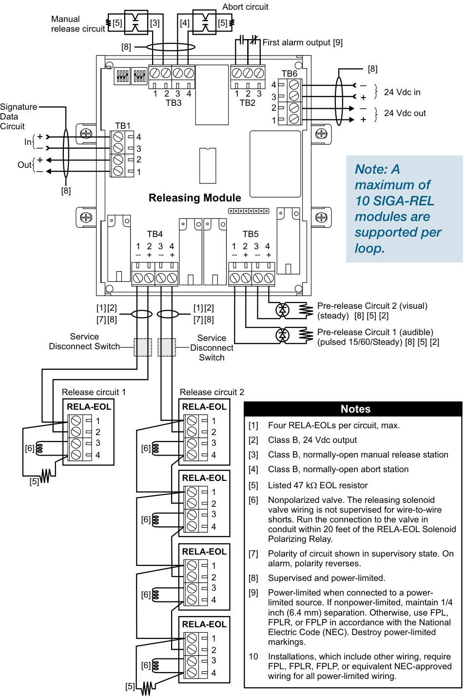  

Releasing solenoid valves. Releasing solenoid valves must be listed with the appropriate agencies in your area. See Listing agencies.  

Listing agencies. Listing agencies include: • Factory Mutual Research Corporation (FMRC) • Underwriters Laboratories, Inc. (UL) • Underwriters Laboratories Canada (ULC)  

# Switch Settings  

Abort mode and time delay settings are configured by means of dip switches on the module.  

Abort mode   

<html><body><table><tr><td>Mode</td><td>SW1</td><td>SW2</td><td></td></tr><tr><td>DEFAULT 1</td><td>0</td><td>O</td><td>Routines thatdeterminehow</td></tr><tr><td>2</td><td>0</td><td>1</td><td>theabortfunctioninteracts</td></tr><tr><td>3</td><td>1</td><td>O</td><td>withthet timers.</td></tr><tr><td>4</td><td>1</td><td>1</td><td></td></tr></table></body></html>  

# Manual time delay (seconds)  

<html><body><table><tr><td colspan="4">Delay SW3</td></tr><tr><td></td><td>O</td><td>SW4 0 O</td><td>Thelengthoftimet thatthe</td></tr><tr><td>DEFAULT 10</td><td>O</td><td>1</td><td>delugeisinhibitedv whent the</td></tr><tr><td>20</td><td>1</td><td>O</td><td>releasing functionismanually</td></tr><tr><td>30</td><td>1</td><td>1</td><td>initiated.</td></tr></table></body></html>  

<html><body><table><tr><td colspan="5">Automatictimedelay(seconds)</td></tr><tr><td colspan="5">Delay SW5 SW6</td></tr><tr><td>10</td><td></td><td>0</td><td>SW7 0</td><td>Thelengthoftimethat</td></tr><tr><td>20</td><td></td><td></td><td>1</td><td>thedelugeisinhibited</td></tr><tr><td>30</td><td></td><td>01</td><td></td><td>whenthereleasingfunc-</td></tr><tr><td>40</td><td>0001</td><td>1</td><td>1</td><td>tionisinitiatedbythe</td></tr><tr><td>DEFAULT 50</td><td></td><td>O</td><td>0</td><td>controlpanel(i.e.:after receivinganalarm).</td></tr><tr><td colspan="5">Aborttimedelay(seconds)</td></tr><tr><td colspan="5">Delay SW8</td></tr><tr><td></td><td></td><td></td><td></td><td>Thelengthoftimethatthedelugeis</td></tr><tr><td>DEFAULT</td><td>0 10</td><td>0 1</td><td></td><td>inhibitedwhentheabortfunctionis</td></tr><tr><td></td><td></td><td></td><td></td><td></td></tr><tr><td></td><td></td><td></td><td></td><td>restored (i.e.:cancelled). uDenotesdefaultsettings.</td></tr></table></body></html>  

# Mounting  

# LED Operation  

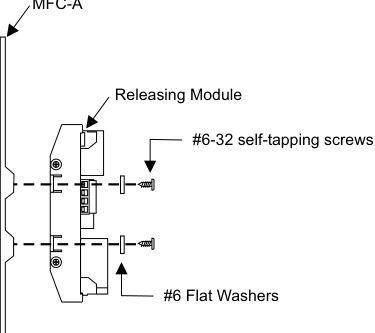  

<html><body><table><tr><td>LED Color</td><td>Pattern</td><td>Function</td></tr><tr><td>DS1 Red</td><td>Flashing</td><td>Data(alarmconditions)*</td></tr><tr><td>DS2 Green</td><td>Flashing</td><td>Data(normalconditions)*</td></tr><tr><td>DS3 Red</td><td>Steady</td><td>Alarm</td></tr><tr><td>DS4 Green</td><td>Steady</td><td>Power</td></tr><tr><td>DS5 Yellow</td><td>Steady</td><td>Abort</td></tr><tr><td>DS6 Yellow</td><td>Steady</td><td>Trouble</td></tr><tr><td>DS7 Red patternduring</td><td>Steady analarmcondition.</td><td>ReleaseActive</td></tr><tr><td colspan="3">*Note:Duringalossofcommunications,the ReleasingModulewillgointoastandbycondition, whichwillcauseDS1andDS2tochangetoasteady</td></tr></table></body></html>  

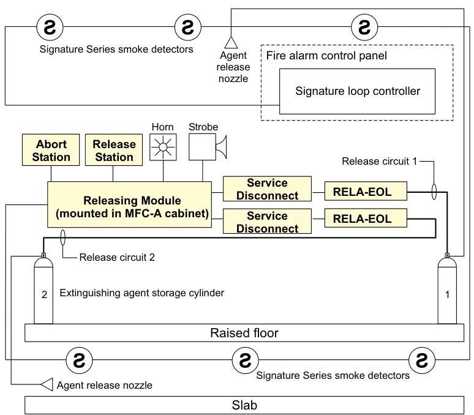  
Typical application of SIGA-REL accessories (computer room)   
Manual Release Station  

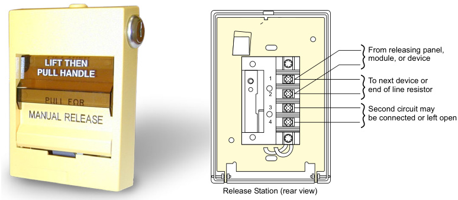  

The manual release station is a normally-open, dry contact signal initiating device. The 276A-REL is a single-action station that requires the user to pull the release handle to initiate the release of a fire suppression agent. The 278A-REL (shown) is a double-action station that requires the user to raise the upper door, then pull the release handle to initiate the release.  

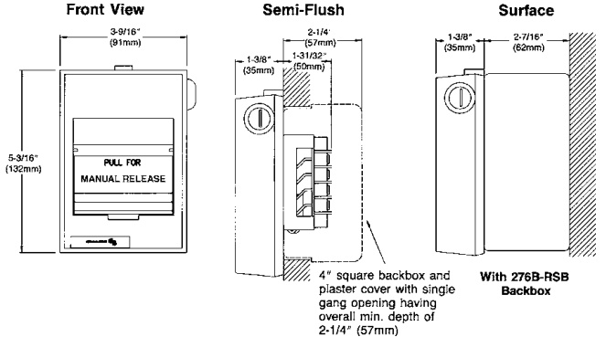  

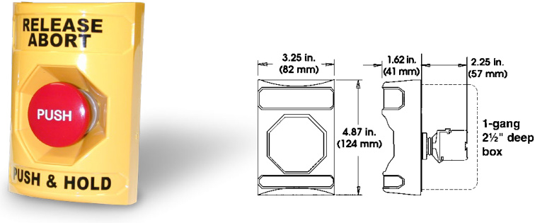  
Abort Station  

The abort station is a normally-open, non-latching device. It is used to prevent the release of agent into the protected area after the release sequence has begun.  

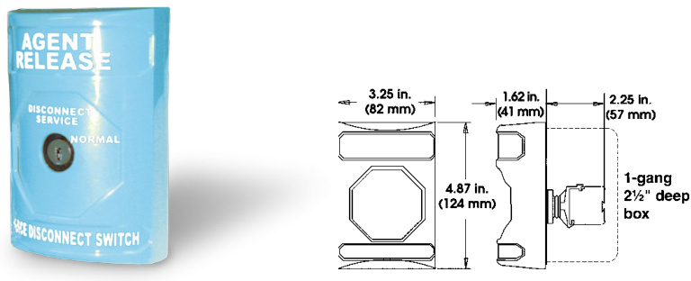  
Service Disconnect Switch  

The service disconnect switch is used to temporarily disable the fire suppression system. One switch is installed on each of the two release circuits between the SIGA-REL and the RELA-EOL end-of-line relay. Opening the Service Disconnect Switch allows the fire alarm system to be tested without activating the fire suppression system. The operation of this switch causes a trouble signal at the control panel.  

# End-of-Line Relay  

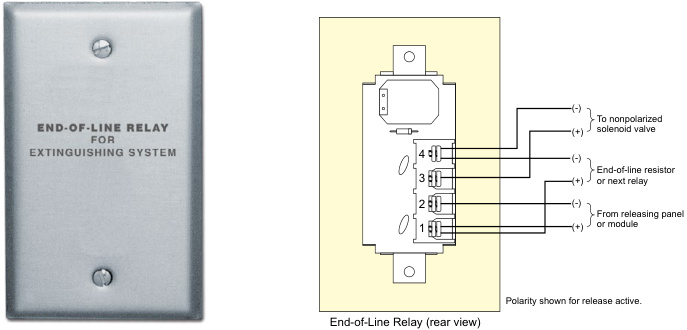  

The End-of-Line Relay facilitates the connection of a non-polarized releasing solenoid to a supervised, polarized releasing circuit. One relay is required per release solenoid.  

# Module Enclosure  

The MFC-A cabinet is UL-listed for use with Signature modules. Shown here with plug-in style  

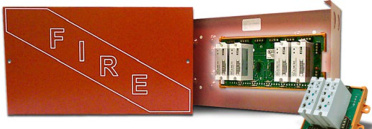  

I/O modules, the MFC-A also meets UL requirements for spacing and clearance around the SIGA-REL Releasing Module. The cabinet features red epoxy finish with white “FIRE” markings.  

<html><body><table><tr><td>Power riser</td><td>Input voltage2 Supervisory current Riser input current Alarm</td><td>24 Vdc (power limited) 25 mA, max. 4 amps maximum 170 mA min.; 4 A max.</td></tr><tr><td>Release circuits</td><td>Output rating Valves per circuit Max. supervisory current Nominal supervisory current Supervisory voltage End of line device</td><td>2 A @ 24 Vdc (for each circuit) 4 valves, max. 0.4 mA (short circuit) 0.18 mA 26 Vdc, max. (open circuit) 47k Ohm EOL 2 A @ 24 Vdc (for each</td></tr><tr><td>Pre-release alarm circuits</td><td>Output rating Max. supervisory current Nominal supervisory current Supervisory voltage End of line device</td><td>circuit) 0.4 mA (short circuit) 0.18 mA 26 Vdc, max. (open circuit) 47k Ohm resistor</td></tr><tr><td>Manual release input circuit</td><td>Max.supervisory current Nominal supervisory curent Supervisory voltage End of line device Circuit type Circuit capacitance</td><td>0.4 mA (short circuit) 0.18 mA 26 Vdc, max. (open circuit) 47k Ohm resistor Class B N.O. latching 0.1 μF, max 0.4 mA (short circuit)</td></tr><tr><td>Abort circuit</td><td>Max.supervisorycurrent Nominal supervisory current Supervisory voltage End of line device Circuit type Circuit capacitance</td><td>0.18 mA 26 Vdc, max. (open circuit) 47k Ohm resistor Class B N.O. non- latching 0.1 μF, max</td></tr><tr><td>First alarm output relay</td><td>Contact rating</td><td>3 A @ 24 Vdc (0.6 power factor) Form C 5.2 to 19.95 Vdc</td></tr><tr><td>Signature Data line</td><td>Operating voltage Supervisory current Alarm current Operating temperature</td><td>1000 μA 1000 μA 32°F to 120°F</td></tr><tr><td>Environmental conditions</td><td>Storage temperature Humidity</td><td>(0° C to 49° C) -4° F to 140°F (-20° C to 60°C) 0 to 93% Non-condensing</td></tr><tr><td>Wiring Terminals</td><td>Suitable for #18 to #12 AWG (2.5 mm2 to .75 mm2)</td><td></td></tr><tr><td>Type Code</td><td colspan="2">Factory Set</td></tr><tr><td>Addressing Requirements</td><td colspan="2">Uses sixmodule addresses</td></tr><tr><td>Agency Listings</td><td colspan="2">UL, ULC, and FM</td></tr><tr><td>Compatible Solenoids</td><td colspan="2">Must be bothUL/ULC-listed and FM-approved</td></tr></table></body></html>

Note: Output circuits are power-limited when the riser circuit is power-limited.  

# Line Resistance  

Power riser   

<html><body><table><tr><td rowspan="2">Total riser current (Amps)</td><td colspan="4">DistancefromSlGA-RELtopower supply</td><td rowspan="2">Wire resistance (Ohms perwire)</td></tr><tr><td>#12 AWG</td><td>2.5mm2</td><td># AWG</td><td>1.5mm2</td></tr><tr><td>4.0</td><td>29 ft</td><td>8.84 m</td><td>20 ft</td><td>6.10 m</td><td>0.050</td></tr><tr><td>3.5</td><td>34ft</td><td>10.36 m</td><td>23ft</td><td>7.01 m</td><td>0.057</td></tr><tr><td>3.0</td><td>39 ft</td><td>11.89 m</td><td>27 ft</td><td>8.23m</td><td>0.067</td></tr><tr><td>2.5</td><td>47 ft</td><td>14.33 m</td><td>32ft</td><td>9.75 m</td><td>0.080</td></tr><tr><td>2.0</td><td>59 ft</td><td>17.98 m</td><td>40 ft</td><td>12.19 m</td><td>0.100</td></tr><tr><td>1.5</td><td>78 ft</td><td>23.77 m</td><td>53ft</td><td>16.15 m</td><td>0.133</td></tr><tr><td>1.0</td><td>118ft</td><td>35.97m</td><td>80 ft</td><td>24.38 m</td><td>0.200</td></tr></table></body></html>  

Pre-release and release circuits (per circuit)   

<html><body><table><tr><td rowspan="2">Total riser current (Amps)</td><td colspan="4">DistancefromSlGA-RELtopower supply</td><td rowspan="2">Wire resistance (Ohms per wire)</td></tr><tr><td>#12 AWG</td><td>2.5mm2</td><td>#14 AWG</td><td>1.5mm2</td></tr><tr><td>2.00</td><td>176 ft</td><td>53.64m</td><td>120 ft</td><td>36.58m</td><td>0.300</td></tr><tr><td>1.75</td><td>202ft</td><td>61.57 m</td><td>137ft</td><td>41.76 m</td><td>0.343</td></tr><tr><td>1.50</td><td>235ft</td><td>71.63 m</td><td>160ft</td><td>48.77 m</td><td>0.400</td></tr><tr><td>1.25</td><td>282ft</td><td>85.95m</td><td>192 ft</td><td>58.52m</td><td>0.480</td></tr><tr><td>1.0</td><td>353ft</td><td>107.59m</td><td>240 ft</td><td>73.15 m</td><td>0.600</td></tr><tr><td>0.50</td><td>706 ft</td><td>215.19 m</td><td>480 ft</td><td>146.30m</td><td>1.200</td></tr></table></body></html>  

# Ordering Information  

<html><body><table><tr><td>Model</td><td>Description</td><td>Ship Wt. Ib (kg)</td></tr><tr><td>SIGA- REL</td><td>Analog addressablereleasing module</td><td>0.52 (0.23)</td></tr><tr><td>276A-REL</td><td>Manual releasing station (single-action). English markings, black text on yellow polycarbonate body.</td><td>1.0 (0.45)</td></tr><tr><td>278A-REL</td><td>Manual releasing station (double-action). English markings, black text on yellow polycarbonate body.</td><td>1.0 (0.45)</td></tr><tr><td>RELA- ABT</td><td>Manual Abort Station.English markings, black text on yellow polycarbonate body.</td><td>1.0 (0.45)</td></tr><tr><td>RELA- SRV-1</td><td>ServiceDisconnectSwitch.Onen/ccontact and one n/o contact. English markings, white text on blue polycarbonate body.</td><td>1.0 (0.45)</td></tr><tr><td>RELA- EOL</td><td>Polarized end-of-line relay. English markings on stainless steel cover.</td><td>0.2 (0.1)</td></tr><tr><td>MFC-A</td><td>UL listed cabinet for mounting releasing modules, red with white “"FIRE". HWD: 8"×14"×31%2" (203mm×356mm×89mm)</td><td>7.0 (3.1)</td></tr></table></body></html>  