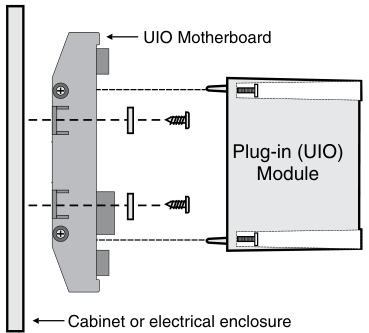
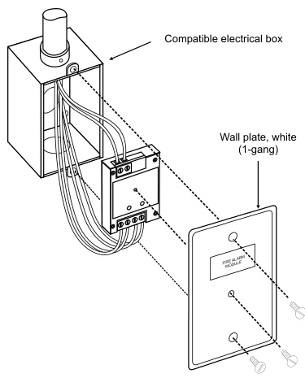
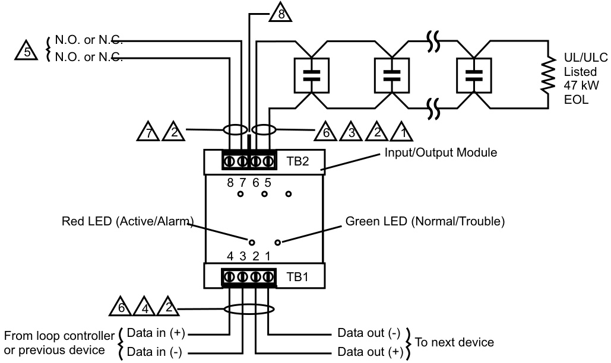
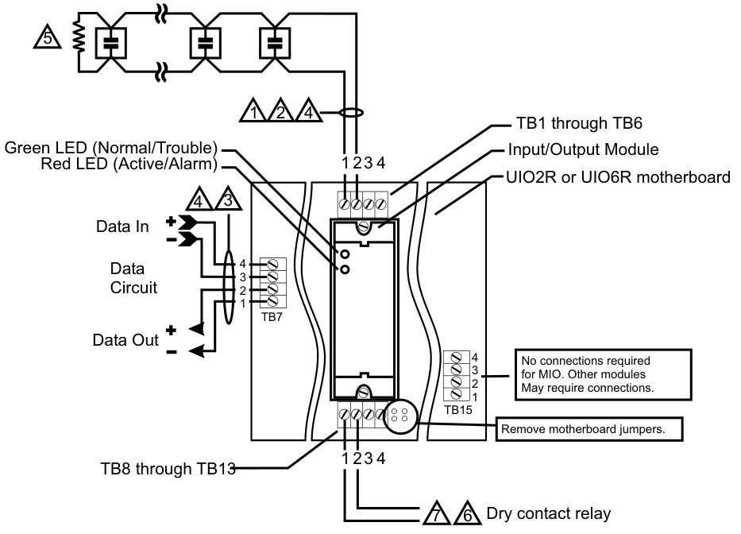

# Input/Output Modules SIGA-IO, SIGA-MIO  

# Overview  

SIGA-IO and MIO Input/Output Modules are intelligent analog addressable devices that form part of EDWARDS’s Signature line of products. The actual operation of the SIGA-IO and MIO is determined by the “personality code” selected by the installer, which is downloaded to the module from the Signature loop controller during system configuration.  

Depending on their assigned personality, Input/Output Modules provide the following modes of operation: • Output with monitor input (two personalities) • Input/programmable output (eight personalities)  

Each IO module requires one module address.  

# Standard Features  

# 10 modules in one  

Multiple applications including normally-open or normallyclosed alarm relay and latching or non-latching alarm inputs. The installer selects one of up to 10 personality codes to be downloaded from the loop controller.  

# Adjustable time delays  

User sets the expected response time (5 - 120 seconds) for maximum flexibility.  

# •	 Plug in (UIO) or standard 1-gang mount  

UIO versions allow quick installation where multiple modules are required. The 1-gang mount version is ideal for remote locations that require a single module.  

# Automatic device mapping  

Signature modules transmit information to the loop controller regarding their circuit locations with respect to other Signature devices on the wire loop.  

# Electronic addressing  

Programmable addresses are downloaded from the loop controller, a PC, or the SIGA-PRO Signature Program/Service Tool. There are no switches or dials to set.  

# •	 Intelligent device with microprocessor  

All decisions are made at the module to allow lower communication speed with substantially improved control panel response time and less sensitivity to line noise and loop wiring properties; twisted or shielded wire is not required.  

# Application  

The SIGA-IO mounts to a standard North American one-gang electrical box, making it ideal for locations where only one module is required. Separate I/O and data loop connections are made to each module.  

The SIGA-MIO is part of the UIO family of plug-in Signature Series modules. It functions identically to the SIGA-IO, but takes advantage of the modular flexibility and easy installation that characterize all UIO modules. Two- and six-module UIO motherboards are available. These can accommodate individual risers for each on-board module, or risers that are shared by any combination of its UIO modules. All wiring connections are made to terminal blocks on the motherboard. UIO assemblies may be mounted in EDWARDS enclosures.  

# Electronic Addressing  

The loop controller electronically addresses each module saving valuable time during system commissioning. Setting complicated switches or dials is not required.  Each module has its own unique serial number stored in its “on-board memory”. The loop controller identifies each device on the loop and assigns a “soft” address to each serial number. If desired, the modules can be addressed using the SIGA-PRO Signature Program/Service Tool.  

# Personality Codes  

A signature module requires a Signature loop controller to download the personality code that determines how it will operate. The Input/Output Module provides personality codes 31 through 40. For personalities 33 through 40, the outputs must be programmed to be activated by the panel.  

# Personality code 31 (default): N.O. relay output with monitor input  

Personality code 31 configures the module as a normally-open output relay contact that requires a maintained dry contact input activation. The activation must take place within a time period defined by the user (15 seconds default; 5 - 120 seconds selectable) after the output circuit activation. If the fire alarm control panel does not receive a monitor input within the specified time, it will generate a trouble condition.  

Personality code 32: N.C. relay output with monitor input Personality code 32 operates the same as personality code 31, except that the output is configured as a normally closed, drycontact relay.  

# Personality codes 33: Alarm input and N.O. relay output  

Personality code 33 configures the module as a normally-open, dry-contact relay and an alarm latching input for Class B contact initiating devices. When the input contact of the initiating device changes state, the I/O module sends an alarm signal to the Signature loop controller and the alarm condition is latched at the module.  

# Personality code 34: Alarm input and N.C. relay output  

Personality code 34 operates the same as personality code 33, except that the output is configured as a normally closed, drycontact relay.  

# Personality code 35: Delayed alarm input and N.O. relay output  

Personality code 35 configures the module as a normally-open, dry-contact relay and an alarm latching input for Class B contact initiating devices. This personality requires that a change in the state of the initiating device be maintained for approximately 16 seconds before the I/O module sends an alarm signal to the Signature loop controller. The alarm condition is latched at the module. Use only with non-retarded, N.O. waterflow alarm switches.  

# Personality code 36: Delayed alarm input and N.C. relay output  

Personality code 36 operates the same as personality code 35, except that the output is configured as a normally closed, drycontact relay. Use only with non-retarded, N.C. waterflow alarm switches.  

# Personality code 37: Active input (non-latching) and N.O. relay output  

Personality code 37 configures the module as a normally-open, dry-contact relay and an active input for Class B contact initiating devices. When the input contact of the initiating device changes state, the I/O module sends an active signal to the Signature loop controller. The active signal does not latch, and restores when the input device returns to its normal state. Typically used for monitoring N.O. fans, dampers, doors, etc.  

# Personality codes 38: Active input (non-latching) and N.C. relay output  

Personality code 38 operates the same as personality code 37, except that the output is configured as a normally closed, drycontact relay. Typically used for monitoring N.C. fans, dampers, doors, etc.  

# Personality code 39: Active input (latching) and N.O. relay output  

Personality code 39 configures the module as a normally-open, dry-contact relay and an active latching input for Class B contact initiating devices. When the input contact of the initiating device changes state, the I/O module sends an active signal to the Signature loop controller and the active condition is latched at the module.  

# Personality code 40: Active input (latching) and N.C. relay output  

Personality code 40 operates the same as personality code 39, except that the output is configured as a normally closed, drycontact relay.  

# Installation  

The SIGA-IO: modules mount to North American $2\%$ inch (64 mm) deep 1-gang boxes and $1\,\%$ inch $\left(38\;\mathrm{mm}\right)$ deep 4 inch square boxes with 1-gang covers. They also can be snapped directly to the SIGA-MP mounting plates. The terminals are suited for $\#12$ to #18 AWG $2.5\:\mathsf{m m}^{2}$ to $0.75\;\mathrm{mm}^{2}$ ) wire size.  

  

SIGA-MIO: mount the $\mathsf{U l O}\mathsf{x R}$ motherboard inside a suitable EDWARDS enclosure with screws and washers provided. Plug the module into any available position on the motherboard and secure the module to the motherboard with the captive screws. Wiring connections are made to the terminals on the motherboard (see wiring diagram). UIOxR motherboard terminals are suited for #12 to $\#18$ AWG $2.5\;\mathrm{mm}^{2}$ to $0.75\;\mathrm{mm}^{2})$ wire size.  

  

# Warnings & Cautions  

This module will not operate without electrical power. As fires frequently cause power interruption, we suggest you discuss further safeguards with your fire protection specialist.  

EDWARDS recommends that these modules be installed according to latest recognized edition of national and local fire alarm codes.  

# Testing & Maintenance  

The module’s automatic self-diagnosis identifies when it is defective and causes a trouble message. The user-friendly maintenance program shows the current state of each module and other pertinent messages. Single modules may be turned off (de-activated) temporarily, from the control panel.  

Scheduled maintenance (Regular or Selected) for proper system operation should be planned to meet the requirements of the Authority Having Jurisdiction (AHJ).  Refer to current NFPA 72 and ULC CAN/ULC 536 standards.  

# Compatibility  

These modules are part of EDWARDS’s Signature Series intelligent processing and control platform. They are compatible with EST3, EST3X and iO Series control panels.  

# Typical Wiring (SIGA-IO)  

Modules will accept #18 AWG to #12 AWG $(0.75\mathsf{m m}^{2}$ to $2.50\mathsf{m m}^{2})$ ) wire sizes. Note: Sizes #16 AWG $\scriptstyle({1.0\mathsf{m m}^{2}})$ and #18 AWG (0.75mm2) are preferred for ease of installation. See Signature Loop Controller catalog sheet for detailed wiring requirement specifications.  

  
Input/Output Module (personality codes 31 - 40)  

Wiring Notes:   
1 	 Maximum 25 Ohm resistance per wire.   
2 	 #12 AWG (2.5 mm²) max; #18 AWG (0.75²) mm min.   
3 	 10 Vdc @ 350 mA, max.   
4 	 See the loop controller installation sheet for wiring specifications.   
5 	 System programming determines whether contact will be normally-open (N/O) or normally-closed $(\mathsf{N}/\mathsf{C})$ .  
6 	 Supervised and power-limited.   
7 	 Power-limited unless connected to a nonpowerlimited source. If the source is nonpower-limited, eliminate the power-limited mark and: •	 Maintain a 1/4-inch $.6.4\;\mathrm{mm}!$ ) space from powerlimited wiring. or •	 Use FPL, FPLR, FPLP, or an equivalent cable in accordance with the National Electric Code.   
8 	 The Nomex isolation barrior separates power-limited and nonpower-limited wiring. Watch out for the sharp corners during installation and maintenance.  

# Tory prpeivicouas ld evWiceirinDgat a (inS (-I)GA-MIO)  

Modules will accept #12 AWG $(2.5\mathsf{m m}^{2})$ , #18 AWG $(0.75\mathsf{m m}^{2})$ , #16 $(1.0\mathsf{m m}^{2})$ , and #14 AWG $(1.50\mathsf{m m}^{2})$ wire sizes. Note: Sizes #16 AWG $(1.0\mathsf{m m}^{2})$ ) and $\#18$ AWG $(0.75\mathsf{m m}^{2})$ are preferred for ease of installation. See Signature Loop Controller catalog sheet for detailed wiring requirement specifications.  

# Input/Output Module (personality codes 31 U-I O420R)  

# Wiring Notes:  

  

1 	 Maximum 25 Ohm resistance per wire. Maximum circuit capacitance of 0.1 mF.   
2 	 10 Vdc @ 350 mA, max.   
3 	 See the Signature loop controller installation sheet for wiring  specifications.   
4 	 Supervised and power-limited   
5 	 UL/ULC listed 47 kW EOL   
6 	 System programming determines whether contact will be normally-open (N/O) or normally-closed $(\mathsf{N}/\mathsf{C})$ .  
7 	 Power-limited unless connected to a nonpowerlimited source. If the source is nonpower-limited, eliminate the power-limited mark and: •	 Maintain a 1/4-inch (6.4 mm) space from powerlimited wiring. or •	 Use FPL, FPLR, FPLP, or an equivalent cable in accordance with the National Electric Code.   
8	 See the UIO2R or UIO6R installation sheet for additional instructions about the separation of powerlimited and nonpower-limited wiring.  

# Signature Series Overview  

The Signature Series intelligent analog-addressable system from EDWARDS is an entire family of multi-sensor detectors and mounting bases, multiple-function input and output modules, network and nonnetwork control panels, and user-friendly maintenance and service tools. Analog information from equipment connected to Signature devices is gathered and converted into digital signals. An onboard microprocessor in each Signature device measures and analyzes the signal and decides whether or not to input an alarm. The microprocessor in each Signature device provides four additional benefits – Self-diagnostics and History Log, Automatic Device Mapping, and Fast, Stable Communication.  

Self-diagnostics and History Log – Each Signature Series device constantly runs self-checks to provide important maintenance information. The results of the self-check are automatically updated and permanently stored in its non-volatile memory. This information is accessible for review any time at the control panel, PC, or using the SIGA-PRO Signature Program/Service Tool.  

Automatic Device Mapping –The Signature Data Controller (SDC) learns where each device’s serial number address is installed relative to other devices on the circuit. The SDC keeps a “map” of all Signature Series devices connected to it. The Signature Series Data Entry Program also uses the mapping feature. With interactive menus and graphic support, the wired circuits between each device can be examined. Layout or “as-built” drawing information showing branch wiring (T-taps), device types and their address are stored on disk for printing hard copy. This takes the mystery out of the installation. The preparation of “as-built” drawings is fast and efficient.  

Most Signature modules use a “personality code” selected by the installer to determine their actual function. Personality codes are downloaded from the SDC during system configuration and are indicated during device mapping.  

# Specifications  

Fast Stable Communication – Built-in intelligence means less information needs to be sent between the device and the Signature Data Controller (SDC). Other than regular supervisory polling response, Signature devices only need to communicate with the SDC when they have something new to report. This provides very fast control panel response and allows a lower baud rate (speed) to be used for communication on the circuit. The lower baud rate offers several advantages including:  

•	Less sensitivity to circuit wire characteristics.   
•	Less sensitivity to noise glitches on the cable.   
•	Less emitted noise from the data wiring.   
•	Twisted or shielded wiring is not required.  

Diagnostic LEDs – Twin LEDs on most Signature devices provide visual indication of normal and alarm-active conditions. A flashing green LED shows normal system polling. A flashing red LED means the module is in alarm-active state.  

Testing & Maintenance – Automatic self-diagnosis identifies when a Signature device is defective and causes a trouble message. The userfriendly maintenance program shows the current state of each device and other pertinent information. Single devices may be turned off temporarily, from the control panel. Scheduled maintenance (Regular or Selected) for proper system operation should be planned to meet the requirements of the Authority Having Jurisdiction (AHJ). Refer to current NFPA 72 and ULC CAN/ULC 536 standards.  

Quality and Reliability – EDWARDS Signature devices are manufactured in North America to strict international ISO 9001 standards. All electronics utilize surface mount technology (SMT) for smaller size and greater immunity to RF noise. A conformal coating is used for humidity and corrosion resistance.  

<html><body><table><tr><td>Model</td><td>SIGA-I0</td><td>SIGA-MIO</td></tr><tr><td>Description</td><td>Standard Mount Input/Output Module North American 21/2 inch (64 mm) deep one-gang boxes</td><td>Plug-in (UIO) Input/Output Module</td></tr><tr><td>Mounting</td><td>and 112 inch (38 mm) deep 4 inch square boxes with one- gang covers and SIGA-MP mounting plates</td><td>Plugs into UIO2R or UIO6R Motherboards only.</td></tr><tr><td>Current Standby</td><td colspan="2">250 μA</td></tr><tr><td>Activated Relay type</td><td colspan="2">430 μA Form A or B.</td></tr><tr><td>Contact ratings (pilot duty) Initiating Device Circuit</td><td colspan="2">24 Vdc: 2 A.120 Vac: 0.5 A (Not rated for capacitive loads.)</td></tr><tr><td>EOL (end-of-line) resistor Max. circuit resistance</td><td colspan="2">UL/ULC listed 47k Ohm 50 Ohm (25 Ohms per wire)</td></tr><tr><td>Max. circuit capacitance Wiring Terminations</td><td colspan="2">0.1 μF Suitable for #12 to #18 AWG (2.5 mm2 to 0.75mm2)</td></tr><tr><td>Personality Codes</td><td colspan="2">Ten Selectable Codes Available</td></tr><tr><td>Address Requirements</td><td colspan="2">Uses One Module Address</td></tr><tr><td></td><td colspan="2"></td></tr><tr><td>Operating Voltage</td><td colspan="2">15.2 to 19.95 Vdc (19 Vdc nominal)</td></tr><tr><td>Construction Environment</td><td colspan="2">High Impact Engineering Polymer</td></tr><tr><td>Operating Temperature Storage Temperature</td><td colspan="2">32°Fto 120°F(0°C to 49°C) -4°F to 140° F(-20°C to 60° C)</td></tr><tr><td>Humidity LED Operation</td><td colspan="2">0 to 93% RH On-board Green LED - Flashes when polled; On-board Red LED -Flashes when in alarm/active</td></tr><tr><td>Compatibility</td><td colspan="2"></td></tr><tr><td>Agency Listings</td><td colspan="2">UL, ULC, MEA, CSFM</td></tr></table></body></html>  

# Ordering Information  

<html><body><table><tr><td>Catalog Number</td><td>Description</td><td>Ship Wt. Ibs (kg)</td></tr><tr><td>SIGA-IO</td><td>Input/Output Module (Standard Mount) - UL/ULC Listed</td><td>0.34 (0.15)</td></tr><tr><td>SIGA-MIO</td><td>Input/Output Module (Plug-in) - UL/ULC Listed</td><td>0.22 (0.10)</td></tr><tr><td colspan="3"></td></tr><tr><td>Related Equipment</td><td></td><td></td></tr><tr><td>27193-11</td><td>Surface Mount Box - Red, 1-gang</td><td>2 (1.2)</td></tr><tr><td>27193-16</td><td>Surface Mount Box-White,1-gang Universal Input-Output Module Board w/Riser Inputs</td><td>2 (1.2) 0.32</td></tr><tr><td>SIGA-UIO2R</td><td>- Two Module Positions Universal Input-OutputModuleBoard w/Riser Inputs</td><td>(0.15) 0.62</td></tr><tr><td>SIGA-UIO6R</td><td>- Six Module Positions UL listed cabinet for mounting releasing modules, red with white</td><td>(0.28)</td></tr><tr><td>MFC-A</td><td>"FIRE".</td><td>7.0 (3.1)</td></tr><tr><td>SIGA-MB4</td><td>Transponder Mounting Bracket (allows for mounting two 1-gang modules in a 2-gang box)</td><td>0.4 (0.15)</td></tr><tr><td>SIGA-MP1</td><td>Signature Module Mounting Plate, 1 footprint</td><td>1.5 (0.70)</td></tr><tr><td>SIGA-MP2</td><td>Signature Module Mounting Plate, 1/2 footprint</td><td>0.5 (0.23)</td></tr><tr><td>SIGA-MP2L</td><td>Signature Module Mounting Plate, 1/2 extended footprint</td><td>1.02 (0.46)</td></tr></table></body></html>  