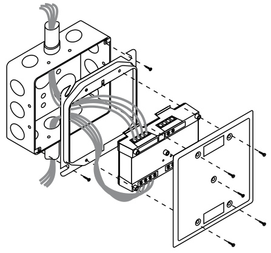
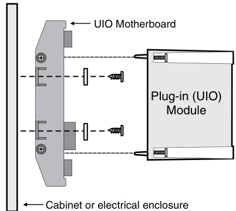
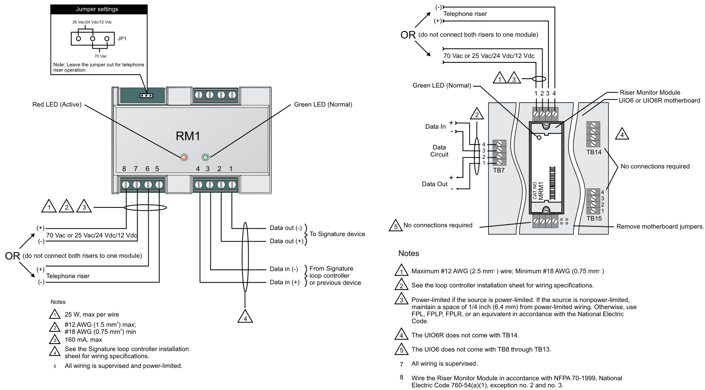

# Riser Monitor Modules MRM1, RM1  

# Overview  

SIGA-RM1 and MRM1 Riser Monitor Modules are intelligent analog addressable devices that form part of EDWARDS’s Signature line of products. The actual operation of the SIGA-RM1 and MRM1 is determined by the “personality code” selected by the installer, which is downloaded to the module from the Signature loop controller during system configuration.  

Depending on their assigned personality, Riser Monitor Modules may be used to monitor telephone risers or 70 Vac audio, 25 Vac audio, or 12 Vdc to 24 Vdc risers.  

Upon the loss of a signal, the fire alarm control panel indicates an alert status. The Riser Monitor Module requires one module address.  

# Standard Features  

•	 Adjustable time delay 0 - 75 seconds (default 15 seconds)  

# Monitors audio power or telephone risers  

Reports a trouble condition when voltage on the riser drops below the trouble threshold.  

# Plug in (UIO) or standard 2-gang mount  

UIO versions allow quick installation where multiple modules are required. The 2-gang mount version is ideal for remote locations that require a single module.  

# Automatic device mapping  

Signature modules transmit information to the loop controller regarding their circuit locations with respect to other Signature devices on the wire loop.  

# Electronic addressing  

Programmable addresses are downloaded from the loop controller, a PC, or the SIGA-PRO Signature Program/Service Tool. There are no switches or dials to set.  

# Intelligent device with microprocessor  

All decisions are made at the module to allow lower communication speed with substantially improved control panel response time and less sensitivity to line noise and loop wiring properties; twisted or shielded wire is not required.  

# Non-volatile memory  

Permanently stores serial number, type of device, and job number. Automatically updates historic information including hours of operation, last maintenance date, number of alarms and troubles, and time and date of last event.  

# Application  

The SIGA-RM1 mounts to a standard North American two-gang electrical box, making it ideal for locations where only one module is required. Separate I/O and data loop connections are made to each module.  

The SIGA-MRM1 is part of the UIO family of plug-in Signature Series modules. It functions identically to the SIGA-RM1, but takes advantage of the modular flexibility and easy installation that characterize all UIO modules. Two- and six-module UIO motherboards are available. These can accommodate individual risers for each on-board module, or risers that are shared by any combination of its UIO modules. All wiring connections are made to terminal blocks on the motherboard. UIO assemblies may be mounted in EDWARDS enclosures.  

# Electronic Addressing  

The loop controller electronically addresses each module saving valuable time during system commissioning. Setting complicated switches or dials is not required.  Each module has its own unique serial number stored in its “on-board memory”. The loop controller identifies each device on the loop and assigns a “soft” address to each serial number. If desired, the modules can be addressed using the SIGA-PRO Signature Program/Service Tool.  

# Personality Codes  

Signature modules require the Signature loop controller to download the personality code that determines how it will operate. The Riser Monitor Module provides personality codes 23 and 24, which are described below.  

# Personality Code 23: Riser Monitor (factory default)  

Personality code 23 configures the Riser Monitor Module to monitor 70 Vac audio, 25 Vac audio, or 12 Vdc and 24 Vdc risers. A trouble condition is reported back to the panel wherever the voltage on the riser drops below the trouble threshold. The hardware jumper on the Riser Monitor Module must be configured for either 70 Vac or 25Vac/24Vdc/12Vdc.  

# Personality Code 24: Telephone Riser Monitor  

Personality code 24 configures the Riser Monitor Module to monitor telephone risers. A trouble condition is reported back to the panel whenever voltage on the riser drops below the trouble threshold.  

The delay time from when the device falls below the trouble threshold to when it sends a trouble signal to the panel is user definable in the appropriate data entry program. A delay of 5 to 75 seconds can be assigned to the device; the default delay period is 15 seconds.  

# Warnings & Cautions  

This module will not operate without electrical power. As fires frequently cause power interruption, we suggest you discuss further safeguards with your fire protection specialist.  

EDWARDS recommends that these modules be installed according to latest recognized edition of national and local fire alarm codes.  

# Installation  

The SIGA-RM1: mounts to North American 2-1/2 inch $(64\;\mathsf{m m})$ deep 2-gang boxes and 1-1/2 inch $(38\,\mathsf{m m})$ deep 4 inch square boxes with   2  -  g  a  n  g   c  o  v  e  r s    a nd SIGA-MP mounting plates. The terminals are suited for #12 to #18 AWG $(2.5\;\mathsf{m m}^{2}$ to $0.75\;\mathrm{mm}^{2}$ )wire size.  

  

SIGA-MRM1: mount the $\mathsf{U l O}\mathsf{x R}$ motherboard inside a suitable EDWARDS enclosure with screws and washers provided. Plug the module into any available position on the motherboard and secure the module to the motherboard with the captive screws. Wiring connections are made to the terminals on the motherboard (see wiring diagram). UIOxR motherboard terminals are suited for #12 to #18 AWG $2.5\;\mathrm{mm}2$ to $0.75\;\mathrm{mm}2$ ) wire size.  

  

# Testing & Maintenance  

The module’s automatic self-diagnosis identifies when it is defective and causes a trouble message. The user-friendly maintenance program shows the current state of each module and other pertinent messages. Single modules may be turned off (de-activated) temporarily, from the control panel.  

Scheduled maintenance (Regular or Selected) for proper system operation should be planned to meet the requirements of the Authority Having Jurisdiction (AHJ).  Refer to current NFPA 72 and ULC CAN/ULC 536 standards.  

# Compatibility  

These modules are part of EDWARDS’s Signature Series intelligent processing and control platform. They are compatible with EST3, EST3X and iO Series control panels.  

# Typical Wiring (SIGA-RM1)  

Modules will accept #18 AWG $(0.75\mathsf{m m}^{2})$ , #16 $\left\{1.0\mathsf{m m}^{2}\right\}$ , #14 AWG $(1.50\mathsf{m m}^{2})$ and #12 AWG $(2.50\mathsf{m m}^{2})$ wire sizes. Note: Sizes $\#16$ AWG (1.0mm2) and $\#18$ AWG $(0.75\mathsf{m m}^{2})$ are preferred for ease of installation. See Signature Loop Controller catalog sheet for detailed wiring requirement specifications.  

# Typical Wiring (SIGA-MRM1)  

Modules will accept $\#12$ AWG $(2.5\mathsf{m m}^{2})$ ), #18 AWG $(0.75\mathsf{m m}^{2})$ ,#16 $(1.0\mathsf{m m}^{2})$ , and #14 AWG $(1.50\mathsf{m m}^{2})$ wire sizes. Note: Sizes #16 AWG $(1.0\mathsf{m m}^{2})$ and $\#18$ AWG $(0.75\mathsf{m m}^{2})$ ) are preferred for ease of installation. See Signature Loop Controller catalog sheet for detailed wiring requirement specifications.  

  

# Signature Series Overview  

The Signature Series intelligent analog-addressable system from EDWARDS is an entire family of multi-sensor detectors and mounting bases, multiple-function input and output modules, network and non-network control panels, and user-friendly maintenance and service tools. Analog information from equipment connected to Signature devices is gathered and converted into digital signals. An onboard microprocessor in each Signature device measures and analyzes the signal and decides whether or not to input an alarm. The microprocessor in each Signature device provides four additional benefits – Self-diagnostics and History Log, Automatic Device Mapping, Stand-alone Operation and Fast, Stable Communication.  

Self-diagnostics and History Log – Each Signature Series device constantly runs self-checks to provide important maintenance information. The results of the self-check are automatically updated and permanently stored in its non-volatile memory. This information is accessible for review any time at the control panel, PC, or using the SIGA-PRO Signature Program/ Service Tool.  

Automatic Device Mapping –The Signature Data Controller (SDC) learns where each device’s serial number address is installed relative to other devices on the circuit. The SDC keeps a “map” of all Signature Series devices connected to it. The Signature Series Data Entry Program also uses the mapping feature. With interactive menus and graphic support, the wired circuits between each device can be examined. Layout or “as-built” drawing information showing branch wiring (T-taps), device types and their address are stored on disk for printing hard copy. This takes the mystery out of the installation. The preparation of “as-built” drawings is fast and efficient.  

Most Signature modules use a “personality code” selected by the installer to determine their actual function. Personality codes are downloaded from the SDC during system configuration and are indicated during device mapping.  

Standalone Operation – A decentralized alarm decision by the device is guaranteed. Onboard intelligence permits the device to operate in standalone (degrade) mode. If Signature loop controller CPU communications fail for more than four seconds, all devices on that circuit go into standalone mode. The circuit acts like a conventional alarm receiving circuit. Each Signature device on the circuit continues to collect and analyze information from its slave devices. When connected to a panel utilizing standalone operation, modules with their “personality” set as alarm devices (IDC) will alarm should their slave alarm-initiating device activate.  

Fast Stable Communication – Built-in intelligence means less information needs to be sent between the device and the Signature Data Controller (SDC). Other than regular supervisory polling response, Signature devices only need to communicate with the SDC when they have something new to report. This provides very fast control panel response and allows a lower baud rate (speed) to be used for communication on the circuit. The lower baud rate offers several advantages including:  

•	Less sensitivity to circuit wire characteristics.   
•	Less sensitivity to noise glitches on the cable.   
•	Less emitted noise from the data wiring.   
•	Twisted or shielded wiring is not required.  

Diagnostic LEDs – Twin LEDs on most Signature devices provide visual indication of normal and alarm-active conditions. A flashing green LED shows normal system polling. A flashing red LED means the module is in alarm-active state. Both LEDs on steady indicates alarm-active state – standalone mode.  

Specifications   

<html><body><table><tr><td>Mounting (SIGA-RM1) plates</td><td>North American 212 inch (64 mm) deep 2-gang box; 1%2 inch (38 mm) deep 4 inch square box with 2-gang cover and SIGA-MP mounting</td></tr><tr><td>Mounting (SIGA- MRM1)</td><td>Plugs into UIO2R, UIO6R or UIO6 Motherboards</td></tr><tr><td>Current</td><td></td></tr><tr><td>Standby</td><td>200 μA</td></tr><tr><td>Activated</td><td>200 μA</td></tr><tr><td>Maximum Input Voltages</td><td></td></tr><tr><td>Riser monitor</td><td>12 Vdc + 15%</td></tr><tr><td></td><td>24 Vdc + 15%</td></tr><tr><td></td><td>25 Vac + 15%</td></tr><tr><td></td><td>70 Vac + 15%</td></tr><tr><td>Telephone</td><td>28 Vdc</td></tr><tr><td>Input Currents 12 Vdc</td><td></td></tr><tr><td>24Vdc</td><td>10 mA dc</td></tr><tr><td>25 Vac</td><td>10mA dc</td></tr><tr><td>70Vac</td><td>10 mA rms</td></tr><tr><td></td><td>10 mA rms</td></tr><tr><td>Telephone24Vdc</td><td>20mA dc</td></tr><tr><td>Riser loading</td><td></td></tr><tr><td>70 Vac</td><td>Z>11k Ohm</td></tr><tr><td>25 Vac</td><td>Z>1k Ohm</td></tr><tr><td>24 Vdc</td><td>R > 2.4k Ohm (2 amps)</td></tr><tr><td>12 Vdc</td><td>R>1.2kOhm</td></tr><tr><td>Telephone</td><td>R > 1.2k Ohm, Z>1.2k Ohm</td></tr><tr><td>Trouble Threshold</td><td>Approximately 25% of riser input</td></tr><tr><td>Wiring Terminations</td><td>Suitable for #12 to #18AWG (2.5mm2 to0.75mm2)</td></tr><tr><td>Personality Codes</td><td>TwoSelectableCodesAvailable</td></tr><tr><td>Address Requirements</td><td>UsesOneModuleAddress</td></tr><tr><td>Operating Voltage</td><td>15.2 to 19.95 Vdc</td></tr><tr><td>Construction</td><td>High Impact Engineering Polymer</td></tr><tr><td>Storage and Operating</td><td>Operating Temperature: 32°F to 120°F (0°C to 49° C)</td></tr><tr><td>Environment</td><td>Storage Temperature:-4°F to 140° F (-20°C to 60°C) Humidity: 0 to 93% RH</td></tr><tr><td>LED Operation</td><td>On-board Green LED -Flashes when polled; On-board Red LED - Flashes when in alarm/active</td></tr><tr><td>Compatibility</td><td>Use With: Signature Loop Controller</td></tr><tr><td>Agency Listings</td><td>UL,ULC, MEA, CSFM</td></tr></table></body></html>  

# Ordering Information  

<html><body><table><tr><td>Catalog Number</td><td>Description</td><td>Ship Wt. ibs (kg)</td></tr><tr><td>SIGA-RM1</td><td>RiserMonitorModule (Standard Mount) -UL/ULC Listed</td><td>0.5 (0.23)</td></tr><tr><td>SIGA- MRM1</td><td>RiserMonitorModule (Plug-in) UL/ULCListed</td><td>0.18 (0.08)</td></tr></table></body></html>  

<html><body><table><tr><td colspan="2">RelatedEquipment</td></tr><tr><td>27193-21</td><td>SurfaceMountBox-Red，2-gang 2.0 (1.2)</td></tr><tr><td>27193-26</td><td>SurfaceMountBox-White,2-gang 2.0 (1.2)</td></tr><tr><td>SIGA- UIO2R Positions</td><td>Universal Input-Output Module Board w/Riser Inputs -TwoModule 0.32 (0.15)</td></tr><tr><td>SIGA-</td><td>Universal Input-Output Module Board w/Riser Inputs - Six Module 0.62 2 (0.28)</td></tr><tr><td>UIO6R Positions SIGA-UIO6</td><td>Universal Input-OutputModuleBoard-SixModulePositions 0.56 (0.25)</td></tr><tr><td>MFC-A</td><td>UL listed cabinet for mounting releasing modules, red with white “FiRE". 7.0 (3.1)</td></tr><tr><td>SIGA-MP1 Signature Module Mounting Plate,1 footprint</td><td>1.5 (0.70)</td></tr><tr><td>SIGA-MP2</td><td>Signature Module Mounting Plate,1/2 footprint 0.5 (0.23)</td></tr><tr><td>SIGA-MP2L</td><td>SignatureModuleMountingPlate，1/2extendedfootprint 1.02 (0.46)</td></tr></table></body></html>  