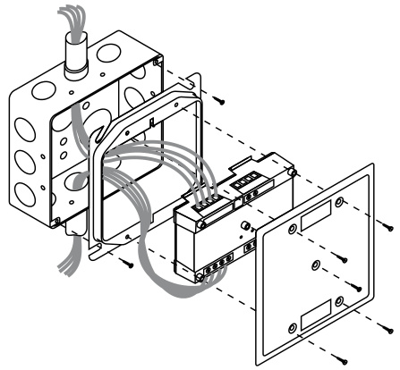
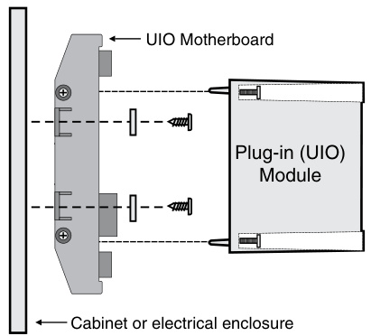
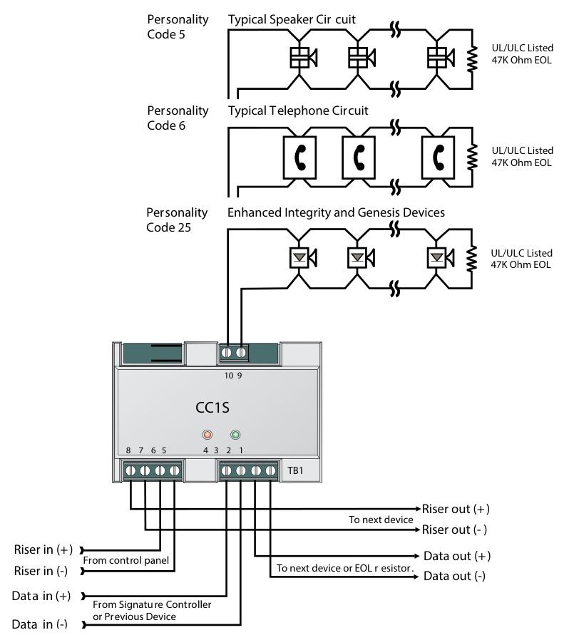
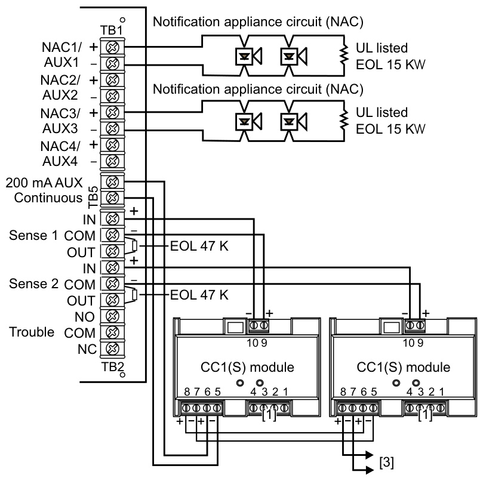
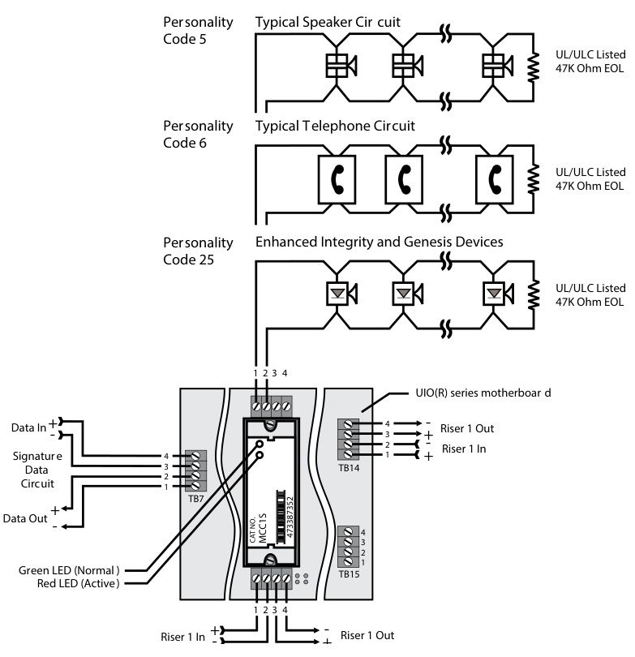

# Synchronization Output Module SIGA-CC1S, MCC1S  

# Overview  

SIGA-CC1S and MCC1S Synchronization Output Modules are intelligent analog addressable devices that form part of EDWARDS’s Signature line of products. The actual operation of the SIGA-CC1S and MCC1S is determined by the “personality code” selected by the installer, which is downloaded to the module from the Signature loop controller during system configuration.  

Depending on their assigned personality, Synchronization Output Modules may be used as a signal power riser selector to provide synchronization of fire alarm signals across multiple zones, or for connecting, upon command from the loop controller, supervised Class B signal or telephone circuits to their respective power inputs. The power inputs may be polarized 24 Vdc to operate audible and visible signal appliances or 25 and 70 VRMS to operate audio evacuation speakers and firefighter’s telephones.  

# Standard Features  

Provides UL 1971-compliant auto-sync output for visual signals   
Use for connecting a supervised output circuit to a supervised 24 Vdc riser input and synchronizing multiple notification appliance circuits.  

# •	 Functions as an audible signal riser selector  

Use as a synch module or for connecting supervised 24 Vdc Audible/Visible signal circuits, or 25 and 70 VRMS Audio Evacuation and Telephone circuits to their power inputs.  

# Built-in ring-tone generator  

When configured for telephone circuits, the SIGA-CC1S generates its own ring-tone signal, eliminating the need for a separate ring-tone circuit.  

# Automatic device mapping  

Signature modules transmit information to the loop controller regarding their circuit locations with respect to other Signature devices on the wire loop.  

# Electronic addressing  

Programmable addresses are downloaded from the loop controller, a PC, or the SIGA-PRO Signature Program/Service Tool; there are no switches or dials to set.  

# Intelligent device with microprocessor  

All decisions are made at the module to allow lower communication speed with substantially improved control panel response time and less sensitivity to line noise and loop wiring properties; twisted or shielded wire is not required.  

# Application  

The SIGA-CC1S mounts to a standard North American two-gang electrical box, making it ideal for locations where only one module is required. Separate I/O and data loop connections are made to each module.  

The SIGA-MCC1S is part of the UIO family of plug-in Signature Series modules. It functions identically to the SIGA-CC1S, but takes advantage of the modular flexibility and easy installation that characterize all UIO modules. Two- and six-module UIO motherboards are available. These can accommodate individual risers for each on-board module, or risers that are shared by any combination of its UIO modules. All wiring connections are made to terminal blocks on the motherboard. UIO assemblies may be mounted in EDWARDS enclosures.  

# Personality Codes  

The operation of the SIGA-CC1S is determined by their sub-type code or “Personality Code”. The code is selected by the installer depending upon the desired application and is downloaded from the loop controller.  

Personality Code 5: Signal Power or Audio Evacuation (single riser). Configures the module for use as a Class B Audible/ Visible Signal power (24 Vdc polarized) or Audio Evacuation (25 or 70 VRMS) power selector. The ring-tone generator is disabled. The output circuit is monitored for open or shorted wiring. If a short exists, the control panel inhibits the activation of the audible/ visible signal circuit to prevent connection to the power circuit.  

Personality Code 6: Telephone with ring-tone (single riser). Configures the module for use as a Telephone power selector. When a telephone handset is plugged into its jack or lifted from its hook, the module generates its own Ring-Tone signal. A separate ring-tone circuit is not needed. The module sends this signal to the control panel to indicate that an off-hook condition is present. When the system operator responds to the call, the ring-tone signal is disabled.  

Personality Code 25: Visual Signal Synchronization. This personality code configures the module to provide synchronization of fire alarm signals across multiple zones. It functions as a signal power (24 Vdc) riser selector. The output wiring is monitored for open circuits and short circuits. A short circuit will cause the fire alarm control panel to inhibit the activation of the audible/visual signal circuit so the riser is not connected to the wiring fault.  

# Warnings & Cautions  

This module will not operate without electrical power. As fires frequently cause power interruption, we suggest you discuss further safeguards with your fire protection specialist.  

EDWARDS recommends that these modules be installed according to latest recognized edition of national and local fire alarm codes.  

# Compatibility  

These modules are part of EDWARDS’s Signature Series intelligent processing and control platform. They are compatible with EST3, EST3X and iO Series control panels.  

# Installation  

The SIGA-CC1S: mounts to North American 2-1/2 inch $(64\;\mathsf{m m})$ )deep 2-gang boxes and 1-1/2 inch $(38\,\mathsf{m m})$ deep 4 inch square boxes with 2-gang covers and SIGA-MP mounting plates. The terminals are suited for #12 to $\#18$ AWG ( $2.5\;\mathrm{mm}^{2}$ to $0.75\;\mathrm{mm}^{2}$ )wire size.  

  
SIGA-MCC1S: mount the $\mathsf{U}\mathsf{O}\!\times\!\mathsf{P}$ motherboard inside a suitable EDWARDS enclosure with screws and washers provided. Plug the module into any available position on the motherboard and secure the module to the motherboard with the captive screws. Wiring connections are made to the terminals on the motherboard (see wiring diagram). UIOxR motherboard terminals are suited for #12 to $\#18$ AWG ( $2.5\;\mathrm{mm}^{2}$ to $0.75\;\mathrm{mm}^{2}$ ) wire size.  

  

# Electronic Addressing  

The loop controller electronically addresses each module saving valuable time during system commissioning. Setting complicated switches or dials is not required.  Each module has its own unique serial number stored in its “on-board memory”. The loop controller identifies each device on the loop and assigns a “soft” address to each serial number. If desired, the modules can be addressed using the SIGA-PRO Signature Program/Service Tool.  

# Testing & Maintenance  

The module’s automatic self-diagnosis identifies when it is defective and causes a trouble message. The user-friendly maintenance program shows the current state of each module and other pertinent messages. Single modules may be turned off (de-activated) temporarily, from the control panel.  

Scheduled maintenance (Regular or Selected) for proper system operation should be planned to meet the requirements of the Authority Having Jurisdiction (AHJ). Refer to current NFPA 72 and ULC CAN/ULC 536 standards.  

  
SIGA-CC1S (Standard Mount)   
Multiple CC1(S) modules using the BPS’s sense inputs  

  

  
SIGA-MCC1S (UIO Mount)  

Specifications   

<html><body><table><tr><td>Catalog Number</td><td>SIGA-CC1S</td><td>SIGA-MCC1S</td></tr><tr><td>Mounting</td><td>North American 2%2 inch (64 mm) deep two-gang boxes and 112 inch (38 mm) deep 4 inch square boxes with 2-gang covers and SIGA-MP mounting plates</td><td>Plugs into UIO2R, UIO6R or UI06 Motherboards</td></tr><tr><td>Description</td><td colspan="2">Synchronization Output Module</td></tr><tr><td>Type Code</td><td colspan="2">50 (factory set)</td></tr><tr><td>Address Requirements</td><td colspan="2">Uses one module address</td></tr><tr><td>Wiring Terminations</td><td colspan="2">Suitable for #12 to #18 AWG (2.5 mm2 to 0.75mm2)</td></tr><tr><td>Operating Current</td><td colspan="2">Standby = 223μA</td></tr><tr><td>Operating Voltage</td><td colspan="2">Activated = 100uA 15.2 to 19.95 Vdc (19 Vdc nominal)</td></tr><tr><td>Output Rating</td><td colspan="2">24 Vdc = 2 amps 25 V Audio = 50 watts</td></tr><tr><td>Construction</td><td colspan="2">70 V Audio= 35watts High Impact Engineering Polymer</td></tr><tr><td>Storage and Operating</td><td colspan="2">Operating: 32F to 120°F(0°C to 49°C) Storage:-4°F to140°F(-20°C to60°C)</td></tr><tr><td>Environment</td><td colspan="2">Humidity: 0 to 93% RH</td></tr><tr><td>LED Operation</td><td colspan="2">active</td></tr><tr><td>Compatibility</td><td colspan="2">Use with: Signature Loop Controller under EST3 version 2.0 or higher</td></tr><tr><td>Agency Listings</td><td colspan="2">UL,ULC, CSFM, MEA</td></tr></table></body></html>  

# Ordering Information  

<html><body><table><tr><td>Catalog Number</td><td>Description</td><td>Shipping Wt. Ibs (kg)</td></tr><tr><td>SIGA-CC1S</td><td>Synchronization Output Module (Standard Mount) - UL/ULC Listed</td><td>0.5 (0.23)</td></tr><tr><td>SIGA- MCC1S</td><td>Synchronization Output Module (UIO Mount) - UL/ULC Listed</td><td>0.18 (0.08)</td></tr><tr><td colspan="3"></td></tr><tr><td colspan="3">Related Equipment</td></tr><tr><td>27193-21</td><td>Surface Mount Box-Red, 2-gang</td><td>2 (1.2)</td></tr><tr><td>27193-26</td><td>Surface Mount Box -White,2-gang</td><td>2 (1.2)</td></tr><tr><td>SIGA-UIO2R</td><td>Universal Input-Output Module Board w/Riser Inputs - Two Module Positions</td><td>0.32 (0.15)</td></tr><tr><td>SIGA-UIO6R</td><td>Universal Input-Output Module Board w/Riser Inputs -SixModulePositions</td><td>0.62 (0.28)</td></tr><tr><td>SIGA-UIO6</td><td>Universal Input-Output ModuleBoard-SixModulePositions</td><td>0.56 (0.25)</td></tr><tr><td>235196P</td><td>Bi-polar Transient Protector</td><td>0.01 (0.05)</td></tr><tr><td>MFC-A</td><td>Multifunction Fire Cabinet - Red,</td><td>7.0 (3.1)</td></tr><tr><td>SIGA-MP1</td><td>supports Signature Module Mounting Plates Signature Module Mounting Plate,1 footprint</td><td>1.5 (0.70)</td></tr><tr><td>SIGA-MP2</td><td>Signature Module Mounting Plate, 1/2 footprint</td><td>0.5 (0.23)</td></tr><tr><td>SIGA-MP2L</td><td>Signature Module Mounting Plate, 1/2 extended footprint</td><td>1.02 (0.46)</td></tr></table></body></html>  