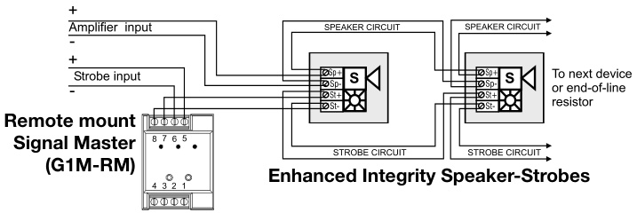
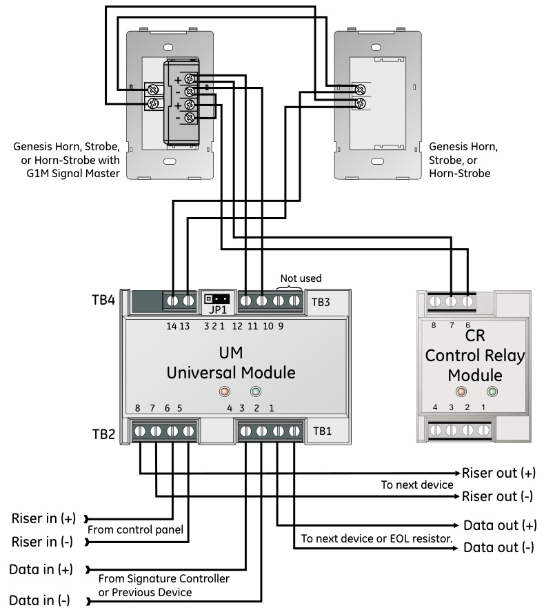
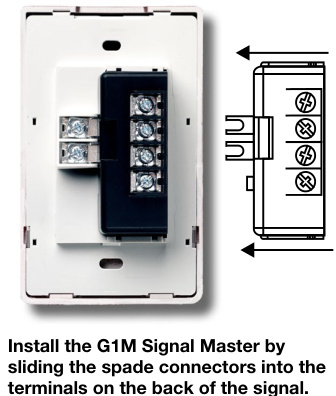
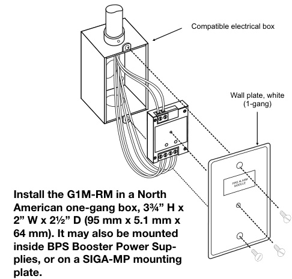

# Signal Master G1M Series  

# Overview  

The Signal Master is a simple-to-use accessory that adds enhanced features to Genesis strobes and horn-strobes as well as Enhanced Integrity strobes. It is a dual-purpose module that provides precision synchronization for connected strobes, and independent control for connected Genesis horns over a single pair of wires.  

All Genesis and Enhanced Integrity strobes are self-synchronizing. When installed with the Signal Master, strobe flashes from devices on the same circuit are synchronized to within 10 milliseconds of each other indefinitely. This exceeds the latest UL 1971 requirements in effect as of November 2000, which specify this level of synchronization over only two hours.  

When installed with Genesis horn-strobes, the Signal Master permits independent horn control (on, off, and coded signals) over a single pair of wires. Two methods of horn control are available: traditional NAC signal silence; or, normally-closed contact. Both methods may be used to silence horns without turning off strobes on the same circuit. Note: independent horn control is available for horn-strobes only. G1-P Series steady horns are not compatible with this feature.  

Two mounting options ensure trouble-free installation of the Signal Master Module. The “snap-on” piggyback model doesn’t require a separate electrical box. It simply snaps to the back of the first signal on the circuit. The remote mount model mounts in a North American $2\%$ inch $(64\;\mathsf{m m}$ ) deep one-gang box. It may also be mounted to any SIGA-MP mounting plate, or directly to the rails provided inside BPS Remote Booster Power Supply cabinets.  

# Standard Features  

•	 Compatible with Genesis and Enhanced Integrity products   
•	 Provides UL 1971 compliant synchronization for all strobes on the same circuit Delivers independent horn control for horn-strobes over twowire Genesis circuits. Two methods of horn control available: traditional NAC signal silence or normally-closed contact.   
•	 Convenient snap-on or single-gang remote models   
•	 Only one module required per circuit   
•	 3 amp rating (G1M-RM only)  

  

# Class B Wiring  

Notes   
•	 Only one Signal Master is required for each horn, strobe, or horn-strobe circuit.   
•	 The strobe circuit of the Signal Master requires a dedicated NAC. Strobe NAC circuit must be continuous in alarm mode.   
•	 The Horn circuit of the Signal Master can be cascaded with other Genesis Signal Master modules on one NAC.   
•	 When determining allowable wire resistance, refer to voltage rating of the Genesis Signal Master, the signaling device, and the control panel specifications. For synchronization, maximum allowable resistance between any two devices in the same viewing area is 20 Ohms.  

  

  

  
Enhanced Integrity Horn-strobes and Speaker-strobes...  

  

  

  
Class A w/ Horn Silence using SIGA-MAB, SIGA-MCR modules   
Class A with Horn Silence using SIGA-UM and SIGA-CR modules  

  
Class A without Horn Silence using a SIGA-MAB module   
Class A without Horn Silence using a SIGA-UM module  

  

  

# Mounting  

  

  

# Specifications  

<html><body><table><tr><td></td><td>G1M piggyback model</td><td>G1M-RMremotemountmodel</td></tr><tr><td>Mounting</td><td>Snaps to back ofGenesisdevice</td><td>NorthAmericanone-gangboxes 33%"H×2"W×21%2"D(95mmx 5.1mmx64mm)and112inch(38 mm)deep 4 inch squareboxes withone-gang covers,and SlGA-</td></tr><tr><td>WireConnections</td><td></td><td>MPmountingplates #18 to #12 AWG (0.75 mm2 to 2.5mm2)</td></tr><tr><td>CircuitRating</td><td>2 amps maximum</td><td>3 amps maximum</td></tr><tr><td>Agency Listings/Approvals</td><td colspan="2">UL1971,UL1638,UL464,ULCS525,ULCS526,MEA,FM， CSFM,CE,FCC.</td></tr><tr><td>Synchronization</td><td colspan="2">One flash per second within 10 milliseconds indefinitely. Exceeds UL1971requirements.</td></tr><tr><td>Operating voltage</td><td colspan="2">16-33Vdc,16-33Vfwr</td></tr><tr><td>CurrentDraw</td><td colspan="2">33 mA</td></tr><tr><td>Operatingtemperaturerange</td><td colspan="2">32-120°F(0-49°C)</td></tr><tr><td>Operatinghumidityrange</td><td colspan="2">0-93%RH</td></tr></table></body></html>

Note: independent 2-wire horn control is available for horn-strobes only. G1-P Series steady horns are not compatible with this feature.  

# Ordering Information  

<html><body><table><tr><td>Catalog Number</td><td>Description</td><td>Ship Wt., Ibs (kg)</td></tr><tr><td>G1M</td><td>GenesisSignal Master Snap-on piggyback</td><td rowspan="2">0.2 (0.1)</td></tr><tr><td>G1M-RM</td><td>GenesisSignalMaster RemoteMount t (1-gang)</td></tr><tr><td>SIGA-MB4</td><td>Transponder Mounting Bracket (allows for mounting two1-gang modules in a 2-gang box)</td><td>0.4 (0.15)</td></tr></table></body></html>  