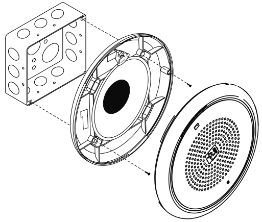
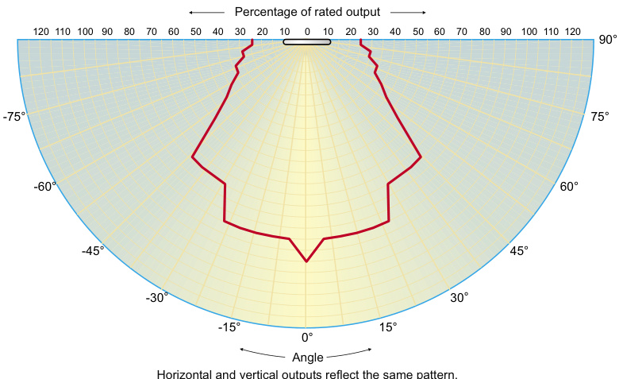
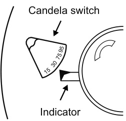
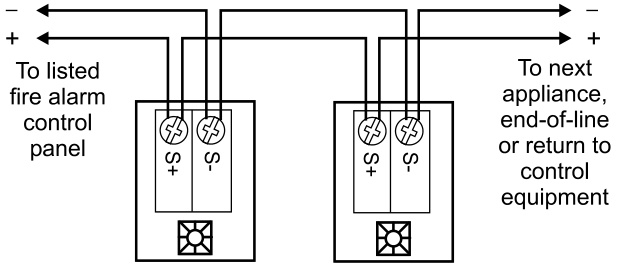

# Field Configurable Ceiling Strobes Genesis Series  

# Overview  

Genesis life safety and mass notification/emergency communications (ECS/MNS) ceiling strobes are small, compact, and attractive visible emergency signaling devices. Protruding no more than 1.6” $(41\ m m)$ ) from the ceiling, Genesis strobes blend with any decor.  

Thanks to patented breakthrough technology, EDWARDS Genesis strobes do not require bulky specular reflectors and lenses. Instead, an exclusive cavity design conditions light to produce a highly controlled distribution pattern. Significant development efforts employing this new technology have given rise to a new benchmark in strobe performance – FullLight technology.  

FullLight strobe technology produces a smooth light distribution pattern without the spikes and voids characteristic of specular reflectors. This ensures the entire coverage area receives consistent illumination from the strobe flash. As a result, Genesis strobes with FullLight technology go well beyond the minimum UL-required “cross” pattern, significantly exceeding UL-1971 and ULC-S526 light distribution requirements.  

Depending on the model, clear lens Genesis ceiling strobes feature 15 to 95, or 95 to 177 candela output (see ordering information), which is selectable with a conveniently-located switch. The candela output setting remains clearly visible even after final installation, yet it is locked in place to prevent unauthorized movement after installation.  

Genesis ECS/MNS appliances offer emergency signaling with clear amber or blue lenses. They are ideal for applications that require differentiation between life safety and mass notification alerts.  

# Standard Features  

Field configurable – no need to remove the device! –	 15/30/75/95 cd and 95/115/150/177 cd clear strobe lens models available –	 Switch settings remain visible even after the unit is installed  

# ECS/MNS models available  

– Amber and blue lens models available. See Ordering Information for details.  

# Unique low-profile design  

–	 30 per cent slimmer profile than comparable signals   
–	 Attractive appearance   
–	 No visible mounting screws   
–	 Available with white or red housings  

# Easy to install  

–	 Fits all standard 4” square electrical boxes with plenty of room behind the signal for extra wire – no extension ring or trim plate needed –	 #18 to #12 AWG terminals – ideal for long runs or existing wiring  

# Unparalleled performance  

–	 Exclusive FullLight strobe technology produces the industry’s most even light distribution   
–	 Precision timing electronics meet tough synchronizing standards for strobes   
–	 Low current draw minimizes system overhead  

# •	 Approved for public and private mode applications  

–	 UL 1971-listed as signaling devices for the hearing impaired –	 UL 1638-listed as protective visual signaling appliances –	 UL/ULC listed for ceiling or wall use  

# Application  

Genesis strobes are UL 1971 or 1638 listed for indoor use. Prevailing codes require strobes to be used where ambient noise conditions exceed specified levels, where occupants use hearing protection, and in areas of public accommodation. Consult with your Authority Having Jurisdiction for details.  

All Genesis strobes exceed UL synchronization requirements (within 10 milliseconds over a two-hour period) when used with a synchronization source. Synchronization for multiple strobe lights in a single field of view is required.  

# ECS/MNS Applications  

Genesis ECS/MNS appliances bring the same high-performance life safety features and unobtrusive design to mass notification applications. Available as standard units with clear, amber or blue lenses with optional ALERT markings, they are ideal for applications that require differentiation between life safety and ECS/MNS signals. Units are also available (special order) with red or green lenses.  

# Installation  

All models are intended for indoor applications only. Strobes mount  to any flush North-American 4” square electrical box, $2^{1}/{\mathrm{s}}^{\prime\prime}$ (54 mm) deep.  

Genesis ceiling strobes simply unlatch and twist to open. This gains access to mounting screws and the selectable candela switch. The shallow depth of Genesis devices leaves ample room behind the signal for extra wiring. Once installed with the cover in place, no mounting screws are visible.  

  

<html><body><table><tr><td>6.8"dia.</td><td></td></tr><tr><td>(173mm)</td><td></td></tr><tr><td></td><td></td></tr><tr><td></td><td></td></tr><tr><td></td><td></td></tr><tr><td></td><td>1.0" (25mm)</td></tr><tr><td></td><td></td></tr></table></body></html>  

# Light output (effective cd)  

Percent of UL rating versus angle  

  

# Field Configuration  

Depending on the model, Genesis ceiling speaker-strobes have multi-candela output (see ordering information). The output setting is changed by simply opening the device and sliding the switch to the desired setting.  The strobe does not have to be removed to change the output setting. The setting remains visible through a small window on the front of the device after the cover is closed.  

  

# Wiring  

Field wiring  terminals  accommodate $\#18$ to $\#12$ AWG $(0.75\;\mathrm{mm}^{2}$ to $2.5\;\mathsf{m m}^{2},$ ) wiring. Strobes are interconnected with a single pair of wires as shown below.  

  

WARNING: These devices will not operate without electrical power. As fires frequently cause power interruptions, we suggest you discuss further safeguards with your local fire protection specialist.  

# Current Draw  

Light output switch settings for UL 1971 listed models are selectable by numeric candela value.   
ECS/MNS appliances are selectable by A, B, C, or D designations.  

Standard output models (mA)   

<html><body><table><tr><td rowspan="2">UL Rating</td><td>"15" or"D"”</td><td>“30” or"c"</td><td>“75” or"B"</td><td>“95” or"A"</td></tr><tr><td>RMS</td><td>RMS</td><td>RMS</td><td>RMS</td></tr><tr><td>16Vdc</td><td>109</td><td>151</td><td>281</td><td>318</td></tr><tr><td>16Vfwr</td><td>131</td><td>194</td><td>379</td><td>437</td></tr></table></body></html>  

Standard output models (mA)   

<html><body><table><tr><td rowspan="2">Typical Current</td><td>“15"or"D”</td><td>“30"or"C”</td><td>“75"or"B”</td><td>“95”or"A”</td></tr><tr><td>RMS</td><td>RMS</td><td>RMS</td><td>RMS</td></tr><tr><td>16 Vdc</td><td>94</td><td>140</td><td>273</td><td>325</td></tr><tr><td>20 Vdc</td><td>74</td><td>108</td><td>205</td><td>244</td></tr><tr><td>24 Vdc</td><td>63</td><td>90</td><td>168</td><td>194</td></tr><tr><td>33Vdc</td><td>48</td><td>70</td><td>124</td><td>139</td></tr><tr><td>16 Vfwr</td><td>126</td><td>187</td><td>368</td><td>403</td></tr><tr><td>20 Vfwr</td><td>108</td><td>156</td><td>281</td><td>333</td></tr><tr><td>24 Vfwr</td><td>97</td><td>139</td><td>240</td><td>270</td></tr><tr><td>33Vfwr</td><td>89</td><td>119</td><td>197</td><td>214</td></tr></table></body></html>  

High Output models (mA)   

<html><body><table><tr><td>“95" or"D"</td><td>“115” or"c"”</td><td>“150" or"B"</td><td>“177”" or"A"</td></tr><tr><td>RMS</td><td>RMS</td><td>RMS</td><td>RMS</td></tr><tr><td>330</td><td>392</td><td>502</td><td>565</td></tr><tr><td>432</td><td>518</td><td>643</td><td>693</td></tr></table></body></html>  

High output models (mA)   

<html><body><table><tr><td>"95"or"D”</td><td>"115" or"C"</td><td>"150"or"B"</td><td>“"177” or"A"”</td></tr><tr><td>RMS</td><td>RMS</td><td>RMS</td><td>RMS</td></tr><tr><td>333</td><td>392</td><td>499</td><td>551</td></tr><tr><td>259</td><td>303</td><td>378</td><td>429</td></tr><tr><td>212</td><td>245</td><td>306</td><td>342</td></tr><tr><td>155</td><td>180</td><td>211</td><td>236</td></tr><tr><td>484</td><td>570</td><td>673</td><td>724</td></tr><tr><td>380</td><td>438</td><td>537</td><td>604</td></tr><tr><td>318</td><td>361</td><td>434</td><td>484</td></tr><tr><td>245</td><td>269</td><td>308</td><td>338</td></tr></table></body></html>  

# Light Output  

Standard output models   

<html><body><table><tr><td rowspan="2">Lens color</td><td rowspan="2">Listings Standard</td><td colspan="4">Switch Settings (candela)</td></tr><tr><td>Setting A</td><td>Setting B</td><td>Setting C</td><td>Setting D</td></tr><tr><td>Clear</td><td>UL 1971</td><td>95cd</td><td>75cd</td><td>30cd</td><td>15 cd</td></tr><tr><td>Amber</td><td>UL1638</td><td>82cd</td><td>65cd</td><td>26cd</td><td>13 cd</td></tr><tr><td>Blue</td><td>UL1638</td><td>40 cd</td><td>31 cd</td><td>12 cd</td><td>6 cd</td></tr></table></body></html>  

High output models   

<html><body><table><tr><td rowspan="2">Lens color</td><td rowspan="2">Listings Standard</td><td colspan="4">Switch Settings (candela)</td></tr><tr><td>Setting A</td><td>Setting B</td><td>Setting C</td><td>Setting D</td></tr><tr><td>Clear</td><td>UL 1971</td><td>177 cd</td><td>150cd</td><td>115 cd</td><td>95cd</td></tr><tr><td>Amber</td><td>UL1638</td><td>155cd</td><td>130cd</td><td>100cd</td><td>82cd</td></tr><tr><td>Blue</td><td>UL1638</td><td>80 cd</td><td>78 cd</td><td>59cd</td><td>48 cd</td></tr></table></body></html>  

# Specifications  

<html><body><table><tr><td>Housing</td><td>available.</td></tr><tr><td>Lens</td><td>Optical grade polycarbonate (clear).</td></tr><tr><td>Mounting</td><td>Flush mount to North American 4-inch square electrical box, 2-1/8 (54 mm) inches deep. No extension ring required. Suitable for indoorwall or ceiling applications.</td></tr><tr><td>Wire Connections</td><td>Screwterminals:#18to#12AwG (0.75mm2to2.5mm2)wiresize.</td></tr><tr><td>Operating Voltage</td><td>Regulated 16 to 33Vdc, 16 to 33 Vfwr.</td></tr><tr><td>Operating environment</td><td>Indoor: 32-120° F (0-49° C) ambient temperature; 0-93% relative humidity.</td></tr><tr><td>Agency listings/ approvals</td><td>Meets or exceeds year 2004 UL requirements for standards UL1638 and UL1971 and Canadian requirements for standards Rule.CSFM,MEA,FM.</td></tr><tr><td>Strobe output rating Clear:</td><td>UL 1971,UL 1638,ULC S526: selectable 15/30/75/95cd (GC-VM)and 95/115/150/177 cd (GC-VMH) Amber:CAN/CSA-C22.2 No.205,CAN/ULC-S526,UL 1638: selectable 13/26/65/82 cd (GCW*-VMA),82/100/130/155 cd (GCW*-VMHA)</td></tr><tr><td>Strobe operating</td><td>Blue:CAN/CSA-C22.2 No.205,CAN/ULC-S526,UL1638:selectable 6/12/31/40 cd (GCW*-VMB),48/59/78/80 cd (GCW*-VMHB) GC-VM series strobes: non-coded, filtered 16-33 Vdc</td></tr><tr><td>voltage Strobe flash rate</td><td>orunfiltered16-33VdcFWR.</td></tr><tr><td>Synchronization</td><td>Meets or exceeds UL 1971 requirements. Maximum allowed resistancebetween any two devices is 20 Ohms.Refer to specifications for the synchronization control module, this strobe, and the control panel to determine allowed wire resistance.</td></tr><tr><td>Synchronization Sources</td><td>SIGA-CC1S,SIGA-MCC1S,SIGA-CC2A,SIGA-MCC2A,G1M-RM BPS6A, BPS10A,APS6A,APS10A,iO Series,Fireshield Plus 3, 5 and 10 zone.Add G1M for G1-CVM &G1-HDVM devices only.</td></tr></table></body></html>  

# Ordering Information  

Light output switch settings for UL 1971 listed models are selectable by numeric candela value. ECS/MNS appliances are selectable by A, B, C, or D designations.  

<html><body><table><tr><td>Model</td><td>Housing</td><td>Marking</td><td>Lens</td><td>Strobe</td><td>Ship Wt.</td></tr><tr><td colspan="6">LifesafetyAppliances (c/wrunningmaniconscreenprintedonhousing)</td></tr><tr><td>GC-VM</td><td>White</td><td>None</td><td rowspan="4">Clear</td><td rowspan="2">Selectable 15,30,75,or95cd</td><td rowspan="4">1.8 Ib. (0.82 kg.) Selectablehighoutput 95，115,150,or177cd</td></tr><tr><td>GCF-VM</td><td>White</td><td>“FIRE'</td></tr><tr><td>GCFR-VM</td><td>Red</td><td>“FIRE'</td></tr><tr><td>GC-VMH GCF-VMH</td><td>White White</td><td>None “FIRE'</td></tr></table></body></html>  

ECS/MNS Appliances (no running man icon on housing)   

<html><body><table><tr><td>GCWA-VMA</td><td rowspan="8">White</td><td rowspan="2">"Alert"</td><td>Amber</td><td rowspan="6">Selectable A,B,C,D</td><td rowspan="6">1.8 Ib. (0.82 kg.)</td></tr><tr><td>GCWA-VMC</td><td>Clear</td></tr><tr><td>GCWN-VMA</td><td>Amber</td></tr><tr><td>GCWN-VMB</td><td>None Blue</td></tr><tr><td>GCWN-VMC</td><td>Clear</td></tr><tr><td>GCWA-VMHA</td><td>Amber</td></tr><tr><td>GCWA-VMHC</td><td></td></tr><tr><td>GCWN-VMHA</td><td rowspan="3">"Alert" None</td><td>Clear</td><td rowspan="3">Selectablehighoutput A,B，CorD</td></tr><tr><td></td><td>Amber Blue</td></tr><tr><td>GCWN-VMBH GCWN-VMHC</td><td>Clear</td></tr></table></body></html>  